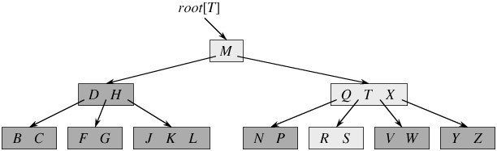

# B Tree

## 引入

### 查找树

动态查找树主要有三类：

- 二叉查找树，BST
- 平衡的二叉查找树，BBST
- 红黑树，RB-Tree
- B-Tree / B+-Tree / B*-Tree

前三种结构是典型的 BST 结构，其查找的复杂度为 O(logN)，与树的深度有关

- 降低树的深度可以提高查找的效率

在实际场景中，对于大规模数据的存储，对于数据的索引查询，每个树节点存储的元素的数量是有限的（如果每个树节点存储的元素非常多，查找就退化为节点内部的线性查找了），结果就是

- BST 结构由于树的深度过大而造成磁盘 IO 过于频繁，进而导致查询效率低下（磁盘存取的次数与树高有关）

**因此，我们需要有效地减小树的深度：使用多叉树结构**

因此得到了一种新的查找树结构——**平衡多路查找树**

### 外部存储

外存储器—磁盘是一种直接存取的存储设备(DASD)。它是以存取时间变化不大为特征的。可以直接存取任何字符组，且容量大、速度较其它外存设备更快。

在大规模数据存储方面，大量数据存储在外存磁盘中，而在外存磁盘中读取/写入块(block)中某数据时，首先需要定位到磁盘中的某块，如何有效地查找磁盘中的数据，需要一种合理高效的外存数据结构，就是下面所要重点阐述的B-tree结构，以及相关的变种结构：B+-tree结构和B*-tree结构。

## B-Tree

**B-Tree，B 即 Balanced，多叉平衡查找树**，类似于 RB-Tree，在 DB 和 FS 场景下表现更好

- 是一种自平衡的树，能够保持数据有序
- 保证数据的查找、访问、插入、删除都在对数时间内完成，含有 n 个节点的 B 树高度为 logN，但是可能比 RB-Tree 小很多，因为分支很大
- 每个节点最少 2 个子节点
- 适用于读写相对大的数据块的存储系统，可用来描述外部存储，常用于 DB 和 FS 的实现上

举例：

- 如下图所示，即是一棵B树，一棵关键字为英语中辅音字母的B树，现在要从树种查找字母R（包含n[x]个关键字的内结点x，x有n[x]+1]个子女（也就是说，一个内结点x若含有n[x]个关键字，那么x将含有n[x]+1个子女）。所有的叶结点都处于相同的深度，带阴影的结点为查找字母R时要检查的结点）：

- 从上图你能轻易的看到，一个内结点x若含有n[x]个关键字，那么x将含有n[x]+1个子女。如含有2个关键字D H的内结点有3个子女，而含有3个关键字Q T X的内结点有4个子女

### 定义

用阶来定义：

B 树又叫平衡多路查找树。一棵m阶的B 树 (注：切勿简单的认为一棵m阶的B树是m叉树，虽然存在四叉树，八叉树，KD树，及vp/R树/R\*树/R+树/X树/M树/线段树/希尔伯特R树/优先R树等空间划分树，但与B树完全不等同)****的特性如下：

1. 树中每个节点最多 m 个孩子，m >= 2
2. 除根节点和叶子节点外，其他每个节点至少有 ceil(m / 2) 个孩子
3. 若根节点不是叶节点，则至少有 2 个孩子
4. 所有叶节点都出现在同一层
5. 每个非叶节点包含 n 个关键字信息 (n，P0，K1，P1，K2，P2，......，Kn，Pn)：
   1.  Ki (i=1...n)为关键字，且关键字按顺序升序排序K(i-1)< Ki。
   2. Pi为指向子树根的接点，且指针P(i-1)指向子树种所有结点的关键字均小于Ki，但都大于K(i-1)。 
   3. 关键字的个数n必须满足： [ceil(m / 2)-1]<= n <= m-1。

> 上面的图中比如根结点，其中17表示一个磁盘文件的文件名；小红方块表示这个17文件内容在硬盘中的存储位置；p1表示指向17左子树的指针

### B-Tree 中文件查找的过程

假如每个盘块可以正好存放一个B树的结点（正好存放2个文件名）。那么一个BTNODE结点就代表一个盘块，而子树指针就是存放另外一个盘块的地址。

下面，咱们来模拟下查找文件29的过程：

1. 根据根结点指针找到文件目录的根磁盘块1，将其中的信息导入内存。【磁盘IO操作 1次】    
2. 此时内存中有两个文件名17、35和三个存储其他磁盘页面地址的数据。根据算法我们发现：17<29<35，因此我们找到指针p2。
3. 根据p2指针，我们定位到磁盘块3，并将其中的信息导入内存。【磁盘IO操作 2次】    
4. 此时内存中有两个文件名26，30和三个存储其他磁盘页面地址的数据。根据算法我们发现：26<29<30，因此我们找到指针p2。
5. 根据p2指针，我们定位到磁盘块8，并将其中的信息导入内存。【磁盘IO操作 3次】    
6. 此时内存中有两个文件名28，29。根据算法我们查找到文件名29，并定位了该文件内存的磁盘地址。

分析上面的过程，发现需要3次磁盘IO操作和3次内存查找操作。关于内存中的文件名查找，由于是一个有序表结构，可以利用折半查找提高效率。至于IO操作是影响整个B树查找效率的决定因素。

当然，如果我们使用平衡二叉树的磁盘存储结构来进行查找，磁盘4次，最多5次，而且文件越多，B树比平衡二叉树所用的磁盘IO操作次数将越少，效率也越高。

### B-Tree 高度

根据上面的例子我们可以看出，对于辅存做IO读的次数取决于B树的高度

- 当B树包含N个关键字时，B树的最大高度为l-1（因为计算B树高度时，叶结点所在层不计算在内）

即：l - 1 = **log┌m/2┐((N+1)/2 )+1**

### 算法复杂度

| 算法 |      | **平均**   | **最差**   |
| ---- | ---- | ---------- | ---------- |
| 空间 |      | O(*n*)     | O(*n*)     |
| 搜索 |      | O(log *n*) | O(log *n*) |
| 插入 |      | O(log *n*) | O(log *n*) |
| 删除 |      | O(log *n*) | O(log *n*) |

## B+-Tree

B+ 树是应文件系统所需产生的一种 B 树的变形树，其与 B 树的异同在于：

1. 有n棵子树的结点中含有n-1 个关键字
2. 所有的叶子结点中包含了全部关键字的信息，及指向含有这些关键字记录的指针，且叶子结点本身依关键字的大小自小而大的顺序链接
3. 所有的非终端结点可以看成是索引部分，结点中仅含有其子树根结点中最大关键字

**更适合文件索引和数据库索引**

1. B+-tree的磁盘读写代价更低：**B+-tree**的内部结点并没有指向关键字具体信息的指针。因此其内部结点相对B 树更小。如果把所有同一内部结点的关键字存放在同一盘块中，那么盘块所能容纳的关键字数量也越多。一次性读入内存中的需要查找的关键字也就越多。相对来说IO读写次数也就降低了

   > 举个例子，假设磁盘中的一个盘块容纳16bytes，而一个关键字2bytes，一个关键字具体信息指针2bytes。一棵9阶B-tree(一个结点最多8个关键字)的内部结点需要2个盘快。而B+ 树内部结点只需要1个盘快。当需要把内部结点读入内存中的时候，B 树就比B+ 树多一次盘块查找时间(在磁盘中就是盘片旋转的时间)

2. B+-tree的查询效率更加稳定：由于非终结点并不是最终指向文件内容的结点，而只是叶子结点中关键字的索引。所以任何关键字的查找必须走一条从根结点到叶子结点的路。所有关键字查询的路径长度相同，导致每一个数据的查询效率相当

## B*-Tree

B*-tree是**B+-tree**的变体，在**B+**树的基础上(所有的叶子结点中包含了全部关键字的信息，及指向含有这些关键字记录的指针)：

- B*树中非根和非叶子结点再增加指向兄弟的指针
- B*树定义了非叶子结点关键字个数至少为(2/3)*M，即块的最低使用率为2/3（代替B+树的1/2）

B+树的分裂：当一个结点满时，分配一个新的结点，并将原结点中1/2的数据复制到新结点，最后在父结点中增加新结点的指针；B+树的分裂只影响原结点和父结点，而不会影响兄弟结点，所以它不需要指向兄弟的指针。

B*树的分裂：当一个结点满时，如果它的下一个兄弟结点未满，那么将一部分数据移到兄弟结点中，再在原结点插入关键字，最后修改父结点中兄弟结点的关键字（因为兄弟结点的关键字范围改变了）；如果兄弟也满了，则在原结点与兄弟结点之间增加新结点，并各复制1/3的数据到新结点，最后在父结点增加新结点的指针。

**所以，B*树分配新结点的概率比B+树要低，空间使用率更高。**

## B-Tree 操作

## 总结

通过以上介绍，大致将B树，B+树，B*树总结如下：

- B树：有序数组+平衡多叉树；

- B+树：有序数组链表+平衡多叉树；

- B*树：一棵丰满的B+树。

## 参考资料

- https://blog.csdn.net/v_JULY_v/article/details/6530142
- 