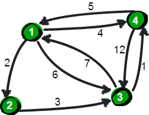
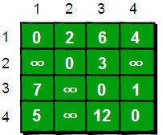
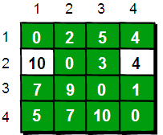
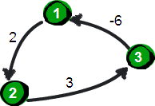

# Floyd 多源最短路算法

> http://wiki.jikexueyuan.com/project/easy-learn-algorithm/floyd.html


暑假，小哼准备去一些城市旅游。有些城市之间有公路，有些城市之间则没有，如下图。为了节省经费以及方便计划旅程，小哼希望在出发之前知道任意两个城市之前的最短路程。



上图中有 4 个城市 8 条公路，公路上的数字表示这条公路的长短。请注意这些**公路是单向的**。我们现在需要求任意两个城市之间的最短路程，也就是**求任意两个点之间的最短路径**。这个问题这也被称为“多源最短路径”问题。

现在需要一个数据结构来存储图的信息，我们仍然可以用一个 4*4 的矩阵（二维数组 e）来存储。比如 1 号城市到 2 号城市的路程为 2，则设 e[1][2]的值为 2。**2 号城市无法到达 4 号城市，则设置 e[2][4]的值为 ∞**。另外此处**约定一个城市自己是到自己的也是 0，例如 e[1][1]为 0，具体如下**。



现在回到问题：如何求任意两点之间最短路径呢？通过之前的学习我们知道**通过深度或广度优先搜索可以求出两点之间的最短路径**。**所以进行 n2 遍深度或广度优先搜索，即对每两个点都进行一次深度或广度优先搜索，便可以求得任意两点之间的最短路径**。可是还有没有别的方法呢？

我们来想一想，根据我们以往的经验，**如果要让任意两点（例如从顶点 a 点到顶点 b）之间的路程变短，只能引入第三个点（顶点 k），并通过这个顶点 k 中转即 a->k->b，才可能缩短原来从顶点 a 点到顶点 b 的路程**。那么这个中转的顶点 k 是 1~n 中的哪个点呢？甚至有时候不只通过一个点，而是经过两个点或者更多点中转会更短，即 a->k1->k2b->或者 a->k1->k2…->k->i…->b。比如上图中从 4 号城市到 3 号城市（4->3）的路程 e[4][3]原本是 12。如果只通过 1 号城市中转（4->1->3），路程将缩短为 11（e[4][1]+e[1][3]=5+6=11）。其实 1 号城市到 3 号城市也可以通过 2 号城市中转，使得 1 号到 3 号城市的路程缩短为 5（e[1][2]+e[2][3]=2+3=5）。所以如果同时经过 1 号和 2 号两个城市中转的话，从 4 号城市到 3 号城市的路程会进一步缩短为 10。通过这个的例子，我们发现**每个顶点都有可能使得另外两个顶点之间的路程变短**。好，下面我们将这个问题一般化。

**当任意两点之间不允许经过第三个点时，这些城市之间最短路程就是初始路程，如下**。


如**现在只允许经过 1 号顶点**，求任意两点之间的最短路程，应该如何求呢？只需判断 e[i][1]+e[1][j]是否比 e[i][j]要小即可。e[i][j]表示的是从 i 号顶点到 j 号顶点之间的路程。e[i][1]+e[1][j]表示的是从 i 号顶点先到 1 号顶点，再从 1 号顶点到 j 号顶点的路程之和。其中 i 是 1~n 循环，j 也是 1~n 循环，代码实现如下。

```
    for(i=1;i<=n;i++)
    {
        for(j=1;j<=n;j++)
        {
            if ( e[i][j] > e[i][1]+e[1][j] )
              e[i][j] = e[i][1]+e[1][j];
        }
    }
```

在只允许经过 1 号顶点的情况下，任意两点之间的最短路程更新为：


通过上图我们发现：在只通过 1 号顶点中转的情况下，3 号顶点到 2 号顶点（e[3][2]）、4 号顶点到 2 号顶点（e[4][2]）以及 4 号顶点到 3 号顶点（e[4][3]）的路程都变短了。

接下来继续求在只允许经过 1 和 2 号两个顶点的情况下任意两点之间的最短路程。如何做呢？我们需要在只允许经过 1 号顶点时任意两点的最短路程的结果下，**再判断如果经过 2 号顶点是否可以使得 i 号顶点到 j 号顶点之间的路程变得更短**。即判断 e[i][2]+e[2][j]是否比 e[i][j]要小，代码实现为如下。

```
    //经过1号顶点
    for(i=1;i<=n;i++)
        for(j=1;j<=n;j++)
            if (e[i][j] > e[i][1]+e[1][j])  e[i][j]=e[i][1]+e[1][j];
    //经过2号顶点
    for(i=1;i<=n;i++)
        for(j=1;j<=n;j++)
            if (e[i][j] > e[i][2]+e[2][j])  e[i][j]=e[i][2]+e[2][j];
```

**在只允许经过 1 和 2 号顶点的情况下**，任意两点之间的最短路程更新为：


通过上图得知，在相比只允许通过 1 号顶点进行中转的情况下，这里允许通过 1 和 2 号顶点进行中转，使得 e[1][3]和 e[4][3]的路程变得更短了。

**同理，继续在只允许经过 1、2 和 3 号顶点进行中转的情况下，求任意两点之间的最短路程**。任意两点之间的最短路程更新为：



**最后允许通过所有顶点作为中转，任意两点之间最终的最短路程为**：


**整个算法过程虽然说起来很麻烦，但是代码实现却非常简单，核心代码只有五行**：

```
     for(k=1;k<=n;k++)
        for(i=1;i<=n;i++)
            for(j=1;j<=n;j++)
                if(e[i][j]>e[i][k]+e[k][j])
                     e[i][j]=e[i][k]+e[k][j];
```

这段代码的基本思想就是：最开始只允许经过 1 号顶点进行中转，接下来只允许经过 1 和 2 号顶点进行中转……允许经过 1~n 号所有顶点进行中转，求任意两点之间的最短路程。**用一句话概括就是：从 i 号顶点到 j 号顶点只经过前k号点的最短路程**。其实这是一种“动态规划”的思想，关于这个思想我们将在《啊哈！算法 2——伟大思维闪耀时》在做详细的讨论。下面给出这个算法的完整代码：

```
    #include <stdio.h>
    int main()
    {
        int e[10][10],k,i,j,n,m,t1,t2,t3;
        int inf=99999999; //用inf(infinity的缩写)存储一个我们认为的正无穷值
        //读入n和m，n表示顶点个数，m表示边的条数
        scanf("%d %d",&n,&m);

        //初始化
        for(i=1;i<=n;i++)
            for(j=1;j<=n;j++)
                if(i==j) e[i][j]=0;
                  else e[i][j]=inf;
        //读入边
        for(i=1;i<=m;i++)
        {
            scanf("%d %d %d",&t1,&t2,&t3);
            e[t1][t2]=t3;
        }

        //Floyd-Warshall算法核心语句
        for(k=1;k<=n;k++)
            for(i=1;i<=n;i++)
                for(j=1;j<=n;j++)
                    if(e[i][j]>e[i][k]+e[k][j] )
                        e[i][j]=e[i][k]+e[k][j];

        //输出最终的结果
        for(i=1;i<=n;i++)
        {
         for(j=1;j<=n;j++)
            {
                printf("%10d",e[i][j]);
            }
            printf("\n");
        }

        return 0;
    }
```

**有一点需要注意的是：如何表示正无穷**。我们通常将正无穷定义为 99999999，因为这样即使两个正无穷相加，其和仍然不超过 int 类型的范围（C 语言 int 类型可以存储的最大正整数是 2147483647）。在实际应用中最好估计一下最短路径的上限，只需要设置比它大一点既可以。**例如有 100 条边，每条边不超过 100 的话，只需将正无穷设置为 10001 即可**。**如果你认为正无穷和其它值相加得到一个大于正无穷的数是不被允许的话，我们只需在比较的时候加两个判断条件就可以了，请注意下面代码中带有下划线的语句**。

```
    //Floyd-Warshall算法核心语句
    for(k=1;k<=n;k++)
       for(i=1;i<=n;i++)
          for(j=1;j<=n;j++)
            if(e[i][k]<inf && e[k][j]<inf && e[i][j]>e[i][k]+e[k][j])
                e[i][j]=e[i][k]+e[k][j];
```

上面代码的输入数据样式为：

```
    4 8
    1 2 2
    1 3 6
    1 4 4
    2 3 3
    3 1 7
    3 4 1
    4 1 5
    4 3 12
```

第一行两个数为 n 和 m，n 表 示顶点个数，m 表示边的条数。
接下来 m 行，每一行有三个数 t1、t2 和 t3，表示顶点 t1 到顶点 t2 的路程是 t3。
得到最终结果如下：


**通过这种方法我们可以求出任意两个点之间最短路径**。它的**时间复杂度是 O(N3)**。令人很震撼的是它竟然只有五行代码，实现起来非常容易。**正是因为它实现起来非常容易，如果时间复杂度要求不高，使用 Floyd-Warshall 来求指定两点之间的最短路或者指定一个点到其余各个顶点的最短路径也是可行的**。当然也有更快的算法，请看下一节：Dijkstra 算法。

另外需要注意的是：**Floyd-Warshall 算法不能解决带有“负权回路”（或者叫“负权环”）的图，因为带有“负权回路”的图没有最短路**。例如下面这个图就不存在 1 号顶点到 3 号顶点的最短路径。因为 1->2->3->1->2->3->…->1->2->3 这样路径中，每绕一次 1->-2>3 这样的环，最短路就会减少 1，永远找不到最短路。**其实如果一个图中带有“负权回路”那么这个图则没有最短路**。



此算法由 Robert W. Floyd（罗伯特·弗洛伊德）于 1962 年发表在“Communications of the ACM”上。同年 Stephen Warshall（史蒂芬·沃舍尔）也独立发表了这个算法。Robert W．Floyd 这个牛人是朵奇葩，他原本在芝加哥大学读的文学，但是因为当时美国经济不太景气，找工作比较困难，无奈之下到西屋电气公司当了一名计算机操作员，在 IBM650 机房值夜班，并由此开始了他的计算机生涯。此外他还和 J.W.J. Williams（威廉姆斯）于 1964 年共同发明了著名的堆排序算法 HEAPSORT。堆排序算法我们将在第七章学习。Robert W．Floyd 在 1978 年获得了图灵奖。