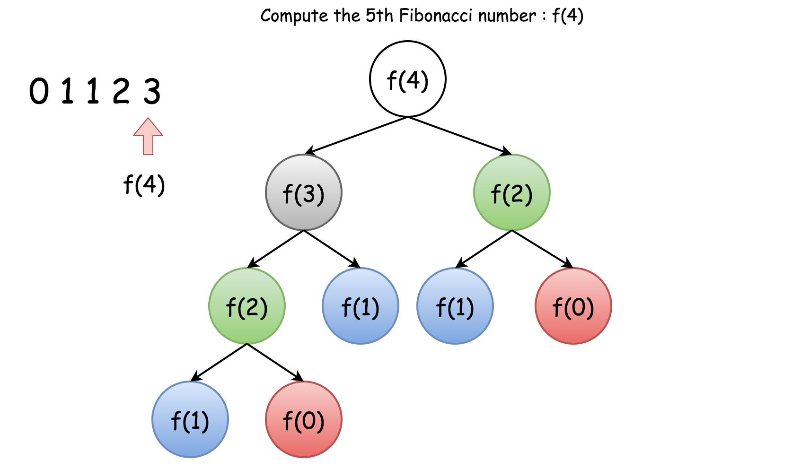
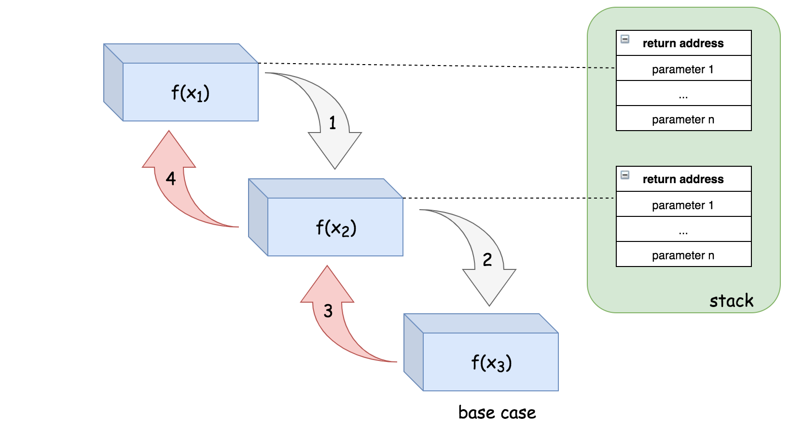
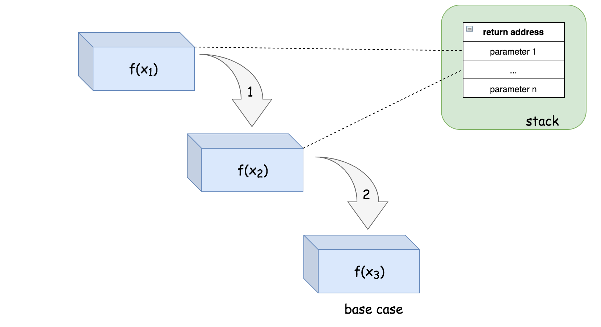
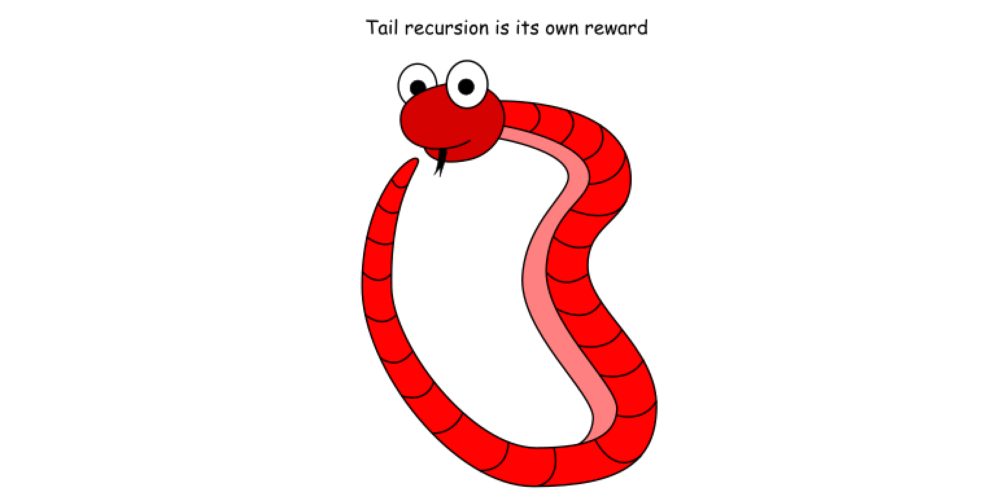

# Leetcode 递归算法总结

## 递归原理

> 递归是一种解决问题的有效方法，在递归过程中，函数将自身作为子例程调用

你可能想知道如何实现调用自身的函数。诀窍在于，每当递归函数调用自身时，它都会将给定的问题拆解为子问题。递归调用继续进行，直到到子问题无需进一步递归就可以解决的地步。

为了确保递归函数不会导致无限循环，它应具有以下属性：

1. 一个简单的`基本案例（basic case）`（或一些案例） —— 能够不使用递归来产生答案的终止方案。
2. 一组规则，也称作`递推关系（recurrence relation）`，可将所有其他情况拆分到基本案例。

注意，函数可能会有多个位置进行自我调用。

### 示例

------

让我们从一个简单的编程问题开始：

> 以相反的顺序打印字符串。

你可以使用迭代的办法轻而易举地解决这个问题，即从字符串的最后一个字符开始遍历字符串。但是如何递归地解决它呢？

首先，我们可以将所需的函数定义为 `printReverse(str[0...n-1])`，其中 `str[0]` 表示字符串中的第一个字符。然后我们可以分两步完成给定的任务：

1. `printReverse(str[1...n-1])`：以相反的顺序打印子字符串 `str[1...n-1]` 。
2. `print(str[0])`：打印字符串中的第一个字符。

请注意，我们在第一步中调用函数本身，根据定义，它使函数递归。

## 递归函数设计

对于一个问题，如果存在递归解决方案，我们可以按照以下步骤来实施它。

举个例子，我们将问题定义为有待实现的函数 {F(X)}*F*(*X*)，其中 {X}*X* 是函数的输入，同时也定义了问题的范围。

然后，在函数 {F(X)}*F*(*X*) 中，我们将会：

1. 将问题逐步分解成较小的范围，例如 {x_0} \in X*x*0∈*X*, {x_1} \in X*x*1∈*X*, ..., {x_n} \in X*x**n*∈*X*；
2. 调用函数 {F(x_0)}*F*(*x*0), F(x_1)*F*(*x*1), ..., F(x_n)*F*(*x**n*) ***递归地*** 解决 {X}*X* 的这些子问题；
3. 最后，处理调用递归函数得到的结果来解决对应 {X}*X* 的问题。

 

### 示例

------

为了进一步展示上述步骤，我们再举一个例子来说明如何递归地解决问题。

> 给定链表，交换每两个相邻节点并返回其头节点。
>
> *例如，对于列表* 1-> 2 -> 3 -> 4，我们应当返回新列表 2 -> 1 -> 4 -> 3 的头节点。

我们可以定义函数 `swap(head)` 以实现解决方案，其中输入的参数 `head` 指向链表的头节点。而该函数应当返回将链表中每两个相邻节点交换后得到的新列表的头节点 `head` 。

按照我们上面列出的步骤，我们可以按下面的流程来实现函数：

1. 首先，我们交换列表中的前两个节点，也就是 `head` 和 `head.next`；
2. 然后我们以 `swap(head.next.next)` 的形式调用函数自身，以交换头两个节点之后列表的其余部分。
3. 最后，我们将步骤（2）中的子列表的返回头与步骤（1）中交换的两个节点相连，以形成新的链表。

## 递推关系分析

在实现递归函数之前，有两件重要的事情需要弄清楚:

- `递推关系`： 一个问题的结果与其子问题的结果之间的关系。
- `基本情况`: 不需要进一步的递归调用就可以直接计算答案的情况。 有时，基本案例也被称为 *bottom cases*，因为它们往往是问题被减少到最小规模的情况，*也就是*如果我们认为将问题划分为子问题是一种自上而下的方式的最下层。

> 一旦我们计算出以上两个元素，再想要实现一个递归函数，就只需要根据`递推关系`调用函数本身，直到其抵达`基本情况`。

## 递归中的重复计算

通常情况下，递归是一种直观而有效的实现算法的方法。 但是，如果我们不明智地使用它，可能会给性能带来一些不希望的损失，*例如*重复计算。 在前一章的末尾，我们遇到了帕斯卡三角的重复计算问题，其中一些中间结果被多次计算。

在本文中，我们将进一步研究递归可能出现的重复计算问题。 然后我们将提出一种常用的技术，称为`记忆化（memoization）`，可以用来避免这个问题。

为了演示重复计算的另一个问题，让我们看一个大多数人可能都很熟悉的例子，[斐波那契数](https://baike.baidu.com/item/斐波那契数)。 如果我们定义函数 `F(n)` 表示在索引 `n` 处的斐波那契数，那么你可以推导出如下的递推关系：


```
F(n) = F(n - 1) + F(n - 2)
```


基本情况：

```
F(0) = 0, F(1) = 1
```


根据斐波那契数列的定义，可以实现下面的函数：

```java
public static int fibonacci(int n) {
  if (n < 2) {
    return n;
  } else {
    return fibonacci(n-1) + fibonacci(n-2);
  }
}
```

现在，如果你想知道 `F(4)` 是多少，你可以应用上面的公式并进行展开：


```
F(4) = F(3) + F(2) = (F(2) + F(1)) + F(2)
```


正如你所看到的，为了得到 f (4)的结果，我们需要在上述推导之后计算两次数 `F(2)` : 第一次在 `F(4)` 的第一次展开中，第二次在中间结果 `F(3)` 中。

下面的树显示了在计算 `F(4)` 时发生的所有重复计算（按颜色分组）。





### 记忆化

------

为了消除上述情况中的重复计算，正如许多人已经指出的那样，其中一个想法是将中间结果**存储**在缓存中，以便我们以后可以重用它们，而不需要重新计算。

这个想法也被称为*记忆化*，这是一种经常与递归一起使用的技术。

> [记忆化](https://baike.so.com/doc/4953402-5174974.html) 是一种优化技术，主要用于**加快**计算机程序的速度，方法是**存储**昂贵的函数调用的结果，并在相同的输入再次出现时返回缓存的结果。 (来源: 维基百科)

回到斐波那契函数 `F(n)`。 我们可以使用哈希表来跟踪每个以 `n` 为键的 `F(n)`的结果。 散列表作为一个缓存，可以避免重复计算。 记忆化技术是一个很好的例子，它演示了如何通过增加额外的空间以减少计算时间。

为了便于比较，我们在下面提供了带有记忆化功能的斐波那契数列解决方案的实现。

作为一种练习，您可以尝试使记忆化更加通用和非侵入性，即应用记忆化技术而不改变原来的功能。 (*提示*: 可以参考一种被称作 **decorator** 的设计模式)。

```java
import java.util.HashMap;

public class Main {

  HashMap<Integer, Integer> cache = new HashMap<Integer, Integer>();

  private int fib(int N) {
    if (cache.containsKey(N)) {
      return cache.get(N);
    }
    int result;
    if (N < 2) {
      result = N;
    } else {
      result = fib(N-1) + fib(N-2);
    }
    // keep the result in cache.
    cache.put(N, result);
    return result;
  }
}
```

## 时间复杂度分析

在本文中，我们将重点介绍如何计算递归算法的时间复杂度。

> 给出一个递归算法，其时间复杂度 ${\mathcal{O}(T)}$ 通常是**递归调用的数量**（记作 $R$） 和计算的时间复杂度的乘积（表示为${\mathcal{O}(s)}$）的乘积：
>
> ${\mathcal{O}(T) = R * \mathcal{O}(s)}$

### 执行树

------

对于递归函数，递归调用的数量很少与输入的大小呈线性关系。如果你还记得我们在前一章中讨论过的[斐波那契数](https://leetcode-cn.com/explore/orignial/card/recursion-i/258/memoization/1212/)问题，其递推关系被定义为 `f(n) = f(n-1) + f(n-2)`。乍一看，在执行斐波那契函数期间计算递归调用的数量似乎并不简单。

> 在这种情况下，最好采用**执行树**，这是一个用于表示递归函数的执行流程的树。树中的每个节点都表示递归函数的调用。因此，树中的节点总数对应于执行期间的递归调用的数量。

递归函数的执行树将形成 `n 叉树`，其中 `n` 作为递推关系中出现递归的次数。例如，斐波那契函数的执行将形成二叉树，下面的图示展现了用于计算斐波纳契数 `f(4)` 的执行树。

在 n 层的完全二叉树中，节点的总数为 $2^n -1$。因此 `f(n)` 中递归数目的上限（尽管不严格）也是 $2^n -1$那么我们可以估计 `f(n)` 的时间复杂度为 ${\mathcal{O}(2^n)}$

### 记忆化（Memoization）

------

在前一章中，我们讨论了通常用于优化递归算法的时间复杂度的记忆化技术。过高速缓存和重用中间结果，记忆化技术可以大大减少递归调用的数量，即减少执行树中的分支数量。在使用记忆化分析递归算法的时间复杂度时，也应该考虑到这种减少。

让我们回到斐波纳契数的例子。通过记忆化技术，我们保存每个索引 `n` 对应的的斐波那契数的结果。我们确信每个斐波那契数的计算只会发生一次。而从递推关系来看，斐波纳契数 `f(n)` 将取决于其所有 `n-1` 个先验斐波纳契数。结果，计算 `f(n)` 的递归将被调用 `n-1` 次以计算它所依赖的所有先验数字。

现在，我们可以简单地应用我们在本章开头介绍的公式来计算时间复杂度，即 {\mathcal{O}(1) * n = \mathcal{O}(n)}O(1)∗*n*=O(*n*)。记忆化技术不仅可以优化算法的时间复杂度，还可以简化时间复杂度的计算。

## 空间复杂度分析

在本文中，我们将会讨论如何分析递归算法的空间复杂度。

> 在计算递归算法的空间复杂度时，应该考虑造成空间消耗的两个部分：递归相关空间（`recursion related space）和非递归相关空间`（`non-recursion related space`）。

### 递归相关空间

------

递归相关空间是指由递归直接引起的内存开销，即用于跟踪递归函数调用的堆栈。为了完成典型的函数调用，系统应该在栈中分配一些空间来保存三个重要信息：

1. 函数调用的返回地址。一旦函数调用完成，程序应该知道返回的位置，即函数调用之前的点；
2. 传递给函数调用的参数； 
3. 函数调用中的局部变量。.

栈中的这个空间是函数调用期间产生的最小成本。然而，一旦完成函数调用，就会释放该空间。

对于递归算法，函数调用将连续链接直到它们到达基本情况（*也称为* 底层情况）。这意味着用于每个函数调用的空间也会累积。

> 对于递归算法，如果没有产生其他内存消耗，则此递归引起的空间将是算法的空间上限。

例如，在练习[反转字符串](https://leetcode-cn.com/explore/orignial/card/recursion-i/256/principle-of-recursion/1198/)中，我们没有使用额外的内存，因为我们仅仅是打印一个字符。对于每个递归调用，我们假设它可能需要一个最大为某一常量值的空间。并且递归调用最多可以链接 `n` 次，其中 `n` 是输入字符串的大小。因此，该递归算法的空间复杂度就是 {\mathcal{O}(n)}O(*n*)。

为了更好地说明这一点，接下来我们将会展示递归调用` f(x1) -> f(x2) -> f(x3)` 的执行顺序以及栈空间的分配情况。



栈中的空间将会分配给 `f(x1)` 来调用 `f(x2)`。类似的情况也同样发生在 `f(x2)` 中，系统会为 `f(x3) 的调用分配另一个空间，最后在` `f(x3)` 中，我们到达基本情况，因此在 `f(x3)` 中没有进行进一步的递归调用。

正是由于这些与递归相关的空间消耗，有时可能会遇到称为[堆栈溢出](https://baike.baidu.com/item/堆栈溢出/1231765?fr=aladdin)的情况，其中为程序分配的堆栈达到其最大空间限制并导致程序最终失败。在设计递归算法时，应该仔细评估在输入规模扩大时是否存在堆栈溢出的可能性。

### 非递归相关空间

------

正如名称所示，非递归相关空间指的是与递归过程没有直接关系的内存空间，通常包括为全局变量分配的空间（通常在堆中）。

不管是否递归，你都可能需要在任何函数调用之前将问题的输入存储为全局变量。你可能还需要保存递归调用的中间结果。后者就是我们前面提到过的**记忆化技术**。例如，在使用带有记忆化技术的递归算法解决斐波那契数问题时,我们使用映射（map）来跟踪在递归调用期间产生的所有中间斐波那契数。因此，在分析空间复杂度时，我们应该考虑到因采用记忆化技术所导致的空间成本。

## 尾递归 - 编译器优化为迭代模式

在上一篇文章中，我们讨论了由于递归调用而在系统调用栈上产生的隐式额外空间。然而，你应该学习识别一种称为[尾递归](https://baike.baidu.com/item/尾递归/554682)的特殊递归情况，它不受此空间开销的影响。

> 尾递归函数是递归函数的一种，其中递归调用是递归函数中的最后一条指令。并且在函数中应该只有一次递归调用。

我们已经在[反转字符串的解决方案](https://leetcode-cn.com/explore/orignial/card/recursion-i/256/principle-of-recursion/1199/)中看到了尾递归的例子。这里的另一个例子说明了非尾递归和尾递归之间的区别。请注意，非尾递归示例中，在最后一次递归调用之后有一个额外的计算。

尾递归的好处是，它可以避免递归调用期间栈空间开销的累积，因为系统可以为每个递归调用重用栈中的固定空间。

例如，对于递归调用序列` f(x1) -> f(x2) -> f(x3)`，如果函数 `f(x)` 以尾递归的形式实现。那么其执行步骤的顺序和栈空间的分配如下所示：



请注意，在尾递归的情况下，一旦从递归调用返回，我们也会立即返回，因此我们可以跳过整个递归调用返回链，直接返回到原始调用方。这意味着我们根本不需要所有递归调用的调用栈，这为我们节省了空间。

例如，在步骤（1）中，栈中的一个空间将被分配给 `f(x1)`，以便调用 `f(x2)`。然后，在步骤（2）中，函数 `f(x2)` 能够递归地调用 `f(x3)`，但是，系统不需要在栈上分配新的空间，而是可以简单地重用先前分配给第二次递归调用的空间。最后，在函数 `f(x3)` 中，我们达到了基本情况，该函数可以简单地将结果返回给原始调用方，而不会返回到之前的函数调用中。

尾递归函数可以作为非尾递归函数来执行，也就是说，带有调用栈并不会对结果造成影响。通常，编译器会识别尾递归模式，并优化其执行。然而，并不是所有的编程语言都支持这种优化，比如 C，C++ 支持尾递归函数的优化。另一方面，Java 和 Python 不支持尾递归优化。

## 总结

现在，您可能会相信递归确实是一种强大的技术，它使我们能够以一种优雅而有效的方式解决许多问题。但是，它仍然不是解决问题的灵丹妙药。由于时间或空间的限制，并不是所有的问题都可以用递归来解决。递归本身可能会带来一些不希望看到的副作用，如堆栈溢出。

在本章中，我们想分享更多关于如何更好地将递归应用于解决现实世界中的问题的提示。

> 当有疑问时，写下**重复出现的关系**。

有时，乍一看，我们并不清楚是否可以应用递归算法来解决问题。然而，由于递归的递推性质与我们所熟悉的数学非常接近，用数学公式来推导某些关系总是有帮助的。通常，利用数学公式，我们可以澄清思想，揭示隐藏的重复出现的关系。在本章中，你可以找到一个有趣的示例，名为[不同的二叉搜索树 II](https://leetcode.com/explore/featured/card/recursion-i/253/conclusion/2384/)，它可以借助数学公式通过递归来解决。

> 只要有可能，就应用**记忆化**。

在起草递归算法时，可以从最简单的策略开始。有时，在递归过程中，可能会出现重复计算的情况，例如斐波纳契数（Fibonacci）。在这种情况下，你可以尝试应用 Memoization 技术，它将中间结果存储在缓存中供以后重用，它可以在空间复杂性上稍加折中，从而极大地提高时间复杂性，因为它可以避免代价较高的重复计算。

> 当堆栈溢出时，尾递归可能会有所帮助。

使用递归实现算法通常有几种方法。尾递归是我们可以实现的递归的一种特殊形式。与记忆化技术不同的是，尾递归通过消除递归带来的堆栈开销，优化了算法的空间复杂度。更重要的是，有了尾递归，就可以避免经常伴随一般递归而来的堆栈溢出问题，而尾递归的另一个优点是，与非尾递归相比，尾部递归更容易阅读和理解。这是由于尾递归不存在调用后依赖（即递归调用是函数中的最后一个动作），这一点不同于非尾递归，因此，只要有可能，就应该尽量运用尾递归。



### 下一步

------

现在，利用到目前为止所学到的关于递归的所有知识，您可以继续解决LeetCode上的更多问题。在本章中，我们提供了一些更经典的练习，让您练习新掌握的技能 — 递归！ 