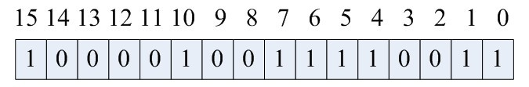

# 位图 Bitmap

## 定义

使用每一位来存储某种状态（也可以用更多的位，取决于你的编码）

- 所谓的 `bitmap` 就是用一个 `bit` 位来标记某个元素对应的 `value`， 而 `key` 即是该元素。由于采用了 `bit` 为单位来存储数据，因此在存储空间方面，可以大大节省。
- 适用于大规模数据，且数据的状态不是很多，比如：存在-不存在（1 bit），不存在-存在一个-存在多个（2 bit）
- STL 中有 bitset 容器

> bitset in STL：
>
> A bitset is a special container class that is designed to store bits (elements with only two possible values: 0 or 1,`true` or `false`, ...).The class is very similar to a regular array, but optimizing for space allocation: each element occupies only one bit (which is eight times less than the smallest elemental type in C++: `char`).Each element (each bit) can be accessed individually: for example, for a given bitset named `mybitset`, the expression `mybitset[3]` accesses its fourth bit, just like a regular array accesses its elements.

## 数据结构

### 数据表示

```
unsigned int bit[N];
```

- 在这个数组中，我们可以存储 bit_size = N × sizeof(int) × 8 个数据
  - 按从右到左的顺序每一位表示一个数，依次递增（相当于对整个数据结构进行了编码）
- 下面是 [5，1，7，15，0，4，6，10] 在 bitset 中的表示：



### 写入数据

设容器如下：

```
unsigned char bit[8 * 1024];
```

- 该容器能够存储  8×1024×8 = 64K 个数据

写入时，需要计算原始数值在 bitset 中的字节偏移和位偏移，这两个值都需要先求出偏移量，这里以 1234 为例：

- 偏移量：容器使用基本类型的位大小：比如 sizeof(char)×8 = 8
- 字节偏移：当前数值存储于哪一个单元中，1234 / 8 = 154
- 位偏移：当前数值用单元中的哪一个位表示：1234 % 8 = 2

因此，数值 1234 存储于 bit[154] 号单元，其中 2 号位设置为 1（右起第二个！）

```
int bytePos = 1234 / 8;
int bitPos = 1234 % 8;
unsigned short val = 1 << bitPos;
bit[bytePos] = bit[bytePos] | val;
```

将其封装为函数：

```
void setbit(bitset<char>& bitmap, int i) {
	bitmap[i >> SHIFT] |= (1 << (i & MASK));
}
```

### 读取数据

```
bool getbit(int *bitmap1, int i){
    return bitmap1[i >> SHIFT] & (1 << (i & MASK));
}
```

## 应用举例

### 问题

给一台普通 `PC`，`2G` 内存，要求处理一个包含 `40` 亿个不重复并且没有排过序的无符号的 `int` 整数，给出一个整数，问如果快速地判断这个整数是否在文件 `40` 亿个数据当中？

### 分析

- 对于 unsigned int 来说，32 位能够表示 42 亿
- `40` 亿个 `int` 占 `(40亿*4)/1024/1024/1024` 大概为 `14.9G` 左右，很明显内存只有 `2G` ，放不下，因此不可能将这 `40` 亿数据放到内存中计算
  - 注意：10 亿个数也就是 1G 个书
- 问题转变为如何利用 2G 空间对数据进行索引（一次放完或者切分放完）
- 2G 内存共有 2 × 1024 × 1024 × 1024 × 8 = 171.7987 亿位
- 一个 `int` 整数占 `4` 个字节的即要 `32bit` 位，如果能够用一个 `bit` 位来标识一个 `int` 整数那么存储空间将大大减少
  - 注意：这里的 32 代表了位图对直接存储方法的压缩比
- 算一下 `40` 亿个 `int` 需要的内存空间为 `40亿/8/1024/1024` 大概为 `476.83MB`，这样的话我们完全可以将这 `40` 亿个 `int` 数放到内存中进行处理

### 方案

1. 用 bitmap 表示 40 亿个数，只需要 40 亿 / 32 个 int 单元（或者 40 亿 / 8 个 char 单元），大约 500 MB 空间即可，因此申请 1 + n / 32 长度的 int 数组
2. 数组中每位表示 32 个数

```
tmp[0]:可表示 0~31
tmp[1]:可表示 32~63
tmp[2]可表示 64~95
```

3. 如何判断 `int` 数字在 `tmp` 数组的哪个下标，这个其实可以通过直接除以 `32` 取整数部分，例如：整数 `8` 除以`32` 取整等于 `0`，那么 `8` 就在 `tmp[0]`上。另外，我们如何知道了 `8` 在 `tmp[0]`中的 `32` 个位中的哪个位，这种情况直接 `mod` 上 `32` 就 `ok` ，又如整数 `8` ，在 `tmp[0]` 中的第 `8 mod` 上 `32` 等于 `8`，那么整数 `8` 就在 `tmp[0]` 中的第八个 `bit` 位（**从右边数起**）。

## 位图的优点

- 用连续的位来表示大量的数据，适合大数据查找

## 位图的缺点

- 可读性差
- 存储元素个数等于元素最大值，对于 unsigned int 类型的数据，需要 5 亿字节的内存
- 对于有符号类型数据的存储，需要两位来表示

## 位图的应用

- 给40亿个不重复的unsigned int的整数，没排过序的，然后再给一个数，如何快速判断这个数是否在那40亿个数当中
  - 首先，将这40亿个数字存储到bitmap中，然后对于给出的数，判断是否在bitmap中即可
- 使用位图法判断整形数组是否存在重复
  - 遍历数组，一个一个放入bitmap，并且检查其是否在bitmap中出现过，如果没出现放入，否则即为重复的元素
- 使用位图法进行整形数组排序
  - 首先遍历数组，得到数组的最大最小值，然后根据这个最大最小值来缩小bitmap的范围。这里需要注意对于int的负数，都要转化为unsigned int来处理，而且取位的时候，数字要减去最小值
- 在2.5亿个整数中找出不重复的整数，注，内存不足以容纳这2.5亿个整数
  - 对于 2 ^ 32 来说，可以表示 42 亿个数，因此 2.5 亿个数只需要 2.9 MB 的内存就能表示了
  - 采用2-Bitmap（每个数分配2bit，00表示不存在，01表示出现一次，10表示多次，11无意义）进行，共需内存2^32 * 2 bit=1 GB内存，还可以接受。然后扫描这2.5亿个整数，查看Bitmap中相对应位，如果是00变01，01变10，10保持不变。所描完事后，查看bitmap，把对应位是01的整数输出即可。
  - 其实，这里可以使用两个普通的Bitmap，即第一个Bitmap存储的是整数是否出现，如果再次出现，则在第二个Bitmap中设置即可。这样的话，就可以使用简单的1- Bitmap了


## 参考资料

- https://www.iteblog.com/archives/148.html