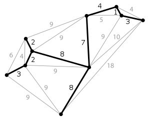

# 最小生成树

最小生成树是一副连通加权无向图中一棵权值最小的生成树。



## Prim 算法 - 选点法

1. 从一点开始，寻找当前点可访问的所有边
2. 在边集合中选择存在还未访问过点的最小边，将该点加入解集，将该边标记
3. 重复 2 过程，直到没有新的点加入


## Kruskal 算法 - 选边法

1. 对所有边进行排序
2. 依次从边集合中取出最小边，将其两点加入解集，并标记该边，若该边位于同一棵树上，则跳过该边
3. 重复 2 过程，直到选择了 n-1 条边


```
4 6
1 2 1
1 3 1
2 3 2
2 4 2
3 4 3
4 1 4
```

