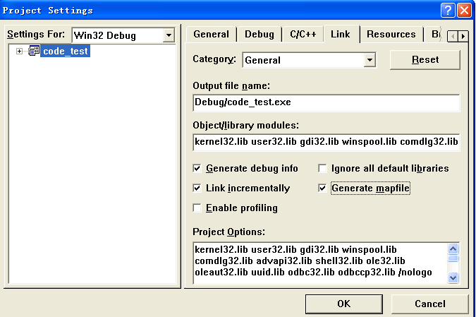

# 极客学院-一步一步写算法

# 一步一步写算法

算法是计算机的生命。没有算法，就没有软件，计算机也就成了一个冰冷的机器，没有什么实用价值。很多人认为，算法是数学的内容，学起来特别麻烦。我们不能认为这种观点是错误的。但是我们也知道，软件是一种复合的技术，如果一个人只知道算法，但是不能用编程语言很好地实现，那么再优秀的算法也不能发挥作用。一个人只有有了很好的计算机知识和数学知识，才能在算法的学习上不断进步。不管算法多么简单，都要自己亲手实践，只有不断认识错误、不断发现错误，才能不断提高自己的编程能力，不断提高自己的业务水平。

这里取名一步一步写算法的目的主要有两个：第一，保证我们的算法都是大家可以学得会，看的懂的；第二，保证我们的算法是健壮的、可以测试的。所以在编写的过程中，我们的算法开发过程是伴随着测试用例增加的，没有测试用例保证的代码只是一段无序的字符而已，没有什么价值。

其实任何算法都有自己的应用环境和应用场景，没有算法可以适用于所有的场景。这一点希望大家明白。同时，我们也要清楚复杂的算法都是由普通的算法构成的，没有普通的算法就没有复杂的算法可言，所以复杂变简单，由大化小，这就是算法分治递归的基本思想。

我们可以下面一个数组查找的函数说起。一句一句写起，首先我们开始从最简单的函数构造开始：

```
int find(int array[], int length, int value)
{
    int index = 0;
    return index;
}
```

这里看到，查找函数只是一个普通的函数，那么首先需要判断的就是参数的合法性：

```
static void test1()
{
    int array[10] = {0};
    assert(FALSE == find(NULL, 10, 10));
    assert(FALSE == find(array, 0, 10));
}
```

这里可以看到，我们没有判断参数的合法性，那么原来的查找函数应该怎么修改呢？

```
int find(int array[], int length, int value)
{
    if(NULL == array || 0 == length)
        return FALSE;

    int index = 0;
    return index;
}
```

看到上面的代码，说明我们的已经对入口参数进行判断了。那么下面就要开始写代码了。

```
int find(int array[], int length, int value)
{
    if(NULL == array || 0 == length)
        return FALSE;

    int index = 0;
    for(; index < length; index++){
        if(value == array[index])
            return index;
    }

    return FALSE;
}
```

上面的代码已经接近完整了，那么测试用例又该怎么编写呢？

```
static void test2()
{
    int array[10] = {1, 2};
    assert(0 == find(array, 10, 1));
    assert(FALSE == find(array, 10, 10));
}
```

运行完所有的测试用例后，我们看看对原来的代码有没有什么可以优化的地方。其实，我们可以把数组转变成指针。

```
int find(int array[], int length, int value)
{
    if(NULL == array || 0 == length)
        return FALSE;

    int* start = array;
    int* end = array + length;
    while(start < end){
        if(value == *start)
            return ((int)start - (int)array)/(sizeof(int));
        start ++;
    }

    return FALSE;
}
```

如果上面的代码参数必须是通用的数据类型呢？

```
template
int find(type array[], int length, type value)
{
    if(NULL == array || 0 == length)
        return FALSE;

    type* start = array;
    type* end = array + length;
    while(start < end){
        if(value == *start)
            return ((int)start - (int)array)/(sizeof(type));
        start ++;
    }

    return FALSE;
}
```

此时，测试用例是不是也需要重新修改呢？

```
static void test1()
{
    int array[10] = {0};
    assert(FALSE == find(NULL, 10, 10));
    assert(FALSE == find(array, 0, 10));
}

static void test2()
{
    int array[10] = {1, 2};
    assert(0 == find(array, 10, 1));
    assert(FALSE == find(array, 10, 10));
}
```

所以，下面我们总结一下：

（1）我们的算法需要测试用例的验证

（2）任何的优化都要建立在测试的基础之上

（3）测试和代码的编写要同步进行

（4）算法的成功运行时一步一步进行得，每一步的成功必须确立在原有的成功之上

> **致谢**
> 内容撰写：http://blog.csdn.net/feixiaoxing

# 循环和递归

其实编程的朋友知道，不管学什么语言，循环和递归是两个必须学习的内容。当然，如果循环还好理解一点，那么递归却没有那么简单。我们曾经对递归讳莫如深，但是我想告诉大家的是，递归其实没有那么可怕。所谓的递归就是函数自己调用自己而已，循环本质上也是一种递归。

1）求和递归函数

我们可以举一个循环的例子，前面我们说过，如果编写一个1到n的求和函数怎么写呢，你可能会这么写：

```
int calculate(int m)
{
    int count = 0;
    if(m <0)
        return -1;

    for(int index = 0; index <= m; index++)
        count += index;

    return count;
}
```

上面只是一个示范。下面我们看看如果是递归应该怎么写呢？

```
int calculate(int m)
{
    if(m == 0)
        return 0;
    else
        return calculate(m -1) + m;
}
```

大家看着两段代码有什么不同？

（1）第一段代码从0，开始计算，从0到m逐步计算；第二段代码是从10开始计算，逐步到0之后这回，这样同样可以达到计算的效果

（2）第一段代码不需要重复的压栈操作，第二段需要重复的函数操作，当然这也是递归的本质

（3）第一段代码比较长，第二段代码较短

2）查找递归函数

大家可能说，这些代码有些特殊。如果是查找类的函数，有没有可能修改成递归函数呢？

```
int find(int array[], int length, int value)
{
    int index = 0;
    if(NULL == array || 0 == length)
        return -1;

    for(; index < length; index++)
    {
        if(value == array[index])
            return index;
    }

    return -1;
}
```

大家可能说，这样的代码可能修改成这样的代码：

```
int _find(int index, int array[], int length, int value)
{
    if(index == length)
        return -1;

    if(value == array[index])
        return index;

    return _find(index + 1,  array, length, value);
}

int find(int array[], int length, int value)
{
    if(NULL == array || length == 0)
        return -1;

    return _find(0, array, length, value);
}
```

3） 指针变量遍历

结构指针是我们喜欢的遍历结构，试想如果有下面定义的数据结构：

```
typedef struct _NODE
{
    int data;
    struct _NODE* next;
}NODE;
```

那么，此时我们需要对一个节点链接中的所有数据进行打印，应该怎么办呢？大家可以自己先想想，然后看看我们写的代码对不对。

```
void print(const NODE* pNode)
{
    if(NULL == pNode)
        return;

    while(pNode){
        printf("%dn", pNode->data);
        pNode = pNode->next;
    }
}
```

那么此时如果改成递归，那就更简单了：

```
void print(const NODE* pNode)
{
    if(NULL == pNode)
        return;
    else
        printf("%dn", pNode->data);

    print(pNode->next);
}
```

其实，写这么多，就是想和大家分享一下我个人的观点：循环是一种特殊的递归，只有递归和堆栈是等价的。所有的递归代码都可以写成堆栈的形式，下面的一片博客我们就讨论一下堆栈和递归的关系。要想写好，必须熟练掌握堆栈。

# 递归和堆栈

看过我前面博客的朋友都清楚，函数调用主要依靠ebp和esp的堆栈互动来实现的。那么递归呢，最主要的特色就是函数自己调用自己。如果一个函数调用的是自己本身，那么这个函数就是递归函数。

我们可以看一下普通函数的调用怎么样的。试想如果函数A调用了函数B，函数B又调用了函数C，那么在堆栈中的数据是怎么保存的呢？

```
函数A    ^
函数B    |    (地址递减)
函数C    |
```

如果是递归函数呢，举一个简单的递归函数为例：

```
int iterate(int value)
{
    if(value == 1)
        return 1;
    return value + iterate(value -1);
}
```

下面我们使用一个函数进行调用，看看会发生什么情况？

```
void process()
{
    int value = iterate(6);
}
```

看看此时内存堆栈是什么样的？

```
iterate(int 1) line 96
iterate(int 2) line 97 + 12 bytes
iterate(int 3) line 97 + 12 bytes
iterate(int 4) line 97 + 12 bytes
iterate(int 5) line 97 + 12 bytes
iterate(int 6) line 97 + 12 bytes
process() line 102 + 7 bytes
main() line 108
mainCRTStartup() line 206 + 25 bytes
KERNEL32! 7c817067()
```

大家也看到了上面的代码，递归函数和普通的函数也没有什么差别。除了自己调用本身之外，他就是一个普通的函数。那么这个函数递归到什么时候返回呢？这就是递归函数的关键了。我们看到iterate函数到1就停止了，所以上面的堆栈在（value == 1）即return。所以一个递归函数最关键的部分就是两点：（1）递归策略；（2）函数出口。

看到这里，大家可能感到递归函数不过如此，事实上也是这样。但是，还有一点大家需要牢记在心，递归的深度是我们必须考虑的一个问题。只有递归深度在一个可控的范围内，那么整个递归过程都是可控的。那什么时候不可控呢？那就是递归深度超过了一定的数字？这个数字和具体的线程堆栈长度有关？等到堆栈溢出了，那么获得的数据已经失去了真实性，所以也就没有意义了。

我们把上面的问题推广一下，如何用自己定义的堆栈模拟上面的递归调用呢？这样既能满足递归的属性，又能确保函数深度可控。

大家可以先写一下自己的方案，下面只是我个人的一个思路。

```
int iterate(int value)
{
    int count = 0;
    int number  =0;

    push(value);
    while(-1 != (number = pop()))
    {
        if(1 != number)
            push(number -1);
        count += number;
    }

    return count;
}
```

# 内存

内存是程序运行的基础。所有正在运行的代码都保存在内存里面。内存需要处理各种各样的数据，包括键盘的数据、鼠标的数据、usb的数据、串口的数据、摄像头的数据，那么这些数据经过程序的处理之后，就要进行输出到串口、屏幕、usb等。

内存只有一个，但是程序里面的空间有很多种。但是内存中的数据类型只有几种，比如说全局中的数据、堆中的数据、临时堆栈中的数据。那么他们有什么区别呢？我们可以通过代码发现一些问题。

（1）全局数据

```
static int value = 100;

void process()
{
    static int number = 10;
}
```

大家可以在这里看到，value和number的数据其实都属于全局数据，这里的变量是不随着函数的调用发生变化的。

（2）堆数据

```
void process()
{
    char* point = (char*)malloc(100);
    free(point);
}
```

这里的point分配的数据就是堆数据，如果没有free操作，那么它的存在也是全局的。只要内存不主动释放，那么这个内存就会以一直存在。

（3）临时数据

```
void process()
{
    char name[100] = {0};
    return;
}
```

这里的数据都是堆栈内部的数据，一旦process调用结束返回之前，那么name地址指向的内存空间已经被其他函数使用。此时这段内存空间对我们来说已经没有什么意义了。所以，不管在函数里面用了多少空间，如果你想在函数返回之前继续使用里面的数据，务必在函数返回前拷贝完毕。

这篇博客的内容比较简单，主要讲述了内存的一些内容。其实关于内存的东西还很多。这里说明一下只是让大家有一个了解：

1） 全局数据是我们喜欢使用的类型，用起来比较方便

2）堆数据是系统给我们安排的空间

3）堆栈空间只能存在于当时的函数之中，函数返回即失去意义

虽然我们上面这么说，但是这三个概念有的时候也是可以相互迁移的，比如说：

1） 有的时候，我们为了测试的需要，首先构建一个全局内存池，以后测试的内存都是通过自定义的malloc在内存池中分配的，所以这个时候，堆分配和全局联系在了一起。

全局内存空间 < =========> 内存池 < =========> 本地空间分配

2） 如果我们使用的函数空间比较小，那么所有的操作就可以在一个函数内部完成了，那么这时候全局空间和临时堆栈是不是一致的呢

全局空间 < =============> 本地堆栈

上面的说法有些绕，但是我们的目的只是想让大家时刻明白：

a）必须时刻明白我们的数据在哪块空间里面

b）内存会不会越界

c）内存会不会泄露

d）内存访问的数据是否依然有效

# 查找

无论是数据库，还是普通的ERP系统，查找功能数据处理的一个基本功能。数据查找并不复杂，但是如何实现数据又快又好地查找呢？前人在实践中积累的一些方法，值得我们好好学些一下。我们假定查找的数据唯一存在，数组中没有重复的数据存在。

（1） 普通的数据查找

设想有一个1M的数据，我们如何在里面找到我们想要的那个数据。此时数据本身没有特征，所以我们需要的那个数据可能出现在数组的各个位置，可能在数据的开头位置，也可能在数据的结束位置。这种性质要求我们必须对数据进行遍历之后才能获取到对应的数据。

```
int find(int array[], int  length, int value)
{
    if(NULL == array || 0 == length)
        return -1;

    for(int index = 0; index < length; index++){
        if(value == array[index])
            return index;
        }
    return -1;
}
```

分析：

由于我们不清楚这个数据判断究竟需要多少次。但是，我们知道，这样一个数据查找最少需要1次，那么最多需要n次，平均下来可以看成是（1+n）/2，差不多是n的一半。我们把这种比较次数和n成正比的算法复杂度记为o（n）。

（2）上面的数据没有任何特征，这导致我们的数据排列地杂乱无章。试想一下，如果数据排列地非常整齐，那结果会是什么样的呢？就像在生活中，如果平时不注意收拾整齐，那么找东西的时候非常麻烦，效率很低；但是一旦东西放的位置固定下来，所有东西都归类放好，那么结果就不一样了，我们就会形成思维定势，这样查找东西的效率就会非常高。那么，对一个有序的数组，我们应该怎么查找呢？二分法就是最好的方法。

```
int binary_sort(int array[], int length, int value)
{
    if(NULL == array || 0 == length)
        return -1;

    int start = 0;
    int end = length -1;

    while(start <= end){

        int middle = start + ((end - start) >> 1);
        if(value == array[middle])
            return middle;
        else if(value > array[middle]){
            start = middle + 1;
        }else{
            end = middle -1;
        }
    }

    return -1;
}
```

分析：

上面我们说到普通的数据查找算法复杂度是o（n）。那么我们可以用上面一样的方法判断一下算法复杂度。这种方法最少是1次，那么最多需要多少次呢？我们发现最多需要log（n+1）/log（2）即可。大家可以找个例子自己算一下，比如说7个数据，我们发现最多3次；如果是15个数据呢，那么最多4次；以此类推，详细的论证方法可以在《算法导论》、《计算机编程艺术》中找到。明显，这种数据查找的效率要比前面的查找方法高很多。

（3） 上面的查找是建立在连续内存基础之上的，那么如果是指针类型的数据呢？怎么办呢？那么就需要引入排序二叉树了。排序二叉树的定义很简单：（1）非叶子节点至少一边的分支非NULL；（2）叶子节点左右分支都为NULL；（3）每一个节点记录一个数据，同时左分支的数据都小于右分支的数据。可以看看下面的定义：

```
typedef struct _NODE
{
    int data;
    struct _NODE* left;
    struct _NODE* right;
}NODE;

那么查找呢，那就更简单了。

const NODE* find_data(const NODE* pNode, int data){
    if(NULL == pNode)
        return NULL;

    if(data == pNode->data)
        return pNode;
    else if(data < pNode->data)
        return find_data(pNode->left, data);
    else
        return find_data(pNode->right, data);
}
```

（4）同样，我们看到（2）、（3）都是建立在完全排序的基础之上，那么有没有建立在折中基础之上的查找呢？有，那就是哈希表。哈希表的定义如下：1）每个数据按照某种聚类运算归到某一大类，然后所有数据链成一个链表；2）所有链表的头指针形成一个指针数组。这种方法因为不需要完整排序，所以在处理中等规模数据的时候很有效。其中节点的定义如下：

```
typedef struct _LINK_NODE
{
    int data;
    struct _LINK_NODE* next;
}LINK_NODE;

那么hash表下面的数据怎么查找呢？

LINK_NODE* hash_find(LINK_NODE* array[], int mod, int data)
{
    int index = data % mod;
    if(NULL == array[index])
        return NULL;

    LINK_NODE* pLinkNode = array[index];
    while(pLinkNode){
        if(data == pLinkNode->data)
            return pLinkNode;
        pLinkNode = pLinkNode->next;
    }

    return pLinkNode;
}
```

分析：

hash表因为不需要排序，只进行简单的归类，在数据查找的时候特别方便。查找时间的大小取决于mod的大小。mod越小，那么hash查找就越接近于普通查找；那么hash越大呢，那么hash一次查找成功的概率就大大增加。

# 非递归排序

在上面一篇博客当中，我们发现普通查找和排序查找的性能差别很大。作为一个100万的数据，如果使用普通的查找方法，那么每一个数据查找平均下来就要几十万次，那么二分法的查找呢，20多次就可以搞定。这中间的差别是非常明显的。既然排序有这么好的效果，那么这篇博客中，我们就对排序算做一个总结。

按照我个人的理解，排序可以分为两种：一种是非递归排序，它主要按照非递归的方法对数据进行排序，也就是说主要数据的移位和循环来完成；另外一种就是递归方法，我们在排列当前数据的时候首先把子数据排列有序，然后才会排列当前的数据。这种不断递归调用的方法就是递归排序。

非递归排序的方法很多，这里主要介绍冒泡排序、插入排序、希尔排序；递归的方法也不少，这里介绍的方法是快速排序、归并排序和堆排序。排序的内容很多，本篇博客主要介绍非递归排序，递归排序的内容主要在下一节内容解决。

**（1）冒泡排序**

冒泡排序的内容并不复杂。假设有n个数据需要排序，那么我们需要确定n个从大到小的数据，每一次都挑选第n大的数据是多少，并且放大相应的位置。直到所有的数据都排列整齐了，那么我们的排序就结束了。

```
void bubble_sort(int array[], int length)
{
    int inner = 0, outer = 0;
    int median = 0;

    if(NULL == array || 0 == length)
        return;

    for(outer = length-1; outer >= 1; outer --){
        for(inner = 0; inner < outer; inner ++){
            if(array[inner] > array[inner + 1]){
                median = array[inner];
                array[inner] = array[inner + 1];
                array[inner + 1] = median;
            }
        }
    }
}
```

那么这个程序有没有什么改进的地方呢？当然存在，如果发现在一次遍历循环之中，如果没有发生移位的现象，那么是不是可以判断这个排序可以结束了呢？朋友们可以好好思考一下这个问题？

```
void bubble_sort(int array[], int length)
{
    int inner = 0, outer = 0;
    int median = 0;
    int flag = 1;

    if(NULL == array || 0 == length)
        return;

    for(outer = length-1; outer >= 1 && flag; outer --){
        flag = 0;

        for(inner = 0; inner < outer; inner ++){
            if(array[inner] > array[inner + 1]){
                median = array[inner];
                array[inner] = array[inner + 1];
                array[inner + 1] = median;

                if(flag == 0)
                    flag = 1;
            }
        }
    }
}
```

**（2） 插入排序**

插入排序的意思就是说，我们把数据分成两个部分，一部分是已经排好序的数据，一部分是当前还没有完成排序的数据。那么这么说来的话，排序的过程是不是就是把没有排序的数据逐个插入到已经排好序的队列中的过程呢。大家可以自己先试一下，然后再看看我的代码对不对？

```
void insert_sort(int array[], int length)
{
    int inner = 0;
    int outer = 0;
    int median = 0;
    if(NULL == array || 0 == length)
        return;

    for(outer = 1; outer = 1; inner --){
            if(array[inner] < array[inner -1]){
                median = array[inner];
                array[inner] = array[inner -1];
                array[inner -1] = median;
            }else{
                break;
            }
        }
    }
}
```

那么插入排序有没有像冒泡排序那样的改进方法呢？其实没有。因为每一次插入排序的位置都是局部比较的结果，而冒泡排序每一次的内容都是全局最优的。这从数据比较的次数就可以看出来。

**（3）希尔排序**

希尔排序，我个人认为可以看成是冒泡排序的变种。它的基本思想是：首先按照一个序列递减的方法逐渐进行排序。比如说有10个数据，我们按照序列5、3、1的顺序进行排序。首先是5，那么我们对1和6、2和7、3和8、4和9、5和10进行排列；第二轮是3，那么对数据1、4、7、10排列，再对2、5、8进行排列，以及3、6、9排列；第三轮就和冒泡排序一样了，以此对每个数据进行排列。它的优势就是让整个队列基本有序，减少数据移动的次数，从而降低算法的计算复杂度。

```
void shell_sort(int array[], int length, int step)
{
    int inner = 0;
    int outer = 0;
    int median = 0;

    if(NULL == array || 0 == length)
        return;

    for(; step >= 1; step -=2){
        for(int index = 0; index < step; index ++){
            if((length -1) < (index + step))
                continue;
            else{
                outer = index + step;
                while( (outer + step) <= (length - 1))
                    outer += step;
            }

            for(;  outer >= (index + step);  outer -= step){
                for(inner = index; inner <= outer - step; inner += step){
                    if(array[inner] >= array[inner + step]){
                        median = array[inner];
                        array[inner] = array[inner + step];
                        array[inner + step] = median;
                    }
                }
            }
        }
    }
}
```

**总结：**

（1）上面的排序都是非递归程序，理解上不难，但是细节问题需要注意，特别是长度的问题

（2）代码编写的时候务必注意测试用例的设计

（3）如果可能的情况下，多使用已经验证的代码和函数

# 快速排序

快速排序是编程中经常使用到的一种排序方法。可是很多朋友对快速排序有畏难情绪，认为快速排序使用到了递归，是一种非常复杂的程序，其实未必如此。只要我们使用好了方法，就可以自己实现快速排序。

首先，我们复习一下，快速排序的基本步骤是什么：

1、 判断输入参数的合法性

2、把数组的第一个数据作为比较的原点，比该数据小的数据排列在左边，比该数据大的数据排列在右边

3、按照（2）的方法分别对左边的数组和右边的数据进行和（2）一样的数据排列

那么实际编写代码中，应该怎么做呢？

**a）首先，判断数据的合法性？**

```
void quick_sort(int array[], int length)
{
    int median = 0;
    if(NULL == array || 0 == length)
        return;

    _quick_sort(array, 0, length -1);
}

**b）寻找中间数，分别对左边和右边的数据进行排序**

void _quick_sort(int array[], int start, int end)
{
    int middle;
    if(start >= end)
        return;

    middle = get_middle(array, start, end);
    _quick_sort(array, start, middle -1);
    _quick_sort(array, middle + 1, end);
}

void quick_sort(int array[], int length)
{
    int median = 0;
    if(NULL == array || 0 == length)
        return;

    _quick_sort(array, 0, length-1);
}
```

**c）那么这里的中间数应该怎么安排呢？**

```
int get_middle(int array[], int start, int end)
{
    int front = 0;
    int tail = end - start;
    int value = array[start];
    int length = end - start + 1;
    int loop = start + 1;

    while(loop <= end){
        if(array[loop] < value){
            gQuickSort[front] = array[loop];
            front ++;
        }else{
            gQuickSort[tail] = array[loop];
            tail --;
        }

        loop ++;
    }

    gQuickSort[front] = value;
    memmove(&array[start], gQuickSort, sizeof(int) * (length));
    return start + front ;
}
```

注意：这里gQuickSort是一个全局数组，主要是为了作为排序的临时数组使用，实际环境中大家可以灵活运用各种方法。

d）基本的快速排序就完成了，那我们怎么测试呢？我们可以编写几个简单的测试用例？

```
static void test1()
{
    int array[] = {1};
    quick_sort(array, sizeof(array)/sizeof(int));
}

static void test2()
{
    int array[] = {2, 1};
    quick_sort(array, sizeof(array)/sizeof(int));
    assert(1 == array[0]);
    assert(2 == array[1]);
}

static void test3()
{
    int array[] = {4, 3, 2,1};
    quick_sort(array, sizeof(array)/sizeof(int));
    assert(1 == array[0]);
    assert(2 == array[1]);
    assert(3 == array[2]);
    assert(4 == array[3]);
}

static void test4()
{
    int array[] = {3, 2, 1};
    quick_sort(array, sizeof(array)/sizeof(int));
    assert(1 == array[0]);
    assert(2 == array[1]);
    assert(3 == array[2]);
}
```

# 合并排序

前面一篇博客提到的快速排序是排序算法中的一种经典算法。和快速排序一样，合并排序是另外一种经常使用的排序算法。那么合并排序算法有什么不同呢？关键之处就体现在这个合并上面。

合并算法的基本步骤如下所示：

1）把0~length-1的数组分成左数组和右数组

2）对左数组和右数组进行迭代排序

3）将左数组和右数组进行合并，那么生成的整个数组就是有序的数据数组

下面就开始实践操作：

a）创建函数，判断参数的合法性

```
void merge_sort(int array[], int length)  
{  
    if(NULL == array || 0 == length)  
        return ;  
    _merge_sort(array, 0, length-1);  
}  
```

b）进行merge函数迭代操作

```
void _merge_sort(int array[], int start, int end)  
{  
    if(start >= end)  
        return;  

    int middle = start + ((end - start) >> 1);  
    _merge_sort(array, start, middle);  
    _merge_sort(array, middle + 1, end);  
    _merge_data_in_array(array, start, middle, end);  
}  
```

c）对合并后的队列进行合并操作

```
void _merge_data_in_array(int array[], int start, int middle, int end)  
{  
    int length = end - start + 1;  
    int* pData = NULL;  
    int left = start;  
    int right = middle + 1;  
    int all = 0;  

    /* allocate new memory to the space */  
    pData = (int*) malloc(sizeof(int) * length);  
    assert(NULL != pData);  
    memset(pData, 0, length);  

    /* begin to move data */  
    while(right <= end){  
        while(array[left] <= array[right] && left <= middle){  
            pData[all] = array[left]; left ++; all ++;  
        }  

        if(left > middle)  {  
            break;  
        }  

        while(array[left] > array[right] && right <= end){  
            pData[all] = array[right]; right ++; all ++;  
        }  
    }  

    /* move the left data */  
    if(left <= middle)  
        memmove(&pData[all], &array[left], sizeof(int) * (middle -left +1));  

    if(right <= end)  
        memmove(&pData[all], &array[right], sizeof(int) * (end - right + 1));  

    memmove(&array[start], pData, sizeof(int) * length);  
    free(pData);  
}  
```

注： 文中使用的pData动态内存不是一种最优的处理办法，实际开发中可以由其他形式的数据类型代替。

d）编写测试用例

```
static void test1()  
{  
    int array[] = {1};  
    merge_sort(array, sizeof(array)/sizeof(int));  
}  

static void test2()  
{  
    int array[] = {2, 1};  
    merge_sort(array, sizeof(array)/sizeof(int));  
    assert(1 == array[0]);  
    assert(2 == array[1]);  
}  

static void test3()  
{  
    int array[] = {3, 2, 1};  
    merge_sort(array, sizeof(array)/sizeof(int));  
    assert(1 == array[0]);  
    assert(2 == array[1]);  
    assert(3 == array[2]);  
}  

static void test4()  
{  
    int array[] = {4, 3, 5, 1};  
    merge_sort(array, sizeof(array)/sizeof(int));  
    assert(1 == array[0]);  
    assert(3 == array[1]);  
    assert(4 == array[2]);  
    assert(5 == array[3]);  
}  
```

分析快速排序和合并排序的相同点和不同点：

- 相同点： 都是迭代操作
- 不同点： 快速排序，先分类再迭代；合并排序，先迭代再合并

# 堆排序

堆排序是另外一种常用的递归排序。因为堆排序有着优秀的排序性能，所以在软件设计中也经常使用。堆排序有着属于自己的特殊性质，和二叉平衡树基本是一致的。打一个比方说，处于大堆中的每一个数据都必须满足这样一个特性：

（1）每一个array[n] 不小于array[2*n]

（2）每一个array[n]不小于array[2 * n + 1]

构建这样一个堆只是基础，后面我们需要每次从堆的顶部拿掉一个数据，不断调整堆，直到这个数组变成有序数组为主。所以详细的堆排序算法应该是这样的：

1）构建大堆，使得堆中的每一个数据都满足上面提到的性质

2）将堆的第一个数据和堆的最后一个数据进行互换，然后重新调整堆，直到堆重新平衡为止

3）重复2）的过程，直到整个数组有序。

上面的描述过程很简单，那么实践操作是怎么样的呢？

**a）对入参进行判断**

```
void heap_sort(int array[], int length)
{
    if(NULL == array || 0 == length)
        return ;

    /* to make sure data starts at number 1 */
    _heap_sort(array-1, length);
}

 **b）构建大堆和调整大堆**

void _heap_sort(int array[], int length)
{
    int index = 0;
    int median = 0;
    construct_big_heap(array, length);

    for(index = length; index > 1; index --)
    {
        median = array[1];
        array[1] = array[index];
        array[index] = median;

        reconstruct_heap(array, 1, index-1);
    }
}
```

**c）构建大堆的细节操作部分**

```
void set_sorted_value(int array[], int length)
{
    int index = length;
    int median = 0;
    if(length == 1) return;

    while(index > 1){
        if(array[index >> 1] >= array[index])
            break;

        median = array[index];
        array[index] = array[index >> 1];
        array[index >> 1] = median;
        index >>= 1;
    }
}

void construct_big_heap(int array[], int length)
{
    int index = 0 ;

    for(index = 1; index <= length; index ++)
    {
        set_sorted_value(array, index);
    }
}
```

**d）大堆迭代调整**

```
void reconstruct_heap(int array[], int index, int length)
{
    int swap = 0;
    if(length < index << 1)
        return;

    if(length == index << 1){
        adjust_leaf_position(array, index);
        return;
    }

    if(-1 != (swap = adjust_normal_position(array, index))){
        reconstruct_heap(array, swap, length);
    }
}
```

e）对单分支节点和满分支节点分别处理

```
int adjust_normal_position(int array[], int index)
{
    int left = index << 1 ;
    int right = left + 1;
    int median = 0;
    int swap = 0;

    if(array[index] >= array[left]){
        if(array[index] >= array[right]){
            return -1;
        }else{
            swap = right;
        }
    }else{
        if(array[index] >= array[right]){
            swap = left;
        }else{
            swap = array[left] > array[right] ? left : right;
        }
    }

    if(swap == left) {
        median = array[index];
        array[index] = array[left];
        array[left] = median;
    }else{
        median = array[index];
        array[index] = array[right];
        array[right] = median;
    }

    return swap;
}

STATUS adjust_leaf_position(int array[], int index)
{
    int median = 0;
    if(array[index] > array[index << 1])
        return TRUE;

    median = array[index];
    array[index] = array[index << 1];
    array[index << 1] = median;
    return FALSE;
}
```

**f）堆排序算法介绍完毕，创建测试用例验证**

```
static void test1()
{
    int array[] = {1};
    heap_sort(array, sizeof(array)/sizeof(int));
}

static void test2()
{
    int array[] = {2, 1};
    heap_sort(array, sizeof(array)/sizeof(int));
    assert(1 == array[0]);
    assert(2 == array[1]);
}

static void test3()
{
    int array[] = {3, 2, 1};
    heap_sort(array, sizeof(array)/sizeof(int));
    assert(1 == array[0]);
    assert(2 == array[1]);
    assert(3 == array[2]);
}

static void test4()
{
    int array[] = {2, 3, 1};
    heap_sort(array, sizeof(array)/sizeof(int));
    assert(1 == array[0]);
    assert(2 == array[1]);
    assert(3 == array[2]);
}

static void test5()
{
    int array[] = {5,3, 4, 1};
    heap_sort(array, sizeof(array)/sizeof(int));
    assert(1 == array[0]);
    assert(3 == array[1]);
    assert(4 == array[2]);
    assert(5 == array[3]);
}

static void test6()
{
    int array[] = {2, 3,6, 8, 7};
    heap_sort(array, sizeof(array)/sizeof(int));
    assert(2 == array[0]);
    assert(3 == array[1]);
    assert(6 == array[2]);
    assert(7 == array[3]);
    assert(8 == array[4]);
}

static void test7()
{
    int array[] = {3,4,2,7,1,9,8,6,5};
    heap_sort(array, sizeof(array)/sizeof(int));
    assert(1 == array[0]);
    assert(2 == array[1]);
    assert(3 == array[2]);
    assert(4 == array[3]);
    assert(5 == array[4]);
    assert(6 == array[5]);
    assert(7 == array[6]);
    assert(8 == array[7]);
    assert(9 == array[8]);
}
```

# 线性结构的处理

我们知道，在内存中的空间都是连续的。也就是说，0x00000001下面的地址必然是0x00000002。所以，空间上是不会出现地址的突变的。那什么数据结构类型是连续内部空间呢，其实就是数组，当然也可以是堆。数组有很多优势，它可以在一段连续空间内保存相同类型的数据，并且对这些数据进行管理。所以从这个意义上说，掌握了数组才能说明你数据结构入门了。

那么，在实际开发中，我们对线性结构应该注意些什么呢？我个人的观点：

（1）数组的资源是有限的，必须确定资源的范围

（2）数组中资源的申请和释放必须一一对应，否则很容易造成资源泄漏的现象

（3）数组中的注意事项同样应用于堆分配的连续内存资源空间中

下面是自己设计的一个int分配的小程序，大家可以一起尝试一下：

**a）设计内存节点的数据形式**

```
typedef struct _DATA_NODE
{
    int* pData;
    char* pFlag;
    int num;
}DATA_NODE;

#define STATUS int
#define TRUE 1
#define FALSE 0
```

**b）创建内存节点**

```
DATA_NODE* malloc_node(int number)
{
    DATA_NODE* pDataNode = NULL;
    if(0 == number)
        return NULL;

    pDataNode = (DATA_NODE*) malloc(sizeof(DATA_NODE));
    assert(NULL != pDataNode);
    memset(pDataNode, 0, sizeof(DATA_NODE));

    pDataNode->pData = (int*)malloc(sizeof(int) * number);
    if(NULL == pDataNode->pData){
        free(pDataNode);
        return NULL;
    }

    pDataNode->pFlag = (char*) malloc( (number + 7) >> 3);
    if(NULL == pDataNode->pFlag){
        free(pDataNode->pData);
        free(pDataNode);
        return NULL;
    }

    memset(pDataNode->pData, 0, sizeof(int) * number);
    memset(pDataNode->pFlag, 0, (number + 7) >> 3);
    pDataNode->num = number;
    return pDataNode;
}
```

**c） 删除内存节点**

```
STATUS free_node(const DATA_NODE* pDataNode)
{
    if(NULL == pDataNode)
        return FALSE;

    assert(NULL != pDataNode ->pData);
    assert(NULL != pDataNode-> pFlag);
    assert(0 != pDataNode);

    free(pDataNode->pFlag);
    free(pDataNode->pData);
    free((void*)pDataNode);
    return TRUE;
}
```

**d）判断当前是否还有内存可以分配**

```
int check_if_data_exist(const DATA_NODE* pDataNode)
{
    int number = pDataNode->num;
    char* pFlag = pDataNode->pFlag;
    unsigned char flag = 0;
    int loop = 1;

    while(loop <= number){
        flag = pFlag[(loop + 7) >> 3 - 1] & (0x1 << ((loop + 7) % 8));
        if(0 != flag){
            return loop;
        }

        loop ++;
    }

    return -1;
}
```

**e） 分配内存空间**

```
int* alloca_data(const DATA_NODE* pDataNode)
{
    int* pData = NULL;
    int pos;
    if(NULL == pDataNode)
        return NULL;

    if(-1 == (pos = check_if_data_exist(pDataNode)))
        return NULL;

    pDataNode->pFlag[(pos + 7) >> 3 - 1] |= 0x1 << ((pos + 7)% 8);
    return pDataNode->pData + (pos - 1);
}
```

**f）回收内存空间**

```
STATUS free_data(const DATA_NODE* pDataNode, const int* pData)
{
    int pos = 0;
    if(NULL == pDataNode || NULL == pData)
        return FALSE;

    if(pData < pDataNode->pData || pData > (pDataNode->pData + pDataNode->num))
        return FALSE;

    pos = (pData - pDataNode->pData) >> 3;
    pDataNode->pFlag[(pos + 7) -1]  &= ~(0x1 << ((pos + 7) % 8));
    return TRUE;
}
```

**g）统计当前已经分配了多少DWORD空间**

```
int count_free_space(const DATA_NODE* pDataNode)
{
    int count = 0;
    int loop = 1;
    char flag = 0;
    if(NULL == pDataNode)
        return 0;

    for(; loop <= pDataNode->num; loop++)
    {
        flag = pDataNode->pFlag[(loop + 7) >> 3 - 1] & (0x1 << ((loop + 7) % 8));
        if(0 == flag){
            count ++;
        }
    }

    return count;
}
```

上面的代码只是一个示范，大家可以在这个基础之上加以改进，比如说：

（1）修改成可以自由分配很多内存，注意需要同时修改flag的结构类型

（2）修改成先到先得的内存分配类型

（3）修改成最合适空间的内存分配类型

（4）修改成debug类型的内存分配形式，每次分配和释放的时候都检查内存是否越界、是否没有成对运行，注意需要添加对应的判断函数

# 线性队列

这里的线性结构实际上指的就是连续内存的意思，只不过使用"线性"这个词显得比较专业而已。前面一篇博客介绍了现象结构的处理方法，那么在这个基础之上我们是不是添加一些属性形成一种新的数据结构类型呢？答案是肯定的，队列便是其中的一种。

队列的性质很简单：

（1）队列有头部和尾部

（2）队列从尾部压入数据

（3）队列从头部弹出数据

那么连续内存下的队列是怎么实现的呢？

**a）设计队列数据结构**

```
typedef struct _QUEUE_NODE
{
    int* pData;
    int length;
    int head ;
    int tail;
    int count;
}QUEUE_NODE;
```

**b）申请队列内存**

```
QUEUE_NODE* alloca_queue(int number)
{
    QUEUE_NODE* pQueueNode;
    if( 0 == number)
        return NULL;

    pQueueNode = (QUEUE_NODE*)malloc(sizeof(QUEUE_NODE));
    assert(NULL != pQueueNode);
    memset(pQueueNode, 0, sizeof(QUEUE_NODE));

    pQueueNode->pData = (int*)malloc(sizeof(int) * number);
    if(NULL == pQueueNode->pData){
        free(pQueueNode);
        return NULL;
    }

    pQueueNode->length = number;
    return pQueueNode;
}
```

**c）释放队列内存**

```
STATUS delete_queue(const QUEUE_NODE* pQueueNode)
{
    if(NULL == pQueueNode)
        return FALSE;

    assert(NULL != pQueueNode->pData);

    free(pQueueNode->pData);
    free((void*)pQueueNode);
    return TRUE;
}
```

**d）把数据压入队列**

```
STATUS insert_queue(QUEUE_NODE* pQueueNode, int value)
{
    if(NULL == pQueueNode)
        return FALSE;

    if(pQueueNode->length == pQueueNode->count)
        return FALSE;

    pQueueNode->pData[pQueueNode->tail] = value;
    pQueueNode->tail = (pQueueNode->tail + 1) % pQueueNode->length;
    pQueueNode->count ++;
    return TRUE;
}
```

**e）把数据弹出队列**

```
STATUS get_queue_data(QUEUE_NODE* pQueueNode, int* value)
{
    if(NULL == pQueueNode || NULL == value)
        return FALSE;

    if(0 == pQueueNode->count)
        return FALSE;

    *value = pQueueNode->pData[pQueueNode->head];
    pQueueNode-> pData[pQueueNode->head] = 0;
    pQueueNode-> count --;
    pQueueNode->head = (pQueueNode->head + 1) % pQueueNode->length;
    return TRUE;
}
```

**f）统计当前队列中有多少数据**

```
int  get_total_number(const QUEUE_NODE* pQueueNode)
{
    if(NULL == pQueueNode)
        return 0;

    return pQueueNode->count;
}
```

**g）查看队列中初始化的时候总长度是多少**

```
int  get_total_number(const QUEUE_NODE* pQueueNode)
{
    if(NULL == pQueueNode)
        return 0;

    return pQueueNode->length;
}
```

# 线性堆栈

前面我们讲到了队列，今天我们接着讨论另外一种数据结构：堆栈。堆栈几乎是程序设计的命脉，没有堆栈就没有函数调用，当然也就没有软件设计。那么堆栈有什么特殊的属性呢？其实，堆栈的属性主要表现在下面两个方面：

（1）堆栈的数据是先入后出

（2）堆栈的长度取决于栈顶的高度

那么，作为连续内存类型的堆栈应该怎么设计呢？大家可以自己先试一下：

**（1）设计堆栈节点**

```
typedef struct _STACK_NODE
{
    int* pData;
    int length;
    int top;
}STACK_NODE;
```

**（2）创建堆栈**

```
STACK_NODE* alloca_stack(int number)
{
    STACK_NODE* pStackNode = NULL;
    if(0 == number)
        return NULL;

    pStackNode = (STACK_NODE*)malloc(sizeof(STACK_NODE));
    assert(NULL != pStackNode);
    memset(pStackNode, 0, sizeof(STACK_NODE));

    pStackNode->pData = (int*)malloc(sizeof(int) * number);
    if(NULL == pStackNode->pData){
        free(pStackNode);
        return NULL;
    }

    memset(pStackNode->pData, 0, sizeof(int) * number);
    pStackNode-> length = number;
    pStackNode-> top= 0;
    return pStackNode;
}
```

**（3）释放堆栈**

```
STATUS free_stack(const STACK_NODE* pStackNode)
{
    if(NULL == pStackNode)
        return FALSE;

    assert(NULL != pStackNode->pData);

    free(pStackNode->pData);
    free((void*)pStackNode);
    return TRUE;
}
```

**（4）堆栈压入数据**

```
STATUS stack_push(STACK_NODE* pStackNode, int value)
{
    if(NULL == pStackNode)
        return FALSE;

    if(pStackNode->length == pStackNode->top)
        return FALSE;

    pStackNode->pData[pStackNode->top ++] = value;
    return TRUE;
}
```

**（5）堆栈弹出数据**

```
STATUS stack_pop(STACK_NODE* pStackNode, int* value)
{
    if(NULL == pStackNode || NULL == value)
        return FALSE;

    if(0 == pStackNode->top)
        return FALSE;

    *value = pStackNode->pData[-- pStackNode->top];
    return TRUE;
}
```

**（6）统计当前堆栈中包含多少数据**

```
int count_stack_number(const STACK_NODE* pStackNode)
{
    return pStackNode->top;
}
```

建议： 堆栈是函数调用的基础，是递归调用的基础，是很多问题的根源，建议朋友们平时有时间好好练习一下。

# 单向链表

有的时候，处于内存中的数据并不是连续的。那么这时候，我们就需要在数据结构中添加一个属性，这个属性会记录下面一个数据的地址。有了这个地址之后，所有的数据就像一条链子一样串起来了，那么这个地址属性就起到了穿线连结的作用。

相比较普通的线性结构，链表结构的优势是什么呢？我们可以总结一下：

（1）单个节点创建非常方便，普通的线性内存通常在创建的时候就需要设定数据的大小

（2）节点的删除非常方便，不需要像线性结构那样移动剩下的数据

（3）节点的访问方便，可以通过循环或者递归的方法访问到任意数据，但是平均的访问效率低于线性表

那么在实际应用中，链表是怎么设计的呢？我们可以以int数据类型作为基础，设计一个简单的int链表：

**（1）设计链表的数据结构**

```
typedef struct _LINK_NODE
{
    int data;
    struct _LINK_NODE* next;
}LINK_NODE;
```

**（2）创建链表**

```
LINK_NODE* alloca_node(int value)
{
    LINK_NODE* pLinkNode = NULL;
    pLinkNode = (LINK_NODE*)malloc(sizeof(LINK_NODE));

    pLinkNode->data = value;
    pLinkNode->next = NULL;
    return pLinkNode;
}
```

**（3）删除链表**

```
void delete_node(LINK_NODE** pNode)
{
    LINK_NODE** pNext;
    if(NULL == pNode || NULL == *pNode)
        return ;

    pNext = &(*pNode)->next;
    free(*pNode);
    delete_node(pNext);
}
```

**（4）链表插入数据**

```
STATUS _add_data(LINK_NODE** pNode, LINK_NODE* pDataNode)
{
    if(NULL == *pNode){
        *pNode = pDataNode;
        return TRUE;
    }

    return _add_data(&(*pNode)->next, pDataNode);
}

STATUS add_data(const LINK_NODE** pNode, int value)
{
    LINK_NODE* pDataNode;
    if(NULL == *pNode)
        return FALSE;

    pDataNode = alloca_node(value);
    assert(NULL != pDataNode);
    return _add_data((LINK_NODE**)pNode, pDataNode);
}
```

**（5）删除数据**

```
STATUS _delete_data(LINK_NODE** pNode, int value)
{
    LINK_NODE* pLinkNode;
    if(NULL == (*pNode)->next)
        return FALSE;

    pLinkNode = (*pNode)->next;
    if(value == pLinkNode->data){
        (*pNode)->next = pLinkNode->next;
        free(pLinkNode);
        return TRUE;
    }else{
        return _delete_data(&(*pNode)->next, value);
    }
}

STATUS delete_data(LINK_NODE** pNode, int value)
{
    LINK_NODE* pLinkNode;
    if(NULL == pNode || NULL == *pNode)
        return FALSE;

    if(value == (*pNode)->data){
        pLinkNode = *pNode;
        *pNode = pLinkNode->next;
        free(pLinkNode);
        return TRUE;
    }

    return _delete_data(pNode, value);
}
```

**（6）查找数据**

```
LINK_NODE* find_data(const LINK_NODE* pLinkNode, int value)
{
    if(NULL == pLinkNode)
        return NULL;

    if(value == pLinkNode->data)
        return (LINK_NODE*)pLinkNode;

    return find_data(pLinkNode->next, value);
}
```

**（7）打印数据**

```
void print_node(const LINK_NODE* pLinkNode)
{
    if(pLinkNode){
        printf("%dn", pLinkNode->data);
        print_node(pLinkNode->next);
    }
}
```

**（8）统计数据**

```
int count_node(const LINK_NODE* pLinkNode)
{
    if(NULL == pLinkNode)
        return 0;

    return 1 + count_node(pLinkNode->next);
}
```

# 双向链表

前面的博客我们介绍了单向链表。那么我们今天介绍的双向链表，顾名思义，就是数据本身具备了左边和右边的双向指针。双向链表相比较单向链表，主要有下面几个特点：

（1）在数据结构中具有双向指针

（2）插入数据的时候需要考虑前后的方向的操作

（3）同样，删除数据的是有也需要考虑前后方向的操作

那么，一个非循环的双向链表操作应该是怎么样的呢？我们可以自己尝试一下：

**（1）定义双向链表的基本结构**

```
typedef struct _DOUBLE_LINK_NODE
{
    int data;
    struct _DOUBLE_LINK_NODE* prev;
    struct _DOUBLE_LINK_NODE* next;
}DOUBLE_LINK_NODE;
```

**（2）创建双向链表节点**

```
DOUBLE_LINK_NODE* create_double_link_node(int value)
{
    DOUBLE_LINK_NODE* pDLinkNode = NULL;
    pDLinkNode = (DOUBLE_LINK_NODE*)malloc(sizeof(DOUBLE_LINK_NODE));
    assert(NULL != pDLinkNode);

    memset(pDLinkNode, 0, sizeof(DOUBLE_LINK_NODE));
    pDLinkNode->data = value;
    return pDLinkNode;
}
```

**（3）删除双向链表**

```
void delete_all_double_link_node(DOUBLE_LINK_NODE** pDLinkNode)
{
    DOUBLE_LINK_NODE* pNode;
    if(NULL == *pDLinkNode)
        return ;

    pNode = *pDLinkNode;
    *pDLinkNode = pNode->next;
    free(pNode);
    delete_all_double_link_node(pDLinkNode);
}
```

**（4）在双向链表中查找数据**

```
DOUBLE_LINK_NODE* find_data_in_double_link(const DOUBLE_LINK_NODE* pDLinkNode, int data)
{
    DOUBLE_LINK_NODE* pNode = NULL;
    if(NULL == pDLinkNode)
        return NULL;

    pNode = (DOUBLE_LINK_NODE*)pDLinkNode;
    while(NULL != pNode){
        if(data == pNode->data)
            return pNode;
        pNode = pNode ->next;
    }

    return NULL;
}
```

**（5）双向链表中插入数据**

```
STATUS insert_data_into_double_link(DOUBLE_LINK_NODE** ppDLinkNode, int data)
{
    DOUBLE_LINK_NODE* pNode;
    DOUBLE_LINK_NODE* pIndex;

    if(NULL == ppDLinkNode)
        return FALSE;

    if(NULL == *ppDLinkNode){
        pNode = create_double_link_node(data);
        assert(NULL != pNode);
        *ppDLinkNode = pNode;
        (*ppDLinkNode)->prev = (*ppDLinkNode)->next = NULL;
        return TRUE;
    }

    if(NULL != find_data_in_double_link(*ppDLinkNode, data))
        return FALSE;

    pNode = create_double_link_node(data);
    assert(NULL != pNode);

    pIndex = *ppDLinkNode;
    while(NULL != pIndex->next)
        pIndex = pIndex->next;

    pNode->prev = pIndex;
    pNode->next = pIndex->next;
    pIndex->next = pNode;
    return TRUE;
}
```

**（6）双向链表中删除数据**

```
STATUS delete_data_from_double_link(DOUBLE_LINK_NODE** ppDLinkNode, int data)
{
    DOUBLE_LINK_NODE* pNode;
    if(NULL == ppDLinkNode || NULL == *ppDLinkNode)
        return FALSE;

    pNode = find_data_in_double_link(*ppDLinkNode, data);
    if(NULL == pNode)
        return FALSE;

    if(pNode == *ppDLinkNode){
        if(NULL == (*ppDLinkNode)->next){
            *ppDLinkNode = NULL;
        }else{
            *ppDLinkNode = pNode->next;
            (*ppDLinkNode)->prev = NULL;
        }

    }else{
        if(pNode->next)
            pNode->next->prev = pNode->prev;
        pNode->prev->next = pNode->next;
    }

    free(pNode);
    return TRUE;
}
```

**（7）统计双向链表中数据的个数**

```
int count_number_in_double_link(const DOUBLE_LINK_NODE* pDLinkNode)
{
    int count = 0;
    DOUBLE_LINK_NODE* pNode = (DOUBLE_LINK_NODE*)pDLinkNode;

    while(NULL != pNode){
        count ++;
        pNode = pNode->next;
    }
    return count;
}
```

**（8）打印双向链表中数据**

```
void print_double_link_node(const DOUBLE_LINK_NODE* pDLinkNode)
{
    DOUBLE_LINK_NODE* pNode = (DOUBLE_LINK_NODE*)pDLinkNode;

    while(NULL != pNode){
        printf("%dn", pNode->data);
        pNode = pNode ->next;
    }
}
```

注意：

今天我们讨论的双向链表是非循环的，大家可以考虑一下如果改成循环双向链表，应该怎么写？如果是有序的循环双向链表，又该怎么写？

# 循环单向链表

前面的博客中，我们曾经有一篇专门讲到单向链表的内容。那么今天讨论的链表和上次讨论的链表有什么不同呢？重点就在这个"循环"上面。有了循环，意味着我们可以从任何一个链表节点开始工作，可以把root定在任何链表节点上面，可以从任意一个链表节点访问数据，这就是循环的优势。

那么在实现过程中，循环单向链表有什么不同？

1）打印链表数据

```
void print_data(const LINK_NODE* pLinkNode)  
{  
    LINK_NODE* pIndex = NULL;  
    if(NULL == pLinkNode)  
        return;  

    printf("%d\n", pLinkNode->data);  
    pIndex = pLinkNode->next;  
    while(pLinkNode != pIndex){  
        printf("%d\n", pIndex->data);  
        pIndex = pIndex ->next;  
    }  
}  
```

以往，我们发现打印数据的结束都是判断指针是否为NULL，这里因为是循环链表所以发生了变化。原来的条件（NULL != pLinkNode）也修改成了这里的（pLinkNode != pIndex）。同样需要修改的函数还有find函数、count统计函数。

**2）插入数据**

```
STATUS insert_data(LINK_NODE** ppLinkNode, int data)  
{  
    LINK_NODE* pNode;  
    if(NULL == ppLinkNode)  
        return FALSE;  

    if(NULL == *ppLinkNode){  
        pNode = create_link_node(data);  
        assert(NULL != pNode);  

        pNode->next = pNode;  
        *ppLinkNode = pNode;  
        return TRUE;  
    }  

    if(NULL != find_data(*ppLinkNode, data))  
        return FALSE;  

    pNode = create_link_node(data);  
    assert(NULL != pNode);  

    pNode->next = (*ppLinkNode)->next;  
    (*ppLinkNode)->next = pNode;  
    return TRUE;  
}  
```

这里的insert函数在两个地方发生了变化：

a）如果原来链表中没有节点，那么链表节点需要自己指向自己

b）如果链表节点原来存在，那么只需要在当前的链表节点后面添加一个数据，同时修改两个方向的指针即可

**3） 删除数据**

```
STATUS delete_data(LINK_NODE** ppLinkNode, int data)  
{  
    LINK_NODE* pIndex = NULL;  
    LINK_NODE* prev = NULL;  
    if(NULL == ppLinkNode || NULL == *ppLinkNode)  
        return FALSE;  

    pIndex = find_data(*ppLinkNode, data);  
    if(NULL == pIndex)  
        return FALSE;  

    if(pIndex == *ppLinkNode){  
        if(pIndex == pIndex->next){  
            *ppLinkNode = NULL;  
        }else{  
            prev = pIndex->next;  
            while(pIndex != prev->next)  
                prev = prev->next;  

            prev->next = pIndex->next;  
            *ppLinkNode = pIndex->next;  
        }  
    }else{  
        prev = pIndex->next;  
        while(pIndex != prev->next)  
            prev = prev->next;  
        prev->next = pIndex->next;  
    }  

    free(pIndex);  
    return TRUE;  
}  
```

和添加数据一样，删除数据也要在两个方面做出改变：

a）如果当前链表节点中只剩下一个数据的时候，删除后需要设置为NULL

b）删除数据的时候首先需要当前数据的前一个数据，这个时候就可以从当前删除的数据开始进行遍历

c） 删除的时候需要重点判断删除的数据是不是链表的头结点数据

# 链表逆转

链表逆转是面试环境中经常遇到的一道题目，也是我们在实际开发中可能会遇到的开发需求。和线性逆转不一样，单向链表的节点需要一个一个进行处理。为了显示两者之间的区别，我们分别对线性内存和链表进行逆转：

**（1）普通连续内存数据的反转分析**

```
STATUS normal_revert(int array[], int length)
{
    int* pData ;
    int index = length - 1;
    if(NULL == array || 0 == length)
        return FALSE;

    pData = (int*)malloc(sizeof(int) * length);
    assert(NULL != pData);
    memset(pData, 0, sizeof(int) * length);

    while(index >= 0)
        pData[length - 1 - index] = array[index], index --;

    memmove(array, pData, length * sizeof(int));
    free(pData);
    return TRUE;
}
```

我们看到连续内存反转函数主要做了下面几个工作：

1）分配和原来数据一样大的内存

2）从原来数据末尾开始拷贝

3）利用pData获取的数据对原来的数据进行拷贝覆盖，释放内存

**（2）链表数据的反转**

```
STATUS link_revert(NODE** pNode)
{
    NODE* pPrevNode;
    NODE* pNextNode;
    if(NULL == pNode || NULL == *pNode)
        return FALSE;

    pNextNode = (*pNode)->next;
    (*pNode) ->next = NULL;

    while(pNextNode){
        pPrevNode = pNextNode;
        pNextNode = pNextNode->next;
        pPrevNode->next = *pNode;
        *pNode = pPrevNode;
    }

    return TRUE;
}
```

和连续内存不同，链表节点的反转需要进行下面一些操作：

1） 判断指针是否为空，判断指针的指针是否为空

2） 将指针分成两个部分，一个是已经反转成功的链表，即pNode；另外一个是待反转的链表，即pPrevNode

3） 对2）进行循环迭代处理，直到所有的节点都已经接受反转

建议大家可以好好观察一下两者之间的区别。

# 大数计算

我们知道在x86的32位cpu上面，int表示32位，如果核算成整数的话，大约是40多亿。同样，如果在64位cpu上面，能表示的最大整数就是64位二进制，表示的数值要大得多。那么在32位如果想表示大整数怎么办呢？那只能靠我们自己想办法了。

首先我们回顾一下我们手算整数的加减、乘除法是怎么做到的：

（1）记住9*9之间的乘法口诀

（2）记住个位与个位之间的加减法

（3）所有乘法用加法和左移位表示，所有的减法用减法和右移位表示

明白上面的道理之后，我们就可以自己手动写一个大整数的加法了：

```
int* big_int_add(int src1[], int length1, int src2[], int length2)
{
    int* dest = NULL;
    int length;
    int index;
    int smaller;
    int prefix = 0;

    if(NULL == src1 || 0 >= length1 || NULL == src2 || 0 >= length2)
        return NULL;

    length = length1 > length2 ? (length1 + 1) : (length2 + 1);
    dest = (int*)malloc(sizeof(int) * length);
    assert(NULL != dest);
    memset(dest, 0, sizeof(int) * length);

    smaller = (length2 < length1) ? length2 : length1;
    for(index = 0; index < smaller; index ++)
        dest[index] = src1[index] + src2[index];

    if(length1 > length2){
        for(; index < length1; index++)
            dest[index] = src1[index];
    }else{
        for(; index < length2; index++)
            dest[index] = src2[index];
    }

    for(index = 0; index < length; index ++){
        dest[index] += prefix;
        prefix = dest[index] / 10;
        dest[index] %= 10;
    }

    return dest;
}
```

上面算法最大的特点就是：计算的时候没有考虑10进制，等到所有结果出来之后开始对每一位进行进制处理。

讨论：

看到上面的算法之后，大家可以考虑一下：

（1）减法应该怎么写呢？

（2）乘法呢？除法呢？

# n！中末尾零的个数统计

在很多面试的题目中，求n！结果中零的个数也是经常遇到的一道题目。那么这道题目的解决方法究竟是什么呢？我愿意在此和大家分享一下我自己的一些看法，有不同见解的朋友欢迎多提意见。

求n！中零的个数主要在于乘数中有没有能被2和5整除的数，只要能找到被2和5整数的乘数即可，所以，我的代码流程是这样的：

(1）查找当前数据中有没有可以整除2的整数，同时修改整数的数值

(2）查找当前数据中有没有可以整除5的整数，同时修改整数的数值

(3）如果1、2的条件同时满足，表示已经有一个零了，count++

(4）重复1、2的过程，直到1、2中有一个条件为假

说了这么多，那么代码应该怎么书写呢？下面是我个人写的一个例子，欢迎大家写出自己的想法：

```
int count_zero_number(int value)
{
    int count;
    int index;
    int* pData;
    int flag_two;
    int flag_five;
    if(value <= 0)
        return 0;

    pData = (int*)malloc(sizeof(int) * value);
    assert(NULL != pData);
    memset(pData, 0, sizeof(int) * value);

    for(index = 0; index < value; index ++){
        pData[index] = index + 1;
    }

    count = 0;
    do{
        /* reset the flag value */
        flag_two = 0;
        flag_five = 0;

        for(index = 0; index < value; index ++){
            if( 0 == (pData[index] % 2)){
                pData[index] /= 2;
                flag_two = 1;
                break;
            }
        }

        if(!flag_two)
            break;

        for(index = 0; index < value; index ++){
            if( 0 == (pData[index] % 5)){
                pData[index] /= 5;
                flag_five = 1;
                count ++;
                break;
            }
        }

    }while(flag_five);

    free(pData);
    return count;
}
```

# 洗牌算法

扑克牌洗牌是我们生活中比较喜欢玩的一个游戏。那么我们有没有什么办法自己设计一个扑克牌洗牌的方法呢？在c运行库当中有一个随机函数rand，它可以生成0~32767之间的任意数。那么有没有可能利用这么一个函数对我们扑克牌进行随即洗牌呢？

在这里我抛砖引玉一下，谈一谈自己目前已经看到的两个算法。欢迎朋友们谈一谈其他的方法。

**（1）全局洗牌法**

步骤如下所示：

a）首先生成一个数组，大小为54，初始化为1~54

b）按照索引1到54，逐步对每一张索引牌进行洗牌，首先生成一个余数 value = rand %54，那么我们的索引牌就和这个余数牌进行交换处理

c）等多索引到54结束后，一副牌就洗好了

代码如下所示：

```
void get_rand_number(int array[], int length)
{
    int index;
    int value;
    int median;

    if(NULL == array || 0 == length)
        return ;

    /* 每次发牌的时候任意分配待交换的数据 */
    for(index = 0; index < length; index ++){
        value = rand() % length;

        median = array[index];
        array[index] = array[value];
        array[value] = median;
    }
}
```

**（2）局部洗牌法**

上面的算法非常简单，但是有一个问题，我们发现每次洗牌之后原来洗好的牌都会进行二次操作，个人觉得有点说不过去，所以不妨加以改进：

a）同样，首先我们生成一个大小为54的数组，数组排列为1~54

b）索引牌从1开始，到54结束。这一次索引牌只和剩下还没有洗的牌进行交换， value = index + rand（） %（54 - index）

c）等到所有的索引牌都洗好之后，一副牌就弄好了

代码如下所示：

```
void get_rand_number(int array[], int length)
{
    int index;
    int value;
    int median;

    if(NULL == array || 0 == length)
        return ;

    /* 发牌的时候对于已经分配的数据不再修改 */
    for(index = 0; index < length; index ++){
        value = index + rand() % (length - index);

        median = array[index];
        array[index] = array[value];
        array[value] = median;
    }
}
```

# 排序二叉树

前面我们讲过[**双向链表**][1]的数据结构。每一个循环节点有两个指针，一个指向前面一个节点，一个指向后继节点，这样所有的节点像一颗颗珍珠一样被一根线穿在了一起。然而今天我们讨论的数据结构却有一点不同，它有三个节点。它是这样定义的：

```
typedef struct _TREE_NODE
{
    int data;
    struct _TREE_NODE* parent;
    struct _TREE_NODE* left_child;
    struct _TREE_NODE* right_child;
}TREE_NODE;
```

根据上面的数据结构，我们看到每一个数据节点都有三个指针，分别是：指向父母的指针，指向左孩子的指针，指向右孩子的指针。每一个节点都是通过指针相互连接的。相连指针的关系都是父子关系。那么排序二叉树又是什么意思呢？其实很简单，只要在二叉树的基本定义上增加两个基本条件就可以了：（1）所有左子树的节点数值都小于此节点的数值；（2）所有右节点的数值都大于此节点的数值。

既然看到了节点的定义，那么我们并可以得到，只要按照一定的顺序遍历，可以把二叉树中的节点按照某一个顺序打印出来。那么，节点的创建、查找、遍历是怎么进行的呢，二叉树的高度应该怎么计算呢？我们一一道来。

**1）创建二叉树节点**

```
TREE_NODE* create_tree_node(int data)
{
    TREE_NODE* pTreeNode = NULL;
    pTreeNode = (TREE_NODE*)malloc(sizeof(TREE_NODE));
    assert(NULL != pTreeNode);

    memset(pTreeNode, 0, sizeof(TREE_NODE));
    pTreeNode->data = data;
    return pTreeNode;
}
```

分析：我们看到，二叉树节点的创建和我们看到的链表节点、堆栈节点创建没有什么本质的区别。首先需要为节点创建内存，然后对内存进行初始化处理。最后将输入参数data输入到tree_node当中即可。

**2）数据的查找**

```
TREE_NODE* find_data_in_tree_node(const TREE_NODE* pTreeNode, int data)
{
    if(NULL == pTreeNode)
        return NULL;

    if(data == pTreeNode->data)
        return (TREE_NODE*)pTreeNode;
    else if(data < pTreeNode->data)
        return find_data_in_tree_node(pTreeNode->left_child, data);
    else
        return find_data_in_tree_node(pTreeNode->right_child, data);
}
```

分析：我们的查找是按照递归迭代进行的。因为整个二叉树是一个排序二叉树，所以我们的数据只需要和每一个节点依次比较就可以了，如果数值比节点数据小，那么向左继续遍历；反之向右继续遍历。如果遍历下去遇到了NULL指针，只能说明当前的数据在二叉树中还不存在。

**3）数据统计**

```
int count_node_number_in_tree(const TREE_NODE* pTreeNode)
{
    if(NULL == pTreeNode)
        return 0;

    return 1 + count_node_number_in_tree(pTreeNode->left_child)
        + count_node_number_in_tree(pTreeNode->right_child);
}
```

分析：和上面查找数据一样，统计的工作也比较简单。如果是节点指针，那么直接返回0即可，否则就需要分别统计左节点树的节点个数、右节点树的节点个数，这样所有的节点总数加起来就可以了。

**4）按照从小到大的顺序打印节点的数据**

```
void print_all_node_data(const TREE_NODE* pTreeNode)
{
    if(pTreeNode){
        print_all_node_data(pTreeNode->left_child);
        printf("%dn", pTreeNode->data);
        print_all_node_data(pTreeNode->right_child);
    }
}
```

分析：因为二叉树本身的特殊性，按顺序打印二叉树的函数本身也比较简单。首先打印左子树的节点，然后打印本节点的数值，最后打印右子树节点的数值，这样所有节点的数值就都可以打印出来了。

**5）统计树的高度**

```
int calculate_height_of_tree(const TREE_NODE* pTreeNode)
{
    int left, right;
    if(NULL == pTreeNode)
        return 0;

    left = calculate_height_of_tree(pTreeNode->left_child);
    right = calculate_height_of_tree(pTreeNode->right_child);
    return (left > right) ? (left + 1) : (right + 1);
}
```

分析：树的高度其实是指所有叶子节点中，从根节点到叶子节点的最大高度可以达到多少。当然，程序中表示得已经很明白了，如果节点为空，那么很遗憾，节点的高度为0；反之如果左子树的高度大于右子树的高度，那么整个二叉树的节点高度就是左子树的高度加上1；如果右子树的高度大于左子树的高度，那么整个二叉树的高度就是右子树的高度加上1。计算树的高度在我们设计平衡二叉树的时候非常有用，特别是测试的时候，希望大家多多理解，熟练掌握。

**总结：**

1）二叉树是所有树的基础，后续的平衡二叉树、线性二叉树、红黑树、复合二叉树、b树、b+树都以此为基础，希望大家好好学习；

2）二叉树很多的操作是和堆栈紧密联系在一起的，如果大家暂时理解不了递归，可以用循环或者堆栈代替；

3）实践出真知，大家可以自己对排序二叉树的代码多多练习。不瞒大家说，我个人写平衡二叉树不下20多遍，即使这样也不能保证每次都正确；即使这样，我每次写代码的都有不同的感觉。

# 排序二叉树插入

二叉树的节点插入比较简单。一般来说，二叉树的插入主要分为以下两个步骤：

1） 对当前的参数进行判断，因为需要考虑到头结点，所以我们使用了指针的指针作为函数的输入参数

2） 分情况讨论：

如果原来二叉树连根节点都没有，那么这个新插入的数据就是根节点；

如果原来的二叉树有根节点，那我们判断这个数据是否存在过，如果存在，那么返回；如果不存在，那么继续插入数据。

那继续插入的数据怎么保存呢？又要分三种情况：

1）如果插入的数据小于当前节点的数据，那么往当前节点的左子树方向继续寻找插入位置

2）如果插入的数据大于当前插入的位置，那么往当前节点的右子树方向继续寻找插入位置

3）如果方向当前的节点为空，那么表示插入的位置找到了，插入数据即可

算法说了这么多，下面即开始练习我们的代码：

**a）判断输入数据的合法性**

```
STATUS insert_node_into_tree(TREE_NODE** ppTreeNode, int data)
{
    if(NULL == ppTreeNode)
        return FALSE;

    return TRUE;
}
```

此时，可以用一个测试用例验证一下

```
static void test1()
{
    assert(FALSE == insert_node_into_tree(NULL, 10));
}
```

**b）判断当前根节点是否存在，修改代码**

```
STATUS insert_node_into_tree(TREE_NODE** ppTreeNode, int data)
{
    if(NULL == ppTreeNode)
        return FALSE;

    if(NULL == *ppTreeNode){
        *ppTreeNode = (TREE_NODE*)create_tree_node(data);
        assert(NULL != *ppTreeNode);
        return TRUE;
    }

    return TRUE;
}
```

修改了代码，少不了测试用例的添加。

```
static void test2()
{
    TREE_NODE* pTreeNode = NULL;
    assert(TRUE == insert_node_into_tree(&pTreeNode, 10));
    assert(10 == pTreeNode->data);
    free(pTreeNode);
}
```

**c）上面考虑了没有根节点的情况，那么如果根节点存在呢？**

```
STATUS _insert_node_into_tree(TREE_NODE** ppTreeNode, int data, TREE_NODE* pParent)
{
    if(NULL == *ppTreeNode){
        *ppTreeNode = create_tree_node(data);
        assert(NULL != *ppTreeNode);
        (*ppTreeNode)->parent = pParent;
        return TRUE;
    }

    if(data < (*ppTreeNode)->data)
        return _insert_node_into_tree(&(*ppTreeNode)->left_child, data, *ppTreeNode);
    else
        return _insert_node_into_tree(&(*ppTreeNode)->right_child, data, *ppTreeNode);
}

STATUS insert_node_into_tree(TREE_NODE** ppTreeNode, int data)
{
    if(NULL == ppTreeNode)
        return FALSE;

    if(NULL == *ppTreeNode){
        *ppTreeNode = (TREE_NODE*)create_tree_node(data);
        assert(NULL != *ppTreeNode);
        return TRUE;
    }

    return _insert_node_into_tree(ppTreeNode, data, NULL);
}
```

上面的代码已经考虑了不是根节点的情况。我们可以据此添加一个测试用例。

```
static void test3()
{
    TREE_NODE* pTreeNode = NULL;
    assert(TRUE == insert_node_into_tree(&pTreeNode, 9));
    assert(TRUE == insert_node_into_tree(&pTreeNode, 8));
    assert(TRUE == insert_node_into_tree(&pTreeNode, 10));
    assert(9 == pTreeNode->data);
    assert(8 == pTreeNode->left_child->data);
    assert(10 == pTreeNode->right_child->data);
    free(pTreeNode->left_child);
    free(pTreeNode->right_child);
    free(pTreeNode);
}
```

由于上面的代码是递归代码，为了实现代码的健壮性和完毕性，其实我们设计测试用例的时候应该至少包括9个测试用例：

（1） 参数非法

（2） 根节点不存在

（3）根节点存在，但是插入的数据已经存在

（4）根节点存在，插入数据为 9， 8

（5）根节点存在， 插入数据为9， 10

（6）根节点存在，插入数据为9，8， 7

（7）根节点存在，插入数据为9，7，8

（8）根节点存在，插入数据为7，8， 9

（9）根节点存在，插入数据为7，9，8

# 排序二叉树删除-1

相比较节点的添加，平衡二叉树的删除要复杂一些。因为在删除的过程中，你要考虑到不同的情况，针对每一种不同的情况，你要有针对性的反应和调整。所以在代码编写的过程中，我们可以一边写代码，一边写测试用例。编写测试用例不光可以验证我们编写的代码是否正确，还能不断提高我们开发代码的自信心。这样，即使我们在开发过程对代码进行修改或者优化也不会担心害怕。然而看起来编写测试用例是一个繁杂的过程，但是从长期的收益来看，编写测试用例的成本是非常低廉的。

在排序二叉树的删除过程当中，我们应该怎么做呢？大家不用担心，只要按照我们下面的介绍一步一步往下做就可以了，大体上分为下面三个步骤：

1）判断参数的合法性，判断参数是否在当前的二叉树当中

2）删除的节点是根节点，此时应该怎么调整

3）删除的节点是普通节点，此时又应该怎么调整

闲话不多说，下面看看我们的代码是怎么设计的？

1、判断参数的合法性，同时判断当前的二叉树是否含有相关数据

**1.1 判断输入参数是否合法**

```
STATUS delete_node_from_tree(TREE_NODE** ppTreeNode, int data)
{
    if(NULL == ppTreeNode || NULL == *ppTreeNode)
        return FALSE;
    return TRUE；
}
```

那么此时测试用例怎么写呢？

```
static void test1()
{
    TREE_NODE* pTreeNode = NULL;
    assert(FALSE == delete_node_from_tree(NULL, 10));
    assert(FALSE == delete_node_from_tree(&pTreeNode, 10));
}
```

注： 上面的测试用例说明当指针为空或者指针的指针为空，函数返回FALSE。

**1.2 判断输入数据是否存在**

```
STATUS delete_node_from_tree(TREE_NODE** ppTreeNode, int data)
{
    TREE_NODE* pTreeNode;

    if(NULL == ppTreeNode || NULL == *ppTreeNode)
        return FALSE;

    pTreeNode = find_data_in_tree_node(*ppTreeNode, data);
    if(NULL == pTreeNode)
        return FALSE;

    return TRUE;
}
```

此时，我们设计一种当前指针合法，但是删除数据不存在的测试用例。

```
static void test2()
{
    TREE_NODE* pTreeNode = NULL;
    pTreeNode = create_tree_node(10);
    assert(FALSE == delete_node_from_tree(&pTreeNode, 11));
    free(pTreeNode);
}
```

注： 上面的测试用例根节点为10，但是删除的数据为11，单步跟踪，验证我们编写的代码是否正确。

2、删除的数据是根节点数据

**2.1 删除根数据时，根节点没有左子树，没有右子树情形**

```
/*
*
*         10          ======>    NULL
*        /
*      NULL  NULL
*/
```

那么此时代码应该怎么写呢？我们可以试一试。

```
STATUS delete_node_from_tree(TREE_NODE** ppTreeNode, int data)
{
    TREE_NODE* pTreeNode;

    if(NULL == ppTreeNode || NULL == *ppTreeNode)
        return FALSE;

    pTreeNode = find_data_in_tree_node(*ppTreeNode, data);
    if(NULL == pTreeNode)
        return FALSE;

    if(*ppTreeNode == pTreeNode){
        if(NULL == pTreeNode->left_child && NULL == pTreeNode->right_child){
            *ppTreeNode = NULL;
        }

        free(pTreeNode);
        return TRUE;
    }

    return TRUE;
}
```

我们的代码明显越来越长，我们要保持耐心。此时，该是我们添加新测试用例的时候了。

```
static void test3()
{
    TREE_NODE* pTreeNode = NULL;
    pTreeNode = create_tree_node(10);
    assert(TRUE == delete_node_from_tree(&pTreeNode, 10));
    assert(NULL == pTreeNode);
}
```

**2.2 删除根数据时，只有左子树节点，没有右子树节点**

```
/*
*
*         10          ======>    5
*        /                    /
*      5  NULL                3    NULL
*     /
*    3
*/
```

很明显，我们只需要把用左子树节点代替原来的根节点即可。

```
STATUS delete_node_from_tree(TREE_NODE** ppTreeNode, int data)
{
    TREE_NODE* pTreeNode;

    if(NULL == ppTreeNode || NULL == *ppTreeNode)
        return FALSE;

    pTreeNode = find_data_in_tree_node(*ppTreeNode, data);
    if(NULL == pTreeNode)
        return FALSE;

    if(*ppTreeNode == pTreeNode){
        if(NULL == pTreeNode->left_child && NULL == pTreeNode->right_child){
            *ppTreeNode = NULL;
        }else if(NULL != pTreeNode->left_child && NULL == pTreeNode->right_child){
            *ppTreeNode = pTreeNode->left_child;
            pTreeNode->left_child->parent = NULL;
        }

        free(pTreeNode);
        return TRUE;
    }

    return TRUE;
}
```

这个时候，我们可以添加新的测试用例，分别添加10、5、3，然后删除10。

```
static void test4()
{
    TREE_NODE* pTreeNode = NULL;
    assert(TRUE == insert_node_into_tree(&pTreeNode, 10));
    assert(TRUE == insert_node_into_tree(&pTreeNode, 5));
    assert(TRUE == insert_node_into_tree(&pTreeNode, 3));
    assert(TRUE == delete_node_from_tree(&pTreeNode, 10));
    assert(5 == pTreeNode->data);
    assert(NULL == pTreeNode->parent);
    free(pTreeNode->left_child);
    free(pTreeNode);
}
```

**2.3 删除根数据时，没有左子树节点，只有右子树节点**

```
/*
*
*         10          ======>    15
*        /                     /
*     NULL  15               NULL    20
*
*             20
*/
```

上面的代码表示了节点的删除过程。我们可以按照这个流程编写代码。

```
STATUS delete_node_from_tree(TREE_NODE** ppTreeNode, int data)
{
    TREE_NODE* pTreeNode;

    if(NULL == ppTreeNode || NULL == *ppTreeNode)
        return FALSE;

    pTreeNode = find_data_in_tree_node(*ppTreeNode, data);
    if(NULL == pTreeNode)
        return FALSE;

    if(*ppTreeNode == pTreeNode){
        if(NULL == pTreeNode->left_child && NULL == pTreeNode->right_child){
            *ppTreeNode = NULL;
        }else if(NULL != pTreeNode->left_child && NULL == pTreeNode->right_child){
            *ppTreeNode = pTreeNode->left_child;
            pTreeNode->left_child->parent = NULL;
        }else if(NULL == pTreeNode->left_child && NULL != pTreeNode->right_child){
            *ppTreeNode = pTreeNode->right_child;
            pTreeNode->right_child->parent = NULL;
        }

        free(pTreeNode);
        return TRUE;
    }

    return TRUE;
}
```

添加测试用例，依次添加10、15、20，然后删除数据10。

```
static void test5()
{
    TREE_NODE* pTreeNode = NULL;
    assert(TRUE == insert_node_into_tree(&pTreeNode, 10));
    assert(TRUE == insert_node_into_tree(&pTreeNode, 15));
    assert(TRUE == insert_node_into_tree(&pTreeNode, 20));
    assert(TRUE == delete_node_from_tree(&pTreeNode, 10));
    assert(15 == pTreeNode->data);
    assert(NULL == pTreeNode->parent);
    free(pTreeNode->right_child);
    free(pTreeNode);
}
```

# 排序二叉树删除-2

2.4 删除节点的左右子树都存在，此时又会分成两种情形

**1）左节点是当前左子树的最大节点，此时只需要用左节点代替根节点即可**

```
/*
*
*         10          ======>     6
*        /                     /
*      6     15               5     15
*     /
*    5
*/
```

代码该怎么编写呢？

```
STATUS delete_node_from_tree(TREE_NODE** ppTreeNode, int data)
{
    TREE_NODE* pTreeNode;
    TREE_NODE* pLeftMax;

    if(NULL == ppTreeNode || NULL == *ppTreeNode)
        return FALSE;

    pTreeNode = find_data_in_tree_node(*ppTreeNode, data);
    if(NULL == pTreeNode)
        return FALSE;

    if(*ppTreeNode == pTreeNode){

        if(NULL == pTreeNode->left_child && NULL == pTreeNode->right_child){
            *ppTreeNode = NULL;
        }else if(NULL != pTreeNode->left_child && NULL == pTreeNode->right_child){
            *ppTreeNode = pTreeNode->left_child;
            pTreeNode->left_child->parent = NULL;
        }else if(NULL == pTreeNode->left_child && NULL != pTreeNode->right_child){
            *ppTreeNode = pTreeNode->right_child;
            pTreeNode->right_child->parent = NULL;
        }else{
            pLeftMax = find_max_node(pTreeNode->left_child);
            if(pLeftMax == pTreeNode->left_child){
                *ppTreeNode = pTreeNode->left_child;
                (*ppTreeNode)->right_child = pTreeNode->right_child;
                (*ppTreeNode)->right_child->parent = *ppTreeNode;
                (*ppTreeNode)->parent = NULL;
            }
        }

        free(pTreeNode);
        return TRUE;
    }

    return TRUE;
}
```

上面的代码中添加的内容表示了我们介绍的这一情形。为此，我们可以设计一种测试用例。依次插入10、6、5、15，然后删除10即可。

```
static void test6()
{
    TREE_NODE* pTreeNode = NULL;
    assert(TRUE == insert_node_into_tree(&pTreeNode, 10));
    assert(TRUE == insert_node_into_tree(&pTreeNode, 6));
    assert(TRUE == insert_node_into_tree(&pTreeNode, 5));
    assert(TRUE == insert_node_into_tree(&pTreeNode, 15));
    assert(TRUE == delete_node_from_tree(&pTreeNode, 10));
    assert(6 == pTreeNode->data);
    assert(NULL == pTreeNode->parent);
    assert(15 == pTreeNode->right_child->data);
    assert(pTreeNode = pTreeNode->right_child->parent);
    assert(NULL == pTreeNode->parent);
    free(pTreeNode->left_child);
    free(pTreeNode->right_child);
    free(pTreeNode);
}
```

如果上面的测试用例通过，表示我们添加的代码没有问题。

**2）左节点不是当前左子树的最大节点，情形如下所示**

```
/*
*
*         10          ======>     8
*        /                     /
*      6     15               5     15
*
*        8
*/
```

此时，我们应该用10左侧的最大节点8代替删除的节点10即可。

```
STATUS delete_node_from_tree(TREE_NODE** ppTreeNode, int data)
{
    TREE_NODE* pTreeNode;
    TREE_NODE* pLeftMax;

    if(NULL == ppTreeNode || NULL == *ppTreeNode)
        return FALSE;

    pTreeNode = find_data_in_tree_node(*ppTreeNode, data);
    if(NULL == pTreeNode)
        return FALSE;

    if(*ppTreeNode == pTreeNode){

        if(NULL == pTreeNode->left_child && NULL == pTreeNode->right_child){
            *ppTreeNode = NULL;
        }else if(NULL != pTreeNode->left_child && NULL == pTreeNode->right_child){
            *ppTreeNode = pTreeNode->left_child;
            pTreeNode->left_child->parent = NULL;
        }else if(NULL == pTreeNode->left_child && NULL != pTreeNode->right_child){
            *ppTreeNode = pTreeNode->right_child;
            pTreeNode->right_child->parent = NULL;
        }else{
            pLeftMax = find_max_node(pTreeNode->left_child);
            if(pLeftMax == pTreeNode->left_child){
                *ppTreeNode = pTreeNode->left_child;
                (*ppTreeNode)->right_child = pTreeNode->right_child;
                (*ppTreeNode)->right_child->parent = *ppTreeNode;
                (*ppTreeNode)->parent = NULL;
            }else{
                pTreeNode->data = pLeftMax->data;
                pLeftMax->parent->right_child = NULL;
                pTreeNode = pLeftMax;
            }
        }

        free(pTreeNode);
        return TRUE;
    }

    return TRUE;
}
```

那么，这个场景下面测试用例又该怎么设计呢？其实只需要按照上面给出的示意图进行即可。依次插入数据10、6、8、15，然后删除数据10。

```
static void test7()
{
    TREE_NODE* pTreeNode = NULL;
    assert(TRUE == insert_node_into_tree(&pTreeNode, 10));
    assert(TRUE == insert_node_into_tree(&pTreeNode, 6));
    assert(TRUE == insert_node_into_tree(&pTreeNode, 8));
    assert(TRUE == insert_node_into_tree(&pTreeNode, 15));
    assert(TRUE == delete_node_from_tree(&pTreeNode, 10));
    assert(8 == pTreeNode->data);
    assert(NULL == pTreeNode->parent);
    assert(NULL == pTreeNode->left_child->right_child);
    assert(NULL == pTreeNode->parent);
    free(pTreeNode->left_child);
    free(pTreeNode->right_child);
    free(pTreeNode);
}
```

至此，删除节点为根节点的情形全部讨论完毕，那么如果删除的节点是普通节点呢，那应该怎么解决呢？

```
STATUS delete_node_from_tree(TREE_NODE** ppTreeNode, int data)
{
    TREE_NODE* pTreeNode;
    TREE_NODE* pLeftMax;

    if(NULL == ppTreeNode || NULL == *ppTreeNode)
        return FALSE;

    pTreeNode = find_data_in_tree_node(*ppTreeNode, data);
    if(NULL == pTreeNode)
        return FALSE;

    if(*ppTreeNode == pTreeNode){

        if(NULL == pTreeNode->left_child && NULL == pTreeNode->right_child){
            *ppTreeNode = NULL;
        }else if(NULL != pTreeNode->left_child && NULL == pTreeNode->right_child){
            *ppTreeNode = pTreeNode->left_child;
            pTreeNode->left_child->parent = NULL;
        }else if(NULL == pTreeNode->left_child && NULL != pTreeNode->right_child){
            *ppTreeNode = pTreeNode->right_child;
            pTreeNode->right_child->parent = NULL;
        }else{
            pLeftMax = find_max_node(pTreeNode->left_child);
            if(pLeftMax == pTreeNode->left_child){
                *ppTreeNode = pTreeNode->left_child;
                (*ppTreeNode)->right_child = pTreeNode->right_child;
                (*ppTreeNode)->right_child->parent = *ppTreeNode;
                (*ppTreeNode)->parent = NULL;
            }else{
                pTreeNode->data = pLeftMax->data;
                pLeftMax->parent->right_child = pLeftMax->left_child;
                pLeftMax->left_child->parent = pLeftMax->parent;
                pTreeNode = pLeftMax;
            }
        }

        free(pTreeNode);
        return TRUE;
    }

    return _delete_node_from_tree(pTreeNode);
}
```

我们在当前函数的最后一行添加_delete_node_from_tree，这个函数用来处理普通节点的删除情况，我们会在下面一篇博客中继续介绍。

3、 普通节点的删除

# 排序二叉树删除-3

3 普通节点的删除

**3.1 删除的节点没有左子树，也没有右子树**

测试用例1： 删除节点6

```
/* 
*                
*         10          ======>     10 
*        /  \                      \ 
*      6     15                     15 
*                                                          
*/  

static void test8()  
{  
    TREE_NODE* pTreeNode = NULL;  
    assert(TRUE == insert_node_into_tree(&pTreeNode, 10));  
    assert(TRUE == insert_node_into_tree(&pTreeNode, 6));  
    assert(6 == pTreeNode->left_child->data);  
    assert(TRUE == insert_node_into_tree(&pTreeNode, 15));  
    assert(TRUE == delete_node_from_tree(&pTreeNode, 6));  
    assert(NULL == pTreeNode->left_child);  
    free(pTreeNode->right_child);  
    free(pTreeNode);  
}  
```

测试用例2： 删除节点15

```
/* 
*                
*         10          ======>     10 
*        /  \                    /  
*      6     15                 6    
*                                                          
*/  

static void test9()  
{  
    TREE_NODE* pTreeNode = NULL;  
    assert(TRUE == insert_node_into_tree(&pTreeNode, 10));  
    assert(TRUE == insert_node_into_tree(&pTreeNode, 6));  
    assert(TRUE == insert_node_into_tree(&pTreeNode, 15));  
    assert(15 == pTreeNode->right_child->data);  
    assert(TRUE == delete_node_from_tree(&pTreeNode, 15));  
    assert(NULL == pTreeNode->right_child);  
    free(pTreeNode->right_child);  
    free(pTreeNode);  
}  
```

那么代码应该怎么编写呢？

```
STATUS _delete_node_from_tree(TREE_NODE* pTreeNode)  
{  
    TREE_NODE* pLeftMax;  

    if(NULL == pTreeNode-> left_child && NULL == pTreeNode->right_child){  
        if(pTreeNode == pTreeNode->parent->left_child)  
            pTreeNode->parent->left_child = NULL;  
        else  
            pTreeNode->parent->right_child = NULL;  
    }  

    free(pTreeNode);  
    return TRUE;  
}  
```

3.2 删除的节点有左子树，没有右子树

测试用例1： 测试节点6

```
/* 
*                
*         10          ======>     10 
*        /                      /  
*      6                      3    
*     / 
*    3                                                         
*/  

static void test10()  
{  
    TREE_NODE* pTreeNode = NULL;  
    assert(TRUE == insert_node_into_tree(&pTreeNode, 10));  
    assert(TRUE == insert_node_into_tree(&pTreeNode, 6));  
    assert(TRUE == insert_node_into_tree(&pTreeNode, 3));  
    assert(TRUE == delete_node_from_tree(&pTreeNode, 6));  
    assert(3 == pTreeNode->left_child->data);  
    assert(pTreeNode = pTreeNode->left_child->parent);  
    free(pTreeNode->left_child);  
    free(pTreeNode);  
}  
```

测试用例2： 删除节点15

```
/* 
*                
*         10          ======>     10 
*           \                       \ 
*           15                       12 
*            /                     
*           12                                                  
*/  

static void test11()  
{  
    TREE_NODE* pTreeNode = NULL;  
    assert(TRUE == insert_node_into_tree(&pTreeNode, 10));  
    assert(TRUE == insert_node_into_tree(&pTreeNode, 15));  
    assert(TRUE == insert_node_into_tree(&pTreeNode, 12));  
    assert(TRUE == delete_node_from_tree(&pTreeNode, 15));  
    assert(12 == pTreeNode->right_child->data);  
    assert(pTreeNode = pTreeNode->right_child->parent);  
    free(pTreeNode->right_child);  
    free(pTreeNode);  
}  
```

添加左子树不为空，右子树为空的处理代码，如下所示：

```
STATUS _delete_node_from_tree(TREE_NODE* pTreeNode)  
{  
    TREE_NODE* pLeftMax;  

    if(NULL == pTreeNode-> left_child && NULL == pTreeNode->right_child){  
        if(pTreeNode == pTreeNode->parent->left_child)  
            pTreeNode->parent->left_child = NULL;  
        else  
            pTreeNode->parent->right_child = NULL;  
    }else if(NULL != pTreeNode->left_child && NULL == pTreeNode->right_child){  
        pTreeNode->left_child->parent = pTreeNode->parent;  

        if(pTreeNode == pTreeNode->parent->left_child)  
            pTreeNode->parent->left_child = pTreeNode->left_child;  
        else  
            pTreeNode->parent->right_child = pTreeNode->left_child;  
    }  

    free(pTreeNode);  
    return TRUE;  
}  
```

3.3 删除的节点左子树为空，右子树节点不为空

测试用例1： 删除数据6

```
/* 
*                
*         10          ======>    10 
*        /                     /  
*      6                      8    
*       \ 
*        8                                                     
*/  

static void test12()  
{  
    TREE_NODE* pTreeNode = NULL;  
    assert(TRUE == insert_node_into_tree(&pTreeNode, 10));  
    assert(TRUE == insert_node_into_tree(&pTreeNode, 6));  
    assert(TRUE == insert_node_into_tree(&pTreeNode, 8));  
    assert(TRUE == delete_node_from_tree(&pTreeNode, 6));  
    assert(8 == pTreeNode->left_child->data);  
    assert(pTreeNode = pTreeNode->left_child->parent);  
    free(pTreeNode->left_child);  
    free(pTreeNode);  
}  
```

测试用例2： 删除数据15

```
/* 
*                
*        10          ======>    10 
*          \                      \  
*           15                     20  
*             \ 
*             20                                              
*/  

static void test13()  
{  
    TREE_NODE* pTreeNode = NULL;  
    assert(TRUE == insert_node_into_tree(&pTreeNode, 10));  
    assert(TRUE == insert_node_into_tree(&pTreeNode, 15));  
    assert(TRUE == insert_node_into_tree(&pTreeNode, 20));  
    assert(TRUE == delete_node_from_tree(&pTreeNode, 15));  
    assert(20 == pTreeNode->right_child->data);  
    assert(pTreeNode = pTreeNode->right_child->parent);  
    free(pTreeNode->right_child);  
    free(pTreeNode);  
} 
```

添加左子树为空，右子树不为空的处理情形。代码如下：

```
STATUS _delete_node_from_tree(TREE_NODE* pTreeNode)  
{  
    TREE_NODE* pLeftMax;  

    if(NULL == pTreeNode-> left_child && NULL == pTreeNode->right_child){  
        if(pTreeNode == pTreeNode->parent->left_child)  
            pTreeNode->parent->left_child = NULL;  
        else  
            pTreeNode->parent->right_child = NULL;  
    }else if(NULL != pTreeNode->left_child && NULL == pTreeNode->right_child){  
        pTreeNode->left_child->parent = pTreeNode->parent;  

        if(pTreeNode == pTreeNode->parent->left_child)  
            pTreeNode->parent->left_child = pTreeNode->left_child;  
        else  
            pTreeNode->parent->right_child = pTreeNode->left_child;  
    }else if(NULL == pTreeNode->left_child && NULL != pTreeNode->right_child){  
        pTreeNode->right_child->parent = pTreeNode->parent;  

        if(pTreeNode == pTreeNode->parent->left_child)  
            pTreeNode->parent->left_child = pTreeNode->right_child;  
        else  
            pTreeNode->parent->right_child = pTreeNode->right_child;  
    }  

    free(pTreeNode);  
    return TRUE;  
}  
```

3.4 删除的节点左右子树均不为空，不过又要分为两种情形：

1） 左节点是删除节点左侧的最大节点 （删除节点6）

```
/* 
*                
*         10          ======>    10 
*        /                     /  
*      6                      5     
*    /  \                      \ 
*   5    8                      8                               
*/  

static void test14()  
{  
    TREE_NODE* pTreeNode = NULL;  
    assert(TRUE == insert_node_into_tree(&pTreeNode, 10));  
    assert(TRUE == insert_node_into_tree(&pTreeNode, 6));  
    assert(TRUE == insert_node_into_tree(&pTreeNode, 5));  
    assert(TRUE == insert_node_into_tree(&pTreeNode, 8));  
    assert(TRUE == delete_node_from_tree(&pTreeNode, 6));  
    assert(5 == pTreeNode->left_child->data);  
    assert(pTreeNode = pTreeNode->left_child->parent);  
    assert( 8 == pTreeNode->left_child->right_child->data);  
    assert(pTreeNode->left_child = pTreeNode->left_child->right_child->parent);  
    free(pTreeNode->left_child->right_child);  
    free(pTreeNode->left_child);  
    free(pTreeNode);  
}  
```

2） 左节点不是删除节点左侧的最大节点（删除节点5）

```
/* 
*                
*         10          ======>    10 
*        /                     /  
*       5                      4     
*      / \                    / \ 
*     2   6                  2   6 
*      \                                
*       4 
*/  

static void test15()  
{  
    TREE_NODE* pTreeNode = NULL;  
    assert(TRUE == insert_node_into_tree(&pTreeNode, 10));  
    assert(TRUE == insert_node_into_tree(&pTreeNode, 5));  
    assert(TRUE == insert_node_into_tree(&pTreeNode, 2));  
    assert(TRUE == insert_node_into_tree(&pTreeNode, 4));  
    assert(TRUE == insert_node_into_tree(&pTreeNode, 6));  
    assert(TRUE == delete_node_from_tree(&pTreeNode, 5));  
    assert(4 == pTreeNode->left_child->data);  
    assert(NULL == pTreeNode->left_child->left_child->right_child);  
    free(pTreeNode->left_child->left_child);  
    free(pTreeNode->left_child->right_child);  
    free(pTreeNode->left_child);  
    free(pTreeNode);  
}  
```

那么针对这两种类型，我们的代码究竟应该怎么处理呢？

```
STATUS _delete_node_from_tree(TREE_NODE* pTreeNode)  
{  
    TREE_NODE* pLeftMax;  

    if(NULL == pTreeNode-> left_child && NULL == pTreeNode->right_child){  
        if(pTreeNode == pTreeNode->parent->left_child)  
            pTreeNode->parent->left_child = NULL;  
        else  
            pTreeNode->parent->right_child = NULL;  
    }else if(NULL != pTreeNode->left_child && NULL == pTreeNode->right_child){  
        pTreeNode->left_child->parent = pTreeNode->parent;  

        if(pTreeNode == pTreeNode->parent->left_child)  
            pTreeNode->parent->left_child = pTreeNode->left_child;  
        else  
            pTreeNode->parent->right_child = pTreeNode->left_child;  
    }else if(NULL == pTreeNode->left_child && NULL != pTreeNode->right_child){  
        pTreeNode->right_child->parent = pTreeNode->parent;  

        if(pTreeNode == pTreeNode->parent->left_child)  
            pTreeNode->parent->left_child = pTreeNode->right_child;  
        else  
            pTreeNode->parent->right_child = pTreeNode->right_child;  
    }else{  
        pLeftMax = find_max_node(pTreeNode->left_child);  
        if(pLeftMax == pTreeNode->left_child){  

            if(pTreeNode == pTreeNode->parent->left_child)  
                pTreeNode->parent->left_child = pTreeNode->left_child;  
            else  
                pTreeNode->parent->right_child = pTreeNode->left_child;  

            pTreeNode->left_child->parent = pTreeNode->parent;  
            pTreeNode->left_child->right_child = pTreeNode->right_child;  
            pTreeNode->right_child->parent = pTreeNode-> left_child;  

        }else{  
            pTreeNode->data = pLeftMax->data;  
            pLeftMax->parent->right_child = pLeftMax->left_child;  
            pLeftMax->left_child->parent = pLeftMax->parent;  
            pTreeNode = pLeftMax;  
        }  
    }  

    free(pTreeNode);  
    return TRUE;  
}  
```

**结束总结：**

上面的过程记录了我们的代码是怎么一步一步走过来的。最后我们给出一份完整的节点删除代码：

```
STATUS _delete_node_from_tree(TREE_NODE* pTreeNode)  
{  
    TREE_NODE* pLeftMax;  

    if(NULL == pTreeNode-> left_child && NULL == pTreeNode->right_child){  
        if(pTreeNode == pTreeNode->parent->left_child)  
            pTreeNode->parent->left_child = NULL;  
        else  
            pTreeNode->parent->right_child = NULL;  
    }else if(NULL != pTreeNode->left_child && NULL == pTreeNode->right_child){  
        pTreeNode->left_child->parent = pTreeNode->parent;  

        if(pTreeNode == pTreeNode->parent->left_child)  
            pTreeNode->parent->left_child = pTreeNode->left_child;  
        else  
            pTreeNode->parent->right_child = pTreeNode->left_child;  
    }else if(NULL == pTreeNode->left_child && NULL != pTreeNode->right_child){  
        pTreeNode->right_child->parent = pTreeNode->parent;  

        if(pTreeNode == pTreeNode->parent->left_child)  
            pTreeNode->parent->left_child = pTreeNode->right_child;  
        else  
            pTreeNode->parent->right_child = pTreeNode->right_child;  
    }else{  
        pLeftMax = find_max_node(pTreeNode->left_child);  
        if(pLeftMax == pTreeNode->left_child){  

            if(pTreeNode == pTreeNode->parent->left_child)  
                pTreeNode->parent->left_child = pTreeNode->left_child;  
            else  
                pTreeNode->parent->right_child = pTreeNode->left_child;  

            pTreeNode->left_child->parent = pTreeNode->parent;  
            pTreeNode->left_child->right_child = pTreeNode->right_child;  
            pTreeNode->right_child->parent = pTreeNode-> left_child;  

        }else{  
            pTreeNode->data = pLeftMax->data;  
            pLeftMax->parent->right_child = pLeftMax->left_child;  
            pLeftMax->left_child->parent = pLeftMax->parent;             
            pTreeNode = pLeftMax;  
        }  
    }  

    free(pTreeNode);  
    return TRUE;  
}  

STATUS delete_node_from_tree(TREE_NODE** ppTreeNode, int data)  
{  
    TREE_NODE* pTreeNode;  
    TREE_NODE* pLeftMax;  

    if(NULL == ppTreeNode || NULL == *ppTreeNode)  
        return FALSE;  

    pTreeNode = find_data_in_tree_node(*ppTreeNode, data);  
    if(NULL == pTreeNode)  
        return FALSE;  

    if(*ppTreeNode == pTreeNode){  

        if(NULL == pTreeNode->left_child && NULL == pTreeNode->right_child){  
            *ppTreeNode = NULL;  
        }else if(NULL != pTreeNode->left_child && NULL == pTreeNode->right_child){  
            *ppTreeNode = pTreeNode->left_child;  
            pTreeNode->left_child->parent = NULL;  
        }else if(NULL == pTreeNode->left_child && NULL != pTreeNode->right_child){  
            *ppTreeNode = pTreeNode->right_child;  
            pTreeNode->right_child->parent = NULL;  
        }else{  
            pLeftMax = find_max_node(pTreeNode->left_child);  
            if(pLeftMax == pTreeNode->left_child){  
                *ppTreeNode = pTreeNode->left_child;  
                (*ppTreeNode)->right_child = pTreeNode->right_child;  
                (*ppTreeNode)->right_child->parent = *ppTreeNode;  
                (*ppTreeNode)->parent = NULL;  
            }else{  
                pTreeNode->data = pLeftMax->data;  
                pLeftMax->parent->right_child = pLeftMax->left_child;  
                pLeftMax->left_child->parent = pLeftMax->parent;  
                pTreeNode = pLeftMax;  
            }  
        }  

        free(pTreeNode);  
        return TRUE;  
    }  

    return _delete_node_from_tree(pTreeNode);  
}  
```

# 爬楼梯

前两天上网的时候看到一个特别有意思的题目，在这里和朋友们分享一下：

有一个人准备开始爬楼梯，假设楼梯有n个，这个人只允许一次爬一个楼梯或者一次爬两个楼梯，请问有多少种爬法？

在揭晓答案之前，朋友们可以自己先考虑一下：

这个人爬n层楼梯，那么它也不是一下子就可以爬这么高的，他只有两个选择，要么从n-2层爬过来，要么从n-1层爬过来。除此之外，他没有别的选择。此时相信朋友其实已经早看出来了，这就是一道基本的递归题目。

**（1）首先我们建立一个函数，判断函数的合法性**

```
void jump_ladder(int layer, int* stack, int* top)
{
    if(layer <= 0)
        return;

    return;
}
```

**（2）判断当前的层数是为1或者是否为2**

```
void jump_ladder(int layer, int* stack, int* top)
{
    if(layer <= 0)
        return;

    if(layer == 1){
        printf_layer_one(layer, stack, top);
        return;
    }

    if(layer == 2){
        printf_layer_two(layer, stack, top);
        return;
    }

    return;
}
```

**（3）对于2中提及的打印函数进行设计，代码补全**

```
#define GENERAL_PRINT_MESSAGE(x)
    do {
        printf(#x);
        for(index = (*top) - 1 ; index >= 0; index --)
            printf("%d", stack[index]);
        printf("n");
    }while(0)

void printf_layer_one(int layer, int* stack, int* top)
{
    int index ;
    GENERAL_PRINT_MESSAGE(1);
}

void printf_layer_two(int layer, int* stack, int* top)
{
    int index;

    GENERAL_PRINT_MESSAGE(11);
    GENERAL_PRINT_MESSAGE(2);
}
```

注：

a）代码中我们使用了宏，注意这是一个do{}while(0)的结构，同时我们对x进行了字符串强转

b）当剩下台阶为2的时候，此时有两种情形，要么一次跳完；要么分两次

**（4）当阶梯不为1或者2的时候，此时需要递归处理**

```
void _jump_ladder(int layer, int* stack, int* top, int decrease)
{
    stack[(*top)++] = decrease;
    jump_ladder(layer, stack, top);
    stack[--(*top)] = 0;
}

void jump_ladder(int layer, int* stack, int* top)
{
    if(layer <= 0)
        return;

    if(layer == 1){
        printf_layer_one(layer, stack, top);
        return;
    }

    if(layer == 2){
        printf_layer_two(layer, stack, top);
        return;
    }

    _jump_ladder(layer- 1, stack, top, 1);
    _jump_ladder(layer- 2, stack, top, 2);
}
```

祝：这里在函数的结尾添加了一个函数，主要是递归的时候需要向堆栈中保存一些数据，为了代码简练，我们重新定义了一个函数。

**总结：**

1）这道题目和斐波那契数列十分类似，是一道地地道道的递归题目

2）递归的函数也需要好好测试，使用不当，极容易堆栈溢出或者死循环。对此，我们可以按照参数从小到大的顺序依次测试，比如说，可以测试楼梯为1、2、3的时候应该怎么运行，同时手算和程序相结合，不断修正代码，完善代码。

# 单词统计

在面试环节中，有一道题目也是考官们中意的一道题目：如果统计一段由字符和和空格组成的字符串中有多少个单词？

其实，之所以问这个题目，考官的目的就是想了解一下你对状态机了解多少。

**（1） 题目分析**

从题目上看，如果对一个字符串进行处理，那么可以有下面几种情形：初始状态，字符状态，空格状态，结束状态。那么这几种状态之间应该怎么迁移呢？

初始状态： 如果输入符号是空格，那么进入空格状态；如果是字符，那么就进入字符状态，同时单词个数+1；如果是结束状态，那么直接返回；

字符状态：如果输入符号是空格，那么进入空格状态；如果是字符，那么什么也不做；如果是结束，直接返回；

空格状态：如果输入符号是空格，那么什么也不做；如果是字符，那么进入字符状态，同时单词个数+1；如果结束状态，那么直接返回。

```
/*          输入是字符
*           -------->    字符状态 ----------
*          |                               | -->
*      初始状态  输入字符  |  |  输入空格            结束状态
*          |                                 -->
*          --------->    空格状态 ----------|
*            输入是空格
*/
```

**（2）根据上面描述的状态迁移过程，编写对应的代码**

```
typedef enum{
    INIT_STATE = 1,
    WORD_STATE,
    SPACE_STATE,
};

int count_word_number(const char* pStr)
{
    int count = 0;
    int state = INIT_STATE;
    char value ;

    if(NULL == pStr)
        return 0;

    while(value = *pStr++){
        switch (state)
        {
        case INIT_STATE:
            if(' ' != value)
                count ++, state = WORD_STATE;
            else
                state = SPACE_STATE;
            break;

        case WORD_STATE:
            if(' ' == value)
                state = SPACE_STATE;
            else if('
```

# 选择排序

选择排序是和冒泡排序差不多的一种排序。和冒泡排序交换相连数据不一样的是，选择排序只有在确定了最小的数据之后，才会发生交换。怎么交换呢？我们可以以下面一组数据作为测试：

2， 1， 5， 4， 9

第一次排序：1， 2， 5， 4， 9

第二次排序： 1， 2， 5， 4， 9

第三次排序： 1， 2， 4， 5， 9

第四次排序： 1， 2， 4， 5， 9

**a）算法步骤**

那么从上面的排序步骤可以看到，选择排序应该是这样的：

（1）每次排序的时候都需要寻找第n小的数据，并且和array[n-1]发生交换

（2）等到n个数据都排序好，那么选择排序结束。

**b）排序代码**

```
void select_sort(int array[], int length)
{
    int inner, outer, index, value, median;

    if(NULL == array || 0 == length)
        return;

    for(outer = 0; outer < length - 1; outer ++)
    {
        value = array[outer];
        index = outer;

        for(inner = outer +1; inner < length; inner ++){
            if(array[inner] < value){
                value = array[inner];
                index = inner;
            }
        }

        if(index == outer)
            continue;

        median = array[index];
        array[index] = array[outer];
        array[outer] = median;
    }
}
```

**c） 测试用例**

```
void print(int array[], int length)
{
    int index;
    if(NULL == array || 0 == length)
        return;

    for(index = 0; index < length; index++)
        printf("%d", array[index]);
}

void test()
{
    int data[] = {2, 1, 5, 4, 9};
    int size = sizeof(data)/sizeof(int);
    select_sort(data, size);
    print(data, size);
}
```

**总结：**

1）其实测试的方法很多，打印就是比较不错的方式，不过只适合测试用例比较少的情形

2）算法可以先在草稿纸上验证一遍，然后开始编程

# 基数排序

基数排序是另外一种比较有特色的排序方式，它是怎么排序的呢？我们可以按照下面的一组数字做出说明：12、 104、 13、 7、 9

（1）按个位数排序是12、13、104、7、9

（2）再根据十位排序104、7、9、12、13

（3）再根据百位排序7、9、12、13、104

这里注意，如果在某一位的数字相同，那么排序结果要根据上一轮的数组确定，举个例子来说：07和09在十分位都是0，但是上一轮排序的时候09是排在07后面的；同样举一个例子，12和13在十分位都是1，但是由于上一轮12是排在13前面，所以在十分位排序的时候，12也要排在13前面。

所以，一般来说，10基数排序的算法应该是这样的？

（1）判断数据在各位的大小，排列数据；

（2）根据1的结果，判断数据在十分位的大小，排列数据。如果数据在这个位置的余数相同，那么数据之间的顺序根据上一轮的排列顺序确定；

（3）依次类推，继续判断数据在百分位、千分位......上面的数据重新排序，直到所有的数据在某一分位上数据都为0。

说了这么多，写上我们的代码。也希望大家自己可以试一试。

a）计算在某一分位上的数据

```
int pre_process_data(int array[], int length, int weight)
{
    int index ;
    int value = 1;

    for(index = 0; index < weight; index++)
        value *= 10;

    for(index = 0; index < length; index ++)
        array[index] = array[index] % value /(value /10);

    for(index = 0; index < length; index ++)
        if(0 != array[index])
            return 1;

    return 0;
}
```

**b）对某一分位上的数据按照0~10排序**

```
void sort_for_basic_number(int array[], int length, int swap[])
{
    int index;
    int basic;
    int total = 0;

    for(basic = -9; basic < 10; basic++){
        for(index = 0; index < length; index++){
            if(-10 != array[index] && basic == array[index] ){
                swap[total ++] = array[index];
                array[index] = -10;
            }
        }
    }

    memmove(array, swap, sizeof(int) * length);
}
```

**c）根据b中的排序结果，对实际的数据进行排序**

```
void sort_data_by_basic_number(int array[], int data[], int swap[], int length, int weight)
{
    int index ;
    int outer;
    int inner;
    int value = 1;

    for(index = 0; index < weight; index++)
        value *= 10;

    for(outer = 0; outer < length; outer++){
        for(inner = 0; inner < length; inner++){
            if(-10 != array[inner] && data[outer]==(array[inner] % value /(value/10))){
                swap[outer] = array[inner];
                array[inner] = -10;
                break;
            }
        }
    }

    memmove(array, swap, sizeof(int) * length);
    return;
}

**d）把a、b、c组合起来构成基数排序，直到某一分位上的数据为**0

void radix_sort(int array[], int length)
{
    int* pData;
    int weight = 1;
    int count;
    int* swap;
    if(NULL == array || 0 == length)
        return;

    pData = (int*)malloc(sizeof(int) * length);
    assert(NULL != pData);
    memmove(pData, array, length * sizeof(int));

    swap = (int*)malloc(sizeof(int) * length);
    assert(NULL != swap);

    while(1){
        count = pre_process_data(pData, length, weight);
        if(!count)
            break;

        sort_for_basic_number(pData, length, swap);
        sort_data_by_basic_number(array, pData, swap, length, weight);
        memmove(pData, array, length * sizeof(int));
        weight ++;
    }

    free(pData);
    free(swap);
    return;
}
```

**总结：**

（1）测试的时候注意负数的情形

（2）如果在某一位数据相同，那么需要考虑上一轮数据排序的情况

（3）代码中多次分配小空间，此处代码待优化

**补充：**

（1） 10月15日晚上修改了余数取值范围，这样负数也可以参加排序

（2）10月16日上午增加了一个swap内存分配，避免了内存的重复分配和释放

（3）10月16日上午删除了count计数，一旦发现有不等于0的数据直接返回为1，不需要全部遍历数据

# 数据选择（组合问题）

在数学中，有一些数据选择的内容。举个例子来说，有这样一组数据：1、2、3、4。现在我们打算从中挑选出1个数据，那么有几种选择呢？结果应该是1、2、3、4；那么如果挑选2个数据呢，怎么选呢？那么结果应该是12、13、14、15。以此类推，我们还能挑选出3个数据、4个数据的情况。

那么，在程序上面应该怎么表示呢？其实可以使用递归的方法。请大家和我一起计算一下：

如果需要从1、2、3、4中挑选两个数据，那么是不是先从1开始，然后再2、3、4中挑选一个数据，这样可以有12、13、14三种情况。接着呢，我们从2开始，下面可以选择的数据只有从3、4中选择了，1不能选择了，否则会产生重复选项。以此类推，那我们从4开始的时候，发现4后面没有数据的时候，此时迭代终止。

挑选2个数据如此，那么挑选n个数据是不是也是这样呢？首先选出第1个数据，那么剩下来的数据只能从这个数据后面位置开始挑选，如果挑选出n-1个数据，那么表示n个数据存在，继续寻找到，直到n-1个数据选不出来为止；接着我们移动第一个数据的位置，同样需要在当前数据的后面挑选n-1个数据。以此类推，如果我们发现当前数据后面连n-1个数据都没有了，那么表示递归就结束了。

下面我们就可以书写代码了。

**a) 定义全局空间和打印函数，保存已经遍历的数据**

```
static int gAllData[MAX_NUMBER]= {0};
static int gTotal = 0;

void print(int pData[], int length)
{
    int index;

    for(index = 0; index < length; index++)
        printf("%d", pData[index]);

    printf("n");
}
```

**b）开始数据的迭代**

```
void traverse(int pData[], int length, int number)
{
    int index;
    if(0 == length)
        return;

    for(index = 0; index < length; index++){
        gAllData[gTotal ++] = pData[index];

        if(1 == number)
            print(gAllData, gTotal);
        else
            traverse(pData + (index + 1), length - (index + 1), number -1);

        gAllData[-- gTotal] = 0;
    }
}
```

**c）编写测试用例，验证结果**

```
void test()
{
    int data[] = {1, 2, 3, 4, 5, 6};
    memset(gAllData, 0, sizeof(int) * MAX_NUMBER);
    traverse(data, sizeof(data)/sizeof(int), 4);
}
```

注：我们可以通过不停修改数组data和数值number的方法，验证打印出来的数据和我们自己计算的结果是否有出入。

# 八皇后

八皇后是一道很具典型性的题目。它的基本要求是这样的：在一个8*8的矩阵上面放置8个物体，一个矩阵点只允许放置一个物体，任意两个点不能在一行上，也不能在一列上，不能在一条左斜线上，当然也不能在一条右斜线上。

初看到这道题目，大家的第一印象是遍历，但是经过实践之后发现遍历其实不好写，而且复杂度很低。不仅需要遍历8*8*8*8*8*8*8*8*8 = 2^24次数据，还要判断各种条件，实际的计算复杂度还要比较这个高。其实我们仔细看一看，这中间很多的计算其实很多是不需要的，因为如果我们在某一行没有可以插入的数据的话，那么这后面的行其实就不用考虑了。也就是说，我们只有在保证前面 插入的物体都合法有效的情况下，才能进行下一次的物体插入。无谓的遍历只会是无用功。

那么，我们应该怎么做呢？其实步骤不太难：

（1）在第n行寻找可以插入的位置，中间涉及到位置合法性的判断

（2）如果没有可以插入的位置，返回

（3）如果有可以插入的位置， 插入数据。此时再判断是否已经是最后一行，如果是，打印输出返回；反之继续对下一行数据进行试探处理。

有了上面的步骤，我们就可以书写代码了。老规矩，朋友们可以自己先尝试一下。

**a）定义全局堆栈和打印函数**

```
static int gEightQueen[8] = {0};
static int gCount = 0;

void print()
{
    int outer;
    int inner;

    for(outer = 0; outer <8; outer ++){
        for(inner = 0; inner < gEightQueen[outer]; inner ++)
            printf("* ");

        printf("# ");

        for(inner = gEightQueen[outer] + 1; inner < 8; inner ++)
            printf("* ");

        printf("n");
    }

    printf("=====================================n");
}
```

**b）添加位置合法性的函数判断**

```
int check_pos_valid(int loop, int value)
{
    int index;
    int data;

    for(index = 0; index < loop; index ++){
        data = gEightQueen[index];

        if(value == data)
            return 0;

        if((index + data) == (loop + value))
            return 0;

        if((index - data) == (loop - value))
            return 0;
    }

    return 1;
}
```

**c） 八皇后遍历**

```
void eight_queen(int index)
{
    int loop;

    for(loop = 0; loop < 8; loop++){
        if(check_pos_valid(index, loop)){
            gEightQueen[index] = loop;

            if(7 == index){
                gCount ++, print();
                gEightQueen[index] = 0;
                return;
            }

            eight_queen(index + 1);
            gEightQueen[index] = 0;
        }
    }
}
```

**总结：**

（1）迭代递归是编程的难点，需要自己好好实践，看别人写一百遍，不如自己写一遍

（2）递归的时候务必注意函数return的出口

（3）递归函数中语句的顺序不要随意更换

（4）递归函数中注意数据的保存和恢复

（5）递归函数也要验证，可以用程序验证法，也可以用其他函数的结果来验证

**ps:**

下面是完整的代码，大家可以直接保存成queue.cpp，直接编译运行即可。可以打印出所有92种情况，

```
#include 
using namespace std;

static int gEightQueen[8] = {0};
static int gCount = 0;

void print()
{
    int outer;
    int inner;

    for(outer = 0; outer <8; outer ++){
        for(inner = 0; inner < gEightQueen[outer]; inner ++)
            printf("* ");

        printf("# ");

        for(inner = gEightQueen[outer] + 1; inner < 8; inner ++)
            printf("* ");

        printf("n");
    }

    printf("=====================================n");
}

int check_pos_valid(int loop, int value)
{
    int index;
    int data;

    for(index = 0; index < loop; index ++){
        data = gEightQueen[index];

        if(value == data)
            return 0;

        if((index + data) == (loop + value))
            return 0;

        if((index - data) == (loop - value))
            return 0;
    }

    return 1;
}

void eight_queen(int index)
{
    int loop;

    for(loop = 0; loop < 8; loop++){
        if(check_pos_valid(index, loop)){
            gEightQueen[index] = loop;

            if(7 == index){
                gCount ++, print();
                gEightQueen[index] = 0;
                return;
            }

            eight_queen(index + 1);
            gEightQueen[index] = 0;
        }
    }
}

int main(int argc, char* argv[])
{
    eight_queen(0);
    printf("total = %dn", gCount);
    return 1;
}
```

# 挑选最大的n个数

从一堆数据中挑选n个最大的数，这个问题是网上流传的比较广的几个问题之一。具体来说，它的意思就是：假设我们有100个数据，我们需要挑选出最大的n个数据(n < 100)，那么有没有办法实现这样一个目标呢？在这里，我想从排序的角度看看有没有什么办法可以实现这样一个目标。

在前面的博客当中，我们实现的排序算法有下面几种：

（1） [冒泡排序][1]、[插入排序][1]、[希尔排序][1]

（2） [快速排序][2]

（3） [合并排序][3]

（4） [堆排序][4]

（5）[ 选择排序][5]

（6） [基数排序][6]

那么是不是这8种算法都适合今天的题目呢？我简单的对它们进行了分析和归类：

a）不到最后无法求出最大数据的算法，（[插入算法][1]，[合并算法][3]，[基数排序][6]）

这些算法的特点就是可以保证局部的数据基本有序，但是无法保证全局的数据有序。在全部数据得到正确地排序之前，没有人知道最大的数据是什么。所以针对这个题目而言，要想知道最大的n个数，那就等于要对所有的数据全部排序一遍。

b）每次求出一个最大的数据，依次类推，直到所有的数据都已经排序。（[冒泡排序][1]、[希尔排序][1]、[选择排序][5]、[堆排序][4]）

这些算法的特点就是，排序的时候，所有的数据都是按照从大到小排列出来的。按照冒泡排序来说，首先我们选出最大的数据，然后是第二大的数据，依次类推，直到第n大的数据找到为止。堆排序也是这样，我们在构建堆之后，也是每次从堆顶获得一个数据，不断调整堆，再接着获得第二大、第三大......第n大的数据的。我们以冒泡排序为例，看看这一次的算法应该怎么写？

```
void find_n_max_number(int array[], int length, int number)
{
    int inner ;
    int outer;
    int median;

    if(NULL == array || 0 == length)
        return;

    if(number > length)
        return;

    for(outer = length -1; outer > (length - 1 - number); outer --){
        for(inner = 0; inner < outer; inner ++){
            if(array[inner] > array[inner +1]){
                median = array[inner];
                array[inner]  = array[inner + 1];
                array[inner + 1]= median;
            }
        }
    }
}
```

c）迭代搜索，首先对数据进行分类，小于于数组第一个数据的排在左边，大于的排在右边。如果右边的数据小于n，为m，那么在左边数组继续寻找剩下的（n-m）个数据；如果右边的数据大于n，那么在右边的数据继续寻找。（[快速排序][2]）
不知道上面的解释说明白了没，没有清楚的同学可以看一看下面这个代码。

```
int partion(int array[], int start, int end, int swap[])
{
    int loop;
    int left = 0;
    int right = end - start;
    int value = array[start];

    for(loop = start +1; loop <= end; loop++){
        if(array[loop] < value)
            swap[left ++] = array[loop];
        else
            swap[right --] = array[loop];
    }
    swap[left] = value;
    memmove(&array[start], swap, sizeof(int) * (end - start +1));
    return left + start;
}

void _quick_sort(int array[], int start, int end, int swap[], int number)
{
    int middle;

    if(start < end){
        middle = partion(array, start, end, swap);

        if((number - 1) > (end - middle))
            _quick_sort(array, start, middle -1, swap, number - (end - middle + 1));
        else
            _quick_sort(array, middle + 1, end, swap, number);
    }
}

void find_n_max_number(int array[], int length, int number)
{
    int* swap ;
    if(NULL == array || 0 == length)
        return;

    swap = (int*)malloc(sizeof(int) * length);
    _quick_sort(array, 0, length-1, swap, number);
    free(swap);
}
```

总结：

至于这些算法的结果怎么样，各位朋友们可以自己利用自己的电脑好好测试一下。

# hash表

hash表，有时候也被称为散列表。个人认为，hash表是介于链表和二叉树之间的一种中间结构。链表使用十分方便，但是数据查找十分麻烦；二叉树中的数据严格有序，但是这是以多一个指针作为代价的结果。hash表既满足了数据的查找方便，同时不占用太多的内容空间，使用也十分方便。

打个比方来说，所有的数据就好像许许多多的书本。如果这些书本是一本一本堆起来的，就好像链表或者线性表一样，整个数据会显得非常的无序和凌乱，在你找到自己需要的书之前，你要经历许多的查询过程；而如果你对所有的书本进行编号，并且把这些书本按次序进行排列的话，那么如果你要寻找的书本编号是n，那么经过二分查找，你很快就会找到自己需要的书本；但是如果你每一个种类的书本都不是很多，那么你就可以对这些书本进行归类，哪些是文学类，哪些是艺术类，哪些是工科的，哪些是理科的，你只要对这些书本进行简单的归类，那么寻找一本书也会变得非常简单，比如说如果你要找的书是计算机方面的书，那么你就会到工科一类当中去寻找，这样查找起来也会显得麻烦。

不知道这样举例你清楚了没有，上面提到的归类方法其实就是hash表的本质。下面我们可以写一个简单的hash操作代码。

**a）定义hash表和基本数据节点**

```
typedef struct _NODE
{
    int data;
    struct _NODE* next;
}NODE;

typedef struct _HASH_TABLE
{
    NODE* value[10];
}HASH_TABLE;
```

**b）创建hash表**

```
HASH_TABLE* create_hash_table()
{
    HASH_TABLE* pHashTbl = (HASH_TABLE*)malloc(sizeof(HASH_TABLE));
    memset(pHashTbl, 0, sizeof(HASH_TABLE));
    return pHashTbl;
}
```

**c）在hash表当中寻找数据**

```
NODE* find_data_in_hash(HASH_TABLE* pHashTbl, int data)
{
    NODE* pNode;
    if(NULL ==  pHashTbl)
        return NULL;

    if(NULL == (pNode = pHashTbl->value[data % 10]))
        return NULL;

    while(pNode){
        if(data == pNode->data)
            return pNode;
        pNode = pNode->next;
    }
    return NULL;
}
```

**d）在hash表当中插入数据**

```
STATUS insert_data_into_hash(HASH_TABLE* pHashTbl, int data)
{
    NODE* pNode;
    if(NULL == pHashTbl)
        return FALSE;

    if(NULL == pHashTbl->value[data % 10]){
        pNode = (NODE*)malloc(sizeof(NODE));
        memset(pNode, 0, sizeof(NODE));
        pNode->data = data;
        pHashTbl->value[data % 10] = pNode;
        return TRUE;
    }

    if(NULL != find_data_in_hash(pHashTbl, data))
        return FALSE;

    pNode = pHashTbl->value[data % 10];
    while(NULL != pNode->next)
        pNode = pNode->next;

    pNode->next = (NODE*)malloc(sizeof(NODE));
    memset(pNode->next, 0, sizeof(NODE));
    pNode->next->data = data;
    return TRUE;
}
```

**e）从hash表中删除数据**

```
STATUS delete_data_from_hash(HASH_TABLE* pHashTbl, int data)
{
    NODE* pHead;
    NODE* pNode;
    if(NULL == pHashTbl || NULL == pHashTbl->value[data % 10])
        return FALSE;

    if(NULL == (pNode = find_data_in_hash(pHashTbl, data)))
        return FALSE;

    if(pNode == pHashTbl->value[data % 10]){
        pHashTbl->value[data % 10] = pNode->next;
        goto final;
    }

    pHead = pHashTbl->value[data % 10];
    while(pNode != pHead ->next)
        pHead = pHead->next;
    pHead->next = pNode->next;

final:
    free(pNode);
    return TRUE;
}
```

**总结：**

1、hash表不复杂，我们在开发中也经常使用，建议朋友们好好掌握；

2、hash表可以和二叉树形成复合结构，至于为什么，建议朋友们好好思考一下？

# 排序二叉树线索化

前面我们谈到了排序二叉树，还没有熟悉的同学可以看一下这个，[二叉树基本操作](http://wiki.jikexueyuan.com/project/step-by-step-learning-algorithm/sorting-binary-tree-clues.html)、[二叉树插入](http://wiki.jikexueyuan.com/project/step-by-step-learning-algorithm/binary-tree-insertion.html)、[二叉树删除1](http://wiki.jikexueyuan.com/project/step-by-step-learning-algorithm/delete-1-order-binary-tree.html)、[删除2](http://wiki.jikexueyuan.com/project/step-by-step-learning-algorithm/delete-2-order-binary-tree.html)、[删除3](http://wiki.jikexueyuan.com/project/step-by-step-learning-algorithm/delete-3-order-binary-tree.html)。但是排序二叉树也不是没有缺点，比如说，如果我们想在排序二叉树中删除一段数据的节点怎么办呢？按照现在的结构，我们只能一个一个数据查找验证，首先看看在不在排序二叉树中，如果在那么删除；如果没有这个数据，那么继续查找。那么有没有方法，可以保存当前节点的下一个节点是什么呢？这样就不再需要进行无谓的查找了。其实这样的方法是存在的，那就是在排序二叉树中添加向前向后双向节点。

现在数据结构定义如下：

```
typedef struct _TREE_NODE
{
    int data;
    struct _TREE_NODE* prev;
    struct _TREE_NODE* next;
    struct _TREE_NODE* left;
    struct _TREE_NODE* right;
}TREE_NODE;
```

拿节点的添加来说，我们可能需要添加prev、next的处理步骤。

```
void set_link_for_insert(TREE_NODE* pParent, TREE_NODE* pNode)
{
    if(NULL == pParent || NULL == pNode)
        return;

    if(pNode = pParent->left){
        pNode->prev = pParent->prev;
        if(pParent->prev)
            pParent->prev->next = pNode;
        pNode->next = pParent;
        pParent->prev = pNode;
    }else{
        pNode->next = pParent->next;
        if(pParent->next)
            pParent->next->prev = pNode;
        pNode->prev = pParent;
        pParent->next = pNode;
    }

    return;
}

STATUS add_node_into_tree(TREE_NODE** ppTreeNode, int data)
{
    TREE_NODE* pHead;
    TREE_NODE* pNode;

    if(NULL == ppTreeNode)
        return FALSE;

    if(NULL == *ppTreeNode){
        *ppTreeNode = create_new_node(data);
        return TRUE;
    }

    if(NULL != find_data_in_tree(*ppTreeNode, data))
        return FALSE;

    pHead = *ppTreeNode;
    while(1){
        if(data < pHead->data){
            if(pHead->left){
                pHead = pHead->left;
            }else{
                pNode = create_new_node(data);
                pHead->left = pNode;
                break;
            }
        }else{
            if(pHead->right){
                pHead = pHead->right;
            }else{
                pNode = create_new_node(data);
                pHead->right = pNode;
                break;
            }
        }
    }

    set_link_for_insert(pHead, pNode);
    return TRUE;
}
```

添加节点如此，删除节点的工作也不能马虎。

```
void set_link_for_delete(TREE_NODE* pNode)
{
    if(pNode->prev){
        if(pNode->next){
            pNode->prev->next = pNode->next;
            pNode->next->prev = pNode->prev;
        }else
            pNode->prev->next = NULL;
    }else{
        if(pNode->next)
            pNode->next->prev = NULL;
    }
}

TREE_NODE* _delete_node_from_tree(TREE_NODE* root, TREE_NODE* pNode)
{
    TREE_NODE* pLeftMax;
    TREE_NODE* pLeftMaxParent;
    TREE_NODE* pParent = get_parent_of_one(root, pNode);

    if(NULL == pNode->left && NULL == pNode->right){
        if(pNode == pParent->left)
            pParent->left = NULL;
        else
            pParent->right = NULL;
    }else if(NULL != pNode->left && NULL == pNode->right){
        if (pNode == pParent->left)
            pParent->left = pNode->left;
        else
            pParent->right = pNode->left;
    }else if(NULL == pNode->left && NULL != pNode->right){
        if(pNode == pParent->left)
            pParent->left = pNode->right;
        else
            pParent->right = pNode->right;
    }else{
        pLeftMax = get_max_node_of_one(pNode->left);
        if(pLeftMax == pNode->left){
            pNode->left->right = pNode->right;
            if(pNode == pParent->left)
                pParent->left = pNode->left;
            else
                pParent->right = pNode->left;
        }else{
            pLeftMaxParent = get_parent_of_one(root, pLeftMax);
            pNode->data = pLeftMax->data;
            pLeftMaxParent->right = NULL;
            pNode = pLeftMax;
        }
    }

    return pNode;
}

STATUS delete_node_from_tree(TREE_NODE** ppTreeNode, int data)
{
    TREE_NODE* pNode;
    TREE_NODE* pLeftMax;
    TREE_NODE* pLeftMaxParent;

    if(NULL == ppTreeNode || NULL == *ppTreeNode)
        return FALSE;

    if(NULL == (pNode = find_data_in_tree(*ppTreeNode, data)))
        return FALSE;

    if(pNode == *ppTreeNode){
        if(NULL == pNode->left && NULL == pNode->right)
            *ppTreeNode = NULL;
        else if(NULL != pNode->left && NULL == pNode->right)
            *ppTreeNode = pNode->left;
        else if(NULL == pNode->left && NULL != pNode->right)
            *ppTreeNode = pNode->right;
        else {
            pLeftMax =  get_max_node_of_one(pNode->left);
            if(pNode->left == pLeftMax){
                pNode->left->right = pNode->right;
                *ppTreeNode = pNode->left;
            }else{
                pLeftMaxParent = get_parent_of_one(*ppTreeNode, pLeftMax);
                pNode->data = pLeftMax->data;
                pLeftMaxParent->right = NULL;
                pNode = pLeftMax;
            }
        }

        goto final;
    }

    pNode = _delete_node_from_tree(*ppTreeNode, pNode);

final:
    set_link_for_delete(pNode);

    free(pNode);
    return TRUE;
}
```

其中，寻找最大值节点和寻找父节点的代码如下所示：

```
TREE_NODE* get_max_node_of_one(TREE_NODE* pNode)
{
    if(NULL == pNode)
        return NULL;

    while(pNode->right)
        pNode = pNode->right;

    return pNode;
}

TREE_NODE* get_parent_of_one(TREE_NODE* root, TREE_NODE* pNode)
{
    if(NULL == root || NULL == pNode)
        return NULL;

    while(root){
        if(pNode == root->left || pNode == root->right)
            return root;
        else if(pNode->data < root->data)
            root = root->left;
        else
            root = root->right;
    }

    return NULL;
}
```

总结：
（1）排序二叉树的序列化关键就是在二叉树节点添加前向指针和后继指针
（2）排序二叉树是空间换时间的典型案例
（3）排序二叉树是很多结构的基础，写多少遍都不为多，有机会朋友们应该多加练习
（4）测试用例的编写是代码编写的关键，编写程序的目的就是为了消除bug，特别是低级bug

# 排序二叉树的保存和加载

排序二叉树是我们开发中经常使用到的一种数据结构，它具有较好的插入、删除、查找特性。但是由于二叉树的指针较多，所以相比较其他的数据结构而言，二叉树来得比较麻烦些。但是也不是没有办法，下面介绍一下我个人常用的方法。

我们知道，如果一个二叉树是一个满树的话，那么二叉树的节点应该是按照1、2、3、4依次排开的。但是现实情况是这样的，由于排序二叉树自身的特性，某个分支节点常常可能左半边有分支，右半边没有分支；或者是右半边有分支，左半边没有分支。那么在数据中节点的顺序很可能是不连贯的了。

但是，对于某一个节点来说，它的左分支节点、右分支节点和父节点之间还是存在着某种联系的。比如说，如果父节点的顺序是n，那么它的左节点只能是n*2，右边节点只能是2*n+1。那么，我们能不能利用父节点和子节点之间的关系来进行数据的保存呢？答案当然是肯定的。

首先，我们需要对数据结构重新定义一下，其中number记录序列号：

```
typedef struct _TREE_NODE
{
    int data;
    int number;
    struct _TREE_NODE* left_child;
    struct _TREE_NODE* right_child;
}TREE_NODE;
```

那么原来添加数据的函数也要做出修改？

```
STATUS _insert_node_into_tree(TREE_NODE* pTreeNode, int data)
{
    TREE_NODE* pNode;

    while(1){
        if(data < pTreeNode->data){
            if(NULL == pTreeNode->left_child){
                pNode = create_tree_node(data);
                assert(NULL != pNode);
                pNode->number = pTreeNode->number << 1;
                pTreeNode->left_child = pNode;
                break;
            }else
                pTreeNode = pTreeNode->left_child;
        }else{
            if(NULL == pTreeNode->right_child){
                pNode = create_tree_node(data);
                assert(NULL != pNode);
                pNode->number = pTreeNode->number << 1 + 1;
                pTreeNode->right_child = pNode;
                break;
            }else
                pTreeNode = pTreeNode->right_child;
        }
    }

    return TRUE;
}

STATUS insert_node_into_tree(TREE_NODE** ppTreeNode, int data)
{
    if(NULL == ppTreeNode)
        return FALSE;

    if(NULL == *ppTreeNode){
        *ppTreeNode = (TREE_NODE*)create_tree_node(data);
        assert(NULL != *ppTreeNode);
        (*ppTreeNode)->number = 1;
        return TRUE;
    }

    return _insert_node_into_tree(*ppTreeNode, data);
}
```

那么，此时保存的时候放在硬盘里面的数据应该有哪些呢？我们在遍历每一个节点的时候，只需要把对应的数据和序列号依次放到硬盘即可。

```
typedef struct _DATA
{
    int data;
    int number;
}DATA;
```

保存的数据总要再次启用吧？怎么加载呢？很简单，四个步骤：

1）根据记录的节点总数分配n*sizeof（TREE_NODE）空间；

2）依次从硬盘中取出DATA数据，把它们复制给TREE_NODE，暂时left_side和right_side指针为空；

3）对于对于每一个节点n，寻找它的父节点n>>1，填充left_side或者是right_side，并且根据（n%2）是否为1判断当前节点是左节点还是右节点；

4）获取n=1的节点，那么这个节点就是我们需要寻找的根节点，至此数据就加载完毕。

# 寻路

寻路是游戏设计中需要使用到一种功能，那么我们怎么样以一个点作为起始点，快速地寻找到目标点呢？其实寻路的方法不难。一种简单有效的方法就是回溯法。如果我们从一个点出发，那么这个点周围肯定有若干条路，只要有一条路存在，我们就一直走下去，直到发现没有路走为止；要是发现路走不下去了怎么办，那就只好回头了，我们只能从剩下的选项中继续选择一条路，继续尝试。如果很不幸，所有的尝试都结束了，还是没有发现目标节点，那只能说明，我们真的无路可走。

**a）首先，我们用矩阵表示地图：其中1表示路，0表示没有路，2表示终点，起始地点为（1,0）**

```
#define MAX_NUMBER_LENGTH 6

static int gPath[MAX_NUMBER_LENGTH][MAX_NUMBER_LENGTH] = {
    {0 , 0, 0, 0, 1, 1},
    {1,  1, 0, 0, 1, 0},
    {0 , 1, 1, 1, 1, 0},
    {0 , 0, 1, 0, 1, 2},
    {0 , 0, 1, 0, 1, 0},
    {0 , 0, 1, 1, 1, 0}
};

static int gValue[MAX_NUMBER_LENGTH][MAX_NUMBER_LENGTH] = {0}; /* 记录已走过的路 */
```

**b）其实，我们编写一个判断函数，判断当前节点是否合法**

```
int check_pos_valid(int x, int y)
{
    /* 节点是否出边界 */
    if(x < 0 || x>= MAX_NUMBER_LENGTH || y < 0 || y >= MAX_NUMBER_LENGTH)
        return 0;

    /* 当前节点是否存在路 */
    if(0 == gPath[x][y])
        return 0;

    /* 当前节点是否已经走过 */
    if('#' == gValue[x][y])
        return 0;

    return 1;
}
```

**c）接着，我们编写一个递归的寻找算法即可**

```
int find_path(int x, int y)
{
    if(check_pos_valid(x,y))
    {
        if(2 == gPath[x][y]){
            gValue[x][y] = '#';
            return 1;
        }

        gValue[x][y] = '#';
        if(find_path(x, y-1))
            return 1;

        if(find_path(x-1, y))
            return 1;

        if(find_path(x, y+1))
            return 1;

        if(find_path(x+1, y))
            return 1;
        gValue[x][y] = 0;
        return 0;
    }

    return 0;
}
```

**d）为了验证我们的算法是否正确，可以编写一个打印函数**

```
void print_path()
{
    int outer;
    int inner;

    for(outer = 0; outer < MAX_NUMBER_LENGTH; outer++){
        for(inner = 0; inner < MAX_NUMBER_LENGTH; inner++){
            printf("%c ", gValue[outer][inner]);
        }
        printf("n");
    }
}
```

**e）上面c中所描述的算法只是寻找一条路，那么如果想遍历所有的道路，算法应该怎么修改呢？**

```
void find_path(int x, int y)
{
    if(check_pos_valid(x,y))
    {
        if(2 == gPath[x][y]){
            gValue[x][y] = '#';
            print_path();
            gValue[x][y] = 0;
            return ;
        }

        gValue[x][y] = '#';
        find_path(x, y-1);
        find_path(x-1, y);
        find_path(x, y+1);
        find_path(x+1, y);
        gValue[x][y] = 0;
    }
}
```

**思考题：**

上面的题目介绍了寻路的方法，介绍了如何遍历所有的可能路径。当然你可以从这所有的寻找路径中寻找出一条最短的路径。但是朋友们可以思考一下，有没有一种方法，可以一下子寻找到最优的路径呢？

# 二叉树广度遍历

在二叉树的遍历当中，有一种遍历方法是不常见的，那就是广度遍历。和其他三种遍历方法不同，二叉树的广度遍历需要额外的数据结构来帮助一下？什么数据结构呢？那就是队列。因为队列具有先进先出的特点，这个特点要求我们在遍历新的一层数据之前，必须对上一次的数据全部遍历结束。暂时还没有掌握队列知识的朋友可以看一看我的这一篇博客—[队列][1]。

**a）下面是新添加的队列数据结构，其中数据部分换成了树节点指针的指针：**

```
typedef struct _QUEUE
{
    int head;
    int tail;
    int length;
    TREE_NODE** pHead;
}QUEUE;
```

注：head表示开始，tail表示结束，length表示pHead的长度，pHead表示指针的起始地址

**b）创建队列，因为涉及到length的长度问题，所以需要计算二叉树中节点的总数**

```
QUEUE* create_queue_for_tree(const TREE_NODE* pTreeNode)
{
    QUEUE* pQueue;
    int count;

    if(NULL == pTreeNode)
        return NULL;

    count = count_all_node_number(pTreeNode);
    pQueue = (QUEUE*)malloc(sizeof(QUEUE));
    assert(NULL != pQueue);
    memset(pQueue, 0, sizeof(QUEUE));

    pQueue->pHead = (TREE_NODE**)malloc(sizeof(TREE_NODE*)* count);
    assert(NULL != pQueue->pHead);
    memset(pQueue->pHead, 0, sizeof(TREE_NODE*) * count);

    pQueue->head = pQueue->tail = 0;
    pQueue->length = count;
    return pQueue;
}
```

**c）实现队列的数据加入和数据弹出操作**

```
void insert_node_into_queue(QUEUE* pQueue, TREE_NODE* pNode)
{
    if(NULL == pQueue || NULL == pQueue->pHead ||NULL == pNode)
        return;

    pQueue->pHead[pQueue->tail ++] = pNode;
    return;
}

TREE_NODE* get_node_from_queue(QUEUE* pQueue)
{
    if(NULL == pQueue || NULL == pQueue->pHead)
        return NULL;

    if(pQueue->head == pQueue->tail)
        return NULL;

    return pQueue->pHead[pQueue->head++];
}
```

注：这里定义的队列不是循环队列，所以数据的压入和弹出比较简单，直接对head和tail处理即可

**d）遍历节点，按层得到数据，最后再pQueue->pHead中得到的指针数据就是按层输出的结果**

```
QUEUE* traverse_node_by_layer(TREE_NODE* pNode)
{
    QUEUE* pQueue;
    if(NULL ==pNode)
        return NULL;

    pQueue = create_queue_for_tree(pNode);
    assert(NULL != pQueue);

    /* 首个节点加入队列 */
    insert_node_into_queue(pQueue, pNode);
    pNode = get_node_from_queue(pQueue);

    while(pNode){
        if(pNode->left)
            insert_node_into_queue(pQueue, pNode->left);

        if(pNode->right)
            insert_node_into_queue(pQueue, pNode->right);

        pNode = get_node_from_queue(pQueue);
    }

    return pQueue;
}
```

**扩充部分：**

上面的办法已经可以实现队列的按层输出，那么如果想在节点结构中直接实现数据的按层访问怎么办？其实两步走就可以：1）在已有的TREE_NODE添加prev和next；（2）按照刚才得到的pQueue->pHead结果，依次对prev和next进行赋值即可。不知道朋友们明白了没？

# 二叉树深度遍历

深度遍历是软件开发中经常遇到的遍历方法。常用的遍历方法主要有下面三种：（1）前序遍历；（2）中序遍历；（3）后序遍历。按照递归的方法，这三种遍历的方法其实都不困难，前序遍历就是根-左-右，中序遍历就是左-根-右，后续遍历就是左-右-根。代码实现起来也不复杂。

**1）前序遍历**

```
void preorder_traverse(TREE_NODE* pTreeNode)
{
    if(pTreeNode){
        printf("%d", pTreeNode->data);
        preorder_traverse(pTreeNode->left);
        preorder_traverse(pTreeNode->right);
    }
}
```

**2）中序遍历**

```
void inorder_traverse(TREE_NODE* pTreeNode)
{
    if(pTreeNode){
        inorder_traverse(pTreeNode->left);
        printf("%d", pTreeNode->data);
        inorder_traverse(pTreeNode->right);
    }
}
```

**3）后序遍历**

```
void afterorder_traverse(TREE_NODE* pTreeNode)
{
    if(pTreeNode){
        afterorder_traverse(pTreeNode->left);
        afterorder_traverse(pTreeNode->right);
        printf("%d", pTreeNode->data);
    }
}
```

**4）后序遍历的一个应用**

上面的遍历方法看上去都比较简单，那他们的应用是什么呢？我们可以拿编程语言中语法树举一个例子。比如说，现在我们需要计算这样一个简单的表达式：

```
 int m =  1 +  2  * 5  -4 / 2;
```

那么这个表达式的语法树可能是这样的，其中末尾的分号已经删除。

现在，我们对上面的表达式进行后序遍历，结果应该是这样的： m、1、2、5、*、+、4、2、/、-、=。那么这个输出的表达式，我们应该怎么计算呢？其实不复杂，我们只要发现连续两个数字和一个相连的符号就可以计算了，上面的表达式计算顺序应该是这样的：

```
/*
*        =
*     /
*   m         -
*          /
*          +      /
*        /      /
*       1    *  4    2
*           /
*          2    5
*/

a）m、1、2、5、*、+、4、2、/、-、=  
b）m、1、10、+、4、2、/、-、=

c）m、11、4、2、/、-、=

d）m、11、2、-、=

e）m、9、=

f）m
```

**建议：**

上面的算法虽然比较简单，也比较基础，但是还是建议朋友们应该多加练习和锻炼。

# 哈希二叉树

用过平衡二叉树的朋友都清楚，平衡二叉树的最大优点就是排序。不管是在数据插入的时候还是在数据删除的时候，我们都要考虑到数据的排序情况。但是和数据的添加、删除一样重要的，还有数据的查询。很不幸，平衡二叉树经常由于节点的添加和删除，数据的查询效率会变得非常低下。朋友们可以看看下面这样的一个极端场景，所有分支节点都只有一边存在数据：

```
/* 
*         7        3 
*        /           \ 
*       6             4 
*      /                \ 
*     5                  7 
*    /                    \ 
*   2                     12 
*  /                        \ 
* 1                         20 
*/  
```

上面的这幅图很能说明问题，虽然查询7、6很方便，但是查询5、2、1的时候效率就非常低了，右边的二叉树也是这种情况。那么有没有办法使得数据之间的查找效率不至于相差太大呢？截止目前为止，主要有下面三种方法：

（1）哈希二叉树

（2）avl树

（3）红黑树

今天我们主要讲解的内容就是哈希树。其他两个内容会在后面的博客里面介绍。

那么什么是哈希树呢？其实也非常简单，就是我们在二叉树节点中添加一个next指针，同时建立一个hash表，这样我们在查询数据的时候就可以直接利用hash查询代替平衡二叉树的查询了。一般来说，哈希树的节点应该是这样定义的：

```
typedef struct _HASH_TREE  
{  
    int data;  
    struct _HASH_TREE* next;  
    struct _HASH_TREE* left;  
    struct _HASH_TREE* right;  
}HASH_TREE;  
``

其实，相比较普通的平衡二叉树而言，也就是多了一个next指针而已，那么这个next指针什么时候需要处理呢？主要就是在添加节点和删除节点的时候处理。
```

STATUS add_node_into_tree(HASH_TREE** ppHash, int data)
{

```
/* add hash node into tree */  

/* add hash node into hash table */  

return TRUE;  
```

}

```
添加的代码如此，删除工作也比较类似。
```

STATUS delete_node_from_tree(HASH_TREE* *ppHash, int data){HASH_TREE* pNode;
/ *delete hash node from tree, but not free space*/

```
/* delete hash node from hash table */  

free(pNode);  
return TRUE;  
```

}

```
说明：

（1）哈希二叉树的思想比较重要，同学们最好弄清楚为什么要建立hash二叉树？

（2）上面的代码不是很完整，对hash表不熟悉的朋友可以参考我写的这一篇博客（hash表），二叉树添加删除不熟悉的朋友同样可以参考我写的另外一篇博客（添加，删除1，删除2，删除3），把两部分代码按照上面给出的结构合起来基本上就可以实现哈希二叉树了。
```

# 链表排序

相比较线性表的排序而言，链表排序的内容稍微麻烦一点。一方面，你要考虑数据插入的步骤；另外一方面你也要对指针有所顾虑。要是有一步的内容错了，那么操作系统会马上给你弹出一个exception。就链表的特殊性而言，适合于链表的排序有哪些呢？

（1）插入排序 （适合）

（2）冒泡排序 （适合）

（3）希尔排序 （适合）

（4）选择排序 （适合）

（5）快速排序 （不适合）

（6）合并排序 （不适合）

（7）基数排序 （不适合）

（8）堆排序 （不适合）

其实，一般来说。如果涉及到数据之间的相对关系调配，那么只适合线性排序；如果只是数据内容之间的相互交换，那么这种排序方法也比较适合链表的排序。快速排序、合并排序、堆排序都涉及到了中间值的选取问题，所以不大适合链表排序。

为了说明链表排序是怎么进行的，我们可以利用插入排序作为示例，描述链表是怎么进行插入排序的。

**a）首先遍历节点，一边是排序好的节点，一边是待排序的节点**

```
void sort_for_link_node(NODE** ppNode)
{
    NODE* prev;
    NODE* curr;

    if(NULL == ppNode || NULL == *ppNode)
        return;

    curr = (*ppNode) ->next;
    (*ppNode) ->next = NULL;

    while(curr){
        prev = curr;
        curr = curr->next;
        insert_for_sort_operation(ppNode, prev);
    }

    return;
}
```

**b）对于待插入的节点，选择合适的位置插入即可**

```
void insert_for_sort_operation(NODE** ppNode, NODE* pNode)
{
    NODE* prev;
    NODE* cur;

    /* 在第一个数据之前插入pNode */
    if(pNode->data < (*ppNode)->data){
        pNode->next = *ppNode;
        *ppNode = pNode;
        return;
    }

    cur = *ppNode;
    while(cur){
        if(pNode->data < cur->data)
            break;

        prev = cur;
        cur = cur->next;
    }

    pNode->next = prev->next;
    prev->next = pNode;
    return;
}  
```

# 字符串查找 上篇

字符串运算是我们开发软件的基本功，其中比较常用的功能有字符串长度的求解、字符串的比较、字符串的拷贝、字符串的upper等等。另外一个经常使用但是却被我们忽视的功能就是字符串的查找。word里面有字符串查找、notepad里面有字符串查找、winxp里面也有系统自带的字符串的查找，所以编写属于自己的字符串查找一方面可以提高自己的自信心，另外一方面在某些情况下可以提高软件的运行效率。下面我们就三个方面讨论一下字符串的查找方法：

1）基本字符串查找

2）KMP查找

3）多核cpu下的字符串查找

（一）、首先介绍一下普通的字符串查找方法：

a）指针是否为空，否则返回

b）判断str是否为‘\0’，判断剩下来的字符串长度是否>=模板字符串的长度，只有一个不符合，函数结束运行

c）依次比较字符串和模板字符串的内容，如果全部符合，返回；只要一个不符合，break跳出，str加1，转b）

那么算法应该怎么写呢？朋友们可以自己先书写一下，即使在纸上写也可以。

```
char* strstr(const char* str, char* data)  
{  
    int index;  
    int len;  

    if(NULL == str || NULL == str)  
        return NULL;  

    len = strlen(data);  
    while(*str && (int)strlen(str) >= len){  
        for(index = 0; index < len; index ++){  
            if(str[index] != data[index])  
                break;  
        }  

        if(index == len)  
            return (char*) str;  

        str++;  
    }  

    return NULL;  
}  
```

为了说明代码的正确性，我们可以编写几个测试用例测试一下。

```
void test()  
{  
    assert(NULL == strstr(NULL, "china"));  
    assert(NULL == strstr("hello, world", "china"));  
    assert(NULL != strstr("hello, china", "china"));  
}  
```

# 字符串查找 中篇

昨天我们编写了简单的字符查找函数。虽然比较简单，但是也算能用。然而，经过我们仔细分析研究一下，这么一个简单的函数还是有改进的空间的。在什么地方改进呢？大家可以慢慢往下看。

下面的代码是优化前的代码，现在再贴一次，这样分析起来也方便些：

```
char* strstr(const char* str, char* data)  
{  
    int index;  
    int len;  

    if(NULL == str || NULL == str)  
        return NULL;  

    len = strlen(data);  
    while(*str && (int)strlen(str) >= len){  
        for(index = 0; index < len; index ++){  
            if(str[index] != data[index])  
                break;  
        }  

        if(index == len)  
            return (char*) str;  

        str++;  
    }  

    return NULL;  
}  
```

不知道朋友们发现没有，原来的while条件中有一个很费时的操作。那就是每次str移动的时候，都需要判断str的长度大小。如果str的长度远大于data的长度，那么计算str长度的时间是相当可观的。

```
int check_length_of_str(const char* str, int len)  
{  
    int index;  

    for(index = 0; index < len; index ++){  
        if('\0' == str[index])  
            return 0;  
    }  

    return 1;  
}  

char* strstr(const char* str, char* data)  
{  
    int index;  
    int len;  

    if(NULL == str || NULL == str)  
        return NULL;  

    len = strlen(data);  
    while(*str && check_length_of_str(str, len)){  
        for(index = 0; index < len; index ++){  
            if(str[index] != data[index])  
                break;  
        }  

        if(index == len)  
            return (char*) str;  

        str++;  
    }  

    return NULL;  
}  
```

上面的代码很好地解决了长度判断的问题，这样一来每次比较的长度很短，只要判断len的大小字符长度即可。但是，我们还不是很满足，如果两者不比较岂不更好。那么，有没有这个可能？我们发现，如果str在每次比较不成功的时候，就会自己递增一位。那么我们只要判断这一位是不是‘\0’不就可以了吗？所以说，我们的代码还可以写成下面的形式。

```
char* strstr(const char* str, char* data)  
{  
    int index;  
    int len;  

    if(NULL == str || NULL == str)  
        return NULL;  

    len = strlen(data);  
    if((int)strlen(str) < len)  
        return NULL;  

    while(*str){  
        for(index = 0; index < len; index ++){  
            if(str[index] != data[index])  
                break;  
        }  

        if(index == len)  
            return (char*) str;  

        if('\0' == str[len])  
            break;  

        str++;  
    }  

    return NULL;  
}  
```

和上面第一次的优化不同，我们在进入while之前会判断两者的长度区别，但是经过第一次判断之后，我们就再也不用判断了，因为接下来我们只要判第n个元素是否为‘\0’即可，原来的n-1个元素我们已经判断过了，肯定是合法的元素。为什么呢？大家可以好好想想。

（二）、KMP算法 KMP算法本质上说是为了消除查找中的多余查找步骤。怎么就产生了多余的查找步骤了呢。我们可以用示例说话。假设有下面两个字符串：

A： baaaaabcd

B： aaaab

那么这两个查找的时候会发生什么现象呢？我们可以看一下：

```
/*      1 2 3 4 5 6 7 8 9 
*    A: b a a a a a b c d 
*    B:   a a a a b 
*       1 2 3 4 5 6 7 8 9 
*/    
```

我们发现B和A在从第2个元素开始比较的时候，发现最后一个元素是不同的，A的第6个元素是a，而B的第5个元素是b。按照普通字符串查找的算法，那么下面A会继续向右移动一位，但是事实上2-5的字符我们都已经比较过了，而且2-5这4个元素正好和B的前4个元素对应。这个时候B应该用最后一位元素和A的第7位元素比较即可。如果这个计算步骤能省下，查找的速度不就能提高了吗？

# 字符串查找 下篇

前面我们谈到了KMP算法，但是讲的还不是很详细。今天我们可以把这个问题讲的稍微详细一点。假设在字符串A中寻找字符串B，其中字符串B的长度为n，字符串A的长度远大于n，在此我们先忽略。

假设现在开始在字符串A中查找，并且假设双方在第p个字符的时候发现查找出错了，也就是下面的情况：

```
/*       
*    A: A1 A2 A3 A4 ... Ap ............ 
*    B: B1 B2 B3 B4 ... Bp ...Bn  
*                       (p)         
*/ 
```

那么这时候，A有什么选择呢？它可以左移1位，用A2~A(p-1)比较B1~B(p-2)，然后再用A(p)~A(n+1)比较B(p-1)~B(n)位；或者左移2位，用A3~A(p-1)比较B1~B(p-3)，然后再用A(p)~A(n+2)比较B(p-2)~B(n)位； 依次类推，直到左移（p-2）位，用A(p-1)比较B(1)，然后再用A(p)~A(p+n-2)比较B(2)~B(n)位。

不知道细心的朋友们发现什么规律没？因为A和B在前面（p-1）个数据是相等的，所以上面的计算其实可以这样看：用A2~A(p-1)比较B1~B(p-2)，实际上就是B2~B(p-1)比较B1~B(p-2)； 用A3~A(p-1)比较B1~B(p-3)，实际上就是B3~B(p-1)比较B1~B(p-3)；最后直到B(p)和B(1)两者相比较。既然这些数据都是B自身的数据，所以当然我们可以提前把这些结果都算出来的。

那么这么多的选择，我们应该左移多少位呢？

其实判断很简单。假设我们左移1位，发现A2~A(p-1)的结果和B1~B(p-2)是一致的，那么两者可以直接从第(p-1)位开始比较了； 如果不成功呢，那么只能左移2位，并判断A2~A(p-1)和B1~B(p-2)的比较结果了，......，这样以此类推进行比较。如果不幸发现所有的数据都不能比较成功呢，那么只能从头再来，从第1位数据依次进行比较了。

不知道讲清楚了没，还没有明白的朋友可以看看下面的代码：

```
int calculate_for_special_index(char str[], int index)  
{  
    int loop;  
    int value;  

    value = 0;  
    for(loop = 1; loop < index; loop ++){  
        if(!strncmp(&str[loop], str, (index - loop))){  
            value = index - loop;  
            break;  
        }  
    }  

    return (value == 0) ? 1 : (index - value);  
}  

void calculate_for_max_positon(char str[], int len, int data[])  
{  
    int index;  

    for(index = 0; index < len; index++)  
        data[index] = calculate_for_special_index(str, index);  
}  
```

当然，上面当然都是为了计算在索引n比较失败的时候，判断此时字符应该向左移动多少位。

```
char* strstr_kmp(const char* str, char* data)  
{  
    int index;  
    int len;  
    int value;  
    int* pData;  

    if(NULL == str || NULL == str)  
        return NULL;  

    len = strlen(data);  
    pData = (int*)malloc(len * sizeof(int));  
    memset(pData, 0, len * sizeof(int));  
    calculate_for_max_positon((char*)str, len, pData);  

    index = 0;  
    while(*str && ((int)strlen(str) >= len)){  
        for(; index < len; index ++){  
            if(str[index] != data[index])  
                break;  
        }  

        if(index == len){  
            free(pData);  
            return (char*) str;  
        }  

        value = pData[index];  
        str += value;  

        if(value == 1)  
            index = 0;  
        else  
            index = index -value;  
    }  

    free(pData);  
    return NULL;  
}  
```

可能朋友们看到了，上面的strlen又回来了？说明代码本身还有优化的空间。大家可以自己先试一试。

```
int check_valid_for_kmp(char str[], int start, int len)  
{  
    int index;  

    for(index = start; index < len; index++)  
        if('\0' == str[index])  
            return 0;  
    return 1;  
}  

char* strstr_kmp(const char* str, char* data)  
{  
    int index;  
    int len;  
    int value;  
    int* pData;  

    if(NULL == str || NULL == str)  
        return NULL;  

    len = strlen(data);  
    pData = (int*)malloc(len * sizeof(int));  
    memset(pData, 0, len * sizeof(int));  
    calculate_for_max_positon((char*)str, len, pData);  

    index = 0;  
    while(*str && check_valid_for_kmp((char*)str, index, len)){  
        for(; index < len; index ++){  
            if(str[index] != data[index])  
                break;  
        }  

        if(index == len){  
            free(pData);  
            return (char*) str;  
        }  

        value = pData[index];  
        str += value;  

        if(value == 1)  
            index = 0;  
        else  
            index = index -value;  
    }  

    free(pData);  
    return NULL;  
}  
```

（三）、多核查找

多核查找其实不新鲜，就是把查找分成多份，不同的查找过程在不同的核上面完成。举例来说，我们现在使用的cpu一般是双核cpu，那么我们可以把待查找的字符分成两份，这样两份查找就可以分别在两个核上面同时进行了。具体怎么做呢，其实不复杂。首先我们要定义一个数据结构：

```
typedef struct _STRING_PART  
{  
    char * str;  
    int len;  
}STRING_PART; 
```

接着，我们要做的就是把字符串分成两等分，分别运算起始地址和长度。

```
void set_value_for_string_part(char str[], int len, STRING_PART part[])  
{  
    char* middle = str + (len >> 1);  

    while(' ' != *middle)  
        middle --;  

    part[0].str = str;  
    part[0].len = middle - (str -1);  

    part[1].str = middle + 1;  
    part[1].len = len - (middle - (str - 1));  
}  
```

分好之后，就可以开始并行运算了。

```
char* strstr_omp(char str[], char data[])  
{  
    int index;  
    STRING_PART part[2] = {0};  
    char* result[2] = {0};  
    int len = strlen(str);  

    set_value_for_string_part(str, len, part);  

#pragma omp parellel for   
    for(index = 0; index < 2; index ++)  
        result[index] = strstr(part[index].str, part[index].len, data);  

    if(NULL == result[0] && NULL == result[1])  
        return NULL;  

    return (NULL != result[0]) ? result[0] : result[1];  
}  
```

注意事项：

（1）这里omp宏要在VS2005或者更高的版本上面才能运行，同时需要添加头文件#include，打开openmp的开关；

(2）这里调用的strstr函数第2个参数是目标字符串的长度，和我们前面介绍的普通查找函数稍微不一样，前面的函数不能直接使用，但稍作改变即可。

# “数星星”

学过编程的朋友都知道，当初为了学习编程语言中的各种语法结构，我们要试着解决各种各样奇怪的题目。其中"数星星"就似乎其中的一种。什么是"数星星"呢？就是打印各种形状的"*"，正三角、倒三角、菱形等等。本篇博客纯粹为了纪念我们逝去的岁月。

**a）正三角**

```
void star_1()
{
    int outer;
    int inner;

    for(outer = 1; outer <10; outer ++){
        for(inner = 1; inner <= outer; inner ++){
            printf("%c ", '*');
        }
        printf("n");
    }
}
```

**b）倒三角**

```
void star_2()
{
    int outer;
    int inner;

    for(outer = 9; outer >= 1; outer --){
        for(inner = 1; inner <= outer; inner ++){
            printf("%c ", '*');
        }
        printf("n");
    }
}
```

**c）左三角**

```
void star_3()
{
    int outer;
    int inner;

    for(outer = -4; outer <= 4; outer ++){
        for(inner = 1; inner <= (5 - abs(outer)); inner ++){
            printf("*");
        }

        for(; inner <= 5; inner ++){
            printf(" ");
        }

        printf("n");
    }
}
```

**d） 右三角**

```
void star_4()
{
    int outer;
    int inner;

    for(outer = -4; outer <= 4; outer ++){
        for(inner = 1; inner <= abs(outer); inner ++){
            printf(" ");
        }

        for(; inner <= 5; inner ++){
            printf("*");
        }

        printf("n");
    }
}
```

**e）垂直菱形**

```
void star_5()
{
    int outer;
    int inner;

    for(outer = -4; outer <= 4; outer ++){
        for(inner = -4; inner <= abs(outer) -5; inner ++){
            printf(" ");
        }

        for(; inner <= 5 - abs(outer); inner ++){
            printf("*");
        }

        printf("n");
    }
}
```

**f）水平菱形**

```
void star_6()
{
    int outer;
    int inner;

    for(outer = -9; outer <= 0; outer ++){
        for(inner = outer; inner < 0; inner ++){
            printf(" ");
        }

        for(; inner <= 9; inner ++){
            printf("*");
        }

        printf("n");
    }
}
```

**g）杨辉三角形**

```
void star_7()
{
    int outer;
    int inner;

    for(outer = 1; outer <10; outer ++){
        for(inner = 1; inner <= outer; inner ++){
            printf("%3d ", outer * inner);
        }
        printf("n");
    }
}  
```

# 图结构

图是数据结构里面的重要一章。通过图，我们可以判断两个点之间是不是具有连通性；通过图，我们还可以计算两个点之间的最小距离是多少；通过图，我们还可以根据不同的要求，寻找不同的合适路径。当然，有的时候为了计算的需要，我们还需要从图中抽象出最小生成树，这样在遍历计算的时候就不需要持续判断是不是遇到了循环节点。当然，这所有的一切都是从图的表示开始的。

1）矩阵表示

矩阵表示可以说是最简单的表示方法，如果说一个图中有5个点，那么我们就可以构建一个5*5的矩阵。如果点和点之间存在连接，那么填上1；反之如果不存在连接，那么可以用0表示，当然对角线上面的点是没有意义的。如下图所示：

```
static int graph[5][5] =   
{  
    {0, 1, 0, 1, 1},  
    {1, 0, 1, 0, 1},  
    {0, 1, 0, 1, 0},  
    {1, 0, 1, 0, 1},  
    {1, 1, 0, 1, 0}  
};  
```

如果点和点之间还是存在方向的，那么它们关于(x，x)对称轴就是不对称的，所以结果也可能是这样的：

```
static int graph[5][5] =   
{  
    {0, 0, 0, 0, 0},  
    {1, 0, 0, 0, 0},  
    {0, 1, 0, 0, 0},  
    {1, 0, 1, 0, 0},  
    {1, 1, 0, 1, 0}  
};  
```

当然，如果点和点之间的关系存在某种权重，比如说距离，那我们可以用它来代替原来的数据1：

```
static int graph[5][5] =   
{  
    {0, 0, 0, 0, 0},  
    {3, 0, 0, 0, 0},  
    {0, 6, 0, 0, 0},  
    {8, 0, 4, 0, 0},  
    {9, 2, 0, 7, 0}  
}; 
```

矩阵表示下的图结构非常直观。但是，矩阵有一个特点，就是比较浪费空间。因为我们这里举例的顶点比较少，只有5个，但是请大家试想一下，如果一张图上有10000个节点，那么10000*10000该是多大的一个空间啊。重要的是，这10000*10000上面大多数点都是0，所以浪费的空间是相当可观的。

2）数组结构

为了改变矩阵浪费空间的特点，我们可以建立一个只有顶点和边组成的数据空间。比如说，我们定义一个这样的结构：

```
typedef struct _LINE  
{  
    int start;  
    int end;  
    int weight;  
    int isDirection;  
}LINE; 
```

上面定义的数据结构非常简洁。第1个为起始顶点，第2个为终点，第3个为权重，第4个判断当前边是否有向。图中要是有多少边，我们就要定义多少个这样的数据。如果把这些边的数据都放在一起构成一个数组，那么我们就可以用这个数组来表示图的全部信息了。

但是，我们还是觉得有遗憾的地方。这个数据结构过分强调了边的意义和重要性，忽略了顶点本身的含义。因为，我们在强调边的时候，应该添加进顶点的相关特性。离开顶点的支持，单纯的边信息是没有什么含义的。

3）基于顶点链表的图表示

首先，我们定义顶点的基本结构：

```
typedef struct _LINE  
{  
    int end;  
    int weight;  
    struct _LINE* next;  
}LINE;  

typedef struct _VECTEX  
{  
    int start;  
    int number;  
    LINE* neighbor;  
}VECTEX; 
```

我们用VECTEX记录顶点的相关信息，LINE表示节点的相关信息。如果LINE是在VECTEX中的变量，那么neighbor表示当前所有节点的起始点都是start点。如果它是PATH中的变量呢，那么next的起始点就是LINE链接的前面一个点，不知道我讲清楚了没有？下面就是点与点之间PATH的定义。

```
typedef struct _PATH  
{  
    int start;  
    int end;  
    int lenth;  
    LINE* next;  
}PATH; 
```

其中start为起始点，end为终结点，next为start链接的下一个点，lenth为路径的总长度，当然也可以修改成其他的权重形式。

注意事项：

1）数组和链表是图结构的基础，朋友们应该好好掌握

2）每一种数据结构都有自己的应用场合，关键是理解其中的思想和方法

3）图的表示是图运算的基础，掌握它们是我们进一步学习的基本条件

# 图创建

前面我们讨论过图的基本结构是什么样的。它可以是矩阵类型的、数组类型的，当然也可以使指针类型的。当然，就我个人而言，比较习惯使用的结构还是链表指针类型的。本质上，一幅图就是由很多节点构成的，每一个节点上面有很多的分支，仅此而已。为此，我们又对原来的结构做了小的改变：

```
typedef struct _LINE
{
    int end;
    int weight;
    struct _LINE* next;
}LINE;

typedef struct _VECTEX
{
    int start;
    int number;
    LINE* neighbor;
    struct _VECTEX* next;
}VECTEX;

typedef struct _GRAPH
{
    int count;
    VECTEX* head;
}GRAPH;
```

为了创建图，首先我们需要创建节点和创建边。不妨从创建节点开始，

```
VECTEX* create_new_vectex(int start)
{
    VECTEX* pVextex = (VECTEX*)malloc(sizeof(VECTEX));
    assert(NULL != pVextex);

    pVextex->start = start;
    pVextex->number = 0;
    pVextex->neighbor = NULL;
    pVextex->next = NULL;
    return pVextex;
}
```

接着应该创建边了，

```
LINE* create_new_line(int end, int weight)
{
    LINE* pLine = (LINE*)malloc(sizeof(LINE));
    assert(NULL != pLine);

    pLine->end = end;
    pLine->weight = weight;
    pLine->next = NULL;
    return pLine;
}
```

有了上面的内容，那么创建一个带有边的顶点就变得很简单了，

```
VECTEX* create_new_vectex_for_graph(int start, int end, int weight)
{
    VECTEX* pVectex = create_new_vectex(start);
    assert(NULL != pVectex);

    pVectex->neighbor = create_new_line(end, weight);
    assert(NULL != pVectex->neighbor);

    return pVectex;
}
```

那么，怎么它怎么和graph相关呢？其实也不难。

```
GRAPH* create_new_graph(int start, int end, int weight)
{
    GRAPH* pGraph = (GRAPH*)malloc(sizeof(GRAPH));
    assert(NULL != pGraph);

    pGraph->count = 1;
    pGraph->head = create_new_vectex_for_graph(start, end, weight);
    assert(NULL != pGraph->head);

    return pGraph;
}
```

有了图，有了边，那么节点和边的查找也不难了。

```
VECTEX* find_vectex_in_graph(VECTEX* pVectex, int start)
{
    if(NULL == pVectex)
        return NULL;

    while(pVectex){
        if(start == pVectex->start)
            return pVectex;
        pVectex = pVectex->next;
    }

    return NULL;
}

LINE* find_line_in_graph(LINE* pLine, int end)
{
    if(NULL == pLine)
        return NULL;

    while(pLine){
        if(end == pLine->end)
            return pLine;

        pLine = pLine->next;
    }

    return NULL;
}
```

总结：

（1）图就是多个链表的聚合

（2）想学好图，最好把前面的链表和指针搞清楚、弄扎实

（3）尽量写小函数，小函数构建大函数，方便阅读和调试

# 图添加和删除

前面我们谈到的[图的数据结构](http://wiki.jikexueyuan.com/project/step-by-step-learning-algorithm/graph-structure.html)、[图的创建](http://wiki.jikexueyuan.com/project/step-by-step-learning-algorithm/figure-create.html)，今天我们就来说一说如何在图中添加和删除边。边的添加和删除并不复杂，但是关键有一点需要记住，那就是一定要在小函数的基础之上构建大函数，否则很容易出现错误。

**一、边的创建**

边的创建一般来说可以分为下面以下几个步骤：

1）判断当前图中是否有节点，如果没有，那么在pGraph->head处添加一条边即可

2）如果当前图中有节点，那么判断节点中有没有以start点开头的，如果没有创建一个顶点和边，并插入图的head处

3）在当前有节点start中，判断是否end的边已经存在。如果end边存在，返回出错；否则在pVectex->neighbour处添加一条边

4）添加的过程中注意点的个数和边的个数处理

```
STATUS insert_vectex_into_graph(GRAPH* pGraph, int start, int end, int weight)
{
    VECTEX* pVectex;
    LINE* pLine;

    if(NULL == pGraph)
        return FALSE;

    if(NULL == pGraph->head){
        pGraph->head = create_new_vectex_for_graph(start, end, weight);
        pGraph->head->number ++;
        pGraph->count ++;
        return TRUE;
    }

    pVectex = find_vectex_in_graph(pGraph->head, start);
    if(NULL == pVectex){
        pVectex = create_new_vectex_for_graph(start, end, weight);
        pVectex->next = pGraph->head;
        pGraph->head = pVectex;
        pGraph->head->number ++;
        pGraph->count ++;
        return TRUE;
    }

    pLine = find_line_in_graph(pVectex->neighbor, end);
    if(NULL != pLine)
        return FALSE;

    pLine = create_new_line(end, weight);
    pLine->next = pVectex->neighbor;
    pVectex->neighbor = pLine;
    pVectex->number ++;
    return TRUE;
}
```

**二、边的删除**

在进行边的删除之前，我们需要对链表子节点进行处理，构建delete小函数，这样可以在边删除函数中使用。

```
STATUS delete_old_vectex(VECTEX** ppVectex, int start)
{
    VECTEX* pVectex;
    VECTEX* prev;

    if(NULL == ppVectex || NULL == *ppVectex)
        return FALSE;

    pVectex = find_vectex_in_graph(*ppVectex, start);
    if(NULL == pVectex)
        return FALSE;

    if(pVectex == *ppVectex){
        *ppVectex = pVectex->next;
        free(pVectex);
        return TRUE;
    }

    prev = *ppVectex;
    while(pVectex != prev->next)
        prev = prev->next;

    prev->next = pVectex->next;
    free(pVectex);
    return TRUE;
}

STATUS delete_old_line(LINE** ppLine, int end)
{
    LINE* pLine;
    LINE* prev;

    if(NULL == ppLine || NULL == *ppLine)
        return FALSE;

    pLine = find_line_in_graph(*ppLine, end);
    if(NULL == pLine)
        return FALSE;

    if(pLine == *ppLine){
        *ppLine = pLine->next;
        free(pLine);
        return TRUE;
    }

    prev = *ppLine;
    while(pLine != prev->next)
        prev = prev->next;

    prev->next = pLine->next;
    free(pLine);
    return TRUE;
}
```

一般来说，边的删除和边的添加是可逆的，过程如下所示：

1）判断图中是否有节点存在，如果没有，返回出错

2）判断图中节点start是否存在，如果不存在，返回出错

3）判断节点start中是否end边存在，如果不存在，返回出错

4）删除对应的边

5）判断该节点的边计数number是否为0，如果为0，继续删除节点

6）删除过程中注意边和顶点的个数处理

```
STATUS delete_vectex_from_graph(GRAPH* pGraph, int start, int end, int weight)
{
    VECTEX* pVectex;
    LINE* pLine;
    STATUS result;

    if(NULL == pGraph || NULL == pGraph->head)
        return FALSE;

    pVectex = find_vectex_in_graph(pGraph->head, start);
    if(NULL == pVectex)
        return FALSE;

    pLine = find_line_in_graph(pVectex->neighbor, end);
    if(NULL != pLine)
        return FALSE;

    result = delete_old_line(&pVectex->neighbor, end);
    assert(TRUE == result);
    pVectex->number --;

    if(0 == pVectex->number)
        result = delete_old_vectex(&pGraph->head, start);

    assert(TRUE == result);
    pGraph->count --;
    return TRUE;
}
```

**注意事项：**

（1）注意写小函数，再复杂的功能都是有无数的小功能构建的，函数最好不要超过50行

（2）老规矩，代码务必要测试

# 图的保存

前面的几篇博客，我们对图进行基本定义，同时介绍了图的创建、图的添加和删除等。今天，我们聊一聊图是怎么在存储在外设中的。这些外接设备可以是各种类型的，比如说，可以是硬盘、sd卡、网络硬盘等等。本质上说，我们今天讨论的主题就是怎么把图的数据永久地保留在本地。并且，如果需要加载这些数据，也可以快速恢复图原来的面貌。对图数据结构已经记得不太清楚的朋友可以复习一下面的代码，回想一下我们之前的定义方法。

```
typedef struct _LINE
{
    int end;
    int weight;
    struct _LINE* next;
}LINE;

typedef struct _VECTEX
{
    int start;
    int number;
    LINE* neighbor;
    struct _VECTEX* next;
}VECTEX;

typedef struct _GRAPH
{
    int count;
    VECTEX* head;
}GRAPH;
```

数据结构中有好多的指针。那么在外存中应该怎么保存呢？因为对于外存来说，指针是没有什么意义的。大家稍微思考其实就明白了。其实我们可以把这些指针全部看成是偏移值。GRAPH是有许多的点构成的，点的结构中有很多的边连接，那么我们就可以按照下面的顺序保存数据。

```
    /*
    *    ---------------------------------------------------------------------------
    *    | GRAPH | vectex1 | vectex2 | ...... | vectex n   | LINE1 |......| LINE n |
    *    ---------------------------------------------------------------------------
    */
```

那么偏移值怎么安排呢？

**a）GRAPH结构**

head为第一个vectex的偏移地址。

**b）VECTEX结构**

neighbour记录了第一条边的偏移位置，next记录了下一个节点的偏移值。

**c）LINE结构**

next为下一条边的偏移值。

但是，如果我们做一些优化的话，那么保存的数据还要少一些。比如说，第一个vectex的节点就在GRAPH的后面，那么head实际上不需要保存；同时在vectex结构中，因为我们需要知道LINE的偏移值，所以neighbour的偏移是需要知道的，但是next就不再需要了，因为vectex数据本身就是并列在一起的；最后同样因为我们需要把所有属于同一个vectex的边放在一起，那么LINE结构中的next数据其实也可以省略了。所以修改后保存的数据结构大体应该是这样的：

```
typedef struct _LINE
{
    int end;
    int weight;
}LINE;

typedef struct _VECTEX
{
    int start;
    int number;
    LINE* neighbor;
}VECTEX;

typedef struct _GRAPH
{
    int count;
}GRAPH;
```

有了上面的数据结构，那么从外层加载数据就是一个逆向操作而已，不再复杂了。

# 函数堆栈显示

在继续图的讨论之前，我们今天开个小差，讨论一下函数堆栈的基本原理。有过编程经验的朋友都知道，堆栈调试是我们在程序开发中经常应用的一个功能。那么大家有没有想过，函数堆栈是怎么开始的啊？其实我们可以自己写一个函数堆栈输出函数分析一下。

因为一般来说，函数的压栈过程是这样的：

| 参数三 |

| 参数二 |

| 参数一 |

| address|

| ebp |

| variable | <--------------------------------- ebp

那么堆栈中的内容是怎么打印的呢？

```
void stack_print()
{
    int var_ebp;

    __asm mov var_ebp, ebp;

    printf("%08xn", *((int*)(var_ebp) + 1));
}
```

上面的代码只是打印当前函数的返回地址，那么如果是连续的函数打印呢？打印到main函数开始呢。

```
void stack_print()
{
    int var_ebp;

    __asm mov var_ebp, ebp;

    do{
        printf("%08xn", *((int*)(var_ebp) + 1));
        var_ebp = *(int*)(var_ebp);

    }while(var_ebp != 0x0);
}
```

上面的代码可看到一对地址，那么怎么把这些地址和函数名称对应起来了，那就只能查表了。函数对应的表在哪里呢？不着急，看了下面的一个截图，朋友们就明白怎么回事了。



大家这样在VC编译的时候把Generate mapfile选上，就可以生成对应的*.map文件了。文件中包含了当前文件中主要函数的起始地址，而且是按照从低到高依次排序的。所以只要寻找到对应的函数起始，判断我们的函数返回地址是不是在这个函数中间，那么就可以找到对应的函数名称了。

**总结：**

（1）今天总结了一下函数堆栈显示的基本原理；

（2）知道函数的基本原理之后，方便我们从本质上理解很多问题。即使很多CPU的处理方式和X86不同，我们也可以通过类似的方法快速掌握；

（3）堆栈原理十分重要，朋友们应该好好了解一下。

# prim算法 上

前面我们讨论了图的创建、添加、删除和保存等问题。今天我们将继续讨论图的一些其他问题，比如说如何在图的环境下构建最小生成树。为什么要构建最小生成树呢？其实原理很简单。打个比方，现在某一个乡镇有n个村，那么这n个村肯定是联通的。现在我们打算在各个村之间搭建网线，实现村村通的工程。那么有什么办法可以实现村村互通，同时又使得最后的总距离最小呢？要达到这个目的，就必须在已有的图中构建最小生成树。

生成最小生成树的方法很多，prim方法就是其中的一种。那么生成最小生成树的基本步骤是什么呢？很简单，听我慢慢道来：

1）以某一个点开始，寻找当前该点可以访问的所有的边；

2）在已经寻找的边中发现最小边，这个边必须有一个点还没有访问过，将还没有访问的点加入我们的集合，记录添加的边；

3）寻找当前集合可以访问的所有边，重复2的过程，直到没有新的点可以加入；

4）此时由所有边构成的树即为最小生成树。

那么，代码应该怎么编写呢？朋友们可以自己好好思考一下。

**a）首先，我们定义基本的数据结构。**

```
typedef struct _DIR_LINE
{
    int start;
    int end;
    int weight;
    struct _DIR_LINE* next;
}DIR_LINE;

typedef struct _MINI_GENERATE_TREE
{
    int node_num;
    int line_num;
    int* pNode;
    DIR_LINE* pLine;
}MINI_GENERATE_TREE;

**b）DIR_LINE的基本操作**

STATUS insert_line_into_queue(DIR_LINE** ppLine, int start, int end, int weight)
{
    DIR_LINE* pLine;

    if(NULL == ppLine)
        return FALSE;

    if(NULL == *ppLine){
        *ppLine = create_new_dir_line(start, end, weight);
        return TRUE;
    }

    pLine = create_new_dir_line(start, end, weight);
    pLine->next = *ppLine;
    *ppLine = pLine;
    return TRUE;
}

STATUS delete_line_from_queue(DIR_LINE** ppLine, DIR_LINE* pLine)
{
    DIR_LINE* prev;

    if(NULL == ppLine || NULL == *ppLine || NULL == pLine)
        return FALSE;

    if(pLine == *ppLine){
        *ppLine = pLine->next;
        goto final;
    }

    prev = *ppLine;
    while(pLine != prev->next)
        prev = prev->next;
    prev->next = pLine->next;

final:
    free(pLine);
    return TRUE;
}
```

# prim算法 中

**C）编写最小生成树，涉及创建、挑选和添加过程**

```
MINI_GENERATE_TREE* get_mini_tree_from_graph(GRAPH* pGraph)
{
    MINI_GENERATE_TREE* pMiniTree;
    DIR_LINE pDirLine;

    if(NULL == pGraph || NULL == pGraph->head)
        return NULL;

    pMiniTree = (MINI_GENERATE_TREE*)malloc(sizeof(MINI_GENERATE_TREE));
    assert(NULL != pMiniTree);
    memset(pMiniTree, 0, sizeof(MINI_GENERATE_TREE));

    pMiniTree->node_num = 1;
    pMiniTree->pNode = (int*)malloc(sizeof(int) * pGraph->count);
    memset(pMiniTree->pNode, 0, sizeof(int) * pGraph->count);
    pMiniTree->pNode[0] = pGraph->head->start;

    while(1){
        memset(&pDirLine, 0, sizeof(DIR_LINE));
        get_dir_line_from_graph(pGraph, pMiniTree, &pDirLine);
        if(pDirLine.start == 0)
            break;

        pMiniTree->line_num ++;
        insert_line_into_queue(&pMiniTree->pLine, pDirLine.start, pDirLine.end, pDirLine.weight);
        insert_node_into_mini_tree(&pDirLine, pMiniTree);
    }

    return pMiniTree;
}
```

**d） 构建挑选函数，选择最合适的边**

```
void get_dir_line_from_graph(GRAPH* pGraph, MINI_GENERATE_TREE* pMiniTree, DIR_LINE* pDirLine)
{
    DIR_LINE* pHead;
    DIR_LINE* prev;
    VECTEX* pVectex;
    LINE* pLine;
    int index;
    int start;

    pHead = NULL;
    for(index = 0; index < pMiniTree->node_num; index++){
        start = pMiniTree->pNode[index];
        pVectex = find_vectex_in_graph(pGraph->head, start);
        pLine = pVectex->neighbor;

        while(pLine){
            insert_line_into_queue(&pHead, start, pLine->end, pLine->weight);
            pLine = pLine->next;
        }
    }

    if(NULL == pHead)
        return;

    delete_unvalid_line_from_list(&pHead, pMiniTree);
    if(NULL == pHead)
        return;

    sort_for_line_list(&pHead);
    memmove(pDirLine, pHead, sizeof(DIR_LINE));

    while(pHead){
        prev = pHead;
        pHead = pHead->next;
        free(prev);
    }
    return;
}
```

**e）添加节点函数，将尚不是最小生成树的点纳入到最小生成树当中去**

```
void insert_node_into_mini_tree(DIR_LINE* pLine, MINI_GENERATE_TREE* pMiniTree)
{
    int index;

    for(index = 0; index < pMiniTree->node_num; index ++){
        if(pLine->start == pMiniTree->pNode[index]){
            pMiniTree->pNode[pMiniTree->node_num++] = pLine->end;
            return;
        }
    }

    pMiniTree->pNode[pMiniTree->node_num++] = pLine->start;
    return;
}
```

**注意事项：**

（1）d、e是c中调用的子函数，如果大家观察一下就明白了

（2）最小生成树是按照自顶向下的顺序编写的，虽然c中的子函数完成了，但是d中还有两个子函数没有着落

（3）d中的函数delete_unvalid_line_from_list、sort_for_line_list会在下一篇中继续介绍

（4）算法只要能够按照手工计算的流程编写出来，基本上问题不大，但是一些细节还是要小心注意的

# prim算法 下

前两篇博客我们讨论了prim最小生成树的算法，熟悉了基本的流程。基本上来说，我们是按照自上而下的顺序来编写代码的。首先我们搭建一个架构，然后一步一步完成其中的每一个子功能，这样最后构成一个完成prim算法计算过程。

**f）将DIR_LINE队列中不符合的数据删除，主要是双节点都已经访问过的DIR_LINE数据。**

```
void delete_unvalid_line_from_list(DIR_LINE** ppHead, MINI_GENERATE_TREE* pMiniTree)
{
    DIR_LINE* prev;
    DIR_LINE* pcur;
    STATUS result;

    prev = NULL;
    pcur = *ppHead;
    while(pcur){
        if(!check_valid_for_line(pcur, pMiniTree)){
            result = delete_line_from_queue(ppHead, pcur);
            assert(TRUE == result);

            if(NULL == prev)
                pcur = *ppHead;
            else
                pcur = prev->next;

            continue;
        }

        prev = pcur;
        pcur = pcur->next;
    }

    return;
}
```

**g） 在f）函数中使用了判定DIR_LINE合法性的函数，我们需要完善一下。**

```
int check_valid_for_line(DIR_LINE* pDirLine, MINI_GENERATE_TREE* pMiniTree)
{
    int index;
    int flag_start;
    int flag_end;

    flag_start = 0;
    flag_end = 0;

    for(index = 0; index < pMiniTree->node_num; index ++){
        if(pDirLine->start == pMiniTree->pNode[index]){
            flag_start = 1;
            break;
        }
    }

    for(index = 0; index < pMiniTree->node_num; index ++){
        if(pDirLine->end == pMiniTree->pNode[index]){
            flag_end = 1;
            break;
        }
    }

    return (1 == flag_start && 1 == flag_end) ? 0 : 1;
}
```

**h） 最后就是对当前已经入队的DIR_LINE数据排序，其实就是[\****链表排序**][1]**。**

```
void insert_for_sort_operation(DIR_LINE** ppNode, DIR_LINE* pNode)
{
    DIR_LINE* prev;
    DIR_LINE* cur;

    /* 在第一个数据之前插入pNode */
    if(pNode->weight < (*ppNode)->weight){
        pNode->next = *ppNode;
        *ppNode = pNode;
        return;
    }

    cur = *ppNode;
    while(cur){
        if(pNode->weight < cur->weight)
            break;

        prev = cur;
        cur = cur->next;
    }

    pNode->next = prev->next;
    prev->next = pNode;
    return;
}

void sort_for_line_list(DIR_LINE** ppNode)
{
    DIR_LINE* prev;
    DIR_LINE* curr;

    if(NULL == ppNode || NULL == *ppNode)
        return;

    curr = (*ppNode) ->next;
    (*ppNode) ->next = NULL;

    while(curr){
        prev = curr;
        curr = curr->next;
        insert_for_sort_operation(ppNode, prev);
    }
}
```

**算法总结：**

1）算法本身还有改进的空间，比如是不是内存分配上每一次都要重建DIR_LINE队列有待商榷

2）算法编写不是一部就位的，中间有反复更有删改，写四五次是很正常的事情

3）编写代码的时候最好做到边修改、边测试，这样可以一方面增加代码的健壮度，一方面还能提高自己的信心

4）如果存在可能，可以复用以前写过的、稳定的算法代码，比如说排序、查找、堆栈、二叉树之类的代码

# 寻找丢失的数

假设我们有一个1亿个数据，其中数据的范围是0~1亿，也就是100M的数据。但是这个数组中丢了一些数据，比如说少了5啊，少了10啊，那么有什么办法可以把这些丢失的数据找回来呢？这个题目不难，但是它可以帮助我们拓展思路，不断提高算法的运行效率。

对于这个问题，我们一个最简单的思路就是对各个数据进行flag判断，然后依次输出数据。

```
void get_lost_number(int data[], int length)  
{  
    int index;  

    assert(NULL != data && 0 != length);  
    unsigned char* pFlag = (unsigned char*)malloc(length * sizeof(unsigned char));  
    memset(pFlag, 0, length * sizeof(unsigned char));  

    for(index = 0; index < length; index ++){  
        if(0 == pFlag[data[index]])  
            pFlag[data[index]] = 1;  
    }  

    for(index = 0; index < length; index++){  
        if(0 == pFlag[index])  
            printf("%d\n", index);  
    }  

    free(pFlag);  
    return;  
}  
```

可能朋友也看到了，上面的代码需要分配和原来数据一样length的空间。其实我们可以用bit进行访问标志的设定，所以我们申请的空间还可以减少。

```
void get_lost_number(int data[], int length)  
{  
    int index;  

    assert(NULL != data && 0 != length);  
    unsigned char* pFlag = (unsigned char*)malloc((length + 7) >> 3);  
    memset(pFlag, 0, length * sizeof(unsigned char));  

    for(index = 0; index < length; index ++){  
        if(0 == (pFlag[data[index] >> 3] & (1 << (data[index] % 8))))  
            pFlag[data[index] >> 3] |= 1 << (data[index] % 8);  
    }  

    for(index = 0; index < length; index++){  
        if(0 == (pFlag[data[index] >> 3] & (1 << (data[index] % 8))))  
            printf("%d\n", index);  
    }  

    free(pFlag);  
    return;  
}  
```

上面的代码已经在空间上面有所减小，那么有什么办法并行运算这些数据呢？

```
void get_lost_number(int data[], int length)  
{  
    int index;  
    RANGE range[4] = {0};  

    assert(NULL != data && 0 != length);  
    unsigned char* pFlag = (unsigned char*)malloc((length + 7) >> 3);  
    memset(pFlag, 0, length * sizeof(unsigned char));  

    range[0].start = 0,               range[0].end = length >> 2;  
    range[1].start = length >> 2 ,    range[1].end = length >> 1;  
    range[2].start = length >> 1 ,    range[2].end = length >> 2 * 3;  
    range[3].start = length >> 2 * 3, range[3].end = length;  

#pragma omp parallel for  
    for(index = 0; index < 4; index ++){  
        _get_lost_number(data, range[index].start, range[index].end, pFlag);  
    }  

    for(index = 0; index < length; index++){  
        if(0 == (pFlag[data[index] >> 3] & (1 << (data[index] % 8))))  
            printf("%d\n", index);  
    }  

    free(pFlag);  
    return;  
}  
```

为了多核的并行计算，我们添加了子函数_get_lost，我们进一步补充完整。

```
typedef struct _RANGE  
{  
    int start;  
    int end;  
}RANGE;  

void _get_lost_number(int data[], int start, int end, unsigned char pFlag[])  
{  
    int index;  

    for(index = start; index < end; index++){  
        if(0 == (pFlag[data[index] >> 3] & (1 << (data[index] % 8))))  
            pFlag[data[index] >> 3] |= 1 << (data[index] % 8);  
    }  
}  
```

工作总结：

(1）代码的优化是可以不断进行得，但是不见得适用于所有的场景

(2）目前的cpu已经开始从2核->4核->8核转变，朋友们在可能的情况下尽量多掌握一些多核编程的知识。

# 链表重合

链表重合是一个好玩的问题。原题目是这样的：有两个链表，那么如何判断这两个链表是不是重合的？至于这个链表在什么时候重合的，这不重要，关键是判断这个链表究竟有没有重合。究竟有什么方法呢？

最简单的方法就是查看两者有没有共同点。那么依次判断就行了。

```
    int find_node_in_link(LINK_NODE* pLink, LINK_NODE* pNode)
    {
        while(pLink){
            if(pLink == pNode)
                return 1;
            pLink = pLink->next;
        }

        return 0;
    }

    STATUS find_if_link_merge(LINK_NODE* pLinkOne, LINK_NODE* pLinkTwo)
    {
        LINK_NODE* pHead;

        if(NULL == pLinkOne || NULL == pLinkTwo)
            return FALSE;

        pHead = pLinkTwo;
        while(pHead){
            if(find_node_in_link(pLinkOne, pHead))
                return TRUE;
            pHead = pHead->next;
        }

        return FALSE;
    }
```

另外一种方法就是计数的方法，既然链表在某处重合，那么此点访问的次数就是2，所以我们可以依次把两个链表遍历一下，最后查看有没有节点的count为2即可。

```
    typedef struct _LINK_NODE
    {
        int data;
        int count;
        struct _LINK_NODE* next;
    }LINK_NODE;

    void process_all_link_node(LINK_NODE* pNode)
    {
        assert(NULL != pNode);

        while(pNode){
            pNode->count ++;
            pNode = pNode->next;
        }
    }
```

从计数的方法，我们可以发现如果两个链表是重合的，那么他们的最后一个节点必然是相同的，所以只要判断最后一个节点是否相同即可。

```
    STATUS find_if_link_merge(LINK_NODE* pLinkOne, LINK_NODE* pLinkTwo)
    {
        assert(NULL != pLinkOne && NULL != pLinkTwo);

        while(pLinkOne->next) pLinkOne = pLinkOne->next;
        while(pLinkTwo->next) pLinkTwo = pLinkTwo->next;

        return (pLinkOne == pLinkTwo) ? TRUE : FALSE;
    }
```

总结：

(1）链表重合的题目虽然简单，但是从不同的角度可以有不同的答案；

(2）本题目来自《编程之美》， 如果对解法还有兴趣的朋友可以参考《编程之美》。

# 通用算法的编写

前面我们写过各种各样的算法，什么排序、查找、二叉树、队列、堆栈等等。但是我们在编写这些代码的时候却都有一个缺点，不知道大家发现了没有？那就是这些算法中使用的数据结构都是简单的int数据。所以，如果排序的是int，那么用起来没有什么问题。关键就是万一是其他的数据类型，那我们应该怎么办呢？

在c++中，有一种解决的方法。那就是类函数。就拿冒泡排序来说，我们完全可以这么写。

```
template 
void bubble_sort(type array[], int length)
{
    int outer;
    int inner;
    type median;

    if(NULL == array || 0 == length)
        return;

    for(outer = length -1; outer >0; outer --){
        for(inner = 0; inner < outer; inner ++){
            if(array[inner] > array[inner +1]){
                median = array[inner];
                array[inner] = array[inner +1];
                array[inner +1] = median;
            }
        }
    }

    return;
}
```

当然，如果是一个class需要调用上面的算法的话，它还需要定义type缺省构造函数、type拷贝够构造函数两个函数。

那么，在c语言里面有没有什么办法呢？其实也有，那就是void*这种方法。

```
void bubble_sort(void* array[], int length, int (*compare)(void*, void*), void(*swap)(void*, void*))
{
    int outer;
    int inner;

    for(outer = length -1; outer >0; outer --){
        for(inner = 0; inner < outer; inner ++){
            if(compare(array[inner], array[inner + 1]))
                swap(array[inner], array[inner + 1]);
        }
    }

    return;
}
```

接着在具体应用的时候，只需要将void*转换成自己需要的那个数据指针了。比如说，如果是int排序的话，我们就需要添加这两个函数即可。

```
int compare(void* var1, void* var2)
{
    int* p_var1 = (int*)var1;
    int* p_var2 = (int*)var2;

    return (*p_var1 > *p_var2) ? 1 : 0;
}

void swap(void* var1, void* var2)
{
    int* p_var1 = (int*)var1;
    int* p_var2 = (int*)var2;
    int median;

    median = *p_var1;
    *p_var1 = *p_var2;
    *p_var2 = median;
}
```

函数调用如下所示，数据转换稍显麻烦。

```
void test()
{
    int array[5] = {1, 2, 4,3,5};
    int* p_array[5] = {&array[0], &array[1], &array[2], &array[3], &array[4]};
    bubble_sort((void**)p_array, 5, compare, swap);

    return;
}
```

总结：

（1）写通用函数之前需要写好特定类型的算法函数

（2）通用算法的关键就是怎么样把通用的内容和具体的数据类型比较分开来

（3）C++和C语言在通用算法各有各的方法，建议大家多多使用，特别是一些经常使用的函数。

# 通用数据结构

上一篇博客介绍了通用算法，那么有了这个基础我们可以继续分析通用数据结构了。我们知道在c++里面，既有数据又有函数，所以一个class就能干很多事情。举一个简单的例子来说，我们可以编写一个数据的class计算类。

```
class calculate{
    int m;
    int n;
public:

    calculate():m(0),n(0) {}
    calculate(int a, int b):m(a),n(b) {}
    ~calculate() {}

    int add() { return m+n; }
    int sub() { return m-n; }
    int mul() { return m *n;}
    int div() { return (n!=0) ?m /n : -1;}
};
```

那么我们可不可以仿造这个思路，在常用的数据结构里面添加一些函数指针呢？至于为什么要这些函数指针，主要是因为我们设计的数据结构是通用的数据类型，那么其中必然有一些譬如compare的函数需要具体数据类型的参与。现在，我们定义一个循环队列，

```
typedef struct _QUEUE
{
    int start;
    int end;
    int length;
    int count;
    void** head;

    int (*compare)(void*, void*);
    void (*print)(void*);
    void* (*find)(void*, void*);
}QUEUE;

那么QUEUE的创建函数、打印函数有什么区别吗？

QUEUE* create_new_queue(int length)
{
    QUEUE* pQueue;
    if(0 == length)
        return NULL;

    pQueue = (QUEUE*)malloc(sizeof(QUEUE));
    assert(NULL != pQueue);

    pQueue->head = (void**)malloc(sizeof(void*)* length);
    assert(NULL != pQueue->head);

    pQueue->start = 0;
    pQueue->end = 0;
    pQueue->count = 0;
    pQueue->length = length;

    pQueue->compare = compare;
    pQueue->find = find;
    pQueue->print = print;
    return pQueue;
}
```

有了函数指针之后，整个数据结构显得有点复杂。但是我们没有办法，这是设计通用数据结构必须花的一个代价。那么有了这个数据结构之后，如何才能实现对整个队列的数据打印呢？朋友们可以自己写一下，再看看我写的是否正确。

```
void print_value_in_queue(QUEUE* pQueue)
{
    int index ;
    int end;
    if(NULL == pQueue || 0 == pQueue->count)
        return;

    end = pQueue->start;
    if(end < pQueue->end)
        end = pQueue->end + pQueue->length;

    for(index = pQueue->start; index < end; index ++){
        pQueue->print(pQueue->head[index % pQueue->length]);
    }

    return;
}
```

总结：

（1）剩下还有compare、find两个子函数，朋友们可以想想怎么利用？

（2）通用数据结构有很多好处，写的越熟，用得越好。

# 哈夫曼树 上

在数据传输的过程当中，我们总是希望用尽可能少的带宽传输更多的数据，哈夫曼就是其中的一种较少带宽传输的方法。哈夫曼的基本思想不复杂，那就是对于出现频率高的数据用短字节表示，对于频率比较低得数据用长字节表示。

比如说，现在有4个数据需要传输，分别为A、B、C、D，所以一般来说，如果此时没有考虑四个数据出现的概率，那么我们完全可以这么分配，平均长度为2，

```
/* 
*  A - 00         B - 01 
*  C - 10         D - 11 
*/  
```

但是，现在条件发生了改变，四个数据出现的频率并不一样，分别为0.1/0.2/0.3/0.4。那么这时候应该怎么分配长度呢，其实也简单。我们只要把所有数据按照频率从低到高排列，每次取前两位合并成新的节点，再把这个新节点放到队列中重新排序即可。新节点的左结点默认设为1，右结点默认设为0。然后重复上面的过程，直到所有的节点都合并成一个节点为止。如果应用到实际的示例中，合并的过程应该是这样的， 第一步，首先合并A和B，因为A和B是概率最小的

```
/* 
*   
*           total_1(0.3)           C (0.3)   D(0.4) 
*          /         \ 
*        A(0.1)      B(0.2) 
*/  
```

第二步，接着合并total_1和C，

```
/* 
*                 total_2 (0.6) 
*               /          \      
*           total_1(0.3)    C (0.3)    D(0.4) 
*          /         \ 
*        A(0.1)      B(0.2) 
*/  
```

最后一步，合并total_2和D，

```
/* 
*            final (1.0) 
*          /       \           
*       D (0.4)    total_2 (0.6)     
*                /          \      
*           total_1(0.3)    C (0.3)    
*          /         \ 
*        A(0.1)      B(0.2) 
*/  
```

所以按照上面的生成树，数据的编号应该这么安排，

```
/* 
*   A - 011       B - 010 
*   C - 00        D - 1 
*/ 
```

看上去A和B的长度还增加了，但是D的长度减少了。那么整个数据的平均长度有没有减少呢？我们可以计算一下。3 *0.1 + 3* 0.2 + 2 *0.3 + 0.4 = 1.9 < 2。我们发现调整后的数据平均长度比原来减少了近（2 - 1.9）/2* 100% = 10 %，这可是巨大的发现啊。

为了完成整个哈夫曼树的创建，我们还需要定义一个数据结构：

```
typedef struct _HUFFMAN_NODE  
{  
    char str;  
    double frequence;  
    int symbol;  
    struct _HUFFMAN_NODE* left;  
    struct _HUFFMAN_NODE* right;  
    struct _HUFFMAN_NODE* parent;  

}HUFFMAN_NODE;  
```

其中str记录字符，frequency记录字符出现的频率， symbol记录分配的数据，左子树为1、右子树为0，left为左子树，right为右子树，parent为父节点。接下来，我们从创建huffman结点开始。

```
HUFFMAN_NODE* create_new_node(char str, double frq)  
{  
    HUFFMAN_NODE* pNode = (HUFFMAN_NODE*)malloc(sizeof(HUFFMAN_NODE));  
    assert(NULL != pNode);  

    pNode->str = str;  
    pNode->frequence = frq;  
    pNode->symbol = -1;  
    pNode->left = NULL;  
    pNode->right = NULL;  
    pNode->parent = NULL;  
    return pNode;  
}  
```

# 哈夫曼树 下

前面说到了哈夫曼树的创建，那下面一个重要的环节就是哈夫曼树的排序问题。但是由于排序的内容是数据结构，因此形式上说，我们需要采用通用数据排序算法，这在我之前的博客里面已经涉及到了（通用算法设计）。所以，我们所要做的就是编写compare和swap两个函数。通用冒泡代码如下所示，

```
void bubble_sort(void* array[], int length, int (*compare)(void*, void*), void(*swap)(void**, void**))  
{  
    int outer;  
    int inner;  

    for(outer = length -1; outer >0; outer --){  
        for(inner = 0; inner < outer; inner ++){  
            if(compare(array[inner], array[inner + 1]))  
                swap(&array[inner], &array[inner + 1]);  
        }  
    }  

    return;  
}  
```

compare和swap代码如下所示，

```
int compare (void* a, void* b)  
{  
    HUFFMAN_NODE* node1 = (HUFFMAN_NODE*)a;  
    HUFFMAN_NODE* node2 = (HUFFMAN_NODE*)b;  

    return node1->frequence > node2->frequence ? 1 : 0;  
}  

void swap(void** a, void** b)  
{  
    HUFFMAN_NODE* median;  
    HUFFMAN_NODE** node1 = (HUFFMAN_NODE**)a;  
    HUFFMAN_NODE** node2 = (HUFFMAN_NODE**)b;  

    median = *node1;  
    *node1 = *node2;  
    *node2 = median;  
}  
```

有了创建函数和排序函数，那么哈夫曼树就可以创建了，

```
HUFFMAN_NODE* create_huffman_tree(HUFFMAN_NODE* huffmanNode[], int length)  
{  
    HUFFMAN_NODE* head = NULL;  

    if(NULL == huffmanNode ||  length <= 1)  
        return NULL;  

    while(length > 1){  
        bubble_sort((void**)huffmanNode, length, compare, swap);  
        head = create_new_node('\0',  huffmanNode[0]->frequence + huffmanNode[1]->frequence);  
        assert(NULL != head);  

        head->left = huffmanNode[0];  
        head->right = huffmanNode[1];  
        huffmanNode[0]->parent = head;  
        huffmanNode[0]->symbol = 1;  
        huffmanNode[1]->parent = head;  
        huffmanNode[1]->symbol = 0;  

        memmove(&huffmanNode[0], &huffmanNode[2], sizeof(HUFFMAN_NODE*) * (length -2));  
        huffmanNode[length -2] = head;  
        length --;  
    }  

    return head;  
} 
```

上面的代码完整了写出了huffman树的创建过程，那么我们怎么知道符号的编码是多少呢？这其实不难，因为根节点都知道了，我们只要按照自下而上的顺序遍历节点就可以打印出编码，只不过编码是逆序的而已，

```
void print_code_for_str(HUFFMAN_NODE* pNode, HUFFMAN_NODE* head)  
{  
    if(NULL == pNode || NULL == head)  
        return;  

    while(head != pNode){  
        printf("%d", pNode->symbol);  
        pNode = pNode->parent;  
    }  

    return;  
}  
```

如果对代码本身还有怀疑，可以编译一个测试用例验证一下，

```
void test()  
{  
    HUFFMAN_NODE* node1 = NULL;  
    HUFFMAN_NODE* node2 = NULL;  
    HUFFMAN_NODE* node3 = NULL;  
    HUFFMAN_NODE* node4 = NULL;  

    HUFFMAN_NODE* test[] = {node1 = create_new_node('a', 0.1),  
        node2 = create_new_node('b', 0.2),  
        node3 = create_new_node('c', 0.3),  
        node4 = create_new_node('d', 0.4),  
    };  

    HUFFMAN_NODE* head = create_huffman_tree(test, sizeof(test)/sizeof(HUFFMAN_NODE*));  
    print_code_for_str(node1, head);  
    print_code_for_str(node2, head);  
    print_code_for_str(node3, head);  
    print_code_for_str(node4, head);  
}
```

总结：

（1）哈夫曼树不复杂，如果手算可以成功，那么编程应该也没有什么问题

（2）复杂算法都是由小算法搭积木而成的，朋友们应该在基本算法上打下坚实的基础

（3）算法注意复用，这里就用到了原来讲到的通用算法内容

# 回数

回数的概念比较好玩，就是说有这么一个字符串str， 长度为n， 现在index开始从0->index/2遍历，那么str[index] = str[n-1-index]，那么这种数据就是我们通常说的回数。比如说a = “a”是回数， a = “aba”是回数， a = "strarts"也是回数。因为这道题目比较简单，所以很多公司都喜欢用它来检查程序员的基本编程能力。不光如此，它还能考察程序员考虑问题是否周密，是否从不同角度考虑问题。

比如说，现在我们要求字符串中的字符必须是小写字母或者大写字母，不能是其他字符，那该怎么写？朋友们可以试试。

```
int isSymbolRight(const char* str, int length)  
{  
    int index;  
    char symbol;  

    for(index = 0; index < length; index++){  
        symbol = str[index];  

        if(symbol >= 'a' && symbol <= 'z' || symbol >= 'A' && symbol <= 'Z')  
            continue;  

        return 0;  
    }  

    return 1;  
}  

int isAnagramOrNot(const char* str, int length)  
{  
    int index;  

    if(NULL == str || 0 == length)  
        return 0;  

    if(!isSymbolRight(str, length))  
        return 0;  

    for(index = 0; index < (length >> 1); index ++){  
        if(str[index] != str[length -1 -index])  
            return 0;  
    }  

    return 1;  
}  
```

上面的方法只是传统上的比较方法，如果面试的考官说用递归的方法怎么计算呢？朋友们可以再试一下。

```
int _isAnagramOrNot(const char* str, int length){  
    if(0 == length || 1 == length)  
        return 1;  

    return (str[0] == str[length -1]) ? _isAnagramOrNot(str +1, length-2) : 0;  
}  

int isAnagramOrNot(const char* str, int length)  
{  
    if(NULL == str || 0 == length)  
        return 0;  

    if(!isSymbolRight(str, length))  
        return 0;  

    return _isAnagramOrNot(str, length);  
}  
```

那么，我们把难度再提高一些，如果比较的数据很多，有1000万个，那么怎么利用多核编程提高数据的处理速度呢？

```
int _isAnagramOrNot(const char* str, int start, int end, int length)  
{  
    int index;  
    char symbol;  

    for(index = 0; index < length; index ++){  
        if(str[start + index] != str[end -1 - index])  
            return 0;  

        symbol = str[start + index];  
        if(symbol >= 'a' && symbol <= 'z' ||  
            symbol >= 'A' && symbol <= 'Z')  
            continue;  

        return 0;  
    }  

    return 1;  
}  

int isAnagramOrNot(const char* str, int length)  
{  
    int index;  
    int start[2];  
    int end[2];  
    int result[2] = {0};  

    if(NULL == str || 0 == length)  
        return 0;  

    start[0] = 0;  
    start[1] = length >> 2;  
    end[0] = length;  
    end[1] = length - (length >>2);  

#pragma omp parallel for  
    for(index = 0; index < 2; index ++)  
        result[index] = _isAnagramOrNot(str, start[index], end[index], length >> 2);  

    return (result[0] && result[1]) ? 1 : 0;  
}  
```

总结：

（1）从上面的题目可以看出，即使很简单的题目，也可以考察应聘者的总和能力

（2）提高算法执行效率的途径很多，朋友们平时课可以多多留意、多多积累

（3）所有算法的执行都是以正确性和健壮性为前提的，必须建立在充分测试的基础之上

# 克鲁斯卡尔算法 下

克鲁斯卡尔算法是计算最小生成树的一种算法。和prim算法（[上](http://wiki.jikexueyuan.com/project/step-by-step-learning-algorithm/prim-algorithm1.html)，[中](http://wiki.jikexueyuan.com/project/step-by-step-learning-algorithm/prim-algorithm.html)，[下](http://wiki.jikexueyuan.com/project/step-by-step-learning-algorithm/under-prim-algorithm.html)）按照节点进行查找的方法不一样，克鲁斯卡尔算法是按照具体的线段进行的。现在我们假设一个图有m个节点，n条边。首先，我们需要把m个节点看成m个独立的生成树，并且把n条边按照从小到大的数据进行排列。在n条边中，我们依次取出其中的每一条边，如果发现边的两个节点分别位于两棵树上，那么把两棵树合并成为一颗树；如果树的两个节点位于同一棵树上，那么忽略这条边，继续运行。等到所有的边都遍历结束之后，如果所有的生成树可以合并成一条生成树，那么它就是我们需要寻找的最小生成树，反之则没有最小生成树。

上面的算法可能听上去有些费解，我们可以用一个示例说明一下，

```
/*
*          9
*    D -----------
*  3 |           |
*    |      6    |
*    A  -------  B
*    |           |
*    |   7       | 5
*    -------C----
**/
```

现在有这么4个点。其中 A-D 为3， A-C为7，A-B为6，B-D为9，B-C为5，下面就开始计算，我们首先默认所有的点都是单独的最小生成树，

```
/*
*
*    D
*
*    A           B
*
*          C
**/
```

第一步，按照从小到大的顺序，我们加入最小的边A-D，

```
/*
*
*    D
*  3 |
*    |
*    A           B
*
*
*           C
**/
```

然后，我们发现下面最小的边是B-C，

```
/*
*
*    D
*  3 |
*    |
*    A           B
*                |
*                | 5
*           C----
**/
```

接着，我们发现最小的边是A-B，因为点A和点B位于不同的最小生成树上面，所以继续合并，

```
/*
*    D
*  3 |
*    |     6
*    A---------- B
*                |
*                | 5
*           C----
**/
```

接下来，我们还会遍历A-C，B-D，但是我们发现此时边的节点都已经遍历过了，所以均忽略，最小生成树的结构就是上面的内容。

那么最小生成树的数据结构是什么，应该怎么定义，不知道朋友们还记得否？我们曾经在prim算法中讨论过，

```
/* 直连边 */
typedef struct _DIR_LINE
{
    int start;
    int end;
    int weight;
    struct _DIR_LINE* next;
}DIR_LINE;

/* 最小生成树 */
typedef struct _MINI_GENERATE_TREE
{
    int node_num;
    int line_num;
    int* pNode;
    DIR_LINE* pLine;
}MINI_GENERATE_TREE;

/* 节点边信息 */
typedef struct _LINE
{
    int end;
    int weight;
    struct _LINE* next;
}LINE;

/*节点信息*/
typedef struct _VECTEX
{
    int start;
    int number;
    LINE* neighbor;
    struct _VECTEX* next;
}VECTEX;

/* 图信息 */
typedef struct _GRAPH
{
    int count;
    VECTEX* head;
}GRAPH;
```

# A*算法

在前面的博客当中，其实我们已经讨论过[寻路](http://wiki.jikexueyuan.com/project/step-by-step-learning-algorithm/pathfinding.html)的算法。不过，当时的示例图中，可选的路径是唯一的。我们挑选一个算法，就是说要把这个唯一的路径选出来，怎么选呢？当时我们就是采用穷尽递归的算法。然而，今天的情形有点不太一样了。在什么地方呢？那就是今天的路径有n条，这条路径都可以达到目的地，然而我们在挑选的过程中有一个要求，那就是挑选的路径距离最短？有没有什么办法呢？

那么，这时候就要A*算法就可以排上用场了。A*算法和普通的算法有什么区别呢？我们可以用一个示例说明一下：

```
/* 
*       0  0  0  0  0 
*       1  1  1  1  1 
*       1  0  0  0  1   
*       1  0  0  0  1    
*       A  1  1  1  1 
*/  
```

这是一个5*5的数组。假设我们从array[1][0]出发，目标为A点。我们发现，在图中有两种方法可以到达目的地，但是往下直达的方法最短。那么怎么找到这个最短的算法呢？朋友们可以好好思考一下。

我们可以把时光回到到达的前几个步骤？我们为什么要选方向朝下的点，而不选水平方向的点？原因不复杂，就是因为所有点中，当时我们要选的这个点和目标点之间距离最短。那么这中间，路径的选择有没有发生改变呢？其实是有可能的，因为选路的过程本省就是一个pk的过程，我们所能做的就是寻找当时那个离目标最近的点而已，而这个点是时刻变化的，所以最后选出来的路应该是这样的。

```
/* 
*       0  0  0  0  0 
*       1  0  0  0  0 
*       1  0  0  0  0   
*       1  0  0  0  0    
*       A  0  0  0  0 
*/  
```

算法编程算法，应该怎么修改呢？当然首先定义一个数据结构？

```
typedef struct _VALUE  
{  
    int x;  
    int y;  
}VALUE; 
```

然后呢，寻找到和目标点距离最短的那个点，

```
int find_most_nearest_neigh(VALUE data[], int length, int x, int y)  
{  
    int index;  
    int number;  
    int current;  
    int median;  

    if(NULL == data || 0 == length)  
        return -1;  

    current = 0;  
    number = (int) sqrt((data[0].x - x) * (data[0].x - x)+ (data[0].y - y) *  (data[0].y - y));  

    for(index = 1; index < length; index ++){  
        median = (int) sqrt((data[index].x - x) * (data[index].x - x)+ (data[index].y - y) *  (data[index].y - y));  

        if(median < number){  
            number = median;  
            current = index;  
        }  
    }  

    return current;  
}  
```

寻找到这个点，一切都好办了，那么现在我们就需要重新对data进行处理，毕竟有些点需要弹出，还有一些新的点需要压入处理的。

VALUE *updata_data_for_queue(VALUE* data, int length, int *newLen){int index;int count;int max;VALUE* pData;

```
if(NULL == data || 0 == length || NULL == newLen)  
    return NULL;  

max = length << 2;  
pData = (VALUE*)malloc(max * sizeof(VALUE));  
memset(pData, 0, max * sizeof(VALUE));  

count = 0;  
for(index = 0; index < length; index ++){  
    if(check_pos_valid(data[index].x, data[index].y - 1)){  
        pData[count].x = data[index].x;  
        pData[count].y = data[index].y -1;  
        count ++;  
    }  

    if(check_pos_valid(data[index].x -1, data[index].y)){  
        pData[count].x = data[index].x -1;  
        pData[count].y = data[index].y;  
        count ++;   
    }  

    if(check_pos_valid(data[index].x, data[index].y + 1)){  
        pData[count].x = data[index].x;  
        pData[count].y = data[index].y +1;  
        count ++;  
    }  

    if(check_pos_valid(data[index].x + 1, data[index].y)){  
        pData[count].x = data[index].x + 1;  
        pData[count].y = data[index].y;  
        count ++;   
    }  
}  

*newLen = count;  
return pData;  
```

}

```
有了上面的函数之后，那么find_path就十分简单了。
```

void find_path(int x, int y)
{
while(/ *最短距离不为0* /){

```
  /* 更新列表 */  

  /* 寻找最近点 */  
```

};
}

```
总结：

（1）A*的重点在于设计权重判断函数，选择最佳下一跳

（2）A*的目标是已知的

（3）A*尤其适合于网格型的路径查找
```

# 可变参数

可变参数是C语言编程的一个特色。在我们一般编程中，函数的参数个数都是确定的，事先定下来的。然而就有那么一部分函数，它的个数是不确定的，长度也不一定，这中间有什么秘密吗？

其实，我们可以回忆一下哪些函数是可变参数的函数？其实也就是sprintf、printf这样的函数而已。那么这些函数有什么规律吗？关键就是在这个字符串上面。我们可以举一个例子看看，

```
void test()  
{  
    printf("%s, value = %d\n", "hello", 10);  
}  
```

test函数里面也就是一个简单的打印函数。那么这个函数有什么特别的地方呢，那就是%s、%d和后面的字符是一一对应的，所以有多少个这样的字符，首参数后面就会剩下多少个参数。那么后面参数的地址怎么获取呢？我们可以回想一下，堆栈一般是怎么压栈处理的，

```
/* 
* stack space: 
* 
*        参数3   |    up 
*        参数2   | 
*        参数1   v    down 
*/  
```

因为参数是按照从右向左依次压入的，所以后面参数的地址依次根据“%”处理即可。下面我们就可以自己写一个PrintInt打印int数据的函数，首先创建一个框架，

```
void PrintInt(char* buffer, int data, ...)  
{  
    return;  
}  
```

然后验证buffer参数中是否有%d，如果存在这样的一个字符，就需要打印一个整数，

```
void PrintInt(char* buffer, int data, ...)  
{  
    static char space[1024];  
    char temp[32];  
    int* start;  
    int count;  

    if(NULL == buffer)  
        return;  

    memset(space, 0, 1024);  
    memset(temp, 0, 32);  
    start = (int*) &buffer;  
    count = 0;  

    while(buffer[count]){  
        if(!strncmp(&buffer[count], "%d", strlen("%d"))){  
            start ++;  
            itoa(*start, temp, 10);  
            strcat(space, temp);  
            count += 2;  
            continue;  
        }  

        space[strlen(space)] = buffer[count];  
        count ++;  
    }  

    memset(buffer, 0, strlen(buffer));  
    memmove(buffer, space, strlen(space));  
    return;  
}  
```

为了验证我们的函数是否正确，可以编写测试函数验证一下，

```
void display()  
{  
    char buffer[32] = {"%d %d %d %d\n"};  
    PrintInt(buffer, 1, 2, 3, 4);  
    printf(buffer);  
}  
```

# 最大公约数、最小公倍数

求解最小公倍数和最大公约数是我们开始编程的时候经常需要练习的题目。从题面上看，好像我们需要求解的是两个题目，但其实就是一个题目。那就是求最大公约数？为什么呢？我们可以假想这两个数m和n，假设m和n的最大公约数是a。那么我们可以这样写：

m = b *a； n = c* a;

所以m和n的最小公倍数就应该是a*b*c啊，那不就是m * n / a，其中m和n是已知的，而a就是那个需要求解的最大公约数。所以就有了下面的代码，

```
int GetMinCommonMultiple(int m, int n)  
{  
    assert(m && n);  

    return m * n / GetMaxCommonDivide(m, n);  
} 
```

下面就可以开始最大公约数的求解。其实，关于最大公约数的求解，大家看到的更多是各种捷径，比如说欧几里得法。欧几里得法构思十分巧妙，它利用了m、n和n、m%n之间的最大公约数是相等的这一重要条件，充分利用替换的方法，在 m%n等于0的那一刹那，获得我们的最大公约数。然而，我们平时自己所能想到的方法却不多，下面的方法就是具有典型意义的一种：

- 首先对数据m和n判断大小，小的赋值给smaller，大的赋值给larger
- index索引从2开始到smaller遍历，发现有没有数据可以同时被两者整除，有则更新数据
- 循环结束后，获取最大的公约数

```
int GetMaxCommonDivide(int n, int m)  
{  
    int index;  
    int smaller;  
    int larger;  
    int value;  
    assert(n && m);  

    if(n > m){  
        larger = n;  
        smaller = m;  
    }else{  
        larger = m;  
        smaller = n;  
    }  

    value = 1;  
    for(index = 2; index <= smaller; index++){  
        if(0 == (smaller % index) && 0 == (larger % index))  
            value = index;  
    }  

    return value;  
}  
```

上面的代码看似没有问题，但是还是留下了一个遗憾，如果m和n的数据都大于32位，那怎么办？也许有的朋友会说，现在有64位的cpu。但是如果我们此刻没有64位的cpu，那该怎么办呢？

总结：

- 看似最大公约数、最小公倍数是个小问题，但是要写好不容易，算法、参数判断、逻辑都要注意，
- 如果m和n的数据都比较大，有没有可能利用多核降低计算的复杂度，
- 如果m和n中有数据大于32位，那该怎么办？
- 小问题看似简单，但是在不同的场景下却可以变得非常复杂，作为面试题可以充分考察面试者的沟通能力和应变能力。