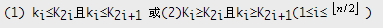
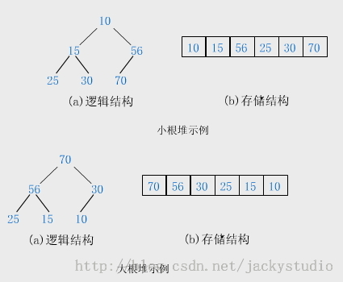
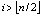
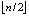
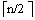
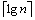
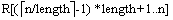
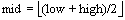
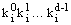
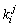

# 极客学院-排序算法

# 排序的基本概念

## 排序（sort）或分类

所谓排序，就是要整理文件中的记录，使之按关键字递增(或递减)次序排列起来。其确切定义如下：

输入：n 个记录 R1，R2，…，Rn，其相应的关键字分别为 K1，K2，…，Kn。

输出：Ril，Ri2，…，Rin，使得 Ki1≤Ki2≤…≤Kin。(或 Ki1≥Ki2≥…≥Kin)。

1．被排序对象--文件

被排序的对象--文件由一组记录组成。

记录则由若干个数据项(或域)组成。其中有一项可用来标识一个记录，称为关键字项。该数据项的值称为关键字(Key)。

> 注意： 在不易产生混淆时，将关键字项简称为关键字。

2．排序运算的依据--关键字

用来作排序运算依据的关键字，可以是数字类型，也可以是字符类型。

关键字的选取应根据问题的要求而定。

【例】在高考成绩统计中将每个考生作为一个记录。每条记录包含准考证号、姓名、各科的分数和总分数等项内容。若要惟一地标识一个考生的记录，则必须用"准考证号"作为关键字。若要按照考生的总分数排名次，则需用"总分数"作为关键字。

## 排序的稳定性

当待排序记录的关键字均不相同时，排序结果是惟一的，否则排序结果不唯一。

在待排序的文件中，若存在多个关键字相同的记录，经过排序后这些具有相同关键字的记录之间的相对次序保持不变，该排序方法是稳定的；若具有相同关键字的记录之间的相对次序发生变化，则称这种排序方法是不稳定的。

> 注意： 排序算法的稳定性是针对所有输入实例而言的。即在所有可能的输入实例中，只要有一个实例使得算法不满足稳定性要求，则该排序算法就是不稳定的。

## 排序方法的分类

1．按是否涉及数据的内、外存交换分

在排序过程中，若整个文件都是放在内存中处理，排序时不涉及数据的内、外存交换，则称之为内部排序(简称内排序)；反之，若排序过程中要进行数据的内、外存交换，则称之为外部排序。

注意：

- 内排序适用于记录个数不很多的小文件。
- 外排序则适用于记录个数太多，不能一次将其全部记录放人内存的大文件。

2．按策略划分内部排序方法

可以分为五类：插入排序、选择排序、交换排序、归并排序和分配排序。

## 排序算法分析

1．排序算法的基本操作

大多数排序算法都有两个基本的操作：

(1) 比较两个关键字的大小；

(2) 改变指向记录的指针或移动记录本身。

> 注意： 第(2)种基本操作的实现依赖于待排序记录的存储方式。

2．待排文件的常用存储方式

（1） 以顺序表(或直接用向量)作为存储结构

排序过程：对记录本身进行物理重排（即通过关键字之间的比较判定，将记录移到合适的位置）。

（2） 以链表作为存储结构

排序过程：无须移动记录，仅需修改指针。通常将这类排序称为链表(或链式)排序。

（3） 用顺序的方式存储待排序的记录，但同时建立一个辅助表(如包括关键字和指向记录位置的指针组成的索引表)

排序过程：只需对辅助表的表目进行物理重排（即只移动辅助表的表目，而不移动记录本身）。适用于难于在链表上实现，仍需避免排序过程中移动记录的排序方法。

3．排序算法性能评价

（1） 评价排序算法好坏的标准

评价排序算法好坏的标准主要有两条：

- 执行时间和所需的辅助空间
- 算法本身的复杂程度

（2） 排序算法的空间复杂度

若排序算法所需的辅助空间并不依赖于问题的规模n，即辅助空间是O(1)，则称之为就地排序(In-PlaceSou)。 非就地排序一般要求的辅助空间为O(n)。

（3） 排序算法的时间开销

大多数排序算法的时间开销主要是关键字之间的比较和记录的移动。有的排序算法其执行时间不仅依赖于问题的规模，还取决于输入实例中数据的状态。

## 文件的顺序存储结构表示

```
#define n l00 //假设的文件长度，即待排序的记录数目  
typedef int KeyType； //假设的关键字类型  
typedef struct{ //记录类型  
  KeyType key； //关键字项  
  InfoType otherinfo；//其它数据项，类型InfoType依赖于具体应用而定义  
 }RecType；  
typedef RecType SeqList[n+1]；//SeqList为顺序表类型，表中第0个单元一般用作哨兵  
```

> 注意： 若关键字类型没有比较算符，则可事先定义宏或函数来表示比较运算。
>
> 【例】关键字为字符串时，可定义宏"#define LT(a，b)(Stromp((a)，(b))<0)"。那么算法中"a<b"可用"LT(a，b)"取代。若使用 C++，则定义重载的算符"<"更为方便。

# 直接插入排序

插入排序(Insertion Sort)的基本思想是：每次将一个待排序的记录，按其关键字大小插入到前面已经排好序的子文件中的适当位置，直到全部记录插入完成为止。

本节介绍第一种排序方法：直接插入排序。

## 直接插入排序基本思想

1．基本思想

假设待排序的记录存放在数组 R[1..n]中。初始时，R[1]自成 1 个有序区，无序区为 R[2..n]。从 i=2 起直至 i=n 为止，依次将 R[i] 插入当前的有序区 R[1..i-1] 中，生成含 n 个记录的有序区。

2．第 i-1 趟直接插入排序

通常将一个记录 R[i][i=2，3，…，n-1]插入到当前的有序区，使得插入后仍保证该区间里的记录是按关键字有序的操作称第 i-1 趟直接插入排序。

排序过程的某一中间时刻，R 被划分成两个子区间 R[1．．i-1]（已排好序的有序区）和 R[i．．n]（当前未排序的部分，可称无序区）。

直接插入排序的基本操作是将当前无序区的第 1 个记录 R[i]插人到有序区 R[1．．i-1]中适当的位置上，使 R[1．．i]变为新的有序区。因为这种方法每次使有序区增加1个记录，通常称增量法。

插入排序与打扑克时整理手上的牌非常类似。摸来的第 1 张牌无须整理，此后每次从桌上的牌(无序区)中摸最上面的 1 张并插入左手的牌(有序区)中正确的位置上。为了找到这个正确的位置，须自左向右(或自右向左)将摸来的牌与左手中已有的牌逐一比较。

## 一趟直接插入排序方法

1．简单方法

首先在当前有序区 R[1..i-1]中查找R[i]的正确插入位置 k(1≤k≤i-1)；然后将 R[k．．i-1]中的记录均后移一个位置，腾出 k 位置上的空间插入 R[i]。

> 注意： 若 R[i]的关键字大于等于 R[1．．i-1]中所有记录的关键字，则 R[i]就是插入原位置。

2．改进的方法

一种查找比较操作和记录移动操作交替地进行的方法。

具体做法：

将待插入记录 R[i]的关键字从右向左依次与有序区中记录 R[j][j=i-1，i-2，…，1]的关键字进行比较：

- 若 R[j]的关键字大于 R[i]的关键字，则将 R[j]后移一个位置；
- 若 R[j]的关键字小于或等于 R[i]的关键字，则查找过程结束，j+1 即为 R[i]的插入位置。

关键字比 R[i]的关键字大的记录均已后移，所以 j+1 的位置已经腾空，只要将 R[i] 直接插入此位置即可完成一趟直接插入排序。

## 直接插入排序算法

1．算法描述

```
void lnsertSort(SeqList R)  
 { //对顺序表R中的记录R[1..n]按递增序进行插入排序  
  int i，j；  
  for(i=2;i<=n；i++) //依次插入R[2]，…，R[n]  
    if(R[i].key<R[i-1].key){//若R[i].key大于等于有序区中所有的keys，则R[i]  
                            //应在原有位置上  
      R[0]=R[i];j=i-1; //R[0]是哨兵，且是R[i]的副本  
      do{ //从右向左在有序区R[1．．i-1]中查找R[i]的插入位置  
       R[j+1]=R[j]； //将关键字大于R[i].key的记录后移  
       j-- ；  
       }while(R[0].key<R[j].key)； //当R[i].key≥R[j].key时终止  
      R[j+1]=R[0]； //R[i]插入到正确的位置上  
     }//endif  
 }//InsertSort  
```

2．哨兵的作用

算法中引进的附加记录 R[0]称监视哨或哨兵(Sentinel)。

哨兵有两个作用：

- 进入查找(插入位置)循环之前，它保存了 R[i]的副本，使不致于因记录后移而丢失 R[i]的内容；
- 它的主要作用是：在查找循环中"监视"下标变量j是否越界。一旦越界(即 j=0)，因为 R[0].key和自己比较，循环判定条件不成立使得查找循环结束，从而避免了在该循环内的每一次均要检测j是否越界(即省略了循环判定条件"j>=1")。

> 注意：
>
> - 实际上，一切为简化边界条件而引入的附加结点(元素)均可称为哨兵。

【例】单链表中的头结点实际上是一个哨兵

引入哨兵后使得测试查找循环条件的时间大约减少了一半，所以对于记录数较大的文件节约的时间就相当可观。对于类似于排序这样使用频率非常高的算法，要尽可能地减少其运行时间。所以不能把上述算法中的哨兵视为雕虫小技，而应该深刻理解并掌握这种技巧。

## 给定输入实例的排序过程

设待排序的文件有8个记录，其关键字分别为：49，38，65，97，76，13，27，49。为了区别两个相同的关键字49，后一个49的下方加了一下划线以示区别。其排序过程见[【动画模拟演示】](http://student.zjzk.cn/course_ware/data_structure/web/flashhtml/insertsort.htm)。

## 算法分析

1．算法的时间性能分析

对于具有 n 个记录的文件，要进行 n-1 趟排序。

各种状态下的时间复杂度：

```
┌─────────┬─────┬──────┬──────┐
│ 初始文件状态 │   正序   │     反序  │无序(平均)│
├─────────┼─────┼──────┼──────┤
│ 第i趟的关键    │   1      │     i+1    │（i-2）/2│
│ 字比较次数     │          │              │             │
├─────────┼─────┼──────┼──────┤
│总关键字比较次数  │n-1 │(n+2)(n-1)/2│ ≈n2/4│
├─────────┼─────┼──────┼──────┤
│第i趟记录移动次数 │ 0   │     i+2    │ （i-2）/2│
├─────────┼─────┼──────┼──────┤
│总的记录移动次数  │ 0   │(n-1)(n+4)/2│ ≈n2/4│
├─────────┼─────┼──────┼──────┤
│时间复杂度     │  0（n）│ O（n2） │ O（n2）│
└─────────┴─────┴──────┴──────┘
```

> 注意：初始文件按关键字递增有序，简称"正序"。初始文件按关键字递减有序，简称"反序"。

2．算法的空间复杂度分析

算法所需的辅助空间是一个监视哨，辅助空间复杂度 S(n)=O(1)。是一个就地排序。

3．直接插入排序的稳定性

直接插入排序是稳定的排序方法。

# 希尔排序

本节介绍第二种插入排序方法：希尔排序。

希尔排序(Shell Sort)是插入排序的一种。因 D.L.Shell 于 1959 年提出而得名。

## 希尔排序基本思想

基本思想：

先取一个小于 n 的整数 d1 作为第一个增量，把文件的全部记录分成 d1 个组。所有距离为 d1 的倍数的记录放在同一个组中。先在各组内进行直接插人排序；然后，取第二个增量 d2<d1 重复上述的分组和排序，直至所取的增量 dt=1(dt<dt-1<…<d2<d1)，即所有记录放在同一组中进行直接插入排序为止。

该方法实质上是一种分组插入方法。

## 给定实例的 shell 排序的排序过程

假设待排序文件有 10 个记录，其关键字分别是：

49，38，65，97，76，13，27，49，55，04。

增量序列的取值依次为：

5，3，1

排序过程如[【动画模拟演示】](http://student.zjzk.cn/course_ware/data_structure/web/flashhtml/shell.htm)。

## Shell 排序的算法实现

1．不设监视哨的算法描述

```
void ShellPass(SeqList R，int d)  
 {//希尔排序中的一趟排序，d为当前增量  
   for(i=d+1;i<=n；i++) //将R[d+1．．n]分别插入各组当前的有序区  
     if(R[i].key<R[i-d].key){  
       R[0]=R[i];j=i-d； //R[0]只是暂存单元，不是哨兵  
       do {//查找R[i]的插入位置  
          R[j+d]；=R[j]； //后移记录  
          j=j-d； //查找前一记录  
       }while(j>0&&R[0].key<R[j].key)；  
       R[j+d]=R[0]； //插入R[i]到正确的位置上  
     } //endif  
 } //ShellPass  

void  ShellSort(SeqList R)  
 {  
  int increment=n； //增量初值，不妨设n>0  
  do {  
        increment=increment/3+1； //求下一增量  
        ShellPass(R，increment)； //一趟增量为increment的Shell插入排序  
     }while(increment>1)  
  } //ShellSort  
```

> 注意： 当增量 d=1 时，ShellPass 和 InsertSort 基本一致，只是由于没有哨兵而在内循环中增加了一个循环判定条件"j>0"，以防下标越界。

## 算法分析

1．增量序列的选择

Shell 排序的执行时间依赖于增量序列。

好的增量序列的共同特征：

- 最后一个增量必须为 1；
- 应该尽量避免序列中的值(尤其是相邻的值)互为倍数的情况。

有人通过大量的实验，给出了目前较好的结果：当n较大时，比较和移动的次数约在nl.25到1.6n1.25之间。

2．Shell 排序的时间性能优于直接插入排序

希尔排序的时间性能优于直接插入排序的原因：

- 当文件初态基本有序时直接插入排序所需的比较和移动次数均较少。
- 当 n 值较小时，n 和 n2 的差别也较小，即直接插入排序的最好时间复杂度 O(n)和最坏时间复杂度 0(n2)差别不大。
- 在希尔排序开始时增量较大，分组较多，每组的记录数目少，故各组内直接插入较快，后来增量 di 逐渐缩小，分组数逐渐减少，而各组的记录数目逐渐增多，但由于已经按di-1作为距离排过序，使文件较接近于有序状态，所以新的一趟排序过程也较快。

因此，希尔排序在效率上较直接插人排序有较大的改进。

3．稳定性

希尔排序是不稳定的。参见上述实例，该例中两个相同关键字 49 在排序前后的相对次序发生了变化

# 冒泡排序

交换排序的基本思想是：两两比较待排序记录的关键字，发现两个记录的次序相反时即进行交换，直到没有反序的记录为止。应用交换排序基本思想的主要排序方法有：冒泡排序和快速排序。

本文介绍第一种交换排序方法：冒泡排序。

## 排序方法

将被排序的记录数组 R[1..n]垂直排列，每个记录 R[i]看作是重量为 R[i].key 的气泡。根据轻气泡不能在重气泡之下的原则，从下往上扫描数组 R：凡扫描到违反本原则的轻气泡，就使其向上"飘浮"。如此反复进行，直到最后任何两个气泡都是轻者在上，重者在下为止。

（1）初始

R[1..n]为无序区。

（2）第一趟扫描

从无序区底部向上依次比较相邻的两个气泡的重量，若发现轻者在下、重者在上，则交换二者的位置。即依次比较(R[n]，R[n-1])，(R[n-1]，R[n-2])，…，(R[2]，R[1])；对于每对气泡(R[j+1]，R[j])，若R[j+1].key<R[j].key，则交换R[j+1]和R[j]的内容。

第一趟扫描完毕时，"最轻"的气泡就飘浮到该区间的顶部，即关键字最小的记录被放在最高位置R[1]上。

（3）第二趟扫描

扫描R[2..n]。扫描完毕时，"次轻"的气泡飘浮到R[2]的位置上…… 最后，经过n-1 趟扫描可得到有序区R[1..n]

> 注意： 第 i 趟扫描时，R[1..i-1]和 R[i..n]分别为当前的有序区和无序区。扫描仍是从无序区底部向上直至该区顶部。扫描完毕时，该区中最轻气泡飘浮到顶部位置 R[i]上，结果是 R[1..i]变为新的有序区。

## 冒泡排序过程示例

冒泡排序的过程[【参见动画演示】](http://student.zjzk.cn/course_ware/data_structure/web/flashhtml/maopaopaixu.htm)

## 排序算法

（1）分析

因为每一趟排序都使有序区增加了一个气泡，在经过 n-1 趟排序之后，有序区中就有 n-1 个气泡，而无序区中气泡的重量总是大于等于有序区中气泡的重量，所以整个冒泡排序过程至多需要进行 n-1 趟排序。

若在某一趟排序中未发现气泡位置的交换，则说明待排序的无序区中所有气泡均满足轻者在上，重者在下的原则，因此，冒泡排序过程可在此趟排序后终止。为此，在下面给出的算法中，引入一个布尔量 exchange，在每趟排序开始前，先将其置为 FALSE。若排序过程中发生了交换，则将其置为 TRUE。各趟排序结束时检查 exchange，若未曾发生过交换则终止算法，不再进行下一趟排序。

（2）具体算法

```
void BubbleSort(SeqList R)  
 { //R（l..n)是待排序的文件，采用自下向上扫描，对R做冒泡排序  
   int i，j；  
   Boolean exchange； //交换标志  
   for(i=1;i<n;i++){ //最多做n-1趟排序  
     exchange=FALSE； //本趟排序开始前，交换标志应为假  
     for(j=n-1;j>=i；j--) //对当前无序区R[i..n]自下向上扫描  
      if(R[j+1].key<R[j].key){//交换记录  
        R[0]=R[j+1]； //R[0]不是哨兵，仅做暂存单元  
        R[j+1]=R[j]；  
        R[j]=R[0]；  
        exchange=TRUE； //发生了交换，故将交换标志置为真  
       }  
     if(!exchange) //本趟排序未发生交换，提前终止算法  
           return；  
   } //endfor(外循环)  
  } //BubbleSort  
```

## 算法分析

（1）算法的最好时间复杂度

若文件的初始状态是正序的，一趟扫描即可完成排序。所需的关键字比较次数C和记录移动次数M均达到最小值：

Cmin=n-1

Mmin=0。

冒泡排序最好的时间复杂度为 O(n)。

（2）算法的最坏时间复杂度

若初始文件是反序的，需要进行 n-1 趟排序。每趟排序要进行 n-i 次关键字的比较(1≤i≤n-1)，且每次比较都必须移动记录三次来达到交换记录位置。在这种情况下，比较和移动次数均达到最大值：

Cmax=n(n-1)/2=O(n2)

Mmax=3n(n-1)/2=O(n2)

冒泡排序的最坏时间复杂度为 O(n2)。

（3）算法的平均时间复杂度为 O(n2)

虽然冒泡排序不一定要进行 n-1 趟，但由于它的记录移动次数较多，故平均时间性能比直接插入排序要差得多。

（4）算法稳定性

冒泡排序是就地排序，且它是稳定的。

## 算法改进

上述的冒泡排序还可做如下的改进：

(1)记住最后一次交换发生位置 lastExchange 的冒泡排序

在每趟扫描中，记住最后一次交换发生的位置 lastExchange，（该位置之前的相邻记录均已有序）。下一趟排序开始时，R[1..lastExchange-1]是有序区，R[lastExchange..n]是无序区。这样，一趟排序可能使当前有序区扩充多个记录，从而减少排序的趟数。。

(2) 改变扫描方向的冒泡排序

**冒泡排序的不对称性**

能一趟扫描完成排序的情况：

只有最轻的气泡位于 R[n]的位置，其余的气泡均已排好序，那么也只需一趟扫描就可以完成排序。

【例】对初始关键字序列 12，18，42，44，45，67，94，10 就仅需一趟扫描。

需要 n-1 趟扫描完成排序情况：

当只有最重的气泡位于R[1]的位置，其余的气泡均已排好序时，则仍需做n-1趟扫描才能完成排序。

【例】对初始关键字序列：94，10，12，18，42，44，45，67 就需七趟扫描。

**造成不对称性的原因**

每趟扫描仅能使最重气泡"下沉"一个位置，因此使位于顶端的最重气泡下沉到底部时，需做 n-1 趟扫描。

**改进不对称性的方法**

在排序过程中交替改变扫描方向，可改进不对称性。

# 快速排序

本文介绍第二种交换排序方法：快速排序。

## 算法思想

快速排序是 C.R.A.Hoare 于 1962 年提出的一种划分交换排序。它采用了一种分治的策略，通常称其为分治法(Divide-and-ConquerMethod)。

### 分治法的基本思想

分治法的基本思想是：将原问题分解为若干个规模更小但结构与原问题相似的子问题。递归地解这些子问题，然后将这些子问题的解组合为原问题的解。

### 快速排序的基本思想

设当前待排序的无序区为 R[low..high]，利用分治法可将快速排序的基本思想描述为：

1.分解：

在 R[low..high]中任选一个记录作为基准(Pivot)，以此基准将当前无序区划分为左、右两个较小的子区间 R[low..pivotpos-1)和 R[pivotpos+1..high]，并使左边子区间中所有记录的关键字均小于等于基准记录(不妨记为 pivot)的关键字 pivot.key，右边的子区间中所有记录的关键字均大于等于 pivot.key，而基准记录 pivot 则位于正确的位置(pivotpos)上，它无须参加后续的排序。

> 注意： 划分的关键是要求出基准记录所在的位置 pivotpos。划分的结果可以简单地表示为(注意 pivot=R[pivotpos])： R[low..pivotpos-1].keys≤R[pivotpos].key≤R[pivotpos+1..high].keys 其中 low≤pivotpos≤high。

2.求解：

通过递归调用快速排序对左、右子区间 R[low..pivotpos-1]和R[pivotpos+1..high]快速排序。

3.组合：

因为当"求解"步骤中的两个递归调用结束时，其左、右两个子区间已有序。对快速排序而言，"组合"步骤无须做什么，可看作是空操作。

## 快速排序算法 QuickSort

```
void QuickSort(SeqList R，int low，int high)  
 { //对R[low..high]快速排序  
   int pivotpos； //划分后的基准记录的位置  
   if(low<high){//仅当区间长度大于1时才须排序  
      pivotpos=Partition(R，low，high)； //对R[low..high]做划分  
      QuickSort(R，low，pivotpos-1)； //对左区间递归排序  
      QuickSort(R，pivotpos+1，high)； //对右区间递归排序  
    }  
  } //QuickSort  
```

> 注意： 为排序整个文件，只须调用 QuickSort(R，1，n)即可完成对 R[l..n]的排序。

## 划分算法 Partition

### 简单的划分方法

1.具体做法

第一步：(初始化)设置两个指针 i 和 j，它们的初值分别为区间的下界和上界，即 i=low，i=high；选取无序区的第一个记录 R[i](即 R[low])作为基准记录，并将它保存在变量 pivot 中；

第二步：令 j 自 high 起向左扫描，直到找到第 1 个关键字小于 pivot.key 的记录 R[j]，将 R[j])移至 i 所指的位置上，这相当于 R[j] 和基准 R[i](即 pivot)进行了交换，使关键字小于基准关键字 pivot.key 的记录移到了基准的左边，交换后 R[j]中相当于是 pivot；然后，令 i 指针自 i+1 位置开始向右扫描，直至找到第 1 个关键字大于 pivot.key 的记录 R[i]，将 R[i]移到 i 所指的位置上，这相当于交换了 R[i] 和基准 R[j]，使关键字大于基准关键字的记录移到了基准的右边，交换后 R[i] 中又相当于存放了 pivot；接着令指针 j 自位置 j-1 开始向左扫描，如此交替改变扫描方向，从两端各自往中间靠拢，直至 i=j 时，i便是基准 pivot 最终的位置，将 pivot 放在此位置上就完成了一次划分。

2.一次划分过程

一次划分过程中，具体变化情况[【参见动画演示】](http://student.zjzk.cn/course_ware/data_structure/web/flashhtml/kuaisupaixu.htm)

3.划分算法

```
int Partition(SeqList R，int i，int j)  
    {//调用Partition(R，low，high)时，对R[low..high]做划分，  
     //并返回基准记录的位置  
      ReceType pivot=R[i]； //用区间的第1个记录作为基准 '  
      while(i<j){ //从区间两端交替向中间扫描，直至i=j为止  
        while(i<j&&R[j].key>=pivot.key) //pivot相当于在位置i上  
          j--； //从右向左扫描，查找第1个关键字小于pivot.key的记录R[j]  
        if(i<j) //表示找到的R[j]的关键字<pivot.key  
            R[i++]=R[j]； //相当于交换R[i]和R[j]，交换后i指针加1  
        while(i<j&&R[i].key<=pivot.key) //pivot相当于在位置j上  
            i++； //从左向右扫描，查找第1个关键字大于pivot.key的记录R[i]  
        if(i<j) //表示找到了R[i]，使R[i].key>pivot.key  
            R[j--]=R[i]; //相当于交换R[i]和R[j]，交换后j指针减1  
       } //endwhile  
      R[i]=pivot； //基准记录已被最后定位  
      return i；  
    } //partition  
```

## 快速排序执行过程

快速排序执行的全过程可用递归树来描述。

分析：

- 递归执行的路线如图中带箭头的包络线所示。
- 递归树上每一结点左旁方括号表示当前待排序的区间，结点内的关键字是划分的基准关键字 注意： 叶结点对应的子区间只有一个关键字，无须划分，故叶结点内没有基准关键字
- 划分后得到的左、右两个子区间分别标在该结点的左、右两个孩子结点的左边方括号内。 【例】根结点左旁方括号[49，38，65，97，76，13，27，49]表示初始待排序的关键字，根内的 49 表示所选的划分基准记录的关键字，划分结果是[27，28，13]49[76，97，65，49_]，其左右子区间分别标在根结点的两个孩子的左边。
- 每个分支结点右旁圆括号中的内容表示对该结点左旁区间的排序过程结束之后返回的结果。它是其左右孩子对应的区间排序完成之后，将左右孩子对应的排序结果分别放在该分支结点的关键字前后所得到的关键字序列。 【例】分支结点 76 的左右孩子对应的区间排序后的结果分别是(49_，65)和(97)，将它们分别放在 76 的前后即得(49，65，76，97)，这是对结点76左旁区间[76，97，，65，49]排序的结果。
- 算法的执行顺序是递归树中的箭头顺序，实际上当把划分操作视为访问结点的操作时，快速排序的执行过程相当于是先序遍历其递归树。

> 注意： 任何递归算法均可用递归树来描述其执行过程。

## 快速排序各次划分后的状态变化

[49 38 65 97 76 13 27 49] //初始关键字 [27 38 13] 49 [76 97 65 49] //第 1 次划分完成之后，对应递归树第 2 层 [13] 27 [38] 49 [49 65] 76 [97] //对上一层各无序区划分完成后，对应递归树第 3 层 13 27 38 49 49 [65] 76 97 //对上一层各无序区划分完成后，对应递归树第 4 层 13 27 38 49 49 65 76 97 //最后的排序结果

## 算法分析

快速排序的时间主要耗费在划分操作上，对长度为 k 的区间进行划分，共需 k-1 次关键字的比较。

1. 最坏时间复杂度

最坏情况是每次划分选取的基准都是当前无序区中关键字最小(或最大)的记录，划分的结果是基准左边的子区间为空(或右边的子区间为空)，而划分所得的另一个非空的子区间中记录数目，仅仅比划分前的无序区中记录个数减少一个。 因此，快速排序必须做 n-1 次划分，第i次划分开始时区间长度为 n-i+1，所需的比较次数为 n-i(1≤i≤n-1)，故总的比较次数达到最大值：Cmax = n(n-1)/2=O(n2)

如果按上面给出的划分算法，每次取当前无序区的第 1 个记录为基准，那么当文件的记录已按递增序(或递减序)排列时，每次划分所取的基准就是当前无序区中关键字最小(或最大)的记录，则快速排序所需的比较次数反而最多。

1. 最好时间复杂度

在最好情况下，每次划分所取的基准都是当前无序区的"中值"记录，划分的结果是基准的左、右两个无序子区间的长度大致相等。总的关键字比较次数：O(nlgn)

> 注意： 用递归树来分析最好情况下的比较次数更简单。因为每次划分后左、右子区间长度大致相等，故递归树的高度为 O(lgn)，而递归树每一层上各结点所对应的划分过程中所需要的关键字比较次数总和不超过n，故整个排序过程所需要的关键字比较总次数 C(n)=O(nlgn)。
>
> 因为快速排序的记录移动次数不大于比较的次数，所以快速排序的最坏时间复杂度应为 O(n2)，最好时间复杂度为 O(nlgn)。

1. 基准关键字的选取

在当前无序区中选取划分的基准关键字是决定算法性能的关键。

"三者取中"的规则

"三者取中"规则，即在当前区间里，将该区间首、尾和中间位置上的关键字比较，取三者之中值所对应的记录作为基准，在划分开始前将该基准记录和该区伺的第1个记录进行交换，此后的划分过程与上面所给的 Partition 算法完全相同。

取位于 low 和 high 之间的随机数k(low≤k≤high)，用 R[k] 作为基准

选取基准最好的方法是用一个随机函数产生一个取位于 low 和 high 之间的随机数 k(low≤k≤high)，用 R[k] 作为基准，这相当于强迫R[low..high]中的记录是随机分布的。用此方法所得到的快速排序一般称为随机的快速排序。

> 注意： 随机化的快速排序与一般的快速排序算法差别很小。但随机化后，算法的性能大大地提高了，尤其是对初始有序的文件，一般不可能导致最坏情况的发生。算法的随机化不仅仅适用于快速排序，也适用于其它需要数据随机分布的算法。

1. 平均时间复杂度

尽管快速排序的最坏时间为 O(n2)，但就平均性能而言，它是基于关键字比较的内部排序算法中速度最快者，快速排序亦因此而得名。它的平均时间复杂度为 O(nlgn)。

1. 空间复杂度

快速排序在系统内部需要一个栈来实现递归。若每次划分较为均匀，则其递归树的高度为 O(lgn)，故递归后需栈空间为 O(lgn)。最坏情况下，递归树的高度为 O(n)，所需的栈空间为 O(n)。

1. 稳定性

快速排序是非稳定的，例如[2，2，1]。

# 直接选择排序

选择排序(Selection Sort)的基本思想是：每一趟从待排序的记录中选出关键字最小的记录，顺序放在已排好序的子文件的最后，直到全部记录排序完毕。常用的选择排序方法有直接选择排序和堆排序。

本节介绍第一种选择排序：直接选择排序。

## 直接选择排序的基本思想

n个记录的文件的直接选择排序可经过n-1趟直接选择排序得到有序结果：

- 初始状态：无序区为 R[1..n]，有序区为空。
- 第 1 趟排序：在无序区 R[1..n]中选出关键字最小的记录 R[k]，将它与无序区的第 1 个记录 R[1]交换，使 R[1..i]和 R[2..n]分别变为记录个数增加 1 个的新有序区和记录个数减少 1 个的新无序区。 ……
- 第 i 趟排序：第i趟排序开始时，当前有序区和无序区分别为 R[1..i-1]和 R[i..n][1≤i≤n-1]。该趟排序从当前无序区中选出关键字最小的记录 R[k]，将它与无序区的第 i 个记录 R[i]交换，使 R[1..i]和 R[i+1..n]分别变为记录个数增加 1 个的新有序区和记录个数减少 1 个的新无序区。

这样，n 个记录的文件的直接选择排序可经过 n-1 趟直接选择排序得到有序结果。

## 直接选择排序的过程

直接选择排序的过程[【参见动画演示】](http://student.zjzk.cn/course_ware/data_structure/web/flashhtml/zhijiexuanze.htm)

## 算法描述

直接选择排序的具体算法如下：

```
void SelectSort(SeqList R)  
{  
  int i，j，k；  
  for(i=1;i<n;i++){//做第i趟排序(1≤i≤n-1)  
    k=i；  
    for(j=i+1;j<=n;j++) //在当前无序区R[i..n]中选key最小的记录R[k]  
      if(R[j].key<R[k].key)  
        k=j; //k记下目前找到的最小关键字所在的位置  
      if(k!=i){ //交换R[i]和R[k]  
        R[0]=R[i]；R[i]=R[k]；R[k]=R[0]； //R[0]作暂存单元  
       } //endif  
    } //endfor  
 } //SeleetSort  
```

## 算法分析

（1）关键字比较次数

无论文件初始状态如何，在第 i 趟排序中选出最小关键字的记录，需做 n-i 次比较，因此，总的比较次数为： n(n-1)/2=O(n2)

（2）记录的移动次数

当初始文件为正序时，移动次数为 0

文件初态为反序时，每趟排序均要执行交换操作，总的移动次数取最大值 3(n-1)。

直接选择排序的平均时间复杂度为 O(n2)。

（3）直接选择排序是一个就地排序

（4）稳定性分析

直接选择排序是不稳定的

【例】反例[2，2，1]

# 堆排序

本节介绍第二种选择排序：堆排序。

## 堆排序定义

n 个关键字序列 K1，K2，…，Kn 称为堆，当且仅当该序列满足如下性质(简称为堆性质)：



若将此序列所存储的向量 R[1..n]看做是一棵完全二叉树的存储结构，则堆实质上是满足如下性质的完全二叉树：树中任一非叶结点的关键字均不大于(或不小于)其左右孩子(若存在)结点的关键字。

【例】关键字序列(10，15，56，25，30，70)和(70，56，30，25，15，10)分别满足堆性质(1)和(2)，故它们均是堆，其对应的完全二叉树分别如小根堆示例和大根堆示例所示。



## 大根堆和小根堆

根结点(亦称为堆顶)的关键字是堆里所有结点关键字中最小者的堆称为小根堆。

根结点(亦称为堆顶)的关键字是堆里所有结点关键字中最大者，称为大根堆。

注意：

- 堆中任一子树亦是堆。
- 以上讨论的堆实际上是二叉堆(Binary Heap)，类似地可定义k叉堆。

## 堆排序特点

堆排序(HeapSort)是一树形选择排序。

堆排序的特点是：在排序过程中，将 R[l..n]看成是一棵完全二叉树的顺序存储结构，利用完全二叉树中双亲结点和孩子结点之间的内在关系【参见二叉树的顺序存储结构】，在当前无序区中选择关键字最大(或最小)的记录。

## 堆排序与直接插入排序的区别

直接选择排序中，为了从 R[1..n]中选出关键字最小的记录，必须进行 n-1 次比较，然后在 R[2..n]中选出关键字最小的记录，又需要做 n-2 次比较。事实上，后面的 n-2 次比较中，有许多比较可能在前面的 n-1 次比较中已经做过，但由于前一趟排序时未保留这些比较结果，所以后一趟排序时又重复执行了这些比较操作。堆排序可通过树形结构保存部分比较结果，可减少比较次数。

## 堆排序

堆排序利用了大根堆(或小根堆)堆顶记录的关键字最大(或最小)这一特征，使得在当前无序区中选取最大(或最小)关键字的记录变得简单。

（1）用大根堆排序的基本思想

- 先将初始文件 R[1..n]建成一个大根堆，此堆为初始的无序区
- 再将关键字最大的记录 R[1]即堆顶和无序区的最后一个记录 R[n]交换，由此得到新的无序区 R[1..n-1]和有序区 R[n]，且满足 R[1..n-1].keys≤R[n].key
- 由于交换后新的根 R[1]可能违反堆性质，故应将当前无序区 R[1..n-1]调整为堆。然后再次将 R[1..n-1]中关键字最大的记录 R[1]和该区间的最后一个记录 R[n-1]交换，由此得到新的无序区 R[1..n-2]和有序区 R[n-1..n]，且仍满足关系 R[1..n-2].keys≤R[n-1..n].keys，同样要将 R[1..n-2]调整为堆。……直到无序区只有一个元素为止。

（2）大根堆排序算法的基本操作：

- 初始化操作：将 R[1..n]构造为初始堆；
- 每一趟排序的基本操作：将当前无序区的堆顶记录 R[1] 和该区间的最后一个记录交换，然后将新的无序区调整为堆(亦称重建堆)。

> 注意：
>
> - 只需做 n-1 趟排序，选出较大的 n-1 个关键字即可以使得文件递增有序。
> - 用小根堆排序与利用大根堆类似，只不过其排序结果是递减有序的。堆排序和直接选择排序相反：在任何时刻，堆排序中无序区总是在有序区之前，且有序区是在原向量的尾部由后往前逐步扩大至整个向量为止。

（3）堆排序的算法：

```
void HeapSort(SeqIAst R)  
 { //对R[1..n]进行堆排序，不妨用R[0]做暂存单元  
  int i；  
  BuildHeap(R)； //将R[1-n]建成初始堆  
  for(i=n;i>1；i--){ //对当前无序区R[1..i]进行堆排序，共做n-1趟。  
    R[0]=R[1]；R[1]=R[i];R[i]=R[0]； //将堆顶和堆中最后一个记录交换  
   Heapify(R，1，i-1)； //将R[1..i-1]重新调整为堆，仅有R[1]可能违反堆性质  
   } //endfor  
 } //HeapSort 
```

(4) BuildHeap 和 Heapify 函数的实现

因为构造初始堆必须使用到调整堆的操作，先讨论 Heapify 的实现。

Heapify 函数思想方法

每趟排序开始前 R[l..i]是以 R[1]为根的堆，在 R[1]与 R[i]交换后，新的无序区 R[1..i-1]中只有 R[1]的值发生了变化，故除 R[1]可能违反堆性质外，其余任何结点为根的子树均是堆。因此，当被调整区间是 R[low..high]时，只须调整以 R[low]为根的树即可。

"筛选法"调整堆

R[low]的左、右子树(若存在)均已是堆，这两棵子树的根 R[2low]和 R[2low+1]分别是各自子树中关键字最大的结点。若 R[low].key不小于这两个孩子结点的关键字，则 R[low]未违反堆性质，以 R[low]为根的树已是堆，无须调整；否则必须将 R[low]和它的两个孩子结点中关键字较大者进行交换，即 `R[low]与 R[large](R[large].key=max(R[2low].key，R[2low+1].key))`交换。交换后又可能使结点 R[large]违反堆性质，同样由于该结点的两棵子树(若存在)仍然是堆，故可重复上述的调整过程，对以 R[large]为根的树进行调整。此过程直至当前被调整的结点已满足堆性质，或者该结点已是叶子为止。上述过程就象过筛子一样，把较小的关键字逐层筛下去，而将较大的关键字逐层选上来。因此，有人将此方法称为"筛选法"。

BuildHeap 的实现

要将初始文件 R[l..n]调整为一个大根堆，就必须将它所对应的完全二叉树中以每一结点为根的子树都调整为堆。 显然只有一个结点的树是堆，而在完全二叉树中，所有序号的结点都是叶子，因此以这些结点为根的子树均已是堆。这样，我们只需依次将以序号为，-1，…，1的结点作为根的子树都调整为堆即可。

## 大根堆排序实例

对于关键字序列(42，13，24，91，23，16，05，88)，在建堆过程中完全二叉树及其存储结构的变化情况参见[【动画演示】](http://student.zjzk.cn/course_ware/data_structure/web/flashhtml/duipaixu.htm)。

## 算法分析

堆排序的时间，主要由建立初始堆和反复重建堆这两部分的时间开销构成，它们均是通过调用 Heapify 实现的。

堆排序的最坏时间复杂度为 O(nlgn)。堆排序的平均性能较接近于最坏性能。

由于建初始堆所需的比较次数较多，所以堆排序不适宜于记录数较少的文件。

堆排序是就地排序，辅助空间为 O(1)，它是不稳定的排序方法。

# 归并排序

归并排序(Merge Sort)是利用"归并"技术来进行排序。归并是指将若干个已排序的子文件合并成一个有序的文件。

## 两路归并算法

### 算法基本思路

设两个有序的子文件(相当于输入堆)放在同一向量中相邻的位置上：R[low..m]，R[m+1..high]，先将它们合并到一个局部的暂存向量 R1(相当于输出堆)中，待合并完成后将 R1 复制回 R[low..high]中。

（1）合并过程

合并过程中，设置 i，j 和 p 三个指针，其初值分别指向这三个记录区的起始位置。合并时依次比较 R[i]和 R[j]的关键字，取关键字较小的记录复制到 R1[p]中，然后将被复制记录的指针 i 或 j 加 1，以及指向复制位置的指针 p 加 1。 重复这一过程直至两个输入的子文件有一个已全部复制完毕(不妨称其为空)，此时将另一非空的子文件中剩余记录依次复制到 R1 中即可。

（2）动态申请 R1

实现时，R1 是动态申请的，因为申请的空间可能很大，故须加入申请空间是否成功的处理。

### 归并算法

```
void Merge(SeqList R，int low，int m，int high)  
  {//将两个有序的子文件R[low..m)和R[m+1..high]归并成一个有序的  
   //子文件R[low..high]  
   int i=low，j=m+1，p=0； //置初始值  
   RecType *R1； //R1是局部向量，若p定义为此类型指针速度更快  
   R1=(ReeType *)malloc((high-low+1)*sizeof(RecType))；  
   if(! R1) //申请空间失败  
     Error("Insufficient memory available!")；  
   while(i<=m&&j<=high) //两子文件非空时取其小者输出到R1[p]上  
     R1[p++]=(R[i].key<=R[j].key)?R[i++]：R[j++]；  
   while(i<=m) //若第1个子文件非空，则复制剩余记录到R1中  
     R1[p++]=R[i++]；  
   while(j<=high) //若第2个子文件非空，则复制剩余记录到R1中  
     R1[p++]=R[j++]；  
   for(p=0，i=low；i<=high；p++，i++)  
     R[i]=R1[p]；//归并完成后将结果复制回R[low..high]  
  } //Merge  
```

## 归并排序

归并排序有两种实现方法：自底向上和自顶向下。

### 自底向上的方法

（1）自底向上的基本思想

自底向上的基本思想是：第 1 趟归并排序时，将待排序的文件 R[1..n]看作是 n 个长度为 1 的有序子文件，将这些子文件两两归并，若 n 为偶数，则得到个长度为 2 的有序子文件；若 n 为奇数，则最后一个子文件轮空(不参与归并)。故本趟归并完成后，前个有序子文件长度为 2，但最后一个子文件长度仍为 1；第 2 趟归并则是将第 1 趟归并所得到的个有序的子文件两两归并，如此反复，直到最后得到一个长度为 n 的有序文件为止。

上述的每次归并操作，均是将两个有序的子文件合并成一个有序的子文件，故称其为"二路归并排序"。类似地有k(k>2)路归并排序。

（2） 二路归并排序的全过程 [【参见动画演示】](http://student.zjzk.cn/course_ware/data_structure/web/flashhtml/guibingpaixu.htm)

（3） 一趟归并算法 分析： 在某趟归并中，设各子文件长度为length(最后一个子文件的长度可能小于length)，则归并前R[1..n]中共有个有序的子文件：R

[1..length]，R[length+1..2length]，…，。

注意： 调用归并操作将相邻的一对子文件进行归并时，必须对子文件的个数可能是奇数、以及最后一个子文件的长度小于 length 这两种特殊情况进行特殊处理：

- 若子文件个数为奇数，则最后一个子文件无须和其它子文件归并(即本趟轮空)；
- 若子文件个数为偶数，则要注意最后一对子文件中后一子文件的区间上界是 n。

具体算法如下：

```
void MergePass(SeqList R，int length)  
     { //对R[1..n]做一趟归并排序  
      int i；  
      for(i=1;i+2*length-1<=n;i=i+2*length)  
      Merge(R，i，i+length-1，i+2*length-1)；  
           //归并长度为length的两个相邻子文件  
      if(i+length-1<n) //尚有两个子文件，其中后一个长度小于length  
         Merge(R，i，i+length-1，n)； //归并最后两个子文件  
      //注意：若i≤n且i+length-1≥n时，则剩余一个子文件轮空，无须归并  
     } //MergePass  
```

（4）二路归并排序算法

```
void MergeSort(SeqList R)  
 {//采用自底向上的方法，对R[1..n]进行二路归并排序  
   int length；  
   for(1ength=1；length<n；length*=2) //做 趟归并  

      MergePass(R，length)； //有序段长度≥n时终止  
 }  
```

> 注意：自底向上的归并排序算法虽然效率较高，但可读性较差。

### 自顶向下的方法

采用分治法进行自顶向下的算法设计，形式更为简洁。

（1）分治法的三个步骤

设归并排序的当前区间是R[low..high]，分治法的三个步骤是：

- 分解：将当前区间一分为二，即求分裂点
- 求解：递归地对两个子区间 R[low..mid]和 R[mid+1..high]进行归并排序；
- 组合：将已排序的两个子区间 R[low..mid]和 R[mid+1..high]归并为一个有序的区间 R[low..high]。

递归的终结条件：子区间长度为 1（一个记录自然有序）。

（2）具体算法

```
void MergeSortDC(SeqList R，int low，int high)  
 {//用分治法对R[low..high]进行二路归并排序  
   int mid；  
   if(low<high){//区间长度大于1  
      mid=(low+high)/2； //分解  
      MergeSortDC(R，low，mid); //递归地对R[low..mid]排序  
      MergeSortDC(R，mid+1，high)； //递归地对R[mid+1..high]排序  
      Merge(R，low，mid，high)； //组合，将两个有序区归并为一个有序区  
    }  
 }//MergeSortDC  
```

（3）算法 MergeSortDC 的执行过程

算法 MergeSortDC 的执行过程如下图所示的递归树。

## 算法分析

1、稳定性

归并排序是一种稳定的排序。

2、存储结构要求

可用顺序存储结构。也易于在链表上实现。

3、时间复杂度

对长度为 n 的文件，需进行 趟二路归并，每趟归并的时间为 O(n)，故其时间复杂度无论是在最好情况下还是在最坏情况下均是 O(nlgn)。

4、空间复杂度

需要一个辅助向量来暂存两有序子文件归并的结果，故其辅助空间复杂度为 O(n)，显然它不是就地排序。

> 注意： 若用单链表做存储结构，很容易给出就地的归并排序。

# 箱排序

分配排序的基本思想：排序过程无须比较关键字，而是通过"分配"和"收集"过程来实现排序.它们的时间复杂度可达到线性阶：O(n)。

本节介绍第一种分配排序方法：箱排序。

## 箱排序

1、箱排序的基本思想

箱排序也称桶排序(Bucket Sort)，其基本思想是：设置若干个箱子，依次扫描待排序的记录 R[0]，R[1]，…，R[n-1]，把关键字等于 k 的记录全都装入到第 k 个箱子里(分配)，然后按序号依次将各非空的箱子首尾连接起来(收集)。

【例】要将一副混洗的 52 张扑克牌按点数 A<2<…<J<Q<K 排序，需设置 13 个"箱子"，排序时依次将每张牌按点数放入相应的箱子里，然后依次将这些箱子首尾相接，就得到了按点数递增序排列的一副牌。

2、箱排序中，箱子的个数取决于关键字的取值范围。

若 R[0..n-1]中关键字的取值范围是0到m-1的整数，则必须设置 m 个箱子。因此箱排序要求关键字的类型是有限类型，否则可能要无限个箱子。

3、箱子的类型应设计成链表为宜

一般情况下每个箱子中存放多少个关键字相同的记录是无法预料的，故箱子的类型应设计成链表为宜。

4、为保证排序是稳定的，分配过程中装箱及收集过程中的连接必须按先进先出原则进行。

（1）实现方法一

每个箱子设为一个链队列。当一记录装入某箱子时，应做人队操作将其插入该箱子尾部；而收集过程则是对箱子做出队操作，依次将出队的记录放到输出序列中。

（2）实现方法二

若输入的待排序记录是以链表形式给出时，出队操作可简化为是将整个箱子链表链接到输出链表的尾部。这只需要修改输出链表的尾结点中的指针域，令其指向箱子链表的头，然后修改输出链表的尾指针，令其指向箱子链表的尾即可。

5、算法简析

分配过程的时间是 O(n)；收集过程的时间为 O(m) （采用链表来存储输入的待排序记录）或 O(m+n)。因此，箱排序的时间为 O(m+n)。若箱子个数m的数量级为 O(n)，则箱排序的时间是线性的，即 O(n)。

> 注意： 箱排序实用价值不大，仅适用于作为基数排序(下节介绍)的一个中间步骤。

## 桶排序

箱排序的变种。为了区别于上述的箱排序，姑且称它为桶排序(实际上箱排序和桶排序是同义词)。

1、桶排序基本思想

桶排序的思想是把[0，1)划分为n个大小相同的子区间，每一子区间是一个桶。然后将n个记录分配到各个桶中。因为关键字序列是均匀分布在[0，1)上的，所以一般不会有很多个记录落入同一个桶中。由于同一桶中的记录其关键字不尽相同，所以必须采用关键字比较的排序方法(通常用插入排序)对各个桶进行排序，然后依次将各非空桶中的记录连接(收集)起来即可。

> 注意： 这种排序思想基于以下假设：假设输入的 n 个关键字序列是随机分布在区间[0，1)之上。若关键字序列的取值范围不是该区间，只要其取值均非负，我们总能将所有关键字除以某一合适的数，将关键字映射到该区间上。但要保证映射后的关键字是均匀分布在[0，1)上的。

2、桶排序算法

伪代码算法为：

```
void BucketSon(R)  
  { //对R[0..n-1]做桶排序，其中0≤R[i].key<1(0≤i<n)  
    for(i=0，i<n;i++) //分配过程．  
      将R[i]插入到桶B[「n(R[i].key)」]中； //可插入表头上  
    for(i=0;i<n;i++) //排序过程  
      当B[i]非空时用插人排序将B[i]中的记录排序；  
    for(i=0，i<n；i++) //收集过程  
      若B[i]非空，则将B[i]中的记录依次输出到R中；  
   }  
```

> 注意： 实现时需设置一个指针向量 B[0..n-1]来表示 n 个桶。但因为任一记录 R[i]的关键字满足：0≤R[i].key<1(0≤i≤n-1)，所以必须将 R[i].key映射到 B 的下标区间[0，n-1)上才能使 R[i]装入某个桶中，这可通过`└n*(R[i].key)┘`来实现。

## 桶排序示例

R[0..9]中的关键字为 (0.78，0.17，0.39，0.26，0.72，0.94，0.21， 0.12，0.23，0.68)，用算法BucketSort排序的过程[【参见动画演示】](http://student.zjzk.cn/course_ware/data_structure/web/flashhtml/tongpaixu.htm)。

分析： 这里 n=10，故 B[0..9]这 10 个桶表示的子区间分别是[0，0.1)，[0.1，0.2)，…，[0.9，1)。 收集过程只要按 B[0]，B[1]，…，B[9]的次序将各非空桶首尾链接起来，或将其输出到 R[0..9)中即可。

## 桶排序算法分析

桶排序的平均时间复杂度是线性的，即 O(n)。但最坏情况仍有可能是 O(n2)。

箱排序只适用于关键字取值范围较小的情况，否则所需箱子的数目 m 太多导致浪费存储空间和计算时间。

【例】n=10，被排序的记录关键字 ki 取值范围是 0 到 99 之间的整数(36，5，16，98，95，47, 32，36，48)时，要用 100 个箱子来做一趟箱排序。（即若 m=n2 时，箱排序的时间 O(m+n)=O(n2)）。

# 基数排序

本节介绍第二种分配排序，基数排序(Radix Sort)是对箱排序的改进和推广。

## 单关键字和多关键字

文件中任一记录R[i]的关键字均由d个分量

构成。

若这d个分量中每个分量都是一个独立的关键字，则文件是多关键字的(如扑克牌有两个关键字：点数和花色)；否则文件是单关键字的，

(0≤j<d)只不过是关键字中其中的一位(如字符串、十进制整数等)。

多关键字中的每个关键字的取值范围一般不同。如扑克牌的花色取值只有 4 种，而点数则有 13 种。单关键字中的每位一般取值范围相同。

## 基数

设单关键字的每个分量的取值范围均是：

C0≤kj≤Crd-1(0≤j<d)

可能的取值个数 rd 称为基数。

基数的选择和关键字的分解因关键宇的类型而异:

(1) 若关键字是十进制整数，则按个、十等位进行分解，基数 rd=10，C0=0，C9=9，d 为最长整数的位数； (2) 若关键字是小写的英文字符串，则 rd=26，Co='a'，C25='z'，d 为字符串的最大长度。

## 基数排序的基本思想

基数排序的基本思想是：从低位到高位依次对 Kj(j=d-1，d-2，…，0)进行箱排序。在 d 趟箱排序中，所需的箱子数就是基数 rd，这就是"基数排序"名称的由来。

## 基数排序的排序过程

要排序的记录关键字取值范围是 0 到 99 之间的整数(36，5，16，98，95，47， 32，36，48)。对这些关键字进行基数排序的过程[【参见动画演示】](http://student.zjzk.cn/course_ware/data_structure/web/flashhtml/jishupaixu.htm)。

## 基数排序的类型说明和算法描述

要保证基数排序是正确的，就必须保证除第一趟外各趟箱排序是稳定的。

## 算法分析

若排序文件不是以数组 R 形式给出，而是以单链表形式给出(此时称为链式的基数排序)，则可通过修改出队和人队函数使表示箱子的链队列无须分配结点空间，而使用原链表的结点空间。人队出队操作亦无需移动记录而仅需修改指针。虽然这样一来节省了一定的时间和空间，但算法要复杂得多，且时空复杂度就其数量级而言并未得到改观。

基数排序的时间是线性的(即 O(n))。

基数排序所需的辅助存储空间为 O(n+rd)。

基数排序是稳定的。

# 各种内部排序方法的比较和选择

按平均时间将排序分为四类：

- 平方阶(O(n2))排序：一般称为简单排序，例如直接插入、直接选择和冒泡排序；
- 线性对数阶(O(nlgn))排序：如快速、堆和归并排序；
- O(n1+￡)阶排序：￡ 是介于 0 和 1 之间的常数，即 0<￡<1，如希尔排序；
- 线性阶(O(n))排序：如计数排序、桶、箱和基数排序。

## 各种排序方法比较

简单排序中直接插入最好，快速排序最快，当文件为正序时，直接插入和冒泡均最佳。

### 影响排序效果的因素

因为不同的排序方法适应不同的应用环境和要求，所以选择合适的排序方法应综合考虑下列因素：

①待排序的记录数目 n；

②记录的大小(规模)；

③关键字的结构及其初始状态；

④对稳定性的要求；

⑤语言工具的条件；

⑥存储结构；

⑦时间和辅助空间复杂度等。

### 不同条件下，排序方法的选择

(1)若 n 较小(如 n≤50)，可采用直接插入或直接选择排序。

当记录规模较小时，直接插入排序较好；否则因为直接选择移动的记录数少于直接插人，应选直接选择排序为宜。

(2)若文件初始状态基本有序(指正序)，则应选用直接插人、冒泡或随机的快速排序为宜；

(3)若 n 较大，则应采用时间复杂度为 O(nlgn)的排序方法：快速排序、堆排序或归并排序。

快速排序是目前基于比较的内部排序中被认为是最好的方法，当待排序的关键字是随机分布时，快速排序的平均时间最短； 堆排序所需的辅助空间少于快速排序，并且不会出现快速排序可能出现的最坏情况。这两种排序都是不稳定的。

若要求排序稳定，则可选用归并排序。但本章介绍的从单个记录起进行两两归并的 排序算法并不值得提倡，通常可以将它和直接插入排序结合在一起使用。先利用直接插入排序求得较长的有序子文件，然后再两两归并之。因为直接插入排序是稳定的，所以改进后的归并排序仍是稳定的。

(4)在基于比较的排序方法中，每次比较两个关键字的大小之后，仅仅出现两种可能的转移，因此可以用一棵二叉树来描述比较判定过程。

当文件的 n 个关键字随机分布时，任何借助于"比较"的排序算法，至少需要 O(nlgn)的时间。

箱排序和基数排序只需一步就会引起m种可能的转移，即把一个记录装入 m 个箱子之一，因此在一般情况下，箱排序和基数排序可能在O(n)时间内完成对n个记录的排序。但是，箱排序和基数排序只适用于像字符串和整数这类有明显结构特征的关键字，而当关键字的取值范围属于某个无穷集合(例如实数型关键字)时，无法使用箱排序和基数排序，这时只有借助于"比较"的方法来排序。

若 n 很大，记录的关键字位数较少且可以分解时，采用基数排序较好。虽然桶排序对关键字的结构无要求，但它也只有在关键字是随机分布时才能使平均时间达到线性阶，否则为平方阶。同时要注意，箱、桶、基数这三种分配排序均假定了关键字若为数字时，则其值均是非负的，否则将其映射到箱(桶)号时，又要增加相应的时间。

(5)有的语言(如 Fortran，Cobol 或 Basic 等)没有提供指针及递归，导致实现归并、快速(它们用递归实现较简单)和基数(使用了指针)等排序算法变得复杂。此时可考虑用其它排序。

(6)本章给出的排序算法，输人数据均是存储在一个向量中。当记录的规模较大时，为避免耗费大量的时间去移动记录，可以用链表作为存储结构。譬如插入排序、归并排序、基数排序都易于在链表上实现，使之减少记录的移动次数。但有的排序方法，如快速排序和堆排序，在链表上却难于实现，在这种情况下，可以提取关键字建立索引表，然后对索引表进行排序。然而更为简单的方法是：引人一个整型向量 t 作为辅助表，排序前令 t[i]=i(0≤i<n)，若排序算法中要求交换 R[i]和 R[j]，则只需交换 t[i]和 t[j]即可；排序结束后，向量t就指示了记录之间的顺序关系：

```
R[t[0]].key≤R[t[1]].key≤…≤R[t[n-1]].key
```

若要求最终结果是：

```
R[0].key≤R[1].key≤…≤R[n-1].key
```

则可以在排序结束后，再按辅助表所规定的次序重排各记录，完成这种重排的时间是 O(n)。