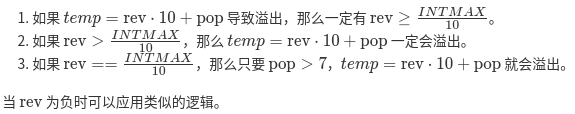

# 颠倒整数 

问题关键词：

- 大数问题

## 01 题目

给定一个 32 位有符号整数，将整数中的数字进行反转。

**示例 1:**

```
输入: 123
输出: 321
```

 **示例 2:**

```
输入: -123
输出: -321
```

**示例 3:**

```
输入: 120
输出: 21
```

**注意:**

假设我们的环境只能存储 32 位有符号整数，其数值范围是 $[−2^{31},  2^{31} − 1]$。根据这个假设，如果反转后的整数溢出，则返回 0。

## 02 分析

- 注意反转后可能溢出
- 输入直接读入为 string 类型则不需要考虑溢出问题

## 03 题解

### 基础：注意边界条件：溢出，负数，末尾 0

- 使用 long 类型来进行处理，在处理过程中不再需要考虑 int32 的溢出问题
- 先处理末尾 0
- 负数转化为正数进行处理
- 输出时对值进行判断

```c++
class Solution {
public:
    int reverse(int x) {
        if (-10 < x && x < 10) return x;
        queue<int> buffer;
        bool isNeg = false;

        long n = x;

        if (n < 0) {
            n = -n;
            isNeg = true;
        }
        // remove the tail zero
        int bit = n % 10;
        while (bit == 0) {
            n /= 10;
            bit = n % 10;
        }

        while (n > 0) {
            buffer.push(bit);
            n /= 10;
            bit = n % 10;
        }

        long ans = 0;
        while (!buffer.empty()) {
            ans = ans * 10 + buffer.front();
            buffer.pop();
        }
        if (isNeg == true && ans == INT_MAX + 1)
            return -ans;
        if (ans > INT_MAX)
            return 0;

        return isNeg == true ? -ans : ans;
    }
};xxxxxxxxxx40 1class Solution {2public:3    int reverse(int x) {4        if (-10 < x && x < 10) return x;5        queue<int> buffer;6        bool isNeg = false;78        long n = x;910        if (n < 0) {11            n = -n;12            isNeg = true;13        }14        // remove the tail zero15        int bit = n % 10;16        while (bit == 0) {17            n /= 10;18            bit = n % 10;19        }2021        while (n > 0) {22            buffer.push(bit);23            n /= 10;24            bit = n % 10;25        }2627        long ans = 0;28        while (!buffer.empty()) {29            ans = ans * 10 + buffer.front();30            buffer.pop();31        }32        if (isNeg == true && ans == INT_MAX + 1)33            return -ans;34        if (ans > INT_MAX)35            return 0;3637        return isNeg == true ? -ans : ans;38    }39};// version 1.040c++
```

### 基础：Python 3

```python
# version 1.0 91.34%

from math import exp
class Solution:
    def reverse(self, x):
        """
        :type x: int
        :rtype: int
        """
        INT_MAX = 2147483647 # 由于python的动态特性（不会溢出）， 这里定义了边界值
        
        
        
        x_str = str(x)
        
        if x_str[0] == "-": result_str = "-" + x_str[1:][::-1]
        else: result_str = x_str[::-1]
        
        result = int(result_str)
        
        if result > INT_MAX-1 or result < -INT_MAX: return 0 # 需要考虑转换后的结果
        else: return result

```

## 04 总结

### 数位的 POP 和 PUSH

```c++
//pop operation:
pop = x % 10;
x /= 10;

//push operation:
temp = rev * 10 + pop;
rev = temp;
```

逐位处理的问题在于 push 时可能会导致溢出：



有了上面的判断方法，我们可以使用下面的处理方法：

```c++
class Solution {
public:
    int reverse(int x) {
        int rev = 0;
        while (x != 0) {
            int pop = x % 10;
            x /= 10;
            if (rev > INT_MAX/10 || (rev == INT_MAX / 10 && pop > 7)) return 0;
            if (rev < INT_MIN/10 || (rev == INT_MIN / 10 && pop < -8)) return 0;
            rev = rev * 10 + pop;
        }
        return rev;
    }
};
```

注意，只使用 pop 和 push 操作在题目中也能够直接处理负数

- 对于负数，每次取余数都会得到负数的余数
- 在循环判断时要改成 while(n != 0)