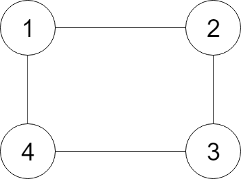

# 克隆图
**问题关键词：**

- 递归
- BFS

## 01 题目

给定无向[**连通**](https://baike.baidu.com/item/连通图/6460995?fr=aladdin)图中一个节点的引用，返回该图的[**深拷贝**](https://baike.baidu.com/item/深拷贝/22785317?fr=aladdin)（克隆）。图中的每个节点都包含它的值 `val`（`Int`） 和其邻居的列表（`list[Node]`）。

**示例：**



```
输入：
{"$id":"1","neighbors":[{"$id":"2","neighbors":[{"$ref":"1"},{"$id":"3","neighbors":[{"$ref":"2"},{"$id":"4","neighbors":[{"$ref":"3"},{"$ref":"1"}],"val":4}],"val":3}],"val":2},{"$ref":"4"}],"val":1}

解释：
节点 1 的值是 1，它有两个邻居：节点 2 和 4 。
节点 2 的值是 2，它有两个邻居：节点 1 和 3 。
节点 3 的值是 3，它有两个邻居：节点 2 和 4 。
节点 4 的值是 4，它有两个邻居：节点 1 和 3 。
```

 

**提示：**

1. 节点数介于 1 到 100 之间。
2. 无向图是一个[简单图](https://baike.baidu.com/item/简单图/1680528?fr=aladdin)，这意味着图中没有重复的边，也没有自环。
3. 由于图是无向的，如果节点 *p* 是节点 *q* 的邻居，那么节点 *q* 也必须是节点 *p* 的邻居。
4. 必须将**给定节点的拷贝**作为对克隆图的引用返回。

## 02 分析

- 这个问题的关键其实在对于引用类型的深度拷贝的理解
  - 深拷贝就是对于所有的指针成员，不能仅仅是赋值，还有重新分配空间
  - 深拷贝反应在本题中就是，所有的结点需要重新`new`出来，而不是直接赋值
  - 因此要维护原节点到新节点的映射，否则建立链接时就会链上原节点


- 本题也就是说，给定图中的一个点，从该点出发返回另一个新图

## 03 题解

### 基础：递归同步建图

- BFS 搜索图
- 使用 visited 表维护映关系，并标记节点（旧点 到 新点的映射）


- 递归返回的标志
  - 访问到访问过的节点直接返回其对应的新节点（而不是原节点）
  - 这一点是一定成立的，因为在 DFS 中我们总是先访问（生成新节点），再处理

```c++
/*
// Definition for a Node.
class Node {
public:
    int val;
    vector<Node*> neighbors;

    Node() {}

    Node(int _val, vector<Node*> _neighbors) {
        val = _val;
        neighbors = _neighbors;
    }
};
*/
class Solution {
private:
    unordered_map<Node*, Node*> visited;
    
public:
    Node* cloneGraph(Node* node) {
        
        if(node == NULL) return NULL;
        if(visited.find(node) != visited.end()) return visited[node];
        
        Node* root = new Node(node->val);
        
        visited[node] = root;
        
        for(auto neb : node->neighbors) {
            root->neighbors.push_back(cloneGraph(neb));
        }
        
        return root;
    }
};
```

## 04 总结

