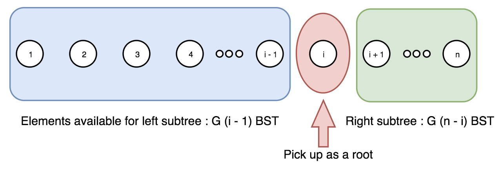

# 不同的二叉搜索树2
**问题关键词：**

- 递归

## 01 题目

给定一个整数 *n*，生成所有由 1 ... *n* 为节点所组成的**二叉搜索树**。

**示例:**

```
输入: 3
输出:
[
  [1,null,3,2],
  [3,2,null,1],
  [3,1,null,null,2],
  [2,1,3],
  [1,null,2,null,3]
]
解释:
以上的输出对应以下 5 种不同结构的二叉搜索树：

   1         3     3      2      1
    \       /     /      / \      \
     3     2     1      1   3      2
    /     /       \                 \
   2     1         2                 3
```

## 02 分析

- 这类求所有 case 的情况，一般都会使用回溯或者搜索的方法来处理
  - 相当于每个点都当一次 root

## 03 题解

### 基础：递归

首先，让我们来数一数需要构建多少棵树。 在[不同的二叉搜索树](https://leetcode-cn.com/problems/unique-binary-search-trees/)中，我们了解到，需要构建的二叉搜索树的数量实际上满足[卡特兰数](https://baike.baidu.com/item/卡特兰数)。

我们将会顺着上一篇文章的思路继续，不过这一次我们不需要计数，而是实际构造树。

**算法**

从序列 `1 ..n` 取出数字 `i` 并以它作为当前树的根节点。 那么就有 `i - 1` 个元素可以用来构造左子树，而另外的 `n - i` 个元素可以用于构造右子树。最后我们将会得到 `G(i - 1)` 棵不同的左子树，以及 `G(n - i)` 棵不同的右子树，其中 `G` 为卡特兰数。



现在，我们将会在序列 `1 ... i - 1` 上重复前面的步骤来构造所有的左子树，之后对序列 `i + 1 ... n` 也这样做以得到所有的右子树。

这么一来，我们就得到了根节点 `i` 和两个可能的左右子树列表。 最后一步是遍历两个列表，将左右子树和根节点链接起来。

```c++
/**
 * Definition for a binary tree node.
 * struct TreeNode {
 *     int val;
 *     TreeNode *left;
 *     TreeNode *right;
 *     TreeNode(int x) : val(x), left(NULL), right(NULL) {}
 * };
 */
class Solution {
public:
    vector<TreeNode*> generateTrees(int n) {
        if(n == 0) return vector<TreeNode*>{};
        
        return buildbst(1, n);
    }
    
    vector<TreeNode*> buildbst(int l, int r) {
        vector<TreeNode*> ans;
        if(l > r) {
            ans.push_back(NULL);
            return ans;
        }
        
        for(int i = l; i <= r; i++) {
            vector<TreeNode*> leftTree = buildbst(l, i-1);
            vector<TreeNode*> rightTree = buildbst(i+1, r);
            
            for(auto l : leftTree) {
                for(auto r : rightTree) {
                    TreeNode* root = new TreeNode(i);
                    root->left = l;
                    root->right = r;
                    ans.push_back(root);

                }
            }
        }
        return ans;
    }
};
```

## 04 总结

<https://leetcode-cn.com/explore/orignial/card/recursion-i/260/conclusion/1234/>