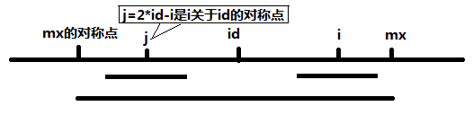

# 最长回文子串
**问题关键词：**

- DP

## 01 题目

给定一个字符串 `s`，找到 `s` 中最长的回文子串。你可以假设 `s` 的最大长度为 1000。

**示例 1：**

```
输入: "babad"
输出: "bab"
注意: "aba" 也是一个有效答案。
```

**示例 2：**

```
输入: "cbbd"
输出: "bb"
```

## 02 分析


## 03 题解

### 基础

#### 思路 1：穷举搜索

- 枚举所有子串，判断其是否为回文串
- 计算中存在大量的重复

#### 思路 2：中心扩展法

- 如果一段字符串是回文，那么以某个字符为中心的前缀和后缀都是相同的，例如以一段回文串“aba”为例，以b为中心，它的前缀和后缀都是相同的，都是a
- 可以枚举中心位置，然后再在该位置上用扩展法，记录并更新得到的最长的回文长度

```cpp
int LongestPalindrome(const char *s, int n)
{
    int i, j, max,c;
    if (s == 0 || n < 1)
        return 0;
    max = 0;

    for (i = 0; i < n; ++i) { // i is the middle point of the palindrome  
        for (j = 0; (i - j >= 0) && (i + j < n); ++j){ // if the length of the palindrome is odd  
            if (s[i - j] != s[i + j])
                break;
            c = j * 2 + 1;
        }
        if (c > max)
            max = c;
        for (j = 0; (i - j >= 0) && (i + j + 1 < n); ++j){ // for the even case  
            if (s[i - j] != s[i + j + 1])
                break;
            c = j * 2 + 2;
        }
        if (c > max)
            max = c;
    }
    return max;
}
```

代码稍微难懂一点的地方就是内层的两个 for 循环，它们分别对于以 i 为中心的，长度为奇数和偶数的两种情况，整个代码遍历中心位置 i 并以之扩展，找出最长的回文。

#### 思路 3：动态规划

这里有很多细节啊，注意边界条件

<https://www.jianshu.com/p/a7741619dd58>

`dp[i][j]`表示s[i..j]是否回文 是则为true，否则为false

- `s[i]=s[j]` 则 `dp[i][j]`取决于s[i+1..j-1]是否是回文串
- `s[i]!=s[j]` 则`dp[i][j]`=false

基本情况

- `dp[i][i]=true`
- `dp[i][i+1]= s[i]==s[i+1]`

#### 思路 4：Manacher 方法 O(N)

在中心扩展法中，我们需要考虑串长度的奇数偶数，我们可以把所有的情况全部转换为奇数

- 首先通过在每个字符的两边都插入一个特殊的符号，将所有可能的奇数或偶数长度的回文子串都转换成了奇数长度
  - 比如 abba 变成 #a#b#b#a#， aba变成 #a#b#a#
- 然后为了进一步减少编码的复杂度，可以在字符串的开始加入另一个特殊字符，这样就不用特殊处理越界问题，比如$#a#b#a#
- 以字符串12212321为例，插入#和$这两个特殊符号，变成了 S[] = "$#1#2#2#1#2#3#2#1#"，然后用一个数组 P[i] 来记录以字符S[i]为中心的最长回文子串向左或向右扩张的长度

```
S # 1 # 2 # 2 # 1 # 2 # 3 # 2 # 1 #
P 1 2 1 2 5 2 1 4 1 2 1 6 1 2 1 2 1
```

- 可以看出，P[i]-1正好是原字符串中最长回文串的总长度，为5
- 接下来怎么计算P[i]呢？Manacher算法增加两个辅助变量id和mx，其中id表示最大回文子串中心的位置，mx则为id+P[id]，也就是最大回文子串的边界。得到一个很重要的结论：
  - 如果mx > i，那么P[i] >= Min(P[2 * id - i], mx - i)

C代码如下：

```c
//mx > i，那么P[i] >= MIN(P[2 * id - i], mx - i)
//故谁小取谁
if (mx - i > P[2*id - i])
    P[i] = P[2*id - i];
else  //mx-i <= P[2*id - i]
    P[i] = mx - i;
```

下面，令j = 2*id - i，也就是说j是i关于id的对称点。

当 mx - i > P[j] 的时候，以S[j]为中心的回文子串包含在以S[id]为中心的回文子串中，由于i和j对称，以S[i]为中心的回文子串必然包含在以S[id]为中心的回文子串中，所以必有P[i] = P[j]；



当 P[j] >= mx - i 的时候，以S[j]为中心的回文子串不一定完全包含于以S[id]为中心的回文子串中，但是基于对称性可知，下图中两个绿框所包围的部分是相同的，也就是说以S[i]为中心的回文子串，其向右至少会扩张到mx的位置，也就是说 P[i] >= mx - i。至于mx之后的部分是否对称，再具体匹配。


此外，对于 mx <= i 的情况，因为无法对 P[i]做更多的假设，只能让P[i] = 1，然后再去匹配。

综上，关键代码如下：

```c
//输入，并处理得到字符串s
int p[1000], mx = 0, id = 0;
memset(p, 0, sizeof(p));
for (i = 1; s[i] != '\0'; i++) 
{
    p[i] = mx > i ? min(p[2 * id - i], mx - i) : 1;
    while (s[i + p[i]] == s[i - p[i]]) 
        p[i]++;
    if (i + p[i] > mx) 
    {
        mx = i + p[i];
        id = i;
    }
}
//找出p[i]中最大的
```

此Manacher算法使用id、mx做配合，可以在每次循环中，直接对P[i]的快速赋值，从而在计算以i为中心的回文子串的过程中，不必每次都从1开始比较，减少了比较次数，最终使得求解最长回文子串的长度达到线性O(N)的时间复杂度。

### 基础：中心扩展法

```c++
class Solution {
public:
    string longestPalindrome(string s) {
        
        if(s.length() < 2) return s;
        
        string es;
        string es_ans;
        string ans;
        
        // warp the string to avoid even mid check case
        for(auto c : s) {
            es.push_back('#');
            es.push_back(c);
        }
        es.push_back('#');
        
        int maxLen = 0;
        int start = 0;
        for(int i = 0; i < es.length(); i++) {
            int subLen = subPalidrome(es, i);
            if(maxLen < subLen) {
                maxLen = subLen;
                start = i;
            }
        }
        
        cout<<start<<" "<<maxLen<<endl;
        
        es_ans = es.substr(start-maxLen, 2 * maxLen);
        
        cout<<es_ans;
        
        for(int i = 0; i < es_ans.length(); i++) {
            if(es_ans[i] != '#')
                ans.push_back(es_ans[i]);
        }
        
        return ans;
    }
    
    int subPalidrome(string& s, int i) {
        
        int len = 0;
        int k = 0;
        
        for( ; k <= i && k < (s.length() - i); k++) {
            
            if(s[i-k] == s[i+k])
                len++;
            else
                break;
        }
        
        return k-1;
    }
};
```

### 优化：DP

```c++
class Solution {
public:
    string longestPalindrome(string s) {
        
        if(s.length() < 2) return s;
        
        vector<vector<int>> opt(s.length(), vector<int>(s.length(), 0));
        int start = 0;
        int len = 1;
        
        for(int i = s.length() - 2; i >= 0; i--) {
            
            opt[i][i] = 1;
            
            for(int j = i + 1; j < s.length(); j++) {
                if(s[i] == s[j] && (j - i <= 2 || opt[i+1][j-1]))
                    opt[i][j] = 1;
                
                if(opt[i][j] && len < j - i + 1) {
                    start = i;
                    len = j - i + 1;
                    
                    cout<<start<<" "<<len<<endl;
                }
            }
        }
        // cout<<start<<" "<<len<<endl;
        
        return s.substr(start, len);
    }
};
```

## 04 总结

对于 STL:: string 类型的总结：

- 区分 append 和 push_back 的输入对象
  - 前者是 string，双引号包围
  - 后者是 char，单引号包围