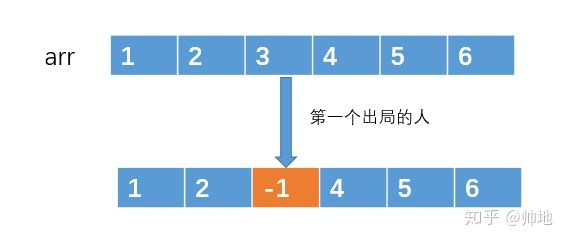
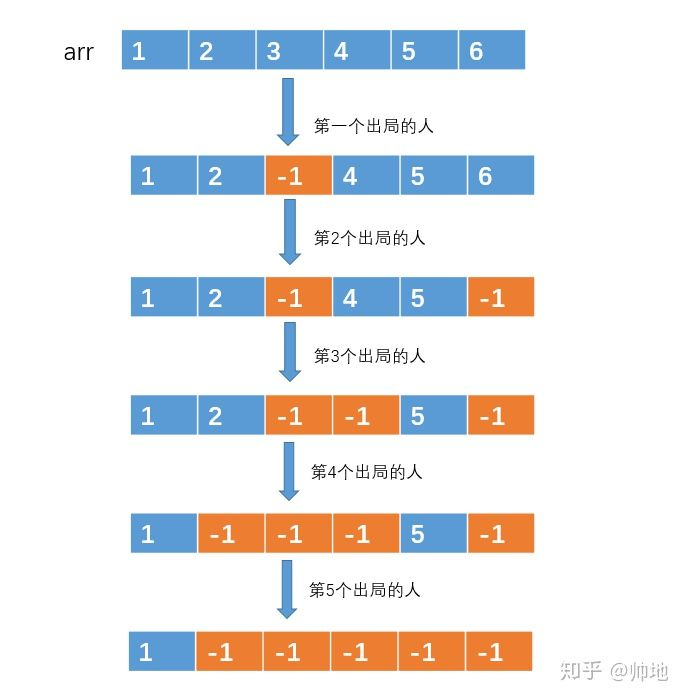
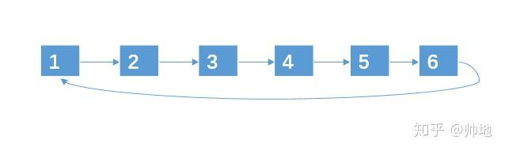
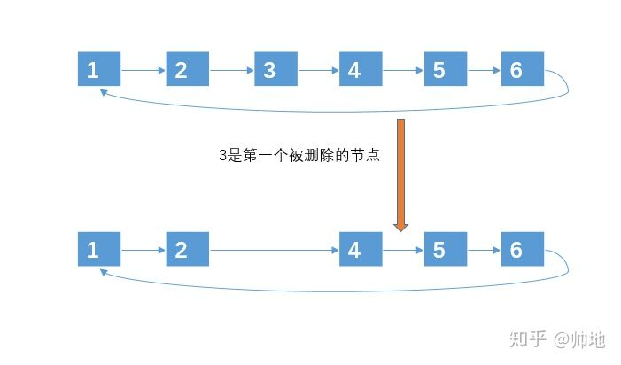

# 约瑟夫环
**问题关键词：**

- 约瑟夫环
- 映射关系
- 模拟解法

## 01 题目

编号为 1-N 的 N 个士兵围坐在一起形成一个圆圈，从编号为 1 的士兵开始依次报数（1，2，3...这样依次报），数到 m 的 士兵会被杀死出列，**之后的士兵再从 1 开始报数**。**直到最后剩下一士兵，求这个士兵的编号**。

## 02 问题分析

假设只有三个人，把他们叫做A、B、C，三人围成一圈，从A开始报数，假设报 2 的人被杀掉。

- 首先A开始报数，他报1。侥幸逃过一劫。
- 然后轮到B报数，他报2。非常惨，他被杀了
- C接着从1开始报数
- 接着轮到A报数，他报2。也被杀死了。
- 最终胜利者是C

通过上面的简单模拟我们可以发现这个问题的关键特点：从删除的地方重新开始计数

## 03 解题思路

### 基础：使用数组进行标记

假设 n = 6, m = 3：

1. 用一个数组来存放 1，2，3 ... n 这 n 个编号


2. 遍历数组，**对于被选中的编号，我们就做一个标记**，例如编号 arr[2] = 3 被选中了，那么我们可以做一个标记，例如让 arr[2] = -1，来表示 arr[2] 存放的编号已经出局的了。



3. 然后就按照这种方法，不停着遍历数组，不停着做标记，**直到数组中只有一个元素是非 -1 的**，这样，**剩下的那个元素就是我们要找的元素了**。这里可以维护一个计数变量



算法特点：思路简单，编码复杂

- 每次遍历到数组最后一个元素的时候，还得重新设置下标为 0：可以用 mod 运算实现
- 遍历的时候需要判断该元素是否是 -1，并更新计数器

复杂度

- 时间：O(n*m)
- 空间：O(n)

### 优化：环形链表 —— 优化移除操作对容器的影响

用环形链表来处理其实和数组处理的思路差不多，只是用链表来处理的时候，对于被选中的编号，不再是**做标记**，而是**直接移除**：

- 从链表移除一个元素的时间复杂度很低，为 O(1)
- 当然，上面数组的方法你也可以采用移除的方式，不过数组移除的时间复杂度为 O(n)

**算法：**

1. 先创建一个环形链表来存放元素：



2. 然后一边遍历链表一遍删除，直到链表只剩下一个节点



代码如下：

```text
// 定义链表节点
class Node{
    int date;
    Node next;

    public Node(int date) {
        this.date = date;
    }
}
```

核心代码

```text
public static int solve(int n, int m) {
        if(m == 1 || n < 2)
            return n;
        // 创建环形链表
        Node head = createLinkedList(n);
        // 遍历删除
        int count = 1;
        Node cur = head;
        Node pre = null;//前驱节点
        while (head.next != head) {
            // 删除节点
            if (count == m) {
                count = 1;
                pre.next = cur.next;
                cur = pre.next;
            } else {
                count++;
                pre = cur;
                cur = cur.next;
            }
        }
        return head.date;
    }

    static Node createLinkedList(int n) {
        Node head = new Node(1);
        Node next = head;
        for (int i = 2; i <= n; i++) {
            Node tmp = new Node(i);
            next.next = tmp;
            next = next.next;
        }
        // 头尾串联
        next.next = head;
        return head;
    }
```

这里需要注意：

- 建立链表时，需要首尾相连
- 模拟时：
  - 退出条件为 head 的 next 为 head
  - 删除条件为计数到位，用 pre 和 cur 删除
  - 往下遍历只需更新指针即可

这种方法估计是最多人用的，

复杂度：

- 时间：O(n*m)
- 空间：O(n)

### 优化：递归求解——找到前后序列的映射关系

其实这道题还可以用递归来解决，递归是思路是**每次我们删除了某一个士兵之后，我们就对这些士兵重新编号，然后我们的难点就是找出删除前和删除后士兵编号的映射关系**。

我们**定义递归函数 f(n，m) 的返回结果是存活士兵的编号**：

- 递归基：显然当 n = 1 时，f(n, m) = 1
- 关系式：假如我们能够找出 f(n，m) 和 f(n-1，m) 之间的关系的话，我们就可以用递归的方式来解决了。

1. 我们假设人员数为 n, 报数到 m 的人就自杀。则刚开始的编号为：

```
… 1 ... m - 2, m - 1, m, m + 1, m + 2 ... n …
```

2. 进行了一次删除之后，删除了编号为 m 的节点。删除之后，就只剩下 n - 1 个节点了，删除前和删除之后的编号转换关系为：

```
删除前 --- 删除后

… --- …

m - 2 --- n - 2

m - 1 --- n - 1

m ---- 无(因为编号被删除了)

m + 1 --- 1(因为下次就从这里报数了)

m + 2 ---- 2

… ---- …
```

3. 新的环中只有 n - 1 个节点。且删除前编号为 m + 1, m + 2, m + 3 的节点成了删除后编号为 1， 2， 3 的节点。

通过上面你的分析可以看出：假设 old 为删除之前的节点编号， new 为删除了一个节点之后的编号，则 old 与 new 之间的关系为 （这个关系式有问题）

```
old = (new + m - 1) % n + 1
```

这里将整个关系写出来

```
before: 1    , ..., m-1, m, m+1, ..., n
after : n-m+1, ..., n-1,  , 1  , ..., n-m
```

- 需要注意的是，如果我们的序列从 1 开始计数，映射关系不好处理，但是如果从 0 开始计数，问题就变得简单了

> 这里在展开的时候有一个技巧，就是从删除的元素部分断开，然后按照 new 的序列从 0 开始排序即可

```
old: m, m+1, m+2, ...,   n-2,   n-1,   0,     1,     2, ..., m-2
new: 0,   1,   2, ..., n-m-2, n-m-1, n-m, n-m+1, n-m+2, ..., n-2
```

上面映射关系的表达式为

```
// 从 0 开始计数，分子部分的最大值为 n-1
f(n, m) = [f(n-1, m) + m] % n

// 从 1 开始计数，分子部分的最大值为 n
f(n, m) = [f(n-1, m) + m + 1] % (n + 1)
```

最终输出结果时，如果题目是从 1 开始计数的，则结果 + 1 即可，如果从 0 开始计数，则直接输出

```c++
// start from 0
int f(int n, int m) {
    if(n == 1) return n;
    
    return (f(n-1, m) + m) % n;
}

// start from 1
```

## 总结

数学类的问题，可以尝试构造映射关系通过函数直接求解

## 参考资料

> 约瑟夫环：https://zhuanlan.zhihu.com/p/74436158，给的答案里面有陷阱
>
> http://www.manongjc.com/article/80213.html
>
> https://segmentfault.com/a/1190000008230882
>
> https://www.wjyyy.top/1966.html