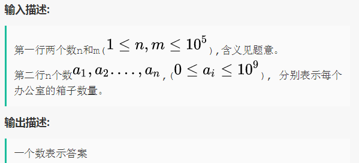
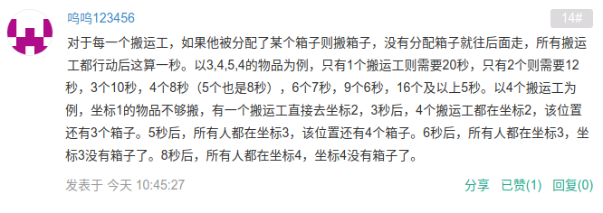
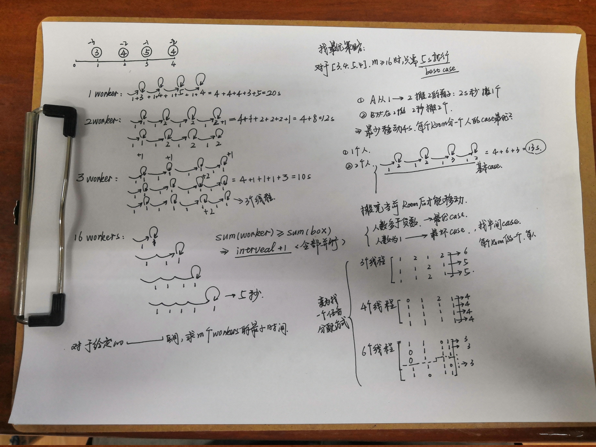

# 勤劳的搬运工
**问题关键词：**

- 任务调度问题：找到一个调度策略

## 01 题目

- 给定 m 名搬运工，和排成一条直线的 n 个办公室，办公室可以看做数轴上坐标为 1 到 n 的每个位置
- 第 i 个办公室有箱子 ai
- 初始状态搬运工都在 0 点，每秒每名搬运工可以执行以下两种操作之一：
  - 移动一个单位
  - 搬走一箱东西，搬走后该搬运工还留在原地

求最少多少时间能搬走所有的东西？

## 02 分析

理解题意：

二分思路：

我的分析：

## 03 题解

### 基础：

### 优化：

## 04 总结

