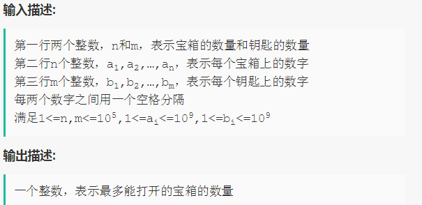

# 宝箱和钥匙
**问题关键词：**

- 匹配问题

## 01 题目

- 小 Q 有 n 个宝箱和 m 把钥匙，每个宝箱或钥匙上都有一个数字
- 规定宝箱和钥匙的数字之和为奇数才能打开宝箱
- 每个宝箱和钥匙都只能使用一次

求小 Q 最多能打开的宝箱数



## 02 分析

- 开箱条件：两数分别为一个奇数一个偶数
- 统计各集合中奇数和偶数的数量，然后
  - 箱子的奇数和钥匙的偶数相匹配，取最小者
  - 反之同理
- 再求两种情况之和即可


注意：这里只是统计个数，不需要考虑大数问题

## 03 题解

### 基础：按奇偶匹配

```c++
#include <iostream>

using namespace std;

int main() {
    int n, m;
    cin >> n >> m;

    int evenBoxNum = 0, oddBoxNum = 0; // count the target box num.
    for (int i = 0; i < n; ++i) {
        int boxNum;
        cin >> boxNum;

        if (boxNum % 2 == 0) evenBoxNum++;
        else oddBoxNum++;
    }

    int evenKeyNum = 0, oddKeyNum = 0;
    for (int i = 0; i < m; ++i) {
        int keyNum;
        cin >> keyNum;
        if (keyNum % 2 == 0) evenKeyNum++;
        else oddKeyNum++;
    }

    cout << min(evenBoxNum, oddKeyNum) + min(oddBoxNum, evenKeyNum);

    return 0;
};
```

## 04 总结

