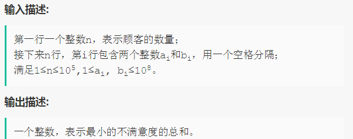
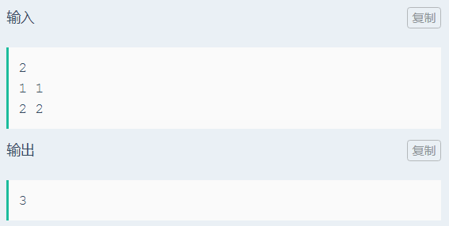

# 最小不满意度队列
**问题关键词：**

- 任务调度

## 01 题目

- n 名顾客排队买咖啡，每个顾客有两个属性 ai 和 bi：
  - ai 表示顾客对当前位置之前的不满意因子
  - bi 表示顾客对当前位置之后的不满意因子
- 客户在当前位置的不满意度为  $a_i(i-i) + b_i(n-i), i = 1 ... n$


请设计 n 名顾客的一种排序，使得所有顾客的不满意度之和最低





## 02 分析

- 任务调度问题，最重要的就是找到一个全局最优的排序
- 考虑第 i 位顾客：
  - 设其当前的不满意度为 $T_i = a_i(i-i) + b_i(n-i)$
  - 假设该顾客调整到 i-1 位置，则该顾客不满意度变为 $T_{i-1} = T_i + b_i - a_i$，因此，当 $b_i - a_i$ 小于 0 时，该顾客不满意度下降
  - 假设 i-1 位置的顾客调整到 i 位置，当 $b_{i-1} - a_{i-1}$ 大于 0 时，该顾客不满意度下降
- 因此，对于任意两位顾客，差值更小的顾客应该排在前面


换一种思路理解：差值表示两个因子的相对重要性，b 越大则该顾客越应该排在队伍的后面

## 03 题解

### 基础：

```c++
#include <iostream>
#include <vector>
#include <algorithm>

using namespace std;

bool cmp1(pair<int, int> p1, pair<int, int> p2) {
    return p1.second - p1.first < p2.second - p2.first;
}

int main() {
    int n;
    cin >> n;
    vector<pair<int, int>> nums;

    int a, b;
    for (int i = 0; i < n; ++i) {
        cin >> a >> b;
        nums.push_back(make_pair(a, b));
    }

    sort(nums.begin(), nums.end(), cmp1);

    int cost = 0;
    for (int i = 0; i < n; ++i) {
        cost += nums[i].first * i + nums[i].second * (n - i - 1);
    }
    cout << cost;
    return 0;
};
```

## 04 总结

