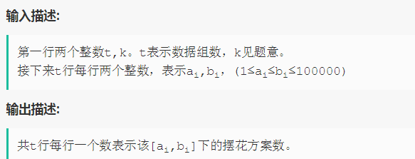
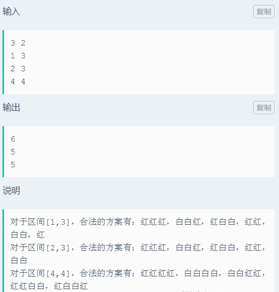

# 花的排列
**问题关键词：**

- DP

## 01 题目

- 花匠养了两种花：红花和白花。现在花匠用这些花进行摆放，有如下规则:
  - 摆放时连续的白花数量只能是 k 的整数倍（包括 0）
- 先给出花的数量的一个区间 a，b

花匠想知道区间内摆花方案中合法的方案一共有多少种？

- 结果对 1e9+7 取余





## 02 分析

- n 盆花的摆法和之前的摆法有关，转化为 DP 问题
- 先使用 DP 求出每一种 n 的摆法
- 然后求 DP 的子序列和即可

n 盆花的摆法：

- 可以由 n-1 的情况增加一盆红花得到
- 也可以由 n-k 的情况增加 k 盆连续白花得到

因此有递推关系式：

```
dp[i] = dp[i-1] + dp[i-k]
```

初始条件：

- 只有 1 盆花，则只能放红花，为 1
- 只有 0 盆花，则只能放 0 组白花，为 1
- 当 n 小于 k 时，只能放红花，为 1

## 03 题解

### 基础：DP

```c++
#include <iostream>
#include <vector>

typedef long long ll;

using namespace std;

void solver(int a, int b, int k) {
    vector<int> dp(b + 1, 0);

    // init
    for (int i = 0; i < k; ++i) {
        dp[i] = 1;
    }

    // dp
    for (int i = k; i <= b; ++i) {
        dp[i] = dp[i - 1] + dp[i - k];
    }

    int ans = 0;
    for (int i = a; i <= b; ++i) {
        ans += dp[i];
    }

    cout << ans;
}

int main() {
    ll t, k;
    cin >> t >> k;

    while (t-- > 0) {
        int a, b;
        cin >> a >> b;
        solver(a, b, k);
    }

    return 0;
}
```

### 优化与细节

1. 在求解 DP 的过程中还可以同步求累积和减少后期求子序列和的一重循环
2. 问题中需要考虑溢出问题，对结果取 mod

## 04 总结

这类排列问题如何用 DP 思想来解释：

- 