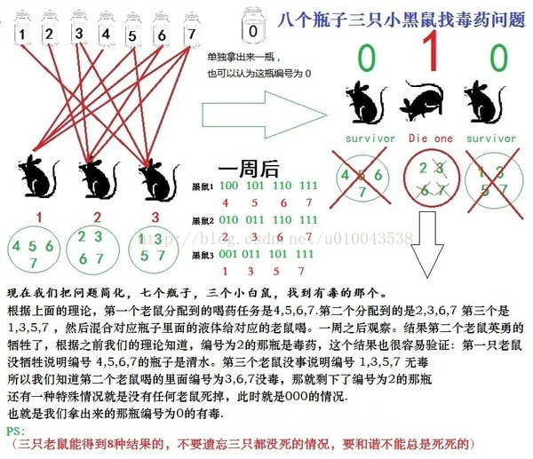
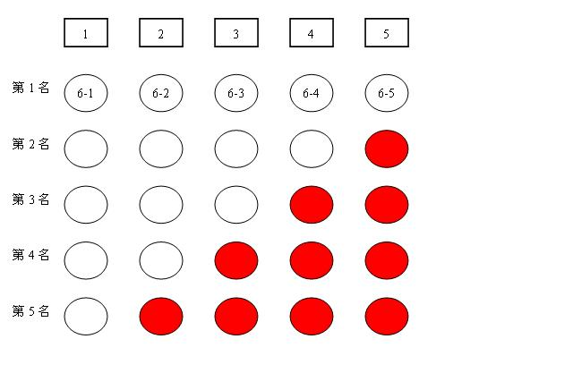
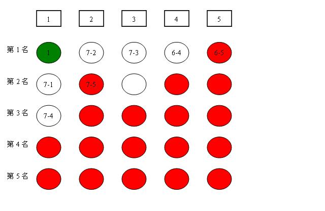

## 智力逻辑

## 海盗分钻石

五个海盗抢到了100颗宝石，每一颗都一样大小和价值连城。他们决定这么分： 抽签决定自己的号码（1、2、3、4、5）

首先，由1号提出分配方案，然后大家表决，当且仅当超过半数的人同意时，按照他的方案进行分配，否则将被扔进大海喂鲨鱼

如果1号死后，再由2号提出分配方案，然后剩下的4人进行表决，当且仅当超过半数的人同意时，按照他的方案进行分配，否则将被扔入大海喂鲨鱼，依此类推。

条件：每个海盗都是很聪明的人，都能很理智地做出判断，从而做出选择。

问题：第一个海盗提出怎样的分配方案才能使自己的收益最大化？

> 链接：https://www.nowcoder.com/questionTerminal/304be4e2a85a41e89623b20be3cf771c来源：牛客网
>
>   1/ 前面四个都死了 ： 5  get 100 
>
>   2/ 前面三个都死了 ： 4 肯定会死 ， 因为5会 投反对票。  所以 4 肯定不希望前面三个都死 
>
>   3/ 前面二个死了     ： 4 会投赞成票  所以3分发：  100  0  0 分别给  3，4，5   
>
> ​                                   （3，4，5 这3个人，3知道4为了保命肯定会投赞成票，不用管5   ，自己肯定通过） 
>
>   4/ 前面1 死了          ： 3希望2死，因为2死后这样就能得到100   3投反对 
>
> ​                                 ：  4，5 如果每人得到  1个金币，肯定会赞成 
>  
>
> ​                                 ： 2的分法是 ：  98   0  1  1      （2，3，4，5）
>  
>
>   5/ 现在 1 都知道了以上的思路：他必须争取到两票来让自己通过 
>
> ​                                  97  0 1 2 0     ： 3  和 4 都会投赞成票      
>
> ​                                   或者    
>
> ​                                  97 0 1 0 2      ：3 和 5 都会投赞成票

## 天平称重

用天平（只能比较，不能称重）从一堆小球中找出其中唯一一个较轻的，使用x次天平，最多可以从y个小球中找出较轻的那个，求y与x的关系式。

> 之前的相法是分成两拨，称称，轻的球肯定在轻的那拨里面，这样二分直到找到那个轻的球。
>
> 后面在网上看到还有更快的方法是三分法，一次分三拨，称两拨，就知道在这三拨中的哪一拨，就这样。。。直到找到那个轻的球。
>
> 四分行吗，不行，三分是最快的方法。
>
> 所以y与x的关系是：
>
> y <= 3^x


## 天平称重 2

有12个小球,外形相同,其中一个小球的质量与其他11个不同，给一个天平,问如何用3次把这个小球找出来，并且求出这个小球是比其他的轻还是重。

- 首先对小球标记序号
- 第一轮，12 个小球分为三份，每份 4 个，可以找出质量不同的那一组
  - 设有小组 a b c，ab, ac, bc 各称一次即可
- 第二轮，4 个小球分为两份，由于此时已知目标小球是轻是重，将这两份称一下就能找到目标小球
- 第三轮，将 2 个小球分为两份，称一下结果就出来了

## 天平称重 3

13个球一个天平，现知道只有一个和其它的重量不同，问怎样称才能用三次就找到那个球?

- 编号处理哦，复杂哦

**5**

有一根27厘米的细木杆，在第3厘米、7厘米、11厘米、17厘米、23厘米这五个位置上各有一只蚂蚁。木杆很细，不能同时通过一只蚂蚁。开始时，蚂蚁的头朝左还是朝右是任意的，它们只会朝前走或调头，但不会后退。当任意两只蚂蚁碰头时，两只蚂蚁会同时调头朝反方向走。假设蚂蚁们每秒钟可以走一厘米的距离。

## 编码：3-8 译码器

有8瓶水，其中有一瓶有毒，最少尝试几次可以找出来。

- 对 8 瓶水进行二进制编码 000 - 111，问题转化为求毒药的编码
- 使用三只老鼠进行试验，每只老鼠对应不同的位
  - 每只老鼠负责检验该位上对应为 1 的瓶子的药水

```
mouse 1：4,5,6,7
mouse 2: 2,3,6,7
mouse 3: 1,3,5,7
```

- 根据结果进行编码即可



## 猴子分桃

五只猴子分桃。半夜，第一只猴子先起来，它把桃分成了相等的五堆，多出一只。于是，它吃掉了一个，拿走了一堆； 第二只猴子起来一看，只有四堆桃。于是把四堆合在一起，分成相等的五堆，又多出一个。于是，它也吃掉了一个，拿走了一堆；.....其他几只猴子也都是这样分的。问：这堆桃至少有多少个？

分析：**先给这堆桃子加上4个**，设此时共有X个桃子，最后剩下a个桃子：

- 第一只猴子分完后还剩:(1-1/5)X=(4/5)X;
- 第二只猴子分完后还剩:(1-1/5)2X;
- 第三只猴子分完后还剩:(1-1/5)3X;
- 第四只猴子分完后还剩:(1-1/5)4X;
- 第五只猴子分完后还剩:(1-1/5)5X=(1024/3125)X;

得：a=(1024/3125)X；**要使a为整数，X最小取3125，减去加上的4个，所以，这堆桃子最少有3121个**。

- 也就是 4 / 5 的 5 次方，之后再去掉一开始补充的 4 个桃子即可

## 编码 2

我们有很多瓶无色的液体，其中有一瓶是毒药，其它都是蒸馏水，实验的小白鼠喝了以后会在5分钟后死亡，而喝到蒸馏水的小白鼠则一切正常。现在有5只小白鼠，请问一下，我们用这五只小白鼠，5分钟的时间，能够检测多少瓶液体的成分？

- 32 瓶

## 赛马

25匹赛马，5个跑道，也就是说每次有5匹马可以同时比赛。问最少比赛多少次可以知道跑得最快的5匹马。

下面是 25 选 3 的算法：

- 总结一下：先进行 5 场资格赛；之后让资格赛的第一名们进行冠军争夺赛，本场比赛的获胜者就是所有马里速度最快的；再对逻辑上仍有资格的 5 匹马进行最后一场比赛。这次比赛里的前两名，就是 25 匹马里跑第二和第三快的。

- 第 6 轮比赛淘汰第四和第五名的选手及其对应的组，此时系统中还剩 15 匹马
- 第六轮结束还剩 6 匹马，分别是本厂的前三名，以及第一名队伍里的前三名
  - 本场第二名队伍里的第二名可能也是第三名
  - 本场第三名队伍里的第名不可能入选了
- 因此还剩，第一名队伍的 123 名，第二名队伍的 12 名，第三名队伍的 第一名，共 6 匹马
- 由于第一名已经确定了，因此对剩下 5 名比赛即可

下面是 25 取 5 的算法：

1. 25匹马分五组跑5场得到每组的排序。
2. 第6场（找到第一名）：用每组的第一名来跑。得到这五组中第一名之间的排序。如图1所示，图中红色圈表示可以不需要比较的马，还剩 15 匹



3. 第7场（找到2,3名）：从6-1所在组选出排名2、3的马，从6-2所在组选出排名第2的马，加上6-2和6-3跑进行比赛

   > 如图2a所示，实际上在第6场之后已经得到了所有马中的第1名(图中绿色点)。同时根据第7轮的比赛结果，又得到了一些
   >
   > 不需要比较的马(图中新增的红色点)，而且**可以确定所有马中的第2和3第名分别为7-1和7-2**。再用剩下没有确定的4匹马
   >
   > **比赛一场即可以得到所有马中的第4和第5名。这种情况下，最多需要比赛8场。**



4. 第 8 场，确定剩下的 4， 5 名即可，还剩 4 匹马

## 博弈

宿舍内5个同学一起玩对战游戏。每场比赛有一些人作为红方，另一些人作为蓝方。请问至少需要多少场比赛，才能使任意两个人之间有一场红方对蓝方和蓝方对红方的比赛？

提示：答案为4场。

**11、单词博弈**

甲乙两个人用一个英语单词玩游戏。两个人轮流进行，每个人每次从中删掉任意一个字母，如果剩余的字母序列是严格单调递增的（按字典序a < b < c <....<z)，则这个人胜利。两个人都足够聪明（即如果有赢的方案，都不会选输的方案 ），甲先开始，问他能赢么？

例如: 输入 bad， 则甲可以删掉b或者a,剩余的是ad或者bd，他就赢了，输出1。 又如: 输入 aaa， 则甲只能删掉1个a，乙删掉一个a,剩余1个a，乙获胜，输出0。