# 算法 9：开启“树”之旅

我们先来看一个例子。

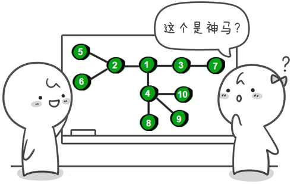

这是什么？是一个图？不对，确切的说这是一棵树。这哪里像树呢？不要着急我们来变换一下。

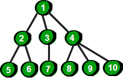

是不是很像一棵倒挂的树，也就是说它是根朝上，而叶子朝下的。不像？哈哈，看完下面这幅图你就会觉得像啦。


你可能会问：树和图有什么区别？这个称之为树的东西貌似和无向图差不多嘛。不要着急，继续往下看。树其实就是不包含回路的连通无向图。你可能还是无法理解这其中的差异，举个例子，如下。

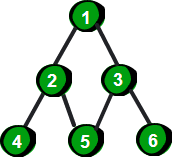

上面这个例子中左边的是一棵树，而右边的是一个图。因为左边的没有回路，而右边的存在 1->2->5->3->1 这样的回路。

1. 正是因为树有着“不包含回路”这个特点，所以树就被赋予了很多特性。
2. 一棵树中的任意两个结点有且仅有唯一的一条路径连通。
3. 一棵树如果有 n 个结点，那么它一定恰好有 n-1 条边。

在一棵树中加一条边将会构成一个回路。树这个特殊的数据结构在哪里会用到呢？比如足球世界杯的晋级图，家族的族谱图、公司的组织结构图、书的目录、我们用的操作系统 Windows、Liunx 或者 Mac 中的“目录（文件夹）”都是一棵树。下面就是“啊哈 C”这个软件的目录结构。

```
    C:\啊哈C
    ├─codes
    ├─core
    │ ├─bin
    │ ├─include
    │ │ ├─ddk
    │ │ ├─gdb
    │ │ ├─gdiplus
    │ │ ├─GL
    │ │ └─sys
    │ ├─lib
    │ │ └─gcc
    │ │ └─mingw32
    │ │ └─4.7.1
    │ │ ├─finclude
    │ │ ├─include
    │ │ │ └─ssp
    │ │ ├─include-fixed
    │ │ └─install-tools
    │ │ └─include
    │ ├─libexec
    │ │ └─gcc
    │ │ └─mingw32
    │ │ └─4.7.1
    │ │ └─install-tools
    │ └─mingw32
    │ ├─bin
    │ └─lib
    │ └─ldscripts
    └─skin
```

假如现在正处于 libexec 文件夹下，需要到 gdiplus 文件夹下。你必须先“向上”回到上层文件夹 core，再进入 include 文件夹，最后才能进入 gdiplus 文件夹。因为一棵树中的任意两个结点（这里就是文件夹）有且仅有唯一的一条路径连通。

为了之后讲解的方便，我们这里对树进行一些定义。

首先，树是指任意两个结点间有且只有一条路径的无向图。 或者说，只要是没有回路的连通无向图就是树。

喜欢思考的同学可能会发现同一棵树可以有多种形态，比如下面这个两棵树。

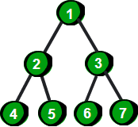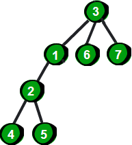

为了确定一棵树的形态，在一棵树中可以指定一个特殊的结点——根。我们在对一棵树进行讨论的时候，将树中的每个点称为结点，有的书中也称为节点。有一个根的树叫做有根树（哎，这不是废话嘛）。比如上方左边这棵树的树根是 1 号结点，右边这棵树的树根是 3 号结点。

根又叫做根结点，一棵树有且只有一个根结点。根结点有时候也称为祖先。既然有祖先，理所当然就有父亲和儿子。比如上图右边这棵树中 3 号结点是 1、6 和 7 号结点的父亲，1、6 和 7 号结点是 3 号结点的儿子。同时 1 号结点又是 2 号结点的父亲，2 号结点是 1 号结点的儿子，2 号结点与 4、5 号结点关系也显而易见了。

父亲结点简称为父结点，儿子结点简称为子结点。2 号结点既是父结点也是子结点，它是 1 号结点的子结点，同时也是 4 和 5 号结点的父结点。另外如果一个结点没有子结点（即没有儿子）那么这个结点称为叶结点，例如 4、5、6 和 7 号结点都是叶结点。没有父结点（即没有父亲）的结点称为根结点（祖先）。如果一个结点既不是根结点也不是叶结点则称为内部结点。最后每个结点还有深度，比如 5 号结点的深度是 4。哎，终于啰嗦完了，写的我汗都流出来了，没有理解的请看下面这幅插图吧。

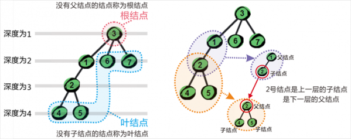

说了这么多你可能都没有感受到树究竟有什么好处。不要着急，请看下回——二叉树。

# 算法 10：二叉树

二叉树是一种特殊的树。二叉树的特点是每个结点最多有两个儿子，左边的叫做左儿子，右边的叫做右儿子，或者说每个结点最多有两棵子树。更加严格的递归定义是：二叉树要么为空，要么由根结点、左子树和右子树组成，而左子树和右子树分别是一棵二叉树。 下面这棵树就是一棵二叉树。


二叉树的使用范围最广，一棵多叉树也可以转化为二叉树，因此我们将着重讲解二叉树。 二叉树中还有连两种特殊的二叉树叫做满二叉树和完全二叉树。如果二叉树中每个内部结点都有两个儿子，这样的二叉树叫做满二叉树。或者说满二叉树所有的叶结点都有同样的深度。比如下面这棵二叉树，是不是感觉很“丰满”。满二叉树的严格的定义是一棵深度为 h 且有 2h-1 个结点的二叉树。


如果一棵二叉树除了最右边位置上一个或者几个叶结点缺少外其它是丰满的，那么这样的二叉树就是完全二叉树。严格的定义是：若设二叉树的高度为 h，除第 h 层外，其它各层 (1～h-1) 的结点数都达到最大个数，第 h 层从右向左连续缺若干结点，就是完全二叉树。也就是说如果一个结点有右子结点，那么它一定也有左子结点。例如下面这三棵树都是完全二叉树。其实你可以将满二叉树理解成是一种特殊的或者极其完美的完全二叉树。

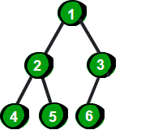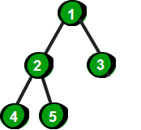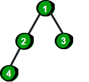

其实完全二叉树类似下面这个形状。

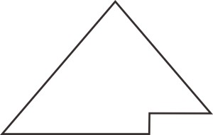

说到这里我们马上就要领略到完全二叉树的魅力了。先想一想一棵完全二叉树如何存储呢？其实完全二叉树中父亲和儿子之间有着神奇的规律，我们只需用一个一维数组就可以存储完全二叉树。首先将完全二叉树进行从上到下，从左到右编号。

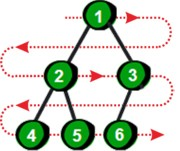

通过上图我们发现如果完全二叉树的一个父结点编号为 k，那么它左儿子的编号就是 2*k，右儿子的编号就是 2*k+1。如果已知儿子（左儿子或右儿子）的编号是 x，那么它父结点的编号就是 x/2，注意这里只取商的整数部分。在 C 语言中如果除号‘/’两边都是整数的话，那么商也只有整数部分（即自动向下取整），即 4/2 和 5/2 都是 2。另外如果一棵完全二叉树有 N 个结点，那么这个完全二叉树的高度为 log2 N 简写为 log N，即最多有 log N 层结点。完全二叉树的最典型应用就是——堆。那么堆又有什么作用呢？请关注下周更新：堆——神奇的优先队列。