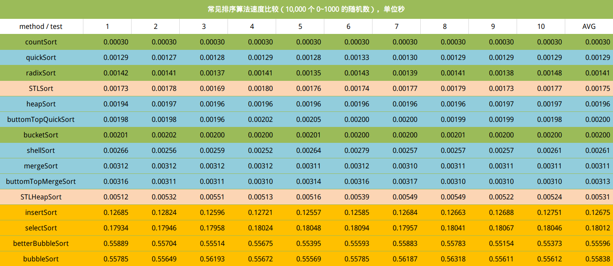

# 排序算法性能一览表

## 算法特性比较

| 算法名称   | 稳定性 | 平均时间 | 最坏时间 | 额外空间 | 描述              |
| --------- | ------ | -------- | -------- | -------- | ----------------- |
| bubble    | **是** | $O(n^2)$ | $O(n^2)$ | $O(1)$   | [无序-交换->有序] |
| selection | **否** | $O(n^2)$ | $O(n^2)$ | $O(1)$   | [有序<-选择-无序] |
| insertion | **是** | $O(n^2)$ | $O(n^2)$ | $O(1)$ | [有序<-插入-无序] |
| shell     | **否** | $O(n \log  n)$ | $O(n \log  ^2n)$ | $O(1)$      | 按间隔进行插入排序   |
| heap      | **否** | $O(n \log n)$    | $O(n \log n)$ | $O(1)$      | （最大堆，有序区）   |
| merge     | **是** | $O(n \log n)$    | $O(n\log n)$  | $O( n)$    | 分段，比较，插入     |
| quick     | **否** | $O(n \log n)$    | $O(n^2)$      | $O(\log n)$ | [小，基准元素，大]   |
| counting  | **是** | $O(n+m)$         | $O(n+m)$      | $O(m)$    | 统计，按索引放置     |
| bucket    | **是** | $O(n+k)$         | $O(n ^2)$ | $O(n + k)$  | 将值为i的元素放入i桶 |
| radix     | **是** | $O(n\times k)$ | $O(n \times k)$ | $O(n + k)$ | 逐位进行桶排序 |

> n 代表数据规模， m 代表数据的最大值 - 最小值，k 代表桶的数量

总结：

- 不稳定排序：选择，希尔，堆，快排

## 试验验证

## 算法度量

**时间上**：理想性能为 $O(n)$ ，好的性能是 $O(n\log n)$ ，坏的性能是 $O(n^2)$ 

**空间上**：讨论算法运行所需的额外空间

**稳定性上**：不改变相等记录的顺序（对于数字来说不存在稳定性问题，稳定性要求多出现在复合元素或者对象上）