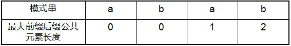

# KMP 算法总结

## 问题介绍

对于给定的目标字符串 s 和模式串 p，如果 s 中存在与 p 相同的子串，返回 p 在 s 中首次出现的位置。

- 设目标串长度为 n，模式串长度为 m

## 暴力匹配算法 $O(nm )$

### 算法思路：扫描 s 中长度为 p 的每一个子串

- 对于 s 中以 s[i] 开头的子串，匹配子串和模式串 p
  - 如果当前检查的字符相同，则两个子串同步后移
  - **如果不同，则模式串复位，目标串从下一位开始扫描**
- 如果模式串遍历完毕，说明找到了这样的一个子串，且是首次找到
  - 如果没有匹配完毕，但是目标串扫描完了，说明不存在这样的子串

### 过程分析
初始状态：
```
i = 0, j = 0
Ｓ：ＢＢＣ　ＡＢＣＤＡＢ　ＡＢＣＤＡＢＣＤＡＢＤＥ
 Ｐ：ＡＢＣＤＡＢＤ
```
扫描：

```
i = 1, j = 0
ＢＢＣ　ＡＢＣＤＡＢ　ＡＢＣＤＡＢＣＤＡＢＤＥ
　ＡＢＣＤＡＢＤ
　
i = ４, j = 0
ＢＢＣ　ＡＢＣＤＡＢ　ＡＢＣＤＡＢＣＤＡＢＤＥ
　　　　ＡＢＣＤＡＢＤ
　　　　
i = 10, j = 6
ＢＢＣ　ＡＢＣＤＡＢ　ＡＢＣＤＡＢＣＤＡＢＤＥ
　　　　ＡＢＣＤＡＢＤ

i = 5, j = 0
ＢＢＣ　ＡＢＣＤＡＢ　ＡＢＣＤＡＢＣＤＡＢＤＥ
　　　　　ＡＢＣＤＡＢＤ
```

### 实现

```c++
int violentSearch(const string &s, const string &p) {
    int slen = s.length(); // 原串长度
    int plen = p.length(); // 模式串长度

    // 边界条件：s 为空，p 为空或者 p 比 s 长
    if (slen < 1 || plen < 1 || plen > slen) return -1;

    // i 用于扫描 s，j 用于扫描 p
    int i = 0, j = 0;

    // 任意一串遍历完即停止
    while (i < slen && j < plen) {
        if (s[i] == p[j]) { // 当前串匹配，则同步向前一步
            i++;
            j++;
        } else { // 失配,p 串右移一位，回溯 i
            i = i - j + 1; // 调整原串起点为下一个，i-j 代表当前扫描的原点
            j = 0; // 模式串回到原点
        }
    }

    return j == plen ? i - j : -1;
}
```

### 复杂度分析

- 时间：最坏情况下，对于序列中的每一个子串都要进行一次扫描，每次扫描都要匹配整个模式串， O(nm)
- 空间：inplace

###  总结

对于扫描过的序列，假设当前在模式串的 j 位置发生了失配，我们可以从 s 和 p 中得到以下信息：

- p[0, j-1] 与 s[j-i, i-1] 是匹配的
- 将 p[0,j-1] 分为三个部分 [前缀，中间， 后缀]，若 前缀 = 后缀，则：
  - 目标串可以从当前位置开始比较
  - 模式串不需要回初始位置，只需要回到前缀串的下一个位置即可

由此引出 KMP 算法

## KMP 算法 $O(n + m)$

### 算法思路

- 对模式串进行预处理，分析出对于模式串中的能够匹配到的每一个子串：
  - 当前子串的最后一个位置失配时，我们最多可以跳过多少前缀
- 每次对失配情况的更新只需要更新到最大前缀的下一个位置即可

核心过程：

```
// 假设 P 串已经匹配到了 E 位置，此处发生了失配
　　　　　　　　　　　ｉ
Ｓ：ＡＢＣＤＫＡＢＣＤＦ
Ｐ：ＡＢＣＤＫＡＢＣＤＥ
　　－－－－　－－－－ｊ
　　
// 在暴力匹配中，下一次需要从 P 串的头部开始
　　　ｉ
Ｓ：ＡＢＣＤＫＡＢＣＤＦ
Ｐ：　ＡＢＣＤＫＡＢＣＤＥ
　　　ｊ

// 在 KMP 中，F 之前长度为 4 的后缀和 P 的长度为 4 的前缀相同，因此只需要将 P 右移 len - 4 个单位即可
// 对于重复的前缀就不再比较了
　　　　　　　　　　　ｉ
Ｓ：ＡＢＣＤＫＡＢＣＤＦ
Ｐ：　　　　　ＡＢＣＤＫＡＢＣＤＥ
　　　　　　　                 ｊ
```

### 过程分析

假设我们已经得到了预处理数组 next，对于当前失配的每个模式串中的位置 j，next 数组给出我们可以跳过的最大前缀长度

- next[j] = k 表示原串中 j 之前的子串中有最大长度为 k 的前缀后缀，下次匹配跳转到模式串的 next[j] 位置即可（也就是模式串右移 j - next[j]） 
- 若 next[j] = 0,-1 表示此时应该跳转到模式串的开头进行匹配

因此，基于 next 的步骤和暴力匹配是相似的：

- 对于 s 中以 s[i] 开头的子串，匹配子串和模式串 p
  - 如果当前检查的字符相同，则两个子串同步后移
  - **如果不同，则模式串从 next[j] 开始匹配**
- 如果模式串遍历完毕，说明找到了这样的一个子串，且是首次找到
  - 如果没有匹配完毕，但是目标串扫描完了，说明不存在这样的子串

### 实现

```c++
int kmpSearch(const string &s, const string &p) {
    int slen = s.length(); // 原串长度
    int plen = p.length(); // 模式串长度

    vector<int> next(plen, 0);

    getNext(next, p);

    // 边界条件：s 为空，p 为空或者 p 比 s 长
    if (slen < 1 || plen < 1 || plen > slen) return -1;

    // i 用于扫描 s，j 用于扫描 p
    int i = 0, j = 0;

    // 任意一串遍历完即停止
    while (i < slen && j < plen) {
        if (j == -1 || s[i] == p[j]) { // 当前串匹配，则同步向前一步
            i++;
            j++;
        } else { // 失配,p 串右移 j-next[j] 位，不再回溯 i
            j = next[j];
        }
    }

    return j == plen ? i - j : -1;
}
```

### 预处理：前缀后缀数组

寻找模式串 P 中**长度最大且相等的前缀和后缀**。如果存在 p0 p1 ...pk-1 pk = pj- k pj-k+1...pj-1 pj，那么在**包含 pj** 的模式串中有最大长度为 k+1 的相同前缀后缀。举个例子，如果给定的模式串为“abab”，那么它的各个子串的前缀后缀的公共元素的最大长度如下表格所示：



比如对于字符串 aba 来说，它有长度为 1 的相同前缀后缀 a；而对于字符串 abab 来说，它有长度为 2 的相同前缀后缀ab（相同前缀后缀的长度为 k + 1，k + 1 = 2）。

### 预处理：next 数组

next 数组考虑的是**除当前字符外**的最长相同前缀后缀，所以通过第 ① 步骤求得各个前缀后缀的公共元素的最大长度后，只要稍作变形即可：将第 ① 步骤中求得的值整体右移一位，然后初值赋为 -1，如下表格所示：


比如对于 aba 来说，第 3 个字符 a 之前的字符串 ab 中有长度为 0 的相同前缀后缀，所以第 3 个字符 a 对应的 next 值为 0；而对于 abab 来说，第 4 个字符 b 之前的字符串 aba 中有长度为 1 的相同前缀后缀 a，所以第 4 个字符 b 对应的 next 值为 1（相同前缀后缀的长度为 k，k = 1）。

使用递推方法求模式串的 next 数组：

1. 对于当前位置 j，有 next[j] = k，表示长度为 j 的子串有最大长度为 k 的前缀与后缀相同
   1. 若 p[k] == p[j]，则 next[j+1] = next[j] + 1 = k + 1
   2. 若 p[k ] ≠ p[j]，只能从前缀子串的子集中寻找最大的前缀后缀子串，由于 next[k] 是以 k 为尾的子串的最大前缀，且不存在比 next[k] 更大的前缀子串，故递归地查询 next[k] 即可，直到 p[next[…[next[k]]]] == p[j]
   3. 边界条件：对于第一个元素，如果设定其 next[0] = 0，这会产生循环访问，故设定其值为 -1

```c++
void getNext(vector<int> &next, const string &p) {
    int plen = p.length();
    int k = -1, j = 0;

    next[0] = -1;
    while (j < plen - 1) {
        if (k == -1 || p[j] == p[k]) {
            k++;
            j++;
            next[j] = k;
        } else {
            k = next[k];
        }
    }
}
```


### 对 next 数组的优化

### 总结

KMP 算法的算法步骤：

1. 预处理模式串 P，求其最大前缀后缀数组
2. 利用最大前缀后缀数组求 P 的 next 数组
3. 根据 next 数组扫描目标串进行匹配

## 拓展 1：BM 算法 $O( n)$

## 拓展 2：Sunday 算法 $O( n )$

