# 十大排序算法

## 0. 排序算法指标

- 时间复杂度
- 空间复杂度：是否为原地排序
- 稳定性

分析基础：排序类

```c++
class SortAlgo {
public:
    SortAlgo() {
        srand(time(NULL));

        for (int i = 0; i < 20; ++i) {
            nums.push_back(rand() % 100);
        }
        n = nums.size();
    }
}
```

## 1. 冒泡排序

### 总结

依次将未排序序列中的最大元素交换至最右侧（有序部分）

### 实现

- 从数组最左侧开始，依次扫描交换逆序对
- 每轮扫描将一个较大值排列就绪，扫描 n 轮结束

```c++
    void bubbleSort() {
        // 扫描 n-1 轮， 一个元素天然有序， 每轮扫描使当前无序区最大元素就位
        for (int i = 0; i < n - 1; ++i) { // 排序趟数，只需要 n-1 趟
            for (int j = 0; j < n - 1 - i; ++j) { // 每趟的比较次数，i 趟 n-i 次
                // 发现逆序对则交换，最大元素与所有剩余元素都构成逆序对
                if (nums[j] > nums[j + 1])
                    swap(nums[j], nums[j + 1]);
            }
        }
    }
```

### 优化：快速启动，提前终止

- 快速启动：对每轮最后一次交换的位置进行记录（无序与有序的边界），下轮扫描时可从该位置开始
- 提前终止：对每轮是否交换过这一状态进行记录，如果该轮没有发生过交换，则说明所有元素已就位，可提前终止

```c++
    void betterBubbleSort() {
        int board = n - 1; // j 只能取到 n-2
        for (int i = 0; i < n - 1; ++i) { // 排序趟数，只需要 n-1 趟
            bool earlyStop = true; // 1. 每趟检查是否执行过交换，没有则表示序列有序，提前终止
            int lastSwapIndex = n; // 2. 每趟记录发生交换的最后位置，只对无序区进行交换
            for (int j = 0; j < board; ++j) { // 每趟的比较次数，i 趟 n-i 次
                if (nums[j] > nums[j + 1]) {
                    swap(nums[j], nums[j + 1]);
                    earlyStop = false;
                    lastSwapIndex = j;
                }
            }
            board = lastSwapIndex;
            if (earlyStop == true) return;
        }
    }
```

### 性质

- 时间复杂度：$O(n^2)$ 
  - 最坏情况：原序列逆序
- 空间复杂度：$O(1)$
  - 原地排序：交换时临时变量的开销
- 稳定排序：相同元素不会发生交换

## 2. 选择排序

### 总结

选择未排序部分中最小的元素插入已排序部分的尾部

### 实现

- 一般实现：我们可以申请一个新的空间存放已排序部分，并用一个标记变量标记原序列中已被排序的元素
- 原地实现：选择序列中最小元素与序列头交换，然后更新区间即可（过程如下图所示）

### 优化：改进为 inplace 方法（比较-交换-更新区间）

- 找到右侧未排序序列中最小的元素（从本轮需要更新位置的下一个元素开始）
- 将该元素与未排序序列最左侧元素交换
- 此时排序序列长度增加，未排序序列长度减小


```c++
    void selectSort() {
        /* in-place method */
        // 这里从 0 开始，表示开始时全都为未排序序列
        // [0, i] 代表有序区间，[i, n) 表示无序区间
        // 更新：每轮使得有序区间长度增长 1，也就是使得一个较小元素就位
        for (int i = 0; i < n; ++i) {
            // 比较：找到右侧未排序区间中最小元素的位置
            int minIndex = i;
            for (int j = i + 1; j < n; ++j) {
                if (nums[minIndex] > nums[j])
                    minIndex = j;
            }
            // 交换：将最小元素和未排序区间头元素交换，并更新区间
            swap(nums[i], nums[minIndex]);
        }
    }
```

### 性质

- 时间复杂度：O(n^2) 

  - 最坏情况：原序列逆序

- 空间复杂度：O(1) 

  - 原地排序：只需要记录当前区间最小元素的位置以及交换时临时变量的开销

- 非稳定排序 ：交换过程可能改变其他元素的相对顺序

  > (7) 2 5 9 3 4 [7] 1...当我们利用直接选择排序算法进行排序时候,(7)和1调换,(7)就跑到了[7]的后面了

## 3. 插入排序

### 总结：理牌

将未排序序列的元素依次插入已排序序列中适当的位置

### 实现

对于数组结构，新元素的插入伴随着下面的两个过程：

- 腾出新位置
- 插入元素（使用链表结构更方便插入，没有了腾挪的过程）

### 优化：改进为 inplace 方法，使用依次交换来避免局部腾挪

- 选择未排序部分的第一个元素
- 插入：
  - 交换法：将该元素依次与已排序部分元素从后向前比较**，**逆序则交换（由于有判断逆序的过程，因此不会改变相等元素的相对位置，是稳定排序）
  - 腾挪法：借助有序序列的有序性，将待插入元素缓存，放出其占用的位置，然后将有序区中**比其大**的元素依次后移（不会处理相等的情况，因此也是稳定的），在最后空出的位置上插入缓存的元素（下图采用的是腾挪法）
- 就位后更新两个序列的区间


```c++
    void insertSort() {
        /* in-place method */
        // 这里从 1 开始，表示开始时认为左侧一个元素为有序的
        // 依次选择未排序部分头元素插入
        for (int i = 1; i < n; ++i) {
            int tmp = nums[i]; // 无序区间的头元素，腾挪时会覆盖，因此需要缓存一下
            int j; // 有序区间的右边界位置
            // 这里使用了尾部移动法，也可以使用依次交换策略
            for (j = i - 1; j >= 0 && nums[j] > tmp; --j) {
                nums[j + 1] = nums[j];
            }
            // 退出循环时进行了 --j，因此需要 j+1
            nums[j + 1] = tmp;
        }
    }
```

### 性质

- 时间复杂度：O(n^2) 
  - 最坏情况：原序列顺序
- 空间复杂度：O(1)
  - 原地排序
- 稳定排序：插入过程不会交换顺序

## 4. 希尔排序

无论是插入排序还是冒泡排序，如果数组的最大值刚好是在第一位，要将它挪到正确的位置就需要 n - 1 次移动。也就是说，**原数组的一个元素如果距离它正确的位置很远的话，则需要与相邻元素交换很多次才能到达正确的位置**

因此，**排序的最好方法就是直接将元素放入正确的位置 –> 线性复杂度**

所以基于交换的方案存在中间过程，会慢一些。希尔排序就是为了加快速度简单地改进了**插入排序**，交换不相邻的元素以对数组的局部进行排序

### 总结：逐步改进序列的部分有序性

在任意间隔 h 构造的子数组上进行插入排序，并不断缩小 h 以在更小的粒度上排序

### 实现

- 将数组按 h 设定的访问间隔分为 h 组
- 每组内进行排序，使得原序列元素每 h 间隔有序
- 缩小间隔 h，重复上述过程，每次缩小都改进了序列的有序性

> 注意：
>
> 1. 代码上，只需要在外层增加一个控制间隔序列的循环就行
>
> 2. 对各个分组进行插入的时候并不是先对一个组排序完了再来对另一个组排序，而是**轮流对每个组进行排序**

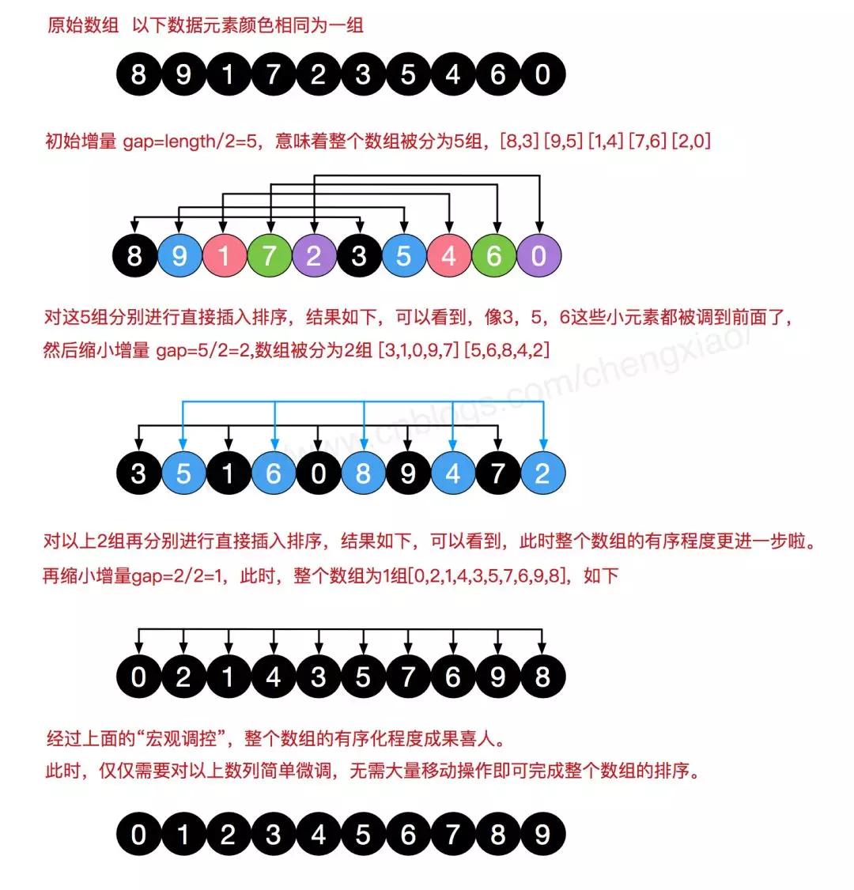

```c++
    void shellSort() {
        /* a faster insert sort */
        // 选择一个 shell 序列作为外循环，间隔从大到 1
        for (int h = n / 2; h > 0; h /= 2) {
            // 对各个局部分组进行插入排序，这里是轮流排序
            for (int i = h; i < n; ++i) {
                // 将 nums[i] 插入到所在分组的正确位置
                // 在插入排序中为排序区从第二个元素开始，也就是 h 位置
                shellInsertSort(i, h); // 这里 h 代表间隔
            }
        }
    }


```

### 优化：选择适当的 h 序列

- Hibbard 序列：{1,3,7，...,2^k-1} O(n^1.5)
- Sedgewick 序列：{1,5,19,41,109,...} O（n^1.3）

### 性质

- 时间复杂度：O(nlogn) ～O(n^2) 
  - 使用 2 进制序列
- 空间复杂度：O(1)
  - 原地排序
- 非稳定排序：希尔排序在插入的时候是**跳跃性插入的（不再依次比较）**，有可能破坏稳定性

## 5. 归并排序

### 总结

基于分治思想不断将原序列分解为子序列，再将有序子序列合并为有序序列的过程

### 实现：分治 + 归并 Merge

- 将原序列递归地分为多个较小的子序列，直到得到有序序列（一个元素的序列天然有序）
- 将多个有序的子序列归并为有序序列，归并过程在新数组排序，然后复制回原数组


### 优化

- 多路归并：同时对多于两个的子序列进行归并

**递归实现**

```c++
    void mergesort(int l, int r) {
        /* 这里用双闭区间实现更清晰 */
        if (l + 1 >= r) return; // 在该区间中，l+1＝＝r 代表还剩一个元素
        // 使用左闭右开区间，使用双闭区间也不错
        int mid = l + (r - l) / 2; // 分割
        mergesort(l, mid);  // 左半边序列排序
        mergesort(mid, r); // 右半边序列排序
        merge(l, mid, r); // 合并
    }

    // merge sort
    void merge(int l, int mid, int r) {
        // 辅助容器用于缓存合并的结果，注意容器大小
        vector<int> helper(r - l);
        // 序列 1 的头为 l，序列 2 的头为 mid，合并序列的头为 0
        int i = l, j = mid, k = 0;

        // 合并
        // 下面的三个循环可以用一个 while 循环实现
        while (i < mid && j < r) {
            if (nums[i] < nums[j])
                helper[k++] = nums[i++];
            else
                helper[k++] = nums[j++];
        }

        // 将剩余序列存入辅助容器
        while (i < mid) helper[k++] = nums[i++];
        while (j < r) helper[k++] = nums[j++];

        // 将合并结果复制回到原序列
        // 将修改结果返回原数组，原数组中的修改范围是连续的
        for (int i = 0; i < k; ++i) {
            nums[l++] = helper[i];
        }
    }
```

**迭代实现：原地归并**

- 考虑到 merge 的功能是将一段连续空间内两段各自有序的数组进行排序，如果不考虑时间复杂度，使用前文提到了排序算法就能够实现原地排序
- 考虑时间复杂度，我们希望在不影响归并排序效率的同时实现排序，因此：
  - 对于两段序列 [l,…,mid], [mid+1,…,r]，二者各自递增
  - 找出二者中各自不超过对方左侧元素的位置，**交换**两个子序列即可

 关键在于merge这个函数。两段递增的子数组arr[begin…mid-1]和arr[mid…end]，i=begin,j=mid,k=end

[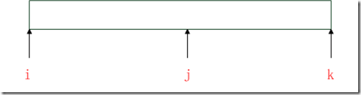](http://images.cnblogs.com/cnblogs_com/daniagger/201207/201207251522232456.png) 

i往后移动，找到第一个arr[i]>arr[j]的索引

[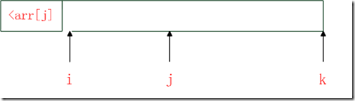](http://images.cnblogs.com/cnblogs_com/daniagger/201207/201207251522232390.png)

j往后移动，再找第一个arr[j]>arr[i]的索引

[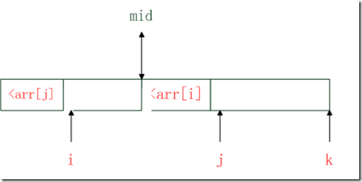](http://images.cnblogs.com/cnblogs_com/daniagger/201207/20120725152224372.png)

然后我们将i到mid的部分和mid到j-1的部分对调，较小的部分就调到前面去了，然后从后面的部分与j到k的部分又是两个递增的子数组，继续迭代即可

迭代实现：这里的边界情况如何理解

比如，一开始数组为[8 7 6 5 4 3 2 1]。 
第一遍，步长为1，将相邻的两个区间合并（注意加粗黑体）： 
**7 8** 6 5 4 3 2 1 
7 8 **5 6** 4 3 2 1 
7 8 5 6 **3 4** 2 1 
7 8 5 6 3 4 **1 2**

第二遍，步长为2，将相邻的两个区间合并（注意加粗黑体）： 
**5 6 7 8** 3 4 1 2 
5 6 7 8 **1 2 3 4**

第三遍，步长为4，将相邻的两个区间合并（注意加粗黑体）： 
**1 2 3 4 5 6 7 8**

下面这张图揭示了边界条件：

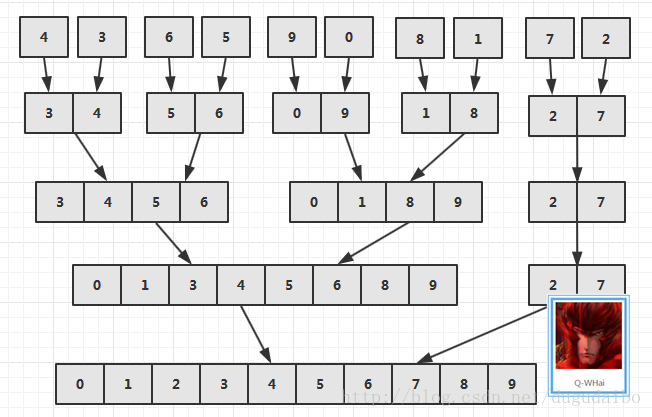

```c++
    void buttomTopMergeSort() {
        /* 枚举步长，将相邻区间合并 */
        for (int step = 1; step < n; step = step << 1) { // step = 1 2 4 8 16
            int offset = step + step;
            for (int index = 0; index < n; index += offset) { // offset = 2 4 8 16
                int l = index;
                int mid = min(l + step, n);
                int r = min(l + offset, n);
                merge(l, mid, r);
            }
        }
    }
```

### 性质

- 时间复杂度：O(nlogn)
  - 切割次数 logn
  - 归并用时 n
- 空间复杂度：O(n) 
  - 普通归并排序的归并过程需要使用辅助空间
- 稳定排序

## ６. 快速排序

快速排序的快表现在其均摊复杂度的**常数因子很小（小于归并）**

### 总结：分治 + 分割 Partition

- 构造枢轴（pivot）元素
  - 左侧元素小于该枢轴元素
  - 右侧元素大于该枢轴元素
- 从枢轴元素处切分序列，子序列都不包含该枢轴元素
  - 对子序列重复上述过程
- 一个元素的序列天然有序

### 实现

- 选择序列的第一个元素，称为**主元**（也可任意选取，主元的不同取法决定了算法的时间稳定性）
  - 将**大于等于**主元的元素放到其右边，**小于等于**的放到其左边（实现中找到这样的两个元素后**交换**即可，由于这里使用了等于进比较，因此快排是不稳定的）
  - 此时主元已就位
- 主元将序列分割为两个子序列，不断在子序列中获取主元即可
- 大小为 1 或 0 的子序列天然有序


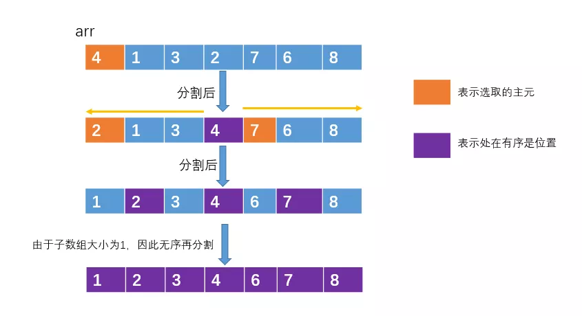

下面是一种分割操作的思路：

**单向调整法**

一禅：就按照你说的，选一个主元，你刚才选的是第一个元素为主元，这次我选最后一个为主元吧，哈哈。假设数组arr的范围为[left, right]，即起始下标为left，末尾下标为right。源数组如下


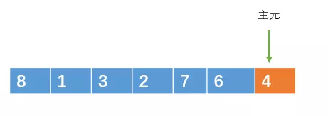


然后可以用一个下标 i 指向 left，即 i = left ;用一个下标 j 也指向l eft，即j = left 


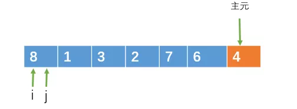


接下来 j 从左向右遍历，遍历的范围为 [left, right-1] ，遍历的过程中，如果遇到比主元小的元素，则把该元素与 i 指向的元素交换，并且 i = i +1


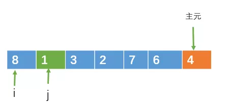


当j指向1时，1比4小，此时把i和j指向的元素交换，之后 i++。


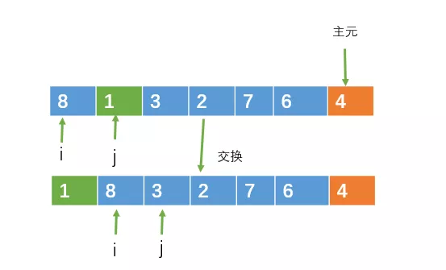


就这样让j一直向右遍历，直到 j = right


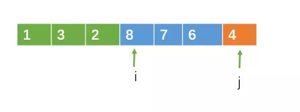


遍历完成之后，把 i 指向的元素与主元进行交换，交换之后，i 左边的元素一定小于主元，而 i 右边的元素一定大于或等于主元。这样，就 i 完成了一次分割了

**双向调整法**

- 改进单向调整引入多次交换的问题

其实，我们可以这样来调整元素。我还是用我的第一个元素充当主元吧。哈哈

源数组如下


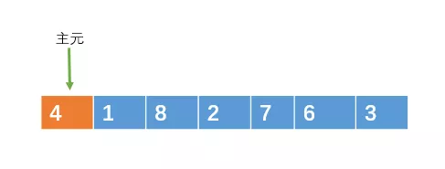


然后用令变量i = left + 1，j = right。然后让 i 和 j 从数组的两边向中间扫描。


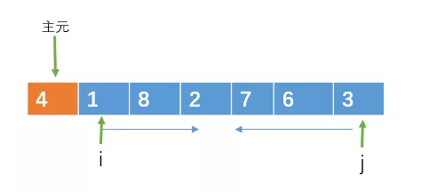


i 向右遍历的过程中，如果遇到大于或等于主元的元素时，则停止移动，j向左遍历的过程中，如果遇到小于或等于主元的元素则停止移动。


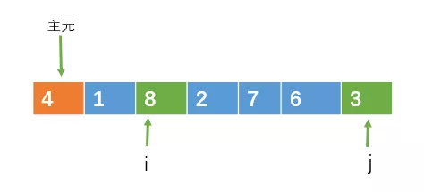


当i和j都停止移动时，如果这时i < j，则交换 i, j 所指向的元素。此时 i < j，交换8和3


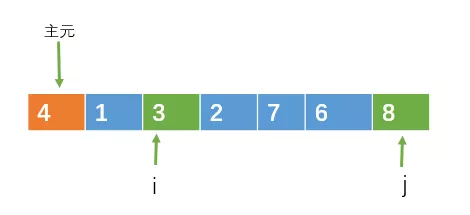


然后继续向中间遍历，直到i >= j。


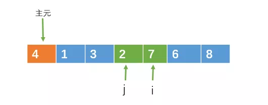


此时i >= j，分割结束。


最后在把主元与 j 指向的元素交换(当然，与i指向的交换也行)。


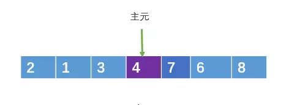


这个时候，j 左边的元素一定小于或等于主元，而右边则大于或等于主元。

到此，分割调整完毕

### 优化

- 快排实现上的优化分为两个方面：
  - 主元的选择：顺序选择，随机选择，三者取中
  - 调整的方法：同向指针，对撞指针

递归实现：

```c++
    void quickSort() {
        // 这是双闭区间
        quicksort(0, n - 1);
    }  

 void quicksort(int l, int r) {
        if (l >= r) return;

        int mid = partition(l, r);
//        int mid = midThree_partition(l, r);
//        int mid = random_partition(l, r);
        quicksort(l, mid - 1);
        quicksort(mid + 1, r);
    }

    //quick sort
    int partition(int l, int r) {
        /* 返回就位后枢轴变量的下标 */
        int pivot = nums[l];
        // 取区间头元素为枢轴变量
        int i = l + 1, j = r;
        while (true) {
            while (i <= j && nums[i] <= pivot) i++;
            while (i <= j && nums[j] >= pivot) j--;

            if (i > j) break;

            swap(nums[i], nums[j]);
        }
        // 退出循环时 j-- 了，因此最终 j 的位置为左侧最右端的位置
        swap(nums[l], nums[j]);

        return j;
    }
```

```c++
   // 随机选取主元
    int random_partition(int l, int r) {
        int randIndex = l + rand() % (r - l + 1);
        swap(nums[l], nums[randIndex]);
        return partition(l, r);
    }
	// 三数取中法
    int midThree_partition(int l, int r) {
        int mid = l + (r - l) / 2;
        int midIndex = l;
        // 下面三次比较相当于冒泡排序
        if (nums[l] > nums[mid]) swap(nums[l], nums[mid]);
        if (nums[mid] > nums[r]) swap(nums[mid], nums[r]);
        if (nums[l] > nums[mid]) swap(nums[l], nums[mid]);

        // 将中值和最小值交换
        swap(nums[l], nums[mid]);

        return partition(l, r);
    }
```

迭代实现：

```c++
void buttomTopQuickSort() {
        stack<int> st;
        int l = 0, r = n - 1;
        int mid = partition(l, r);
        // 用栈保存每一个待排序子串的首尾元素下标
        // 下一次while循环时取出这个范围，对这段子序列进行 partition 操作

        st.push(l);
        st.push(mid - 1);
        st.push(mid + 1);
        st.push(r);

        while (!st.empty()) {
            // 注意出栈顺序
            r = st.top();
            st.pop();
            l = st.top();
            st.pop();

            mid = partition(l, r);
            if (l < mid - 1) {
                st.push(l);
                st.push(mid - 1);
            }
            if (mid + 1 < r) {
                st.push(mid + 1);
                st.push(r);
            }
        }
    }
```


### 性质

- 时间复杂度：平均 O(nlogn) ，最坏 O(n^2)
  - 最好情况：每次从中间分割
  - 最坏情况：每次从最左侧分割 —— 序列正序，倒序，全等
  - 解决方法：随机启动，洗牌，三者取中
- 空间复杂度：O(logn)
  - 来源于递归调用空间
- 非稳定排序

### 快速排序和归并排序

共同点：

- 基于分治思想：
  - 将序列分为非空的两个子序列
  - 对子序列递归地使用排序过程

不同点：

- 快排要求第一个序列不大于第二个序列，归并不作要求
- **在分治解决子问题后，快排是原地有序的**，归并需要合并两个有序子序列

## 7. 堆排序

### 总结：堆序性 + 不断提取堆顶元素

- 堆的特点就是堆顶的元素是一个**最值**，大顶堆的堆顶是最大值，小顶堆则是最小值

### 实现

- **建堆**：将序列中元素构建为一个大顶堆
- **交换**：将堆顶的元素与序列最后一个元素交换，堆顶元素就位
- **迭代调整**：交换之后破坏了堆的特性，再把堆中剩余的元素调整为一个大顶堆，然后再把堆顶元素与倒数第二个元素交换
- 只剩一个元素时天然有序


### 优化

- 

```c++
    void heapSort() {
        // build heap：只需要保证前一半的元素满足堆序性即可
        for (int i = (n - 2) / 2; i >= 0; --i) {
            downAdjust(i, n - 1);
        }
        // sort：将堆顶元素依次交换到堆底
        for (int i = n - 1; i >= 1; --i) {
            swap(nums[0], nums[i]);
            downAdjust(0, i - 1);
        }
    }

    // heap sort
    void downAdjust(int p, int n) {
        int tmp = nums[p];
        // 对于堆来说，如果从 1 开始计算，则 left-child = 2 * p
        // 如果从 0 开始计算，则 left-child = 2 * p + 1，相当于所有结果都 +1
        int child = 2 * p + 1;
        while (child <= n) {
            // 如果右孩子更大，则使用右孩子下沉
            if (child + 1 <= n && nums[child] < nums[child + 1])
                child++;
            // 满足堆序性则停止
            if (nums[child] <= tmp) break;
            // 父节点下沉，使用子节点的值覆盖父节点的值
            nums[p] = nums[child];
            p = child;
            child = 2 * p + 1;
        }

        nums[p] = tmp;
    }
```

#### 补充：二叉堆

二叉堆的性质：
- 具有完全二叉树的特性。
- 堆中的任何一个父节点的值都大于等于它左右孩子节点的值，或者都小于等于它左右孩子节点的值。

根据第二条特性，我们又可以把二叉堆分成两类：

- 最大堆：父节点的值大于等于左右孩子节点的值
- 最小堆：父节点的值小于等于左右孩子节点的值

二叉堆的根节点称之为**堆顶**。根据二叉堆的特性，堆顶要么是整个堆中的**最大元素**，要么是**最小元素**

实现二叉堆，就是实现其三个操作：

- 插入
  - 底部插入
  - 交换**上浮**
- 删除 root
  - 删除 root 后用最后一个元素替换 root
  - 临时元素交换**下沉**
- 建堆
  - **将所有非叶子节点依次下沉**

实现：

- 使用数组实现，利用其完全的特性通过下标进行访问

```c++
vector<int> upAdjust(cector<int> nums, int length) {
    // 新插入的节点加入到序列尾部
    int child = length - 1;
    // 找到该节点的父亲
    int parent = (child - 1) / 2;
    // 缓存该节点
    int tmp = nums[child];

    // child 值小于 parent 则上浮交换
    while(child > 0 && tmp < nums[parent]) {
        nums[child] = nums[parent];
        child = parent;
        parent = (child - 1) / 2;
    }
    // 循环结束，表示 child 找到了正确的位置
    nums[child] = tmp;

    return num;
}

vector<int> downAdjust(cector<int> nums, int parent, int length) {
    // 缓存需要下沉的元素
    int tmp = nums[parent];
    // 找到左孩子
    int child = 2 * parent + 1;
    // 开始下沉
    while(child < length) {
        // 如果右孩子节点比左孩子小，则定位到右孩子
        // 也就是选择最小的那个孩子进行交换
        if(child + 1 < length && nums[child] > nums[child + 1])
            child++;
        // 如果父节点比孩子节点小或等于，则下沉结束
        if(tmp <= nums[child]) break;
        // 单向赋值
        nums[parent] = nums[child];
        parent = child;
        child = 2 * parent + 1;
    }
    // 循环结束，表示 parent 找到了正确的位置
    nums[parent] = tmp;

    return nums;
}

vector<int> buildHead(vector<int> nums, int length) {
    // 从最后一个非叶子节点开始下沉
    for(int i = (length - 2) / 2; i >= 0; i--) {
        nums = downAdjust(nums, i, length)
    }

    return nums;
}
```


### 性质

- 时间复杂度：O(nlogn)
- 空间复杂度：O(1)
- 非稳定排序：
  - 交换是跳跃进行的

## 8. 计数排序

### 总结：利用统计数组统计元素频率

- **元素为整数**
- **适合于最大值和最小值的差值不是不是很大的序列**
- 适合于还有较多重复元素的序列

### 实现

- 使用数组下表代表序列元素的值，使用数组相应位置上的值表示序列元素的频率
- 扫描完成后重构序列即可


### 优化

- 空间优化：max - min 优化
  - 上面的代码中，我们是根据 max 的大小来创建对应大小的数组，假如原数组只有10个元素，并且最小值为 min = 10000，最大值为 max = 10005，那我们创建 10005 + 1 大小的数组不是很吃亏，最大值与最小值的差值为 5，所以我们创建大小为6的临时数组就可以了。
  - 也就是说，我们创建的临时数组大小 (max - min + 1)就可以了，然后在把 min作为偏移量

```c++
    void countSort() {
        // 这里使用了区间压缩的优化方法
        vector<int>::iterator max_it = max_element(nums.begin(), nums.end());
        vector<int>::iterator min_it = min_element(nums.begin(), nums.end());
        int maxNum = *max_it;
        int minNum = *min_it;

        // 1. 初始化统计数组
        int n = maxNum - minNum + 1; // 区间长度
        vector<int> count(n, 0);

        // 2. 扫描并统计
        for (auto num : nums)
            count[num - minNum]++;

        // 3. 重构序列
        int k = 0;
        for (int i = 0; i < n; ++i) {
            for (int j = count[i]; j > 0; --j) {
                nums[k++] = i + minNum;
            }
        }
    }
```

### 性质

- 时间复杂度：O(n+k) 
  - k 为统计数组大小
- 空间复杂度：O(k)
  - 只需要考虑统计数组即可
- 稳定排序：数字类排序都是稳定的

## 9. 桶排序

### 总结：利用桶划分区间，桶内排序，桶间有序

一般用于计数排序搞不定的场合

- 范围过大
- 非整数

- 核心：右边桶内的元素一定不小于左边桶的元素

### 实现

- 利用最大值和最小值设定若干区间
  - **区间跨度（大小）** = （最大值-最小值）/ （**桶的数量** - 1）
  - 除了最后一个桶之外，其余的桶均分最大值和最小值的差值，区间跨度（大小）也就是桶的范围的大小
- **桶的实现使用了链表**
- 将元素按其所在区间分入若干桶内
  - 定位元素属于第几个桶，是按照比例来定位：要定位元素 array[i] 在第几个桶，先减去最小值min,看它在桶数组（ArrayList）中的偏移为多少，然后除以桶的区间大小d/(buketNum-1),相当于乘以(buketNum-1)/d，除以桶区间大小就可以定位是在哪个桶里了
- 对桶内元素排序
  - 快排
  - 归并
- 合并不同的桶（桶间自然有序）

### 优化

- 

```c++
void bucketSort() {
        // 这里和计数排序一样，使用了区间优化
        int maxNum = *max_element(nums.begin(), nums.end());
        int minNum = *min_element(nums.begin(), nums.end());
        // 使用区间长度来划分桶
        int n = maxNum - minNum + 1;
        int bucketNum = n / 5 + 1; // 每 5 个步长构建一个桶，第 i 桶存放  5*i ~ 5*i+5-1范围的数

        // 初始化桶
        vector<vector<int>> buckets(bucketNum);

        // 元素入桶
        for (auto num : nums) {
            buckets[(num - minNum) / bucketNum].push_back(num);
        }
        // 桶内排序
        for (int i = 0; i < bucketNum; ++i) {
            sort(buckets[i].begin(), buckets[i].end());
        }
        // 汇总结果，桶间有序
        int k = 0;
        for (int i = 0; i < bucketNum; ++i) {
            for (auto it : buckets[i]) {
                nums[k++] = it;
            }
        }
    }
```

### 性质

- 时间复杂度：O(n+k)
  - k 为桶的数量，分析过程比较复杂，最坏情况为 O(n^2)
- 空间复杂度：O(n+k)
  - 元素入桶后也会占据空间，因此除了桶的数量，还要加上元素的容量
- 稳定排序

## 基数排序

### 总结：按数位桶依次排序

先以个位数的大小来对数据进行排序，接着以十位数的大小来对数进行排序，接着以百位数的大小……

排到最后，就是一组有序的元素了。不过，他在以某位数进行排序的时候，是用“桶”来排序的。

由于某位数（个位/十位….，不是一整个数）的大小范围为0-9，所以我们需要10个桶，然后把具有相同数值的数放进同一个桶里，之后再把桶里的数按照0号桶到9号桶的顺序取出来，这样一趟下来，按照某位数的排序就完成了。

### 实现

- 由最大值的数位决定排序的趟数
- 每一位的排序使用固定 10 个桶的桶排序


### 优化

- 

```c++
void radixSort() {
        // 这里和计数排序一样，使用了区间优化
        int maxNum = *max_element(nums.begin(), nums.end());
        // 计算最大值的位数，决定扫描的趟数，每位都执行一轮桶排序
        int bits = 0;
        while (maxNum > 0) {
            maxNum /= 10;
            bits++;
        }

        // 创建 10 个桶:0~9
        vector<vector<int>> buckets(10);

        // 排序
        for (int i = 0; i < bits; ++i) {
            for (auto num : nums) {
                // 获取当前数数位的基数
                int radix = (num / (int) pow(10, i)) % 10;
                buckets[radix].push_back(num);
            }
            // 合并桶，放回原数组，进行下一位排序
            int k = 0;
            for (int i = 0; i < 10; ++i) {
                for (auto num : buckets[i])
                    nums[k++] = num;
                buckets[i].clear();
            }
        }
    }
```

### 性质

- 时间复杂度：$O(kn)$
  - 基数的时间复杂度为O(n)，不过他是忽略了常数项，即实际排序时间为kn(其中k是常数项)，然而在实际排序的过程中，这个常数项k其实是很大的，这会很大程度影响实际的排序时间，而像快速排序虽然是nlogn，但它前面的常数项是相对比较小的，影响也相对比较小
- 空间复杂度：O(n+k)
  - 底层还是桶排序的嘛
- 稳定排序

### 排序算法的复杂度下界

利用判定树模型，可以证明：

- 在基于比较的排序算法中，时间复杂度的下界是 O(nlogn)

## Reference

<https://mp.weixin.qq.com/s/IAZnN00i65Ad3BicZy5kzQ>