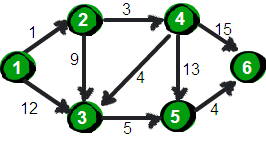
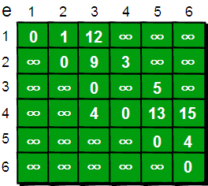
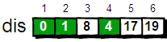
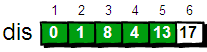

> http://wiki.jikexueyuan.com/project/easy-learn-algorithm/dijkstra.html

上周我们介绍了神奇的只有五行的 Floyd 最短路算法，它可以方便的求得任意两点的最短路径，这称为“多源最短路”。本周来来介绍指定一个点（源点）到其余各个顶点的最短路径，也叫做“单源最短路径”。例如求下图中的 1 号顶点到 2、3、4、5、6 号顶点的最短路径。



与 Floyd-Warshall 算法一样这里仍然使用二维数组 e 来存储顶点之间边的关系，初始值如下。



我们还需要用一个一维数组 dis 来存储 1 号顶点到其余各个顶点的初始路程，如下。


**我们将此时 dis 数组中的值称为最短路的“估计值”**。

既然是求 1 号顶点到其余各个顶点的最短路程，那就**先找一个离 1 号顶点最近的顶点**。通过数组 dis 可知当前离 1 号顶点最近是 2 号顶点。**当选择了 2 号顶点后，dis[2]的值就已经从“估计值”变为了“确定值”**，即 1 号顶点到 2 号顶点的最短路程就是当前 dis[2]值。为什么呢？你想啊，**目前离 1 号顶点最近的是 2 号顶点，并且这个图所有的边都是正数，那么肯定不可能通过第三个顶点中转，使得 1 号顶点到 2 号顶点的路程进一步缩短了**。**因为 1 号顶点到其它顶点的路程肯定没有 1 号到 2 号顶点短，对吧 O(∩_∩)O~**

既然选了 2 号顶点，接下来再来看 2 号顶点有哪些出边呢。有 2->3 和 2->4 这两条边。**先讨论通过 2->3 这条边能否让 1 号顶点到 3 号顶点的路程变短**。也就是说现在来比较 dis[3]和 dis[2]+e[2][3]的大小。其中 dis[3]表示 1 号顶点到 3 号顶点的路程。dis[2]+e[2][3]中 dis[2]表示 1 号顶点到 2 号顶点的路程，e[2][3]表示 2->3 这条边。**所以 dis[2]+e[2][3]就表示从 1 号顶点先到 2 号顶点，再通过 2->3 这条边，到达 3 号顶点的路程。**

我们发现 dis[3]=12，dis[2]+e[2][3]=1+9=10，dis[3]>dis[2]+e[2][3]，因此 dis[3]要更新为 10。这个过程有个专业术语叫做“**松弛**”。**即 1 号顶点到 3 号顶点的路程即 dis[3]，通过 2->3 这条边松弛成功**。**这便是 Dijkstra 算法的主要思想：通过“边”来松弛 1 号顶点到其余各个顶点的路程**。

**同理通过 2->4（e[2][4]），可以将 dis[4]的值从 ∞ 松弛为 4（dis[4]初始为 ∞，dis[2]+e[2][4]=1+3=4，dis[4]>dis[2]+e[2][4]，因此 dis[4]要更新为 4）**。

刚才我们**对 2 号顶点所有的出边进行了松弛**。松弛完毕之后 dis 数组为：


接下来，**继续在剩下的 3、4、5 和 6 号顶点中，选出离 1 号顶点最近的顶点**。通过上面更新过 dis 数组，当前离 1 号顶点最近是 4 号顶点。此时，dis[4]的值已经从“估计值”变为了“确定值”。**下面继续对 4 号顶点的所有出边（4->3，4->5 和 4->6）用刚才的方法进行松弛**。松弛完毕之后 dis 数组为：



继续在剩下的 3、5 和 6 号顶点中，选出离 1 号顶点最近的顶点，这次选择 3 号顶点。此时，dis[3]的值已经从“估计值”变为了“确定值”。对 3 号顶点的所有出边（3->5）进行松弛。松弛完毕之后 dis 数组为：


继续在剩下的 5 和 6 号顶点中，选出离 1 号顶点最近的顶点，这次选择 5 号顶点。此时，dis[5]的值已经从“估计值”变为了“确定值”。对5号顶点的所有出边（5->4）进行松弛。松弛完毕之后 dis 数组为：



**最后对 6 号顶点所有点出边进行松弛。因为这个例子中 6 号顶点没有出边，因此不用处理。到此，dis 数组中所有的值都已经从“估计值”变为了“确定值”。**

**最终 dis 数组如下，这便是 1 号顶点到其余各个顶点的最短路径。**


OK，现在来总结一下刚才的算法。算法的基本思想是：

1. 每次找到离源点（上面例子的源点就是 1 号顶点）最近的一个顶点，
2. 然后以该顶点为中心进行松弛
3. 最终得到源点到其余所有点的最短路径。基本步骤如下：

- 将所有的顶点分为两部分：**已知最短路程的顶点集合 P** 和**未知最短路径的顶点集合 Q**。最开始，已知最短路径的顶点集合 P 中只有源点一个顶点。**我们这里用一个 book[ i ]数组来记录哪些点在集合 P 中。例如对于某个顶点 i，如果 book[ i ]为 1 则表示这个顶点在集合 P 中，如果 book[ i ]为 0 则表示这个顶点在集合 Q 中**。
- 设置源点 s 到自己的最短路径为 0 即 dis=0。若存在源点有能直接到达的顶点 i，则把 dis[ i ]设为 e[s][ i ]。同时把所有其它（源点不能直接到达的）顶点的最短路径为设为 ∞。**—— 初始化**
- **在集合 Q 的所有顶点中选择一个离源点 s 最近的顶点 u（即 dis[u]最小）加入到集合 P**。**并考察所有以点 u 为起点的边，对每一条边进行松弛操作**。例如存在一条从 u 到 v 的边，那么可以通过将边 u->v 添加到尾部来拓展一条从 s 到 v 的路径，这条路径的长度是 dis[u]+e[u][v]。如果这个值比目前已知的 dis[v]的值要小，我们可以用新值来替代当前 dis[v]中的值。
- **重复第 3 步，如果集合 Q 为空，算法结束。最终 dis 数组中的值就是源点到所有顶点的最短路径**。

完整的 Dijkstra 算法代码如下：

```c
  #include <stdio.h>
    int main()
    {
        int e[10][10],dis[10],book[10],i,j,n,m,t1,t2,t3,u,v,min;
        int inf=99999999; //用inf(infinity的缩写)存储一个我们认为的正无穷值
        //读入n和m，n表示顶点个数，m表示边的条数
        scanf("%d %d",&n,&m);

        //初始化
        for(i=1;i<=n;i++)
            for(j=1;j<=n;j++)
                if(i==j) e[i][j]=0;
                  else e[i][j]=inf;

        //读入边
        for(i=1;i<=m;i++)
        {
            scanf("%d %d %d",&t1,&t2,&t3);
            e[t1][t2]=t3;
        }
        //初始化dis数组，这里是1号顶点到其余各个顶点的初始路程
        for(i=1;i<=n;i++)
            dis[i]=e[1][i];
        //book数组初始化
        for(i=1;i<=n;i++)
            book[i]=0;
        book[1]=1;

        //Dijkstra算法核心语句
        for(i=1;i<=n-1;i++)
        {
            //找到离1号顶点最近的顶点
            min=inf;
            for(j=1;j<=n;j++)
            {
                if(book[j]==0 && dis[j]<min)
                {
                    min=dis[j];
                    u=j;
                }
            }
            book[u]=1;
            for(v=1;v<=n;v++)
            {
                if(e[u][v]<inf)
                {
                    if(dis[v]>dis[u]+e[u][v])
                        dis[v]=dis[u]+e[u][v];
                }
            }
        }

        //输出最终的结果
        for(i=1;i<=n;i++)
            printf("%d ",dis[i]);

        getchar();
        getchar();
        return 0;
    }
```

可以输入以下数据进行验证。第一行两个整数 n m。n 表示顶点个数（顶点编号为 1~n），m 表示边的条数。接下来 m 行表示，每行有 3 个数 x y z。表示顶点 x 到顶点 y 边的权值为 z。

```
    6 9
    1 2 1
    1 3 12
    2 3 9
    2 4 3
    3 5 5
    4 3 4
    4 5 13
    4 6 15
    5 6 4
```

运行结果是

```
   0 1 8 4 13 17
```

通过上面的代码我们可以看出，**这个算法的时间复杂度是 O(N2)**。其中**每次找到离 1 号顶点最近的顶点的时间复杂度是 O(N)**，**这里我们可以用“堆”（以后再说）来优化，使得这一部分的时间复杂度降低到 O(logN)**。**另外对于边数 M 少于 N2 的稀疏图来说（我们把 M 远小于 N2 的图称为稀疏图，而 M 相对较大的图称为稠密图），我们可以用邻接表（这是个神马东西？不要着急，下周再仔细讲解）来代替邻接矩阵，使得整个时间复杂度优化到 O( (M+N)logN )**。请注意！在最坏的情况下 M 就是 N2，这样的话 MlogN 要比 N2 还要大。但是大多数情况下并不会有那么多边，因此(M+N)logN 要比 N2 小很多。

## Dijkstra 的复杂度分析

- 基础版本的复杂度为：O(V*V + E)
- 使用小顶堆优化：O(V*logV + E)
- 使用邻接表优化，由于邻接表结构的复杂度为 E，不再是邻接矩阵的 V^2（这里分析的还不到位）


BFS、DFS、Kruskal、Prim、Dijkstra算法时间复杂度的比较：
一般说来，我们知道，BFS，DFS算法的时间复杂度为O（V+E），
最小生成树算法Kruskal、Prim算法的时间复杂度为O（E*lgV）。

而Prim算法若采用斐波那契堆实现的话，算法时间复杂度为O（E+V*lgV），当|V|<<|E|时，E+V*lgV是一个较大的改进。
//|V|<<|E|，=>O（E+V*lgV） << O（E*lgV），对吧。:D

Dijkstra 算法，斐波纳契堆用作优先队列时，算法时间复杂度为O（V*lgV + E）。
//看到了吧，与Prim算法采用斐波那契堆实现时，的算法时间复杂度是一样的。

所以我们，说，BFS、Prime、Dijkstra 算法是有相似之处的，单从各算法的时间复杂度比较看，就可窥之一二。

---------------------
作者：v_JULY_v 
来源：CSDN 
原文：https://blog.csdn.net/v_JULY_v/article/details/6096981 
版权声明：本文为博主原创文章，转载请附上博文链接！

与 Dijkstra 算法不同，Bellman-Ford算法可用于具有负数权值边的图，只要图中不存在总花费为负值且从源点 s 可达的环路即可用此算法（如果有这样的环路，则最短路径不存在，因为沿环路循环多次即可无限制的降低总花费）。