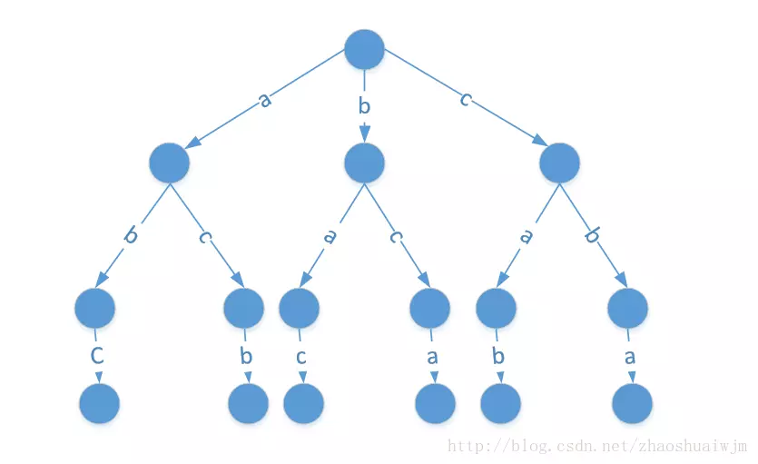
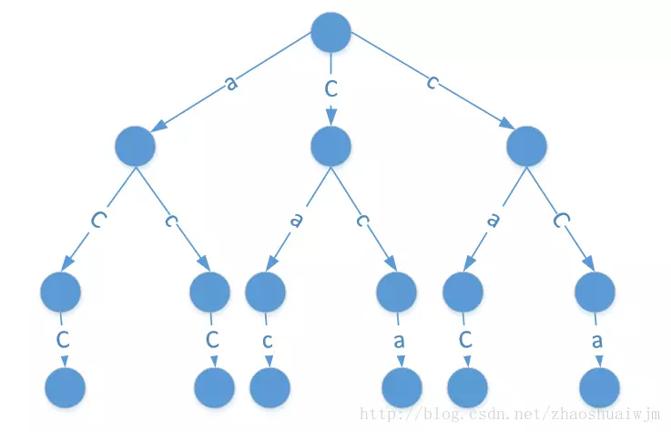
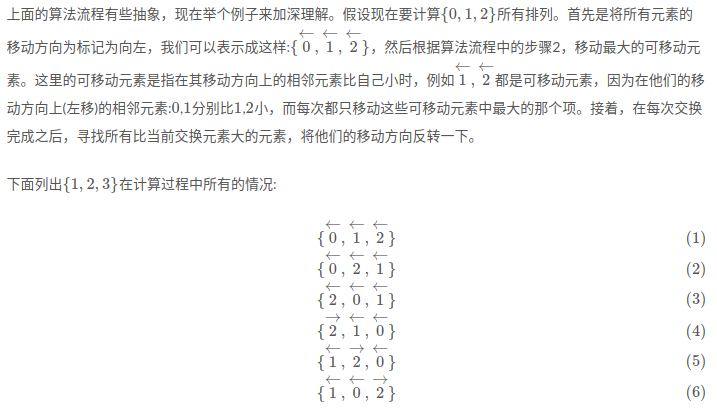
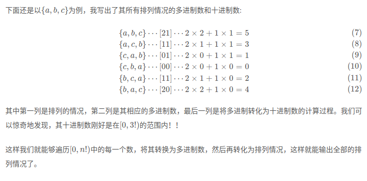

# 排列组合问题算法设计总结

排列（Permutation），下文简称 P，组合（Combination），下文简称 C。

**二者的本质区别在于决策顺序对结果有没有影响**。

排列问题：在 n 个物品中，**按顺序地**选择 k 个物品，那么选择的方式总共有这么多种：（N对象的K排列）
$$
P(n, k) = \frac{n!}{(n-k)!} = n\times(n-1)\times...\times(n-k+1)
$$
组合问题：在 n 个物品中，选择 k 个物品出来，选择的顺序无所谓，那么选择的方式总共有这么多种：（N对象的K组合）
$$
C(n, k) = \frac{n!}{(n-k)!\times k!} = \frac{n\times(n-1)\times...\times(n-k+1)}{k\times(k-1)\times...\times1}
$$


下面的算法设计中多采用递归算法，这里要注意递归算法本身的局限性，因此也需要研究问题的迭代算法

## 排列算法设计

### 暴力求解法 —— 仅适用于 3 维以下的情况

- 根据排序序列的长度直接使用多个嵌套的循环构造序列
- 然后判重

```python
def force():
    data = "abc"
    for i in range(len(data)):
        for j in range(len(data)):
            for k in range(len(data)):
                if data[i] != data[j] and data[j] != data[k] and data[k] != data[i]:
                    print(data[i],data[j],data[k])
```

这种方法的缺点在于：

- 代码和算法复杂度随序列长度的增加显著增加

### 递归求解 —— 回溯交换法：适用于长序列的情况

这里以 abc 的排列来说明，我们可以先考虑第一位的可能情况，然后对后两位进行排列



```python
def rank(data, step):
    if len(data) == step+1:
        print(data)
        return
    else:
        for i in range(step, len(data)):
            // 交换，让当前首位依次为后面的每一个数
          	data[step], data[i] = data[i], data[step]
          	// 递归后面的情况
        	rank(data, step + 1)
            // 回溯后恢复现场
          	data[step], data[i] = data[i], data[step]
            
if __name__ == "__main__":
    data = list("abc")
    rank(data, 0)
```

优点：

- 思路清晰，递归函数中只需要循环构造当前子序列即可
- 适用于任意长度的序列

缺点：

- 效率低于循环的算法

### 递归优化——解决重复的情况

如果排列的序列中含有重复的元素，那么结果中就会存在重复的序列，对于序列“cac”如下图所示：



说明：

- 当以第一个c为开头时，我们需要对`ac`进行全排列，没问题
- 当以a为开头时，我们需要对`cc`进行全排列，没问题
- 当以第二个c为开头时，我们需要对`ca`进行全排列，这就有问题了，ac和ca的全排列是一样的

我们对源码稍加修改下：

```python
def is_equal(data,left,right):     # 判断left到当前right是否有相等的，如果有说明之前已经对这
    for i in range(left,right):    # 个进行过全排序了
        if data[i] == data[right]:
            return True
    return False
def rank(data, step):
    if len(data) == step+1:
        print(data)
        return
    else:
        for i in range(step, len(data)):
            if is_equal(data,step,i):  # 加一个判断
                continue
            else:
                data[step], data[i] = data[i], data[step]
                rank(data, step + 1)
                data[step], data[i] = data[i], data[step]
if __name__ == '__main__':
    data = list("bcc")
    rank(data, 0)
```

- 增加这个判断之后就能解决重复问题了，还需要仔细思考一下
- 之后重复出现的元素在之前就处理过了，因此没必要处理了

### 递归算法——基于排列公式的算法

对于求一个序列的全排列，最直接的想法肯定就是采用递归的方法了，因为根据阶乘的定义$n!=n\times(n−1)!$，因此递归的过程就是：

- 递归式:在每一次的递归层次中求出(n−1)个元素的全排列
- 递归边界条件:当元素个数为1的时候，直接返回该元素

但是在具体的实现过程中，如何处理返回的n−1个元素的全排列又有很多不同的方法，这里主要介绍两种

#### 插入法：

这种方法有点类似于插入排序，当通过递归过程返回n−1个数的全排列的时候，我将第n个数插入到这些排列的空隙中，形成新的排列。举例来说，对于a={0,1,2,3}来说，首先取出第一个元素0，然后通过递归生成{1,2,3}的全排列:

```python
{
	{1,2,3},
	{1,3,2},
	{2,1,3},
	{2,3,1},
	{3,1,2},
	{3,2,1},
}

{
	{0,1,2,3},
	{1,0,3,2},
	{1,2,0,3},
	{1,2,3,0},	#完成了对{1,2,3}的插入
	{0,1,3,2},
	{1,0,3,2},
	{1,3,0,2},
	{1,3,2,0},	#完成了对{1,3,2}的插入
	...
}
```

按照这样的顺序，我们就能够依次生成原序列的所有排列情况了。可以看到，按照这样的算法， **每一次首元素都会被插入到不同的位置中**，这一点是和下面要介绍的另外一种递归方法的本质区别

```python
def perm(arg):
    if len(arg)==0:
        return [[]]
    else:
	#得到n-1的排列
        t = perm(arg[1:])
        order = []
        #遍历每一个排列
        for item in t:
            #在每一个排列的可能位置中插入当前元素
            for (index,x) in enumerate(item):
                tmp = item[:]
                tmp.insert(index,arg[0])
                order.append(tmp)
            tmp = item[:]
            tmp.append(arg[0])
            order.append(tmp)
        return order
```

#### 固定首元素法

在这种方法中，我们不需要每次都要将首元素插入到不同位置中，在递归过程中，我们会尝试所有可能的首元素，生成不同元素作为首元素时排列，举例来说，对于a={0,1,2,3}，我们首先选取0作为首元素，然后固定住0，向下递归生成{1,2,3}的排列，然后，直接将0和生成的排列**拼接**起来(**而不是插入**)，如下所示：

下面是{1,2,3}{1,2,3}的全排列

```
{
	{1,2,3},
	{1,3,2},
	{2,1,3},
	{2,3,1},
	{3,1,2},
	{3,2,1},
}
```

直接将这些排列和0拼接,形成:

```
{
	{0,1,2,3},
	{0,1,3,2},
	{0,2,1,3},
	{0,2,3,1},
	{0,3,1,2},
	{0,3,2,1},
}
```

完成拼接之后，选取1作为首元素，向下递归生成{0,2,3}{0,2,3}的全排列，然后，将1和生成的排列拼接起来；之后选取2作为首元素，重复上述过程，直到所有元素都作为首元素固定过

```python
def perm(arg,order,k=0):
    if k >= len(arg):
        order.append(arg[:])
        return 
    else:
        for i in range(k,len(arg)):
	    #交换首元素
            arg[i],arg[k] = arg[k],arg[i]
	    #递归调用
            perm(arg,order,k+1)
	    #换回原来的位置
            arg[i],arg[k] = arg[k],arg[i]

```

### 字典序算法——非递归算法（STL：next_permutation）

思想：寻找一种所有排列中的顺序关系，然后按照这种顺序依次计算出排列的情况

这种按照某种顺序来生成全排列的方法就被称为是字典序

很显然，最重要的是如何才能找到这样一种一一对应的顺序关系，此处继续用a={0,1,2,3}来说明**字典序**算法的过程。

**要找到一种顺序关系，我们就首先要定义大小关系**，对于两个序列{0,2,1,3}和{0,2,3,1}来说，序列{0,2,3,1}要比{0,2,1,3}大，**比较的方法是从前到后依次比较相同位置上的元素**，如果相同则继续比较下一个元素，直到遇到一个不同的元素，元素值大的序列就大于元素值小的序列。按照这样的大小关系形成的序列的顺序，就是**字典序**。可以看到，最小的序列一定是{0,1,2,3}，最大的序列是{3,2,1,0}。而**字典序**算法就是从**字典序**中最小的序列开始，一直不停寻找下一个仅比上一个序列大的序列，直到到达最大的序列。

现在的问题就变成了，如何从当前状态生成一下个状态？

**字典序**算法是这样做的(假设当前排列是a[1⋯n]):

1. 从a中找到满足a[k]<a[k+1]的k的最大值，即k=max{i|a[i]<a[i+1]}(0≤i<n−1)，如果不存在这样的k，那就是说已经达到字典序最大的序列了
2. 从a[k+1⋯n]中寻找比a[k]大的数中的最小数a[j],即j=min{i|a[i]>a[k]}(k<i≤n−1)
3. 交换a[k]和a[j]，并将a[k+1⋯n]中的元素全部倒序。

经过上述三步，得到的序列就是a[1⋯n]在**字典序**中的下一个序列了。

我想看到这里，很多人都是一头雾水了吧，这三步只是告诉你How-to-do而不是Why-to-do，这里简略给出一个说明[[4\]](http://zhouyichu.com/algorithm/Permutation-Generation-1/#fn4):

首先应该知道，根据字典序的定义，越是小的数排在前面，则整个序列越小。

1. 第一步中找到的 a[k]，其实它是有这样的性质的:在k右侧的所有元素都是从大到小排列的
2. 第二步中找到的a[j]是用来和a[k]交换的，根据a[j]满足的条件，可以得出这样的结论:在a[k+1⋯n]中，a[k]是仅次于a[j]的数。而将他们交换之后，能保证整个序列是最小增长的。
3. 但是由于a[k+1⋯n]中是从大到小排列的，因此需要将这部分倒序，来使得序列进一步减小，使其成为仅大于原始序列的序列。

```python
def nextstate(arg):
    flag = False
    #步骤1
    for i in range(len(arg)-2,-1,-1):
        if(arg[i] < arg[i+1]):
            flag = True
            break
    if flag:
        k = i
    else:
        return False

    #步骤2
    for i in range(len(arg)-1,k,-1):
        if arg[i] > arg[k]:
            break
    j = i
    #步骤3
    arg[j],arg[k] = arg[k],arg[j]
    t = arg[k+1:]
    t.reverse()
    arg[k+1:] = t
    return True


def dictgenerate(arg):
    myarg = list(range(len(arg)))
    order = []
    t = []
    for i in myarg:
        t.append(arg[i])
    order.append(t)
    while True:
        t = []
        flag = nextstate(myarg)
        if flag == False:
            break
        for i in myarg:
            t.append(arg[i])

        order.append(t)
    return order
```


### Johnson-Trotter 算法

思想：寻找一种相邻元素的交换顺序，根据这种交换的顺序依次计算出排列的情况

关键技术：每次循环都进行一次满足条件的相邻元素的交换，知道不存在满足条件的可交换元素，此时说明所有排列的情况均已输出，算法结束

算法过程：

1. 首先初始化所有元素的移动方向为向左，输出序列本身作为第一个排列
2. 移动最大的可移动元素（当元素移动方向上的元素比自己小的时候，才能移动）
3. 反转所有比移动元素大的所有元素的移动方向
4. 重复 2～3，直到不能移动为止

假设现在要计算 {0,1,2} 的所有排列：



### 多进制算法

假设我们有一个长度为n的数列，首先取出第一个数字，然后取出第二个数字，此时第二个数字有两种放置的选择，可以放在第一个数字的左边或右边；接着取第三个数字，它将会有3种选择:左边、中间、右边；依次可以类推下去。多进制算法的精妙之处，是将这些可能的选择情况编码成为了一个数字:从左至右将可能放置的位置进行编号，从0开始。比如取出第三个数字时，它有左边、中间、右边三种选择情况，则着三种选择分别用0,1,2来表示

我们可以设计一个数，比如是xyz，其中z是二进位的，y是三进位的，x是四进位的，分别代表第二个数字、第三个数字、第四个数字可以进行选择的情况，这样设计的话，我们就可以将一种排列的状态转换为一个多进制的数，只要能给定一个这样的多进制数，我们就能计算出其相应的排列情况。

现在先来举个例子:对于{a,b,c}来说，多进制数1010就表示{a,b,c}的一种排列状态，具体过程是这样的:首先取出第一个字符a，然后取出第二个字符b，此时多进制数10中的0表示字符b放置在字符a的左侧，接着取出第三个字符c，此时多进制数10中的1就表示字符c要放置在字符串ba的中间，形成bca。这样，我们就根据一个多进制数生成了一中排列情况

理解了多进制数的意义之后，现在的问题就是说，如何找出这样特殊的多进制数呢？这不禁让人想起了二进制数到十进制数的转化过程了，我们可以将同样的方法运用到这个多进制数上，将其转化为十进制数:3×x+2×y+1×z，具体来说，多进制数10可以通过2×1+1×0=2转化为十进制数2。利用这个过程的逆过程，我们就能将一个十进制数转化为一个多进制数，然后再将这个多进制数转化成为一种排列情况



总结：

- 虽然这种方法的想法是这么的巧妙，但是具体运行的时候还是会很慢，主要原因是需要遍历n!个数，这个遍历过程只要n稍微大一点，其运行速度就会变得很慢，更何况每次遍历都要进行十进制数到排列情况的映射操作。虽然这个算法的效率不高，但其中包含的思想，我认为值得深入理解。

## 组合算法设计

我们从一个具体问题入手：

- 问题：加入我有一个数组`[1, 2, 3, 4, 5, 6]`，我想从里面随机选出三个来，问有哪些取法
- 方法：递归
  - 从左往右递归，对于当前元素，我们有两种选择，要或者不要
  - 如果要，从右侧剩下元素中选择 2 个即可
  - 如果不要，从右侧剩下元素中选择 3 个即可

```python
def combine(data, step, select_data, target_num):
    if len(select_data) == target_num:   # 选择的元素已经够了，就输出并返回
        print(select_data)
        return
    if step >= len(data):               # 没有元素选了而且还没够，也是直接返回
        return
    select_data.append(data[step])             # 选择当前元素
    combine(data, step + 1, select_data, target_num)
    select_data.pop()                         # 别忘了从已选择元素中先删除
    combine(data, step + 1, select_data, target_num) # 不选择当前元素
if __name__ == '__main__':
    data = [1, 2, 3, 4, 5, 6]
    combine(data, 0, [], 3)
```

算法总结：

- 对于N对象的K组合，相当于选择第 i 个对象，然后利用这个对象和 i+1,..,N 对象的 K-1 组合组合到一起
  - 举例：abcd四个对象的3组合，由组合数可知，一共有 4 个
    - 首先挑出a，然后生成bcd的所有2组合bc，bd，cd，组合到一起生成abc，abd，acd
    - 然后再挑出b，后面cd的所有2组合就只有cd，就生成了bcd
  - 对于这个例子课可以通过删除元素法来做，也就是利用 C(4,3) = C(4, 1)


## Reference

- 总结了排列组合的公式：https://zhuanlan.zhihu.com/p/41855459
- 举例描述了排列组合算法的设计方法：<https://juejin.im/post/59d89df56fb9a00a59598bf0>
- JT算法的介绍和距离说明：<http://zhouyichu.com/algorithm/Permutation-Generation-2/>
- 字典序算法和递归算法的说明：<http://zhouyichu.com/algorithm/Permutation-Generation-1/>