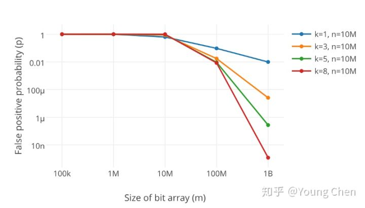

# 布隆过滤器

## 定义

如果希望判断一个元素是否在一个集合中，我们可以使用的方法如下：

- 线性结构：array，vector，list
- 树：BST，trie
- hash 表：bitmap

随着元素数量的增多，我们需要的存储空间越来越大，同时检索的速度也越来越慢，而 bloom filter 正好能解决这两个问题。

bloom filter 是一种用于判断给定元素是否在集合中的数据结构，它使用远小于 bitmap 的空间在牺牲一定正确性的情况下对元素作出判断。

**布隆过滤器 = 很长的二进制向量 + 一系列随机 hash 函数**

- **作用：用于检索一个元素是否在一个集合中**
- **优点：空间效率和查询效率远超一般算法**
- **缺点：有一定的错误率且元素删除很困难**

## 原理

### 构建 bloom filter

实现一个超大的位数组和几个互不相关的哈希函数，假设位数组长度为 m，哈希函数个数为 k：

1. 首先将位数组初始化，将每个位设置为 0
2. hash 函数能将元素映射为位数组上的一个点
3. 当一个元素被加入集合中时，通过 k 个 hash 函数将这个元素映射为一个位数组中的 k 个点，将这些点置为 1

检索时，我们只需要判断查询元素对应的 k 个点是否为 1 就知道集合中有没有它了：

- 如果全为 1，认为集合中**很可能**存在这个元素，此处存在误判率
- 否则，认为不存在

> 误判率的产生原因：不同元素可能映射得到相同的点，这也是经典布隆过滤去不支持删除的原因

### 添加操作

- 将要添加的元素输入给 k 个哈希函数，得到对应于位数组上的 k 个位置
- 将这 k 个位置设为 1

### 查询操作

- 将要查询的元素输入给 k 个哈希函数，得到对应于位数组上的 k 个位置
- 如果 k 个位置**有一个为 0**，则肯定不在集合中
- 如果 k 个位置全部为 1，则可能在集合中

> 因此我们可以利用这一特性，对不在集合中的元素做出肯定的判断

## 分析

### 关键：m 和 k 的选择

- 显然，很小的位数组很快就会装满，查询的任何值都会返回“可能存在“，起不到过滤的目的，误报率也就越高。因此，数组越长误报率越低
- hash 函数越多过滤器中置 1 的速度就会越快，过滤器效率就会下降，误报率会增加

m 和 k 的选择取决于用户需要判断的元素数量 n 和期望的误判率 p ：

- 系统首先要计算需要的内存大小m bits:

![clip_image002[60]](布隆过滤器.assets/201102162319199274.png)

- 再由m，n得到hash function的个数：

![clip_image002[52]](布隆过滤器.assets/201102162319207779.png)

>  想保持错误率低，布隆过滤器的空间使用率需为50%

## 总结

### 优点

相比其他数据结构，bloom filter 在时间上和空间上都有巨大优势：

- 插入和查询实践为常数 O(k)
- hash 函数之间相互没有关系，方便由硬件并行实现
- 数据结构不需要存储元素本身，适用于需要保密的场合

## 缺点

- 随着存入的元素数量增加，误算率随之增加，而**如果元素较少，使用 hash table 足够了**（我们可以反向利用这一点，bloom filter 能够判断某个元素是否一定不在）
- 一般情况下不能从该数据结构中删除元素，**一个改进的方法是将位数组改为频率数组**，每次增加点就对相应的位置增加 1，删除时减去 1 即可

### 启发

- 编码思路可以引入到算法设计中来
- 这里有 3-8 译码器的影子

## 参考资料

- https://www.cnblogs.com/allensun/archive/2011/02/16/1956532.html
- [https://zh.wikipedia.org/zh-hans/%E5%B8%83%E9%9A%86%E8%BF%87%E6%BB%A4%E5%99%A8](https://zh.wikipedia.org/zh-hans/布隆过滤器)
- https://blog.csdn.net/v_july_v/article/details/6685894