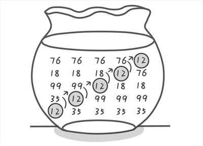

# 冒泡排序

简化版的桶排序不仅仅有上一节所遗留的问题，更要命的是：它非常浪费空间！例如需要排序数的范围是 0~2100000000 之间，那你则需要申请 2100000001 个变量，也就是说要写成 int a[2100000001]。因为我们需要用 2100000001 个“桶”来存储 0~2100000000 之间每一个数出现的次数。即便只给你 5 个数进行排序（例如这 5 个数是 1，1912345678，2100000000，18000000 和 912345678），你也仍然需要 2100000001 个“桶”，这真是太浪费了空间了！还有，如果现在需要排序的不再是整数而是一些小数，比如将 5.56789，2.12，1.1，3.123，4.1234 这五个数进行从小大排序又该怎么办呢？现在我们来学习另一种新的排序算法：冒泡排序。它可以很好的解决这两个问题。

冒泡排序的基本思想是：**每次比较两个相邻的元素，如果他们的顺序错误就把他们交换过来**。

例如我们需要将 12 35 99 18 76 这 5 个数进行**从大到小进行排序**。既然是从大到小排序也就是说越小的越靠后，你是不是觉得我在说废话，但是这句话很关键(∩_∩)。 - 决定了逆序的定义

首先比较第 1 位和第 2 位的大小，现在第 1 位是 12，第 2 位是 35。发现 12 比 35 要小，因为我们希望越小越靠后嘛，因此需要交换这两个数的位置。交换之后这 5 个数的顺序是 35 12 99 18 76。

按照刚才的方法，继续比较第 2 位和第 3 位的大小，第 2 位是 12，第 3 位是 99。12 比 99 要小，因此需要交换这两个数的位置。交换之后这 5 个数的顺序是 35 99 12 18 76。

根据刚才的规则，继续比较第 3 位和第 4 位的大小，如果第 3 位比第 4 位小，则交换位置。交换之后这 5 个数的顺序是 35 99 18 12 76。

最后，比较第 4 位和第 5 位。4 次比较之后 5 个数的顺序是 35 99 18 76 12。

经过 4 次比较后我们发现最小的一个数已经就位（已经在最后一位，请注意 12 这个数的移动过程），是不是很神奇。现在再来回忆一下刚才比较的过程。每次都是比较相邻的两个数，如果后面的数比前面的数大，则交换这两个数的位置。一直比较下去直到最后两个数比较完毕后，最小的数就在最后一个了。就如同是一个气泡，一步一步往后“翻滚”，直到最后一位。所以这个排序的方法有一个很好听的名字“冒泡排序”。



说道这里其实我们的排序只将 5 个数中最小的一个归位了。**每将一个数归位我们将其称为“一趟”**。下面我们将继续重复刚才的过程，将剩下的 4 个数一一归位。

好现在开始“第二趟”，目标是将第 2 小的数归位。首先还是先比较第 1 位和第 2 位，如果第 1 位比第 2 位小，则交换位置。交换之后这 5 个数的顺序是 99 35 18 76 12。接下来你应该都会了，依次比较第 2 位和第 3 位，第 3 位和第 4 位。注意此时已经不需要再比较第 4 位和第 5 位。因为在第一趟结束后已经可以确定第 5 位上放的是最小的了。第二趟结束之后这 5 个数的顺序是 99 35 76 18 12。

“第三趟”也是一样的。第三趟之后这 5 个数的顺序是 99 76 35 18 12。

现在到了最后一趟“第四趟”。有的同学又要问了，这不是已经排好了吗？还要继续？当然，这里纯属巧合，你可以用别的数试一试可能就不是了。你能找出这样的数据样例来吗？请试一试。

“冒泡排序”原理是：每一趟只能确定将一个数归位。即第一趟只能确定将末位上的数（既第 5 位）归位，第二趟只能将倒数第 2 位上的数（既第 4 位）归位，第三趟只能将倒数第 3 位上的数（既第 3 位）归位，而现在前面还有两个位置上的数没有归位，因此我们仍然需要进行“第四趟”。

“第四趟”只需要比较第 1 位和第 2 位的大小。因为后面三个位置上的数归位了，现在第 1 位是 99，第 2 位是 76，无需交换。这 5 个数的顺序不变仍然是 99 76 35 18 12。到此排序完美结束了，5 个数已经有 4 个数归位，那最后一个数也只能放在第 1 位了。

最后我们总结一下：如果有 n 个数进行排序，只需将 n-1 个数归位，也就是说要进行 n-1 趟操作。而“每一趟”都需要从第 1 位开始进行相邻两个数的比较，将较小的一个数放在后面，比较完毕后向后挪一位继续比较下面两个相邻数的大小，重复此步骤，直到最后一个尚未归位的数，已经归位的数则无需再进行比较（已经归位的数你还比较个啥，浪费表情）。

这个算法是不是很强悍。记得我每次拍集体照的时候就总是被别人换来换去的，当时特别烦。不知道发明此算法的人当时的灵感是否来源于此。罗里吧嗦地说了这么多，下面是代码。建议先自己尝试去实现一下看看，再来看我是如何实现的。

```
    #include <stdio.h>
    int main()
    {
      int a[100],i,j,t,n;
        scanf("%d",&n);  //输入一个数n，表示接下来有n个数
        for(i=1;i<=n;i++)  //循环读入n个数到数组a中
            scanf("%d",&a[i]);
        //冒泡排序的核心部分
        for(i=1;i<=n-1;i++) //n个数排序，只用进行n-1趟
        {
            for(j=1;j<=n-i;j++) //从第1位开始比较直到最后一个尚未归位的数，想一想为什么到n-i就可以了。
            {
                if(a[j]<a[j+1]) //比较大小并交换
                {  t=a[j]; a[j]=a[j+1]; a[j+1]=t;  }
            }
        }
        for(i=1;i<=n;i++)  //输出结果
            printf("%d ",a[i]);
        getchar();getchar();
        return 0;
    }
```

可以输入以下数据进行验证

```
1081005022156110009990
```

运行结果是

01681522501009991000

将上面代码稍加修改，就可以解决第 1 节遗留的问题，如下。

```
    #include <stdio.h>
    struct student
    {
        char name[21];
        char score;
    };//这里创建了一个结构体用来存储姓名和分数
    int main()
    {
        struct student a[100],t;
        int i,j,n;
        scanf("%d",&n); //输入一个数n
        for(i=1;i<=n;i++) //循环读入n个人名和分数
    scanf("%s %d",a[i].name,&a[i].score);
        //按分数从高到低进行排序
        for(i=1;i<=n-1;i++)
        {
            for(j=1;j<=n-i;j++)
            {
                if(a[j].score<a[j+1].score)//对分数进行比较
                {  t=a[j]; a[j]=a[j+1]; a[j+1]=t;  }
            }
        }
        for(i=1;i<=n;i++)//输出人名
            printf("%s\n",a[i].name);
        getchar();getchar();
        return 0;
    }
```

可以输入以下数据进行验证

```
5
huhu 5
haha 3
xixi 5
hengheng 2
gaoshou 8
```

运行结果是

```
gaoshou
huhu
xixi
haha
hengheng
```

冒泡排序的核心部分是**双重嵌套循环**。不难看出冒泡排序的时间复杂度是 O(N2)。这是一个非常高的时间复杂度。冒泡排序早在 1956 年就有人开始研究，之后有很多人都尝试过对冒泡排序进行改进，但结果却令人失望。如 Knuth（Donald E. Knuth 中文名为高德纳，1974 年图灵奖获得者）所说：“**冒泡排序除了它迷人的名字和导致了某些有趣的理论问题这一事实之外，似乎没有什么值得推荐的**。”你可能要问：那还有没有更好的排序算法呢？请期待下周更新——快速排序。