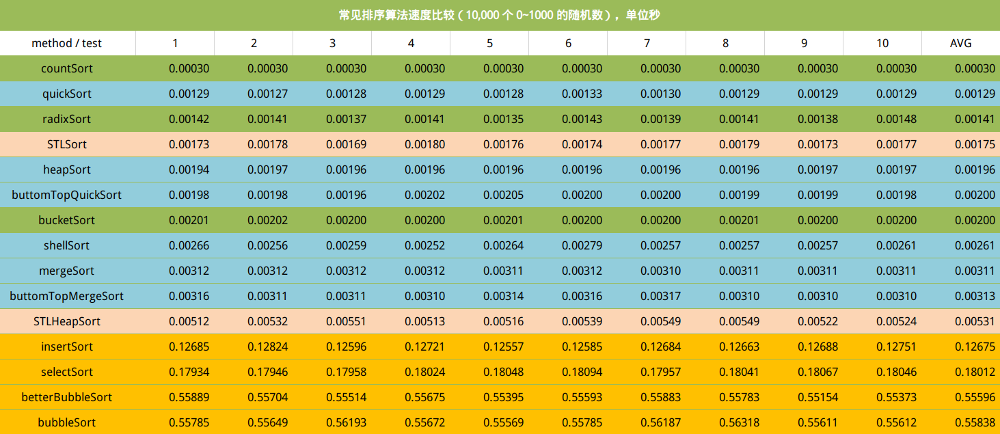

# Sorting Algorithm

## 算法比较

| 算法名称   | 稳定性 | 平均时间 | 最坏时间 | 额外空间 | 描述              |
| --------- | ------ | -------- | -------- | -------- | ----------------- |
| bubble    | 是     | $O(n^2)$ | $O(n^2)$ | $O(1)$   | [无序-交换->有序] |
| selection | 否     | $O(n^2)$ | $O(n^2)$ | $O(1)$   | [有序<-选择-无序] |
| insertion | 是 | $O(n^2)$ | $O(n^2)$ | $O(1)$ | [有序<-插入-无序] |
| merge | 是 | $O(n \log n)$ | $O(n\log n)$ | $O(1)$ | 分段，比较，插入 |
| quick | 否 | $O(n \log n)$ | $O(n^2)$ | $O(\log n)$ | [小，基准元素，大] |
| counting | 是 | $O(n+m)$ | $O(n+m)$ | $O(n+m)$ | 统计，按索引放置 |
| bucket | 是 | $O(n)$ | $O(n)$ | $O(m)$ | 将值为i的元素放入i桶 |
| shell | 否 | $O(n \log ^2 n)$ | $O(n^2)$ | $O(1)$ | 按间隔进行插入排序 |
| heap | 否 | $O(n \log n)$ | $O(n \log n)$ | $O(1)$ | （最大堆，有序区） |

- n 代表数据规模， m 代表数据的最大值 - 最小值

## 算法度量

**时间上**：理想性能为 $O(n)$ ，好的性能是 $O(n\log n)$ ，坏的性能是 $O(n^2)$ 

**空间上**：讨论算法运行所需的额外空间

**稳定性上**：不改变相等记录的顺序（对于数字来说不存在稳定性问题，稳定性要求多出现在复合元素或者对象上

## 试验验证

