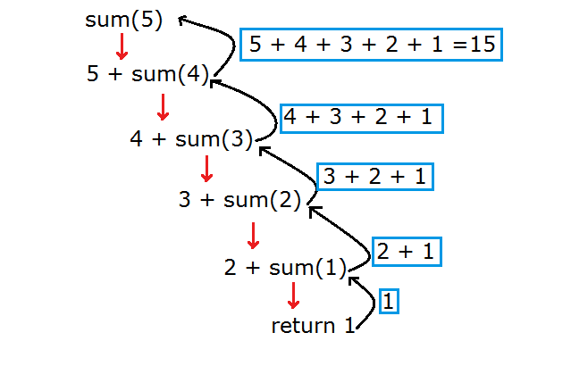

# 递归算法总结

## 01 什么是递归

递归（Recursion），在计算机科学中指通过重复将问题**分解**为**同类的子问题**而解决问题的方法。

通过这段定义我们可以总结出下面的算法关键词：

- 分解为子问题 —— 分治
- 同类 —— 调用自身
- 最小子问题 —— 结束条件

递归函数最大的特点为：函数调用自身

在设计递归函数时，需要考虑函数的终结性：

- 通过问题的最小子问题来设定终止条件

算法优点：

1. 只需要考虑最小子问题的解决通过分治策略就能解决原问题
2. 对于递归可解的问题来说，算法的问题表达能力很强

算法的缺点：

1. 直观的算法设计思路导致了无法挖掘问题深度的信息并利用，因此很少能根据这些信息进行算法优化
2. 由于需要不断地调用自身，每次调用会在内存空间中创建新的函数调用栈，因此算法的时空开销很大
3. 简单的递归算法缺乏对重复子问题（中间状态）的缓存优化

## 02 递归算法能解决的问题

分为三类：

- 数据的定义是按递归定义的：Fibonacci 数
- 问题的解法是按递归算法实现的：Hanoi 问题
- 数据结构是按地规定义的：tree 结构

## 03 如何理解递归函数

我们以阶乘为例，设定用于分析的递归函数定义如下：

```c++
void f(int n) {
    if(n <= 1)
        return 1;
    
    return n * f(n-1);   
}
```

如何判断一个函数是递归函数？

- 看它有没有在函数体内调用同名的函数，并传入规模更小的参数（否则问题可能陷入死循环）

如何理解自身调用自身？

- 可以把 f(n-1) 看作是在调用另一个同名的函数



如何证明递归算法的正确性？

- 首先要把握定义的关键 —— 函数，**这里 f(n) 的定义为：返回 n 的阶乘**

- 这里可以使用数学归纳法进行证明：
  - 欲证明 f(n) 的正确性，由 f(n)  = n × f(n-1)，只需要证明 f(n-1) 的正确性
  - 因此只需证明 f(1) ，f(0) 的正确性，而二者的值由阶乘的定义直接给出了
  - 因此该算法正确

通过上面的分析我们可以看出，理解递归的关键在于三点：

- 函数的定义是什么，解决什么问题
- 问题规模如何缩小
- 问题可解的最小子问题是什么

## 04 如何设计递归函数

理解了递归函数，接下来就要分析如何基于这些理解设计递归函数。

不要去纠结递归间的调用及其返回的细节，我们只需要关心递归内的解决过程即可：

1. 设计递归函数最重要的一点在于：**设计好函数头**，也就是下面三点：
   1. 函数名：解决什么问题？
   2. 参数列表：参数如何变化？引用类型还是值类型？
   3. 返回值：是否返回？返回什么类型？

2. 然后就是解决问题规模如何缩小，直白地说就是，每次递归需要几个分支：
   1. 二叉树问题，左右分支个递归一次
   2. 矩阵问题，四个方向各递归一次
   3. 图问题，所有邻接边各递归一次

3. 有了分支的搜索策略，还需要注意如何避免死循环（重入）：
   1. 使用全部变量对访问过的节点进行标记
   2. 在 node 中新增一个标记变量，访问后修改该变量

> 说白了，你可以将递归的路线想象成遍历一棵树，也就是**深度优先遍历**。一次递进就是往深一层，返回就是回溯一层，多次递归调用就是树的分叉。
>
> 当然**广度优先遍历**也可以用递归实现，关键在于你需要一个缓存来记录当前的广度，以便遍历到下一层你需要回头从当前广度的第一个元素遍历下去，技巧在于用带缓存为参数的递归写法
>
> reference：<https://www.jianshu.com/p/0c5db522eabb>

4. 最后还需要注意**设计好最小子问题**，不要出现未定义的情况（这个步骤一般最先进行）

这里介绍一个递归算法设计的精髓：

1. 从宏观上把握你的分析过程
2. 设计好你的函数，并假设该函数是正确的
3. 在该函数的基础上调用它


这里可以思考一个问题，为什么树的遍历不会重复遍历？

- 递归遍历时，对于树的每一个节点都会创建一个函数调用栈
- 每当这个调用栈拿到需要的值之后就会返回
- 返回之后该节点不会再次创建，**因为到这个节点的连接是单向的**，创建它的时机已经过去了

那么为什么图的遍历需要标记才能避免重复遍历呢？

- 到一个节点的连接可能有很多条，可能是双向的

## 05 递归算法优化

递归算法的优化分为两个方向：

- 对于尾递归形式递归算法，可以将其改写为迭代算法
- 对于含有重复子问题的递归算法，可以使用变量缓存中间状态

下面我们以爬楼梯问题对递归算法的优化进行说明。

### 问题描述

楼梯有n阶台阶，上楼可以一步上1阶，也可以一步上2阶，编一程序计算共有多少种不同的走法？

### 问题分析

- 首先定义问题的解：opt(n) 代表 n 阶台阶需要的走法

- 我们在分析这类问题的时候，应该先从基本情况入手，分析如下：
  - 对于只有 1 阶的台阶，只有 1 种走法
  - 对于2 阶的台阶，有两种走法：
    - 连续上两次 1 阶
    - 上一次 2 阶

- 最后分析一般情况，得到递推关系式：
  - 对于 n 阶台阶的情况，我们可以从 n-1 阶上 1 阶走上来，也可以从 n-2 阶上 2 阶走上来，故有：
  - f(n) = f(n-1) + f(n-2)
  - 从公式可以看出 1 和 0 是问题的最小子问题（这里要考虑 0，因为 0 可能是一个输入）

### 递归解法

```c++
class Solution {
public:    
    int climbStairs(int n) {
        
        if(n == 0) return 1;
        if(n == 1) return 1;
        
       return climbStairs(n - 1) + climbStairs(n - 2);
    }
};
```

### 缓存中间状态的递归解法

```c++
class Solution {
public:
    
    vector<int> ans;
    
    int climbStairs(int n) {
        
        if(n == 0) return 1;
        if(n == 1) return 1;

        // 由于从 0 开始，因此需要判断缓存是否为空
        // 首先缓存的是 ans[0] = climbStairs(2)
        if(!ans.empty() && ans.size() >= n - 2) return ans[n-2];
        
        ans.push_back(climbStairs(n - 1) + climbStairs(n - 2));
        
        return ans.back();
    }
};
```

### 迭代解法

```c++
class Solution {
public:
    int climbStairs(int n) {
        
        int a = 1, b = 1;
        
        // sequence: a, b, a+b, ...
        for(int i = 1; i < n; i++) {
            int tmp = a;
            a = b;
            b = tmp + b;
        }
        
        return b;
    }
};
```

## 06 特殊的递归：尾递归

尾递归是递归算法的一种实现方法，函数在调用自身后直接传回其返回值，而不对该值加以运算。

在一些函数式编程模型（没有显示的循环）中，使用尾递归设计的函数会被编译器优化为循环（回圈）实现，此时所有的过程都集中在一个函数栈空间处理。

### 识别尾递归

下面以 Fibonacci 为例举两个例子说明递归和尾递归的区别：

- 一般递归调用：在调用了 fib(n-1) 和 fib(n-2) 之后，还要进行一次求和计算。那么，这就不是一个尾递归

```text
int fib(int n) {
    if (n < 2)
        return 1;
    
    return fib(n - 1) + fib(n - 2);
}
```

- 如果调用者在调用一个递归函数并且取得返回值以后，不再进行其他的操作，而是直接将这个值返回出去，那么这就是一个尾递归

```java
int fib(int a, int b, int n) {
    if (n == 0)
        return a;
    
    return fib(a + b, a, n - 1);
}
```

对于尾递归，我们还可以深入分析其特点：

- 最主要的区别表现在函数的定义上，尾递归函数的参数列表包含了计算的中间状态和问题规模，而一般递归将中间状态放在了函数之间表达

### 循环改成尾递归

把循环改成尾递归，有一个通用技巧：

- 把循环需要使用变量的地方，都改成尾递归函数的参数

```text
int fib(int n) {
    int a = 1, b = 0;
    for (int i = 0; i < n; i++) {
        int t = b;
        b = a;
        a = a + t;
    }
    
    return a;
}
```

>  就是说，循环过程中，我们需要a, b 两个变量，那我们就把这两个变量转为递归函数的参数就可以了。

需要注意的是，这样的改写方法有很多，可以在实践中积累。

递归与循环的关系可以引用**轮子哥**的这两句评论加以总结：

- 只有尾递归可以处理成循环，其他种类的递归经过精心设计的算法也许可以改成循环，但是没有什么通用的方法在把所有的递归都改成循环的——在不人工维护一个栈来模拟的前提下

- 人工模拟栈那就容易了，你只要递归的时候把所有变量压进去，人肉goto，处理完了人肉goto回来重写所有变量，就跟递归生成出来的代码一样——不过这样还真的不如在一开始就把栈搞大一点

## 06 递归算法模版

by Eric Lipper in stackoverflow: 

```
Result M(Problem prob)
{
    if (<problem can be solved easily>)
        return <easy solution>;
        
    // The problem cannot be solved easily.
    Problem smaller1 = <reduce problem to smaller problem>
    Result result1 = M(smaller1);
    Problem smaller2 = <reduce problem to smaller problem>
    Result result2 = M(smaller2);
    ...
    Result finalResult = <combine all results of smaller problem to solve large problem>
    return finalResult;
}
```

应用：求二叉树深度

```c++
int Depth(Tree tree) {
    // Start with the trivial case. Is the tree empty?
    if (tree.IsEmpty) return 0;
    // The tree is not empty. 
    // Reduce the problem to two smaller problems and solve them:
    int depthLeft = Depth(tree.Left);
    int depthRight = Depth(tree.Right);
    // Now combine the two solutions to solve the larger problem.
    return Math.Max(depthLeft, depthRight) + 1;
}
```

**解递归题的三部曲：**

1. **找整个递归的终止条件：递归应该在什么时候结束？**
2. **找返回值：应该给上一级返回什么信息？**
3. **本级递归应该做什么：在这一级递归中，应该完成什么任务？**

​	


## Reference

- 提供了数学归纳法的分析思路和简洁的例子：<https://www.jianshu.com/p/0c5db522eabb>
- Wiki 定义：[https://zh.wikipedia.org/wiki/%E9%80%92%E5%BD%92_(%E8%AE%A1%E7%AE%97%E6%9C%BA%E7%A7%91%E5%AD%A6)](https://zh.wikipedia.org/wiki/递归_(计算机科学))
- vczh 的回答找不到了，稍后补充
- leetcode 提供的调用图 <https://zhuanlan.zhihu.com/p/59685884>
- <http://stackoverflow.com/questions/9304469/how-to-perform-a-recursive-search/9314805#9314805>
- 实战角度的递归三部曲：<http://39.96.217.32/blog/4#comment-container>